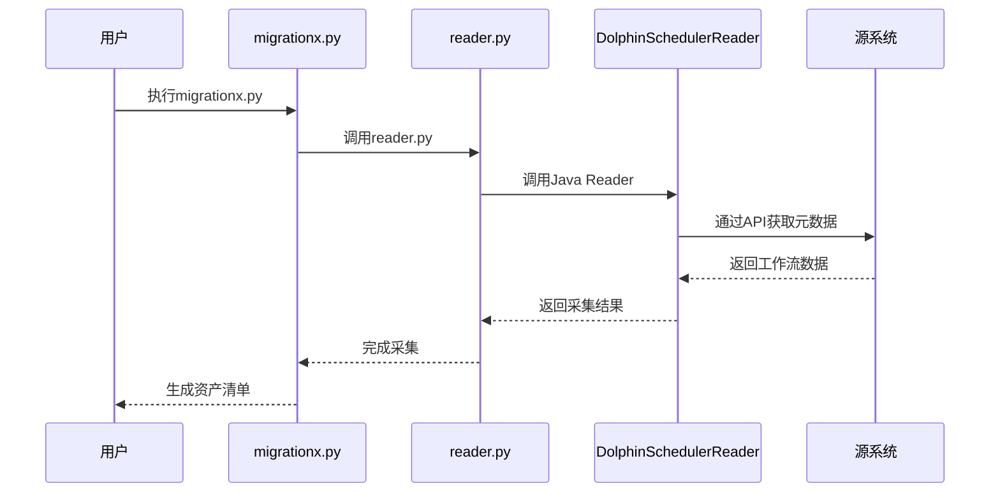
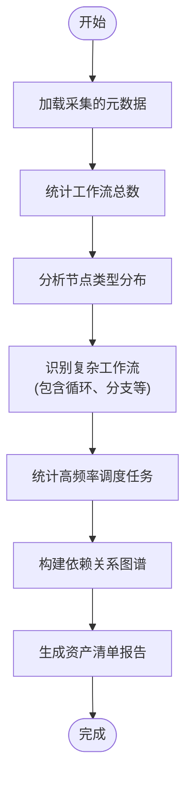
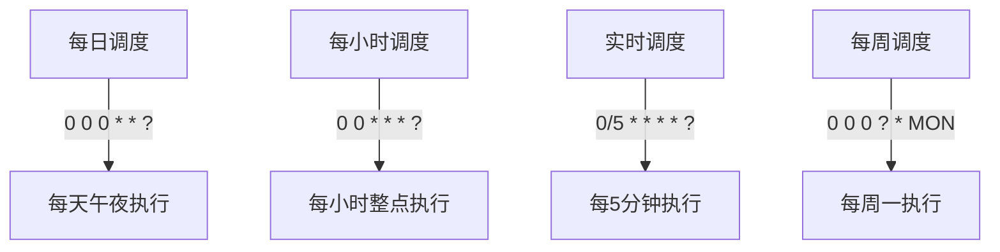

# 资产盘点与分析

<cite>
**本文档中引用的文件**  
- [migrationx.py](file://client/migrationx/src/main/bin/migrationx.py)
- [reader.py](file://client/migrationx/src/main/bin/reader.py)
- [transformer.py](file://client/migrationx/src/main/bin/transformer.py)
- [writer.py](file://client/migrationx/src/main/bin/writer.py)
- [common.py](file://client/client-common/src/main/bin/common.py)
- [migrationx.json](file://client/migrationx/src/main/conf/migrationx.json)
- [DolphinSchedulerReader.java](file://client/migrationx/migrationx-reader/src/main/java/com/aliyun/dataworks/migrationx/reader/dolphinscheduler/DolphinSchedulerReader.java)
- [CaiyunjianConverter.java](file://client/migrationx/migrationx-transformer/src/main/java/com/aliyun/dataworks/migrationx/transformer/dataworks/converter/caiyunjian/CaiyunjianConverter.java)
- [OozieWorkflowConverter.java](file://client/migrationx/migrationx-transformer/src/main/java/com/aliyun/dataworks/migrationx/transformer/dataworks/converter/oozie/OozieWorkflowConverter.java)
- [Project.java](file://client/migrationx/migrationx-domain/migrationx-domain-dataworks/src/main/java/com/aliyun/dataworks/migrationx/domain/dataworks/objects/entity/Project.java)
- [Workflow.java](file://client/migrationx/migrationx-domain/migrationx-domain-dataworks/src/main/java/com/aliyun/dataworks/migrationx/domain/dataworks/objects/entity/Workflow.java)
- [branch.md](file://docs/spec-templates/control-flow/branch.md)
- [join.json](file://spec/src/test/resources/join.json)
</cite>

## 目录
1. [引言](#引言)
2. [工作流资产盘点方法论](#工作流资产盘点方法论)
3. [Reader模块与元数据采集](#reader模块与元数据采集)
4. [自动化扫描与指标提取](#自动化扫描与指标提取)
5. [资产特征分析](#资产特征分析)
6. [分批迁移策略](#分批迁移策略)
7. [结论](#结论)

## 引言
在数据调度系统迁移项目中，全面的资产盘点与分析是确保迁移成功的关键第一步。本文档详细说明如何对源调度系统中的工作流资产进行全面盘点，包括工作流数量统计、节点类型分布分析、依赖关系图谱构建和调度频率模式识别。通过使用MigrationX工具套件，特别是其Reader模块（如DolphinSchedulerReader），可以从不同源系统采集元数据并生成资产清单报告，为后续的迁移决策提供数据支持。

## 工作流资产盘点方法论

资产盘点的核心目标是全面了解源系统中的工作流资产状况，为迁移规划提供依据。盘点内容包括：

- **工作流数量统计**：统计源系统中所有工作流的总数，按类型（周期性、手动触发等）进行分类统计
- **节点类型分布分析**：分析工作流中各类节点的分布情况，识别主要使用的技术组件
- **依赖关系图谱构建**：构建工作流内部节点间以及工作流之间的依赖关系图谱
- **调度频率模式识别**：识别工作流的调度频率模式，如每日、每小时、实时等

这些分析结果将帮助识别复杂工作流、关键路径和潜在风险点。

**Section sources**
- [Project.java](file://client/migrationx/migrationx-domain/migrationx-domain-dataworks/src/main/java/com/aliyun/dataworks/migrationx/domain/dataworks/objects/entity/Project.java#L176-L242)
- [Workflow.java](file://client/migrationx/migrationx-domain/migrationx-domain-dataworks/src/main/java/com/aliyun/dataworks/migrationx/domain/dataworks/objects/entity/Workflow.java#L134-L194)

## Reader模块与元数据采集

MigrationX的Reader模块负责从不同源系统采集元数据。以DolphinSchedulerReader为例，该模块通过API接口连接到DolphinScheduler实例，获取项目、工作流、节点等元数据信息。

元数据采集流程如下：
1. 配置Reader参数，包括API端点、认证令牌、版本号和项目名称
2. 建立与源系统的连接
3. 递归获取项目中的所有工作流定义
4. 提取每个工作流的节点信息、依赖关系和调度配置
5. 将采集的元数据打包为标准格式



**Diagram sources**
- [migrationx.py](file://client/migrationx/src/main/bin/migrationx.py#L1-L44)
- [reader.py](file://client/migrationx/src/main/bin/reader.py#L1-L6)
- [DolphinSchedulerReader.java](file://client/migrationx/migrationx-reader/src/main/java/com/aliyun/dataworks/migrationx/reader/dolphinscheduler/DolphinSchedulerReader.java)

**Section sources**
- [migrationx.py](file://client/migrationx/src/main/bin/migrationx.py#L1-L44)
- [reader.py](file://client/migrationx/src/main/bin/reader.py#L1-L6)
- [DolphinSchedulerReader.java](file://client/migrationx/migrationx-reader/src/main/java/com/aliyun/dataworks/migrationx/reader/dolphinscheduler/DolphinSchedulerReader.java)

## 自动化扫描与指标提取

通过Python脚本调用migrationx.py工具可以实现自动化扫描。以下是一个示例脚本：

```python
import os
import subprocess
import json

# 设置环境变量
os.environ['DOLPHINSCHEDULER_API_ENDPOINT'] = 'http://dolphinscheduler-api:12345'
os.environ['DOLPHINSCHEDULER_API_TOKEN'] = 'your-token'
os.environ['DOLPHINSCHEDULER_VERSION'] = '1.3.6'
os.environ['DOLPHINSCHEDULER_PROJECT_NAME'] = 'migration_project'
os.environ['ALIYUN_REGION_ID'] = 'cn-beijing'
os.environ['ALIYUN_ACCESS_KEY_ID'] = 'your-access-key'
os.environ['ALIYUN_ACCESS_KEY_SECRET'] = 'your-secret-key'
os.environ['ALIYUN_DATAWORKS_WORKSPACE_ID'] = '12345'

# 执行扫描
result = subprocess.run(['python', 'migrationx.py'], capture_output=True, text=True)

# 解析输出结果
if result.returncode == 0:
    print("扫描完成，生成资产清单")
    # 进一步处理输出结果，提取关键指标
else:
    print(f"扫描失败: {result.stderr}")
```

通过分析采集的元数据，可以提取以下关键指标：



**Diagram sources**
- [migrationx.json](file://client/migrationx/src/main/conf/migrationx.json#L1-L35)
- [common.py](file://client/client-common/src/main/bin/common.py#L84-L88)

**Section sources**
- [migrationx.json](file://client/migrationx/src/main/conf/migrationx.json#L1-L35)
- [common.py](file://client/client-common/src/main/bin/common.py#L84-L88)

## 资产特征分析

基于采集的元数据，可以进行深入的资产特征分析。关键分析维度包括：

### 复杂工作流识别
复杂工作流通常包含控制流节点，如分支（Branch）和合并（Join）。通过分析工作流定义中的特殊节点类型，可以识别复杂度较高的工作流。

```json
{
  "nodes": [
    {
      "id": "branch_node_1",
      "branch": {
        "branches": [
          {
            "when": "${a} == 1",
            "desc": "b1"
          },
          {
            "when": "${a} == 2",
            "desc": "b2"
          }
        ]
      }
    }
  ]
}
```

### 调度频率分析
通过解析工作流的调度配置（cron表达式），可以识别调度频率模式：



### 依赖关系分析
通过分析工作流节点间的依赖关系，可以构建完整的依赖图谱，识别关键路径和潜在的循环依赖。

**Section sources**
- [branch.md](file://docs/spec-templates/control-flow/branch.md#L1-L76)
- [join.json](file://spec/src/test/resources/join.json#L1-L68)
- [OozieWorkflowConverter.java](file://client/migrationx/migrationx-transformer/src/main/java/com/aliyun/dataworks/migrationx/transformer/dataworks/converter/oozie/OozieWorkflowConverter.java#L394-L417)

## 分批迁移策略

基于资产特征分析结果，建议采用分批迁移策略：

1. **优先级排序**：根据工作流的复杂度、依赖关系和业务重要性进行优先级排序
2. **低复杂度优先**：优先迁移低复杂度、低依赖的工作流，积累迁移经验
3. **核心系统保障**：识别核心业务工作流，制定专门的迁移和验证方案
4. **风险隔离**：将高风险工作流与其他工作流隔离迁移，降低整体风险

迁移优先级评估矩阵：

| 评估维度 | 高优先级 | 中优先级 | 低优先级 |
|---------|---------|---------|---------|
| 复杂度 | 简单工作流 | 中等复杂度工作流 | 包含复杂控制流的工作流 |
| 依赖度 | 独立工作流 | 少量依赖的工作流 | 多重依赖的工作流 |
| 业务重要性 | 非核心业务 | 一般业务 | 核心业务 |
| 调度频率 | 低频调度 | 中频调度 | 高频/实时调度 |

**Section sources**
- [CaiyunjianConverter.java](file://client/migrationx/migrationx-transformer/src/main/java/com/aliyun/dataworks/migrationx/transformer/dataworks/converter/caiyunjian/CaiyunjianConverter.java#L199-L232)

## 结论
通过系统化的资产盘点与分析，可以全面了解源调度系统的工作流资产状况，为迁移项目提供坚实的数据基础。使用MigrationX工具套件的Reader模块，能够高效地从不同源系统采集元数据，并通过自动化脚本提取关键指标。基于资产特征制定分批迁移策略，可以有效降低迁移风险，确保项目成功。