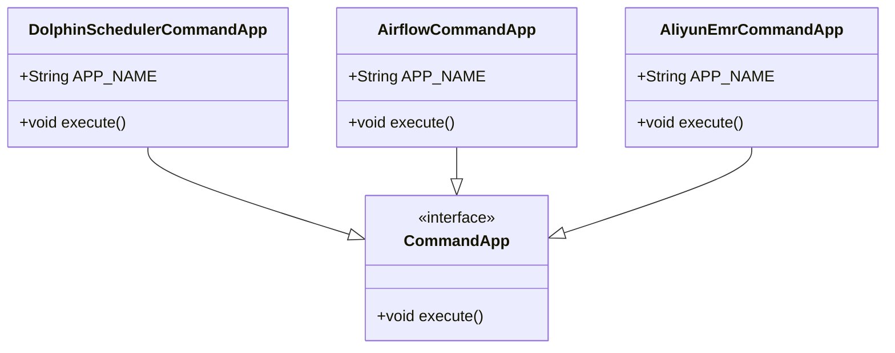
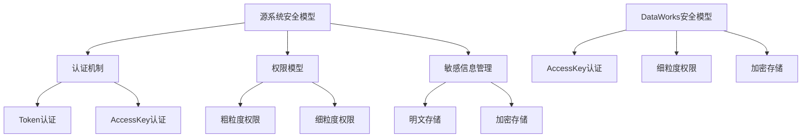
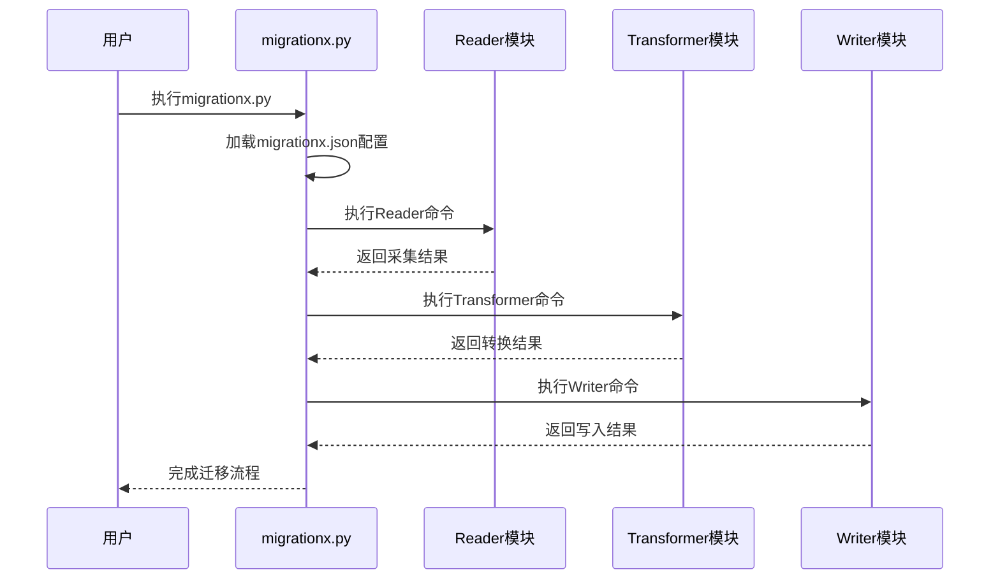

# 迁移前评估

<cite>
**本文档中引用的文件**  
- [migrationx.py](file://client/migrationx/src/main/bin/migrationx.py)
- [reader.py](file://client/migrationx/src/main/bin/reader.py)
- [transformer.py](file://client/migrationx/src/main/bin/transformer.py)
- [writer.py](file://client/migrationx/src/main/bin/writer.py)
- [common.py](file://client/client-common/src/main/bin/common.py)
- [migrationx.json](file://client/migrationx/src/main/conf/migrationx.json)
- [apps.json](file://client/migrationx/src/main/conf/apps.json)
- [readme.md](file://client/migrationx/migrationx-reader/readme.md)
- [DolphinSchedulerCommandApp.java](file://client/migrationx/migrationx-reader/src/main/java/com/aliyun/dataworks/migrationx/reader/dolphinscheduler/DolphinSchedulerCommandApp.java)
- [AirflowCommandApp.java](file://client/migrationx/migrationx-reader/src/main/java/com/aliyun/dataworks/migrationx/reader/airflow/AirflowCommandApp.java)
- [AliyunEmrCommandApp.java](file://client/migrationx/migrationx-reader/src/main/java/com/aliyun/dataworks/migrationx/reader/aliyunemr/AliyunEmrCommandApp.java)
</cite>

## 目录
1. [引言](#引言)
2. [工作流资产盘点](#工作流资产盘点)
3. [元数据采集与Reader模块使用](#元数据采集与reader模块使用)
4. [兼容性差距评估](#兼容性差距评估)
5. [评估报告模板与风险等级划分](#评估报告模板与风险等级划分)
6. [实际案例：使用migrationx.py进行初步扫描](#实际案例使用migrationxpy进行初步扫描)
7. [结论](#结论)

## 引言
在将调度系统从DolphinScheduler、Airflow等迁移到DataWorks之前，进行全面的迁移前评估是确保迁移成功的关键步骤。本指南详细说明了如何对源调度系统中的工作流资产进行盘点，利用MigrationX工具的Reader模块采集元数据，并评估源系统与DataWorks之间的兼容性差距。通过系统化的评估流程，用户可以识别高风险迁移对象并制定相应的应对策略。

## 工作流资产盘点
在迁移前，必须对源调度系统中的工作流资产进行全面盘点，主要包括以下几个方面：

### 工作流数量统计
首先需要统计源系统中所有工作流的总数，以及按项目或业务域划分的分布情况。这有助于评估迁移的整体工作量和资源需求。

### 节点类型分布分析
分析工作流中各类节点的分布情况，包括但不限于：
- **Shell节点**：执行Shell命令的任务
- **SQL节点**：执行数据库查询或操作的任务
- **Spark节点**：提交Spark作业的任务
- **Python节点**：执行Python脚本的任务
- **数据同步节点**：用于数据抽取、转换和加载（ETL）的任务
- **依赖等待节点**：等待其他任务完成的控制节点

### 依赖关系复杂度评估
评估工作流内部及工作流之间的依赖关系复杂度，包括：
- **DAG结构复杂度**：分析有向无环图（DAG）的深度、宽度和分支数量
- **跨工作流依赖**：识别是否存在跨工作流的依赖关系
- **循环依赖检测**：检查是否存在潜在的循环依赖问题
- **条件分支复杂度**：评估条件判断和分支逻辑的复杂程度

### 调度频率分析
统计各类工作流的调度频率分布，包括：
- **实时调度**：按分钟或秒级调度的任务
- **小时级调度**：每小时执行一次的任务
- **天级调度**：每日执行的任务
- **周级/月级调度**：每周或每月执行的任务
- **手动触发**：需要人工干预才能执行的任务

**Section sources**
- [readme.md](file://client/migrationx/migrationx-reader/readme.md#L1-L47)

## 元数据采集与Reader模块使用
MigrationX工具提供了Reader模块，用于从不同的源调度系统中采集元数据。该模块支持多种源系统，包括DolphinScheduler、Airflow和阿里云EMR。

### Reader模块架构
Reader模块采用插件化设计，通过Java类实现不同源系统的适配器。配置文件`apps.json`定义了各个Reader应用对应的Java类：



**Diagram sources**
- [DolphinSchedulerCommandApp.java](file://client/migrationx/migrationx-reader/src/main/java/com/aliyun/dataworks/migrationx/reader/dolphinscheduler/DolphinSchedulerCommandApp.java)
- [AirflowCommandApp.java](file://client/migrationx/migrationx-reader/src/main/java/com/aliyun/dataworks/migrationx/reader/airflow/AirflowCommandApp.java)
- [AliyunEmrCommandApp.java](file://client/migrationx/migrationx-reader/src/main/java/com/aliyun/dataworks/migrationx/reader/aliyunemr/AliyunEmrCommandApp.java)

### 元数据采集流程
元数据采集流程如下：
1. 用户通过命令行调用`reader.py`脚本
2. `common.py`中的`run_command`函数启动Java进程
3. 根据`apps.json`配置加载对应的Reader实现类
4. 执行具体的元数据采集逻辑
5. 将采集结果输出为结构化文件（如JSON或ZIP包）

### 采集命令示例
从不同源系统采集元数据的命令示例如下：

#### 从DolphinScheduler采集
```bash
python ./migrationx-reader/bin/reader.py \
-a dolphinscheduler \
-e http://dolphinscheduler_api_host \
-t {token} \
-v 1.3.9 \
-p project_a \
-f project_a.zip
```

#### 从Airflow采集
```bash
python ./migrationx-reader/bin/reader.py \
-a airflow \
-d /path/to/dag_folder \
-o output.json
```

#### 从阿里云EMR采集
```bash
python ./migrationx-reader/bin/reader.py \
-a aliyunemr \
-d ./target/dump \
-e emr.aliyuncs.com \
-i ${accessId} \
-k ${accessKey} \
-r ${regionId} \
-p emr_prj01,emr_prj02
```

**Section sources**
- [readme.md](file://client/migrationx/migrationx-reader/readme.md#L1-L47)
- [reader.py](file://client/migrationx/src/main/bin/reader.py#L1-L6)
- [common.py](file://client/client-common/src/main/bin/common.py#L55-L87)

## 兼容性差距评估
在完成元数据采集后，需要评估源系统与DataWorks之间的兼容性差距，重点关注以下几个方面：

### 节点类型映射
分析源系统中的节点类型与DataWorks支持的节点类型的映射关系：

| 源系统节点类型 | DataWorks等效节点 | 兼容性评估 |
|---------------|-------------------|------------|
| Shell任务 | Shell节点 | 高度兼容 |
| SQL任务 | ODPS SQL节点 | 高度兼容 |
| Spark任务 | EMR Spark节点 | 需要配置调整 |
| Python任务 | PyODPS节点 | 语法需要转换 |
| 数据同步任务 | 数据集成节点 | 需要重新配置 |

### 参数传递机制差异
评估参数传递机制的差异：
- **变量作用域**：源系统与DataWorks在全局变量、项目变量和节点变量的作用域定义上可能存在差异
- **参数引用语法**：不同系统中参数引用的语法格式可能不同，如`${var}` vs `$[var]`
- **动态参数生成**：评估动态参数生成逻辑的兼容性，特别是涉及日期格式化和数学运算的情况

### 安全模型差异
比较安全模型的主要差异：
- **认证机制**：源系统可能使用Token认证，而DataWorks使用AccessKey认证
- **权限模型**：角色和权限的粒度可能不同，需要重新设计权限分配方案
- **敏感信息管理**：密码、密钥等敏感信息的存储和引用方式可能存在差异



**Diagram sources**
- [migrationx.json](file://client/migrationx/src/main/conf/migrationx.json#L1-L35)
- [apps.json](file://client/migrationx/src/main/conf/apps.json#L1-L38)

## 评估报告模板与风险等级划分
为标准化评估过程，建议使用统一的评估报告模板，并建立风险等级划分标准。

### 评估报告模板
评估报告应包含以下内容：

**Table of Contents**
- **项目基本信息**：源系统类型、版本、项目名称等
- **资产统计**：工作流数量、节点总数、各类节点分布
- **依赖分析**：DAG复杂度、跨工作流依赖数量
- **调度分析**：各频率区间的任务数量分布
- **兼容性评估**：节点类型映射表、参数机制差异、安全模型差异
- **风险清单**：高风险对象列表及风险描述
- **迁移建议**：分阶段迁移策略、技术改造建议

### 风险等级划分标准
根据风险影响程度和解决难度，将迁移风险划分为三个等级：

| 风险等级 | 判定标准 | 应对策略 |
|---------|---------|---------|
| **高风险** | 涉及核心业务、无直接等效节点、需要重大重构 | 优先处理、专项技术攻关、制定回滚方案 |
| **中风险** | 影响次要业务、需要适配改造、语法转换复杂 | 按计划处理、提供转换工具支持 |
| **低风险** | 功能简单、有直接等效节点、配置即可迁移 | 批量处理、自动化迁移 |

### 高风险迁移对象识别
高风险迁移对象通常具有以下特征：
- 使用源系统特有功能，DataWorks无直接支持
- 包含复杂的自定义脚本或插件
- 涉及关键业务流程，停机时间敏感
- 依赖外部系统且接口不稳定
- 包含大量硬编码配置，难以参数化

**Section sources**
- [migrationx.json](file://client/migrationx/src/main/conf/migrationx.json#L1-L35)
- [apps.json](file://client/migrationx/src/main/conf/apps.json#L1-L38)

## 实际案例：使用migrationx.py进行初步扫描
本节通过一个实际案例展示如何使用`migrationx.py`工具进行初步扫描和评估。

### 工具执行流程
`migrationx.py`作为主控脚本，协调Reader、Transformer和Writer模块的执行：



**Diagram sources**
- [migrationx.py](file://client/migrationx/src/main/bin/migrationx.py#L1-L44)
- [migrationx.json](file://client/migrationx/src/main/conf/migrationx.json#L1-L35)

### 配置文件解析
`migrationx.json`配置文件定义了整个迁移流程：

```json
{
  "reader": {
    "name": "dolphinscheduler",
    "params": [
      "-a dolphinscheduler",
      "-e ${DOLPHINSCHEDULER_API_ENDPOINT}",
      "-t ${DOLPHINSCHEDULER_API_TOKEN}",
      "-v ${DOLPHINSCHEDULER_VERSION}",
      "-p ${DOLPHINSCHEDULER_PROJECT_NAME}",
      "-f ${PWD}/${DOLPHINSCHEDULER_PROJECT_NAME}.zip"
    ]
  },
  "transformer": {
    "name": "dolphinscheduler_to_dataworks",
    "params": [
      "-a dolphinscheduler_to_dataworks",
      "-c ${MIGRATIONX_HOME}/conf/dataworks-transformer-config.json",
      "-s ${PWD}/${DOLPHINSCHEDULER_PROJECT_NAME}.zip",
      "-t ${PWD}/${DOLPHINSCHEDULER_PROJECT_NAME}_dw.zip"
    ]
  },
  "writer": {
    "name": "dataworks",
    "params": [
      "-a dataworks",
      "-e dataworks.${ALIYUN_REGION_ID}.aliyuncs.com",
      "-i ${ALIYUN_ACCESS_KEY_ID}",
      "-k ${ALIYUN_ACCESS_KEY_SECRET}",
      "-p ${ALIYUN_DATAWORKS_WORKSPACE_ID}",
      "-r ${ALIYUN_REGION_ID}",
      "-f ${PWD}/${DOLPHINSCHEDULER_PROJECT_NAME}_dw.zip",
      "-t SPEC"
    ]
  }
}
```

该配置文件定义了三个阶段：
1. **Reader阶段**：从DolphinScheduler采集元数据
2. **Transformer阶段**：将采集的数据转换为DataWorks格式
3. **Writer阶段**：将转换后的数据写入DataWorks

### 执行与监控
执行`migrationx.py`后，工具会按顺序执行配置的命令，并输出执行日志：

```python
for cmd in cmd_list:
    print("Running command: " + cmd)
    ret = os.system(cmd)
    if ret != 0:
        print("Command failed, exit with code: " + str(ret))
        sys.exit(ret)
```

用户可以通过查看日志文件（位于`logs/`目录下）来监控每个阶段的执行情况，并及时发现和解决问题。

**Section sources**
- [migrationx.py](file://client/migrationx/src/main/bin/migrationx.py#L1-L44)
- [common.py](file://client/client-common/src/main/bin/common.py#L55-L87)
- [migrationx.json](file://client/migrationx/src/main/conf/migrationx.json#L1-L35)

## 结论
迁移前评估是确保调度系统顺利迁移的关键环节。通过系统化的工作流资产盘点、元数据采集、兼容性评估和风险识别，可以有效降低迁移风险。MigrationX工具提供了一套完整的解决方案，其模块化设计使得评估和迁移过程更加可控和可预测。建议用户在正式迁移前，充分使用本指南提供的方法和工具进行全面评估，制定详细的迁移计划，确保迁移过程平稳顺利。