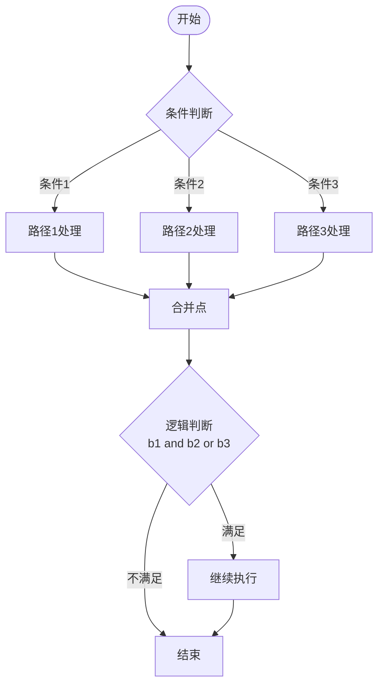
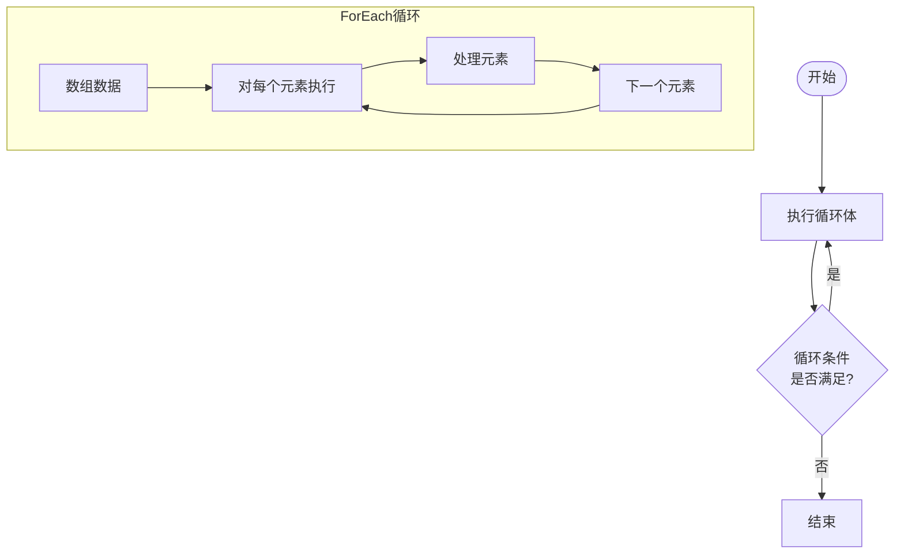
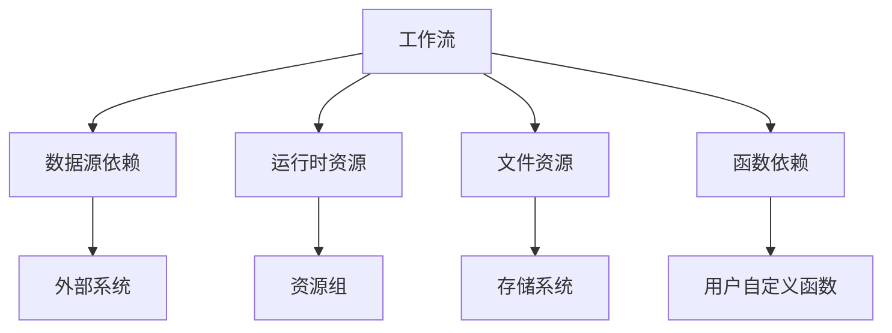
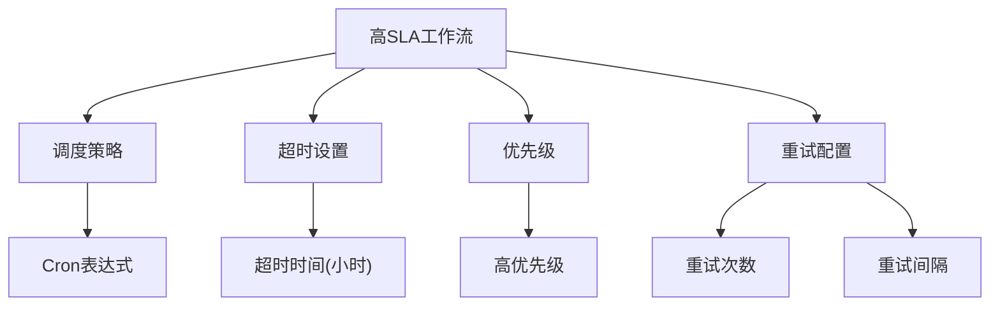
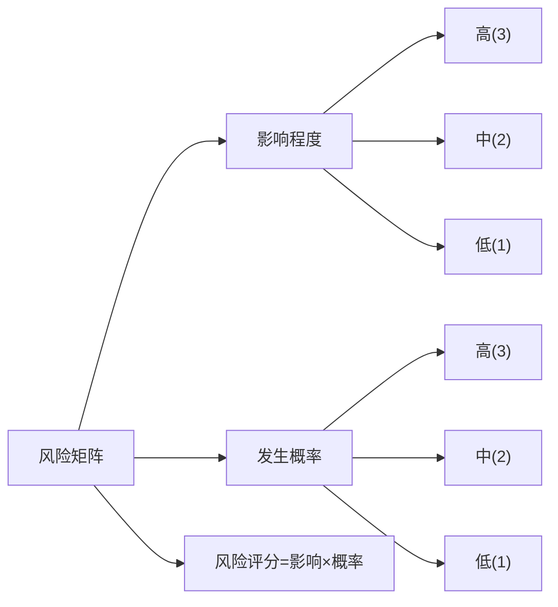
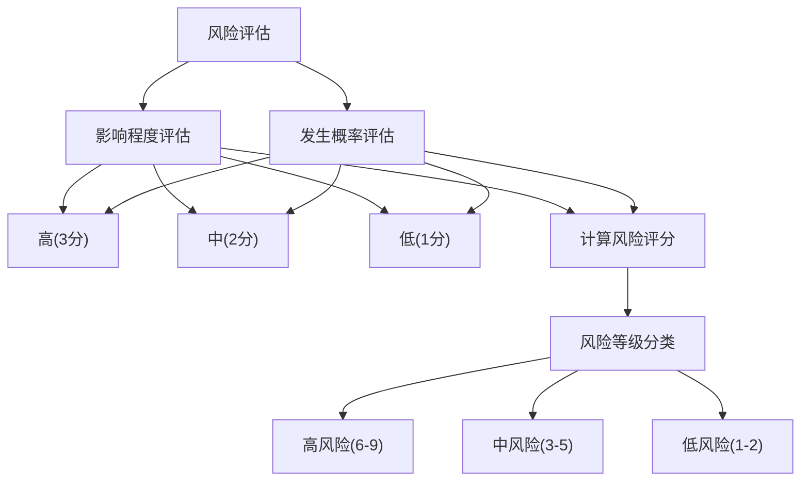
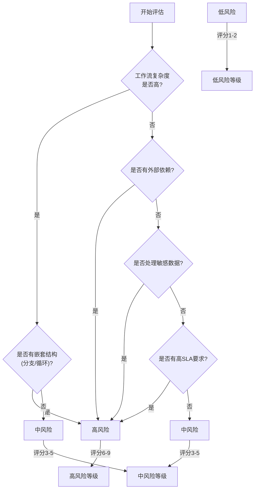
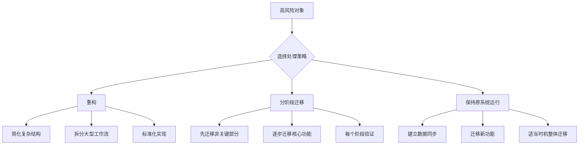
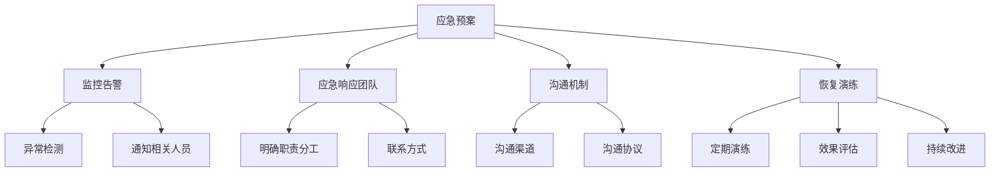

# 风险识别与分类

<cite>
**本文档引用的文件**
- [DataWorksWorkflowSpec.java](file://spec/src/main/java/com/aliyun/dataworks/common/spec/domain/DataWorksWorkflowSpec.java)
- [SpecNode.java](file://spec/src/main/java/com/aliyun/dataworks/common/spec/domain/ref/SpecNode.java)
- [SpecWorkflow.java](file://spec/src/main/java/com/aliyun/dataworks/common/spec/domain/ref/SpecWorkflow.java)
- [SpecBranch.java](file://spec/src/main/java/com/aliyun/dataworks/common/spec/domain/noref/SpecBranch.java)
- [SpecJoin.java](file://spec/src/main/java/com/aliyun/dataworks/common/spec/domain/noref/SpecJoin.java)
- [SpecDoWhile.java](file://spec/src/main/java/com/aliyun/dataworks/common/spec/domain/noref/SpecDoWhile.java)
- [SpecForEach.java](file://spec/src/main/java/com/aliyun/dataworks/common/spec/domain/noref/SpecForEach.java)
- [ReportRiskLevel.java](file://client/migrationx/migrationx-transformer/src/main/java/com/aliyun/dataworks/migrationx/transformer/core/report/ReportRiskLevel.java)
- [ReportItem.java](file://client/migrationx/migrationx-transformer/src/main/java/com/aliyun/dataworks/migrationx/transformer/core/report/ReportItem.java)
- [join.json](file://spec/src/test/resources/join.json)
</cite>

## 目录
1. [引言](#引言)
2. [复杂工作流风险识别](#复杂工作流风险识别)
3. [外部依赖风险识别](#外部依赖风险识别)
4. [敏感数据处理风险识别](#敏感数据处理风险识别)
5. [高SLA业务流程风险识别](#高sla业务流程风险识别)
6. [风险矩阵构建方法](#风险矩阵构建方法)
7. [风险等级划分标准](#风险等级划分标准)
8. [风险评估模板与决策树](#风险评估模板与决策树)
9. [高风险对象处理策略](#高风险对象处理策略)
10. [回滚与应急预案](#回滚与应急预案)

## 引言
本文档系统性地指导用户识别迁移过程中的潜在风险，包括高复杂度工作流、强外部依赖、敏感数据处理任务以及高SLA要求的关键业务流程。通过分析资产盘点和兼容性评估结果，构建风险矩阵，按影响程度和发生概率划分风险等级，提供风险评估模板和决策树，帮助用户确定高风险对象的处理策略，并制定相应的回滚和应急预案。

## 复杂工作流风险识别

在DataWorks规范模型中，复杂工作流主要体现在多层嵌套的分支、循环等控制结构上。这些复杂结构增加了迁移过程中的理解和转换难度，是主要的风险来源之一。

### 多层嵌套分支结构
分支结构通过`SpecBranch`类实现，允许工作流根据条件执行不同的路径。`SpecJoin`类用于合并多个分支的执行结果，支持复杂的逻辑表达式。这种多分支结构可能导致工作流执行路径复杂，增加理解和迁移的难度。

**图示来源**
- [SpecBranch.java](file://spec/src/main/java/com/aliyun/dataworks/common/spec/domain/noref/SpecBranch.java)
- [SpecJoin.java](file://spec/src/main/java/com/aliyun/dataworks/common/spec/domain/noref/SpecJoin.java)
- [join.json](file://spec/src/test/resources/join.json)

### 循环结构风险
循环结构包括`SpecDoWhile`和`SpecForEach`两种类型，分别表示基于条件的循环和基于数组的循环。这些循环结构可能包含最大迭代次数和并行度设置，增加了执行的复杂性。

**图示来源**
- [SpecDoWhile.java](file://spec/src/main/java/com/aliyun/dataworks/common/spec/domain/noref/SpecDoWhile.java)
- [SpecForEach.java](file://spec/src/main/java/com/aliyun/dataworks/common/spec/domain/noref/SpecForEach.java)

**本节来源**
- [SpecDoWhile.java](file://spec/src/main/java/com/aliyun/dataworks/common/spec/domain/noref/SpecDoWhile.java#L1-L43)
- [SpecForEach.java](file://spec/src/main/java/com/aliyun/dataworks/common/spec/domain/noref/SpecForEach.java#L1-L44)
- [SpecBranch.java](file://spec/src/main/java/com/aliyun/dataworks/common/spec/domain/noref/SpecBranch.java#L1-L39)

## 外部依赖风险识别

外部依赖风险主要体现在工作流对其他系统或服务的依赖上。在DataWorks模型中，这种依赖通过`SpecDatasource`、`SpecRuntimeResource`等组件体现。

### 数据源依赖
工作流节点通过`SpecDatasource`属性引用外部数据源，这种依赖关系在迁移过程中需要特别关注，因为目标环境可能不存在相同的数据源配置。

### 运行时资源依赖
`SpecRuntimeResource`定义了工作流执行所需的运行时资源，如计算资源组等。这些资源在不同环境中的可用性和配置可能不同，构成迁移风险。

**图示来源**
- [SpecNode.java](file://spec/src/main/java/com/aliyun/dataworks/common/spec/domain/ref/SpecNode.java)
- [SpecWorkflow.java](file://spec/src/main/java/com/aliyun/dataworks/common/spec/domain/ref/SpecWorkflow.java)

**本节来源**
- [SpecNode.java](file://spec/src/main/java/com/aliyun/dataworks/common/spec/domain/ref/SpecNode.java#L1-L192)
- [SpecWorkflow.java](file://spec/src/main/java/com/aliyun/dataworks/common/spec/domain/ref/SpecWorkflow.java#L1-L83)

## 敏感数据处理风险识别

敏感数据处理任务在迁移过程中需要特别关注数据安全和合规性问题。虽然代码库中没有直接的敏感数据标记，但可以通过工作流的特性和配置来识别潜在的敏感数据处理任务。

### 数据处理节点识别
通过分析`SpecNode`的配置，特别是`SpecScript`和`SpecComponent`，可以识别出涉及数据处理的节点。这些节点可能包含SQL查询、数据转换逻辑等，需要评估其处理的数据是否敏感。

### 数据输出风险
`SpecNode`的`outputs`属性定义了节点的数据输出，这些输出可能包含敏感信息。在迁移过程中，需要确保目标环境有适当的数据保护措施。

**本节来源**
- [SpecNode.java](file://spec/src/main/java/com/aliyun/dataworks/common/spec/domain/ref/SpecNode.java#L1-L192)

## 高SLA业务流程风险识别

高SLA要求的关键业务流程通常具有严格的执行时间要求和高可用性需求。在DataWorks模型中，这些特性通过节点的调度策略和执行配置体现。

### 调度策略分析
`SpecScheduleStrategy`定义了工作流的调度策略，包括执行周期、开始时间、结束时间等。具有严格调度要求的工作流通常对应高SLA业务流程。

### 执行超时配置
`SpecNode`的`timeout`和`timeoutUnit`属性定义了节点的执行超时时间，较短的超时时间通常表示该节点对执行时间有严格要求，可能是高SLA流程的一部分。

**图示来源**
- [SpecNode.java](file://spec/src/main/java/com/aliyun/dataworks/common/spec/domain/ref/SpecNode.java)
- [SpecWorkflow.java](file://spec/src/main/java/com/aliyun/dataworks/common/spec/domain/ref/SpecWorkflow.java)

**本节来源**
- [SpecNode.java](file://spec/src/main/java/com/aliyun/dataworks/common/spec/domain/ref/SpecNode.java#L1-L192)
- [SpecWorkflow.java](file://spec/src/main/java/com/aliyun/dataworks/common/spec/domain/ref/SpecWorkflow.java#L1-L83)

## 风险矩阵构建方法

基于资产盘点和兼容性评估结果，构建风险矩阵是系统化管理迁移风险的关键步骤。风险矩阵综合考虑风险的影响程度和发生概率两个维度。

### 风险影响程度评估
风险影响程度主要从以下几个方面评估：
- **业务影响**：风险事件对业务连续性的影响程度
- **数据影响**：风险事件对数据完整性、一致性的影响
- **财务影响**：风险事件可能导致的直接或间接经济损失
- **声誉影响**：风险事件对企业声誉的潜在损害

### 风险发生概率评估
风险发生概率主要考虑：
- **技术复杂度**：工作流或组件的技术实现复杂度
- **依赖强度**：对外部系统或服务的依赖程度
- **变更频率**：相关系统或配置的变更频率
- **历史问题**：类似迁移项目中出现过的问题频率

**图示来源**
- [SpecNode.java](file://spec/src/main/java/com/aliyun/dataworks/common/spec/domain/ref/SpecNode.java)
- [SpecWorkflow.java](file://spec/src/main/java/com/aliyun/dataworks/common/spec/domain/ref/SpecWorkflow.java)

**本节来源**
- [SpecNode.java](file://spec/src/main/java/com/aliyun/dataworks/common/spec/domain/ref/SpecNode.java#L1-L192)
- [SpecWorkflow.java](file://spec/src/main/java/com/aliyun/dataworks/common/spec/domain/ref/SpecWorkflow.java#L1-L83)

## 风险等级划分标准

根据风险矩阵的评估结果，将风险划分为高、中、低三个等级，便于采取相应的管理措施。

### 风险等级定义
风险等级根据风险评分（影响程度×发生概率）进行划分：

| 风险评分 | 风险等级 | 描述 |
|---------|--------|------|
| 6-9 | 高风险 | 需要立即关注和处理，可能严重影响迁移成功 |
| 3-5 | 中风险 | 需要关注，可能影响迁移进度或质量 |
| 1-2 | 低风险 | 常规关注，通常不会对迁移造成重大影响 |

### 风险等级评估标准

**图示来源**
- [ReportRiskLevel.java](file://client/migrationx/migrationx-transformer/src/main/java/com/aliyun/dataworks/migrationx/transformer/core/report/ReportRiskLevel.java)

**本节来源**
- [ReportRiskLevel.java](file://client/migrationx/migrationx-transformer/src/main/java/com/aliyun/dataworks/migrationx/transformer/core/report/ReportRiskLevel.java#L1-L43)
- [ReportItem.java](file://client/migrationx/migrationx-transformer/src/main/java/com/aliyun/dataworks/migrationx/transformer/core/report/ReportItem.java#L1-L116)

## 风险评估模板与决策树

为系统化地进行风险评估，提供标准化的评估模板和决策树，确保评估过程的一致性和完整性。

### 风险评估模板
风险评估模板包含以下关键字段：
- **风险项名称**：风险的具体描述
- **影响程度**：1-3分
- **发生概率**：1-3分
- **风险评分**：影响×概率
- **风险等级**：高、中、低
- **缓解措施**：建议的缓解或应对措施
- **责任人**：负责管理该风险的人员

### 风险决策树

**图示来源**
- [ReportRiskLevel.java](file://client/migrationx/migrationx-transformer/src/main/java/com/aliyun/dataworks/migrationx/transformer/core/report/ReportRiskLevel.java)
- [SpecNode.java](file://spec/src/main/java/com/aliyun/dataworks/common/spec/domain/ref/SpecNode.java)

**本节来源**
- [ReportRiskLevel.java](file://client/migrationx/migrationx-transformer/src/main/java/com/aliyun/dataworks/migrationx/transformer/core/report/ReportRiskLevel.java#L1-L43)
- [SpecNode.java](file://spec/src/main/java/com/aliyun/dataworks/common/spec/domain/ref/SpecNode.java#L1-L192)

## 高风险对象处理策略

针对识别出的高风险对象，提供多种处理策略，根据具体情况选择最合适的方案。

### 重构策略
对于技术复杂度高但业务价值大的高风险对象，考虑进行重构：
- 简化复杂的工作流结构
- 拆分大型工作流为多个小型工作流
- 标准化脚本和组件的实现方式

### 分阶段迁移策略
对于依赖复杂或影响范围广的高风险对象，采用分阶段迁移：
- 先迁移非关键部分
- 逐步迁移核心功能
- 每个阶段进行充分验证

### 保持原系统运行策略
对于迁移风险极高且当前运行稳定的关键系统，考虑暂时保持原系统运行：
- 建立系统间的数据同步机制
- 逐步将新功能迁移到新平台
- 在适当时机进行整体迁移

**图示来源**
- [ReportRiskLevel.java](file://client/migrationx/migrationx-transformer/src/main/java/com/aliyun/dataworks/migrationx/transformer/core/report/ReportRiskLevel.java)

**本节来源**
- [ReportRiskLevel.java](file://client/migrationx/migrationx-transformer/src/main/java/com/aliyun/dataworks/migrationx/transformer/core/report/ReportRiskLevel.java#L1-L43)

## 回滚与应急预案

为应对迁移过程中可能出现的问题，制定详细的回滚和应急预案，确保业务连续性。

### 回滚策略
- **数据回滚**：确保有完整的数据备份，能够在需要时恢复到迁移前的状态
- **配置回滚**：保存迁移前的所有配置，便于快速恢复
- **流程回滚**：记录迁移过程中的所有变更，能够按步骤反向执行

### 应急预案
- **监控告警**：建立全面的监控体系，及时发现异常
- **应急响应团队**：组建专门的应急响应团队，明确职责分工
- **沟通机制**：建立快速沟通机制，确保信息及时传递
- **恢复演练**：定期进行恢复演练，验证应急预案的有效性

**图示来源**
- [ReportItem.java](file://client/migrationx/migrationx-transformer/src/main/java/com/aliyun/dataworks/migrationx/transformer/core/report/ReportItem.java)

**本节来源**
- [ReportItem.java](file://client/migrationx/migrationx-transformer/src/main/java/com/aliyun/dataworks/migrationx/transformer/core/report/ReportItem.java#L1-L116)