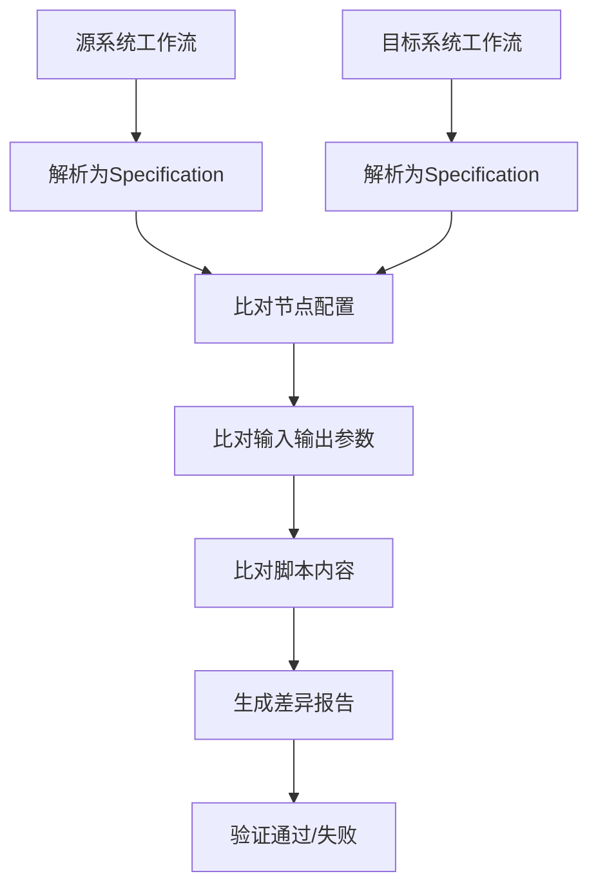
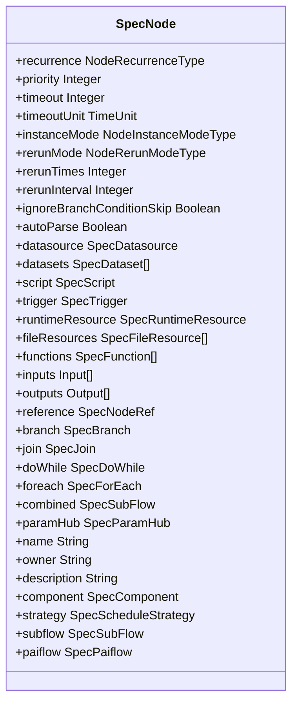
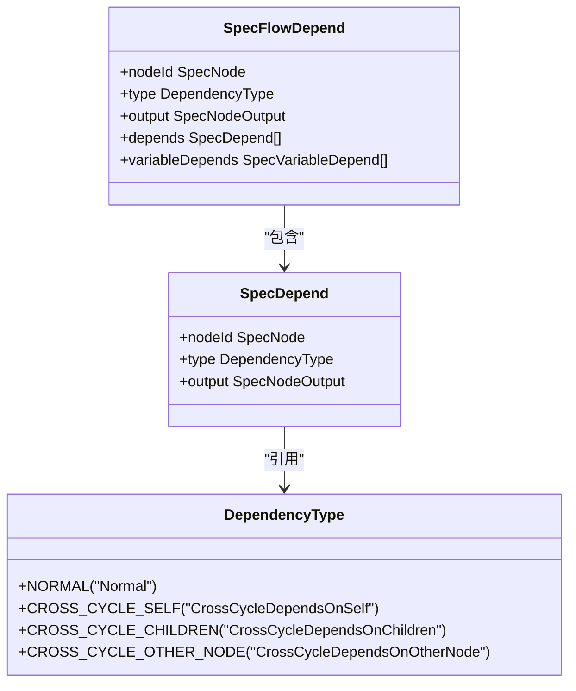
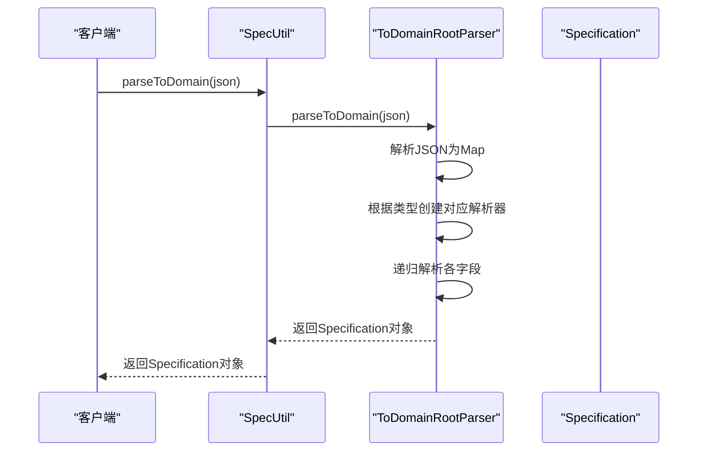
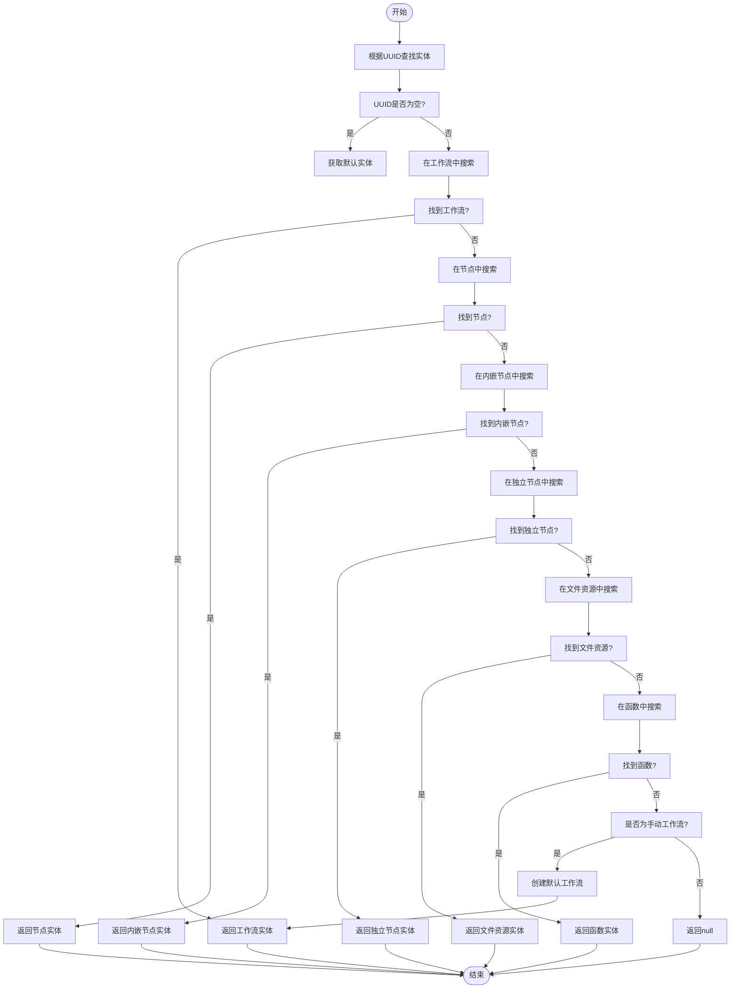
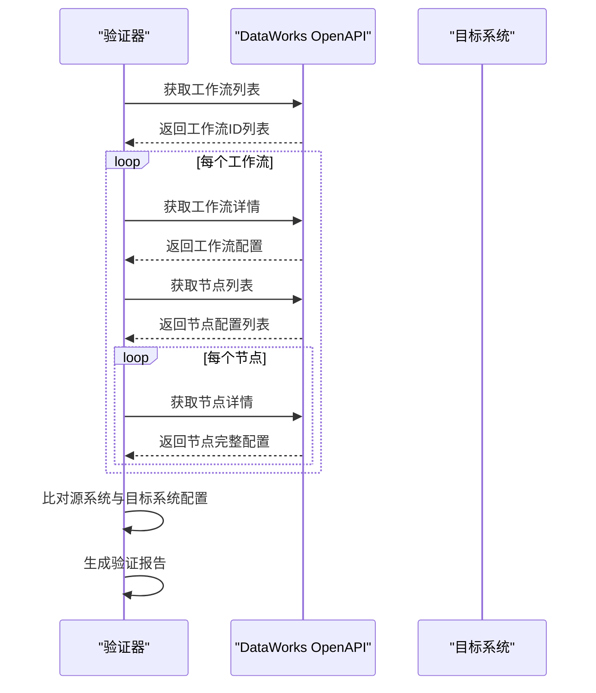
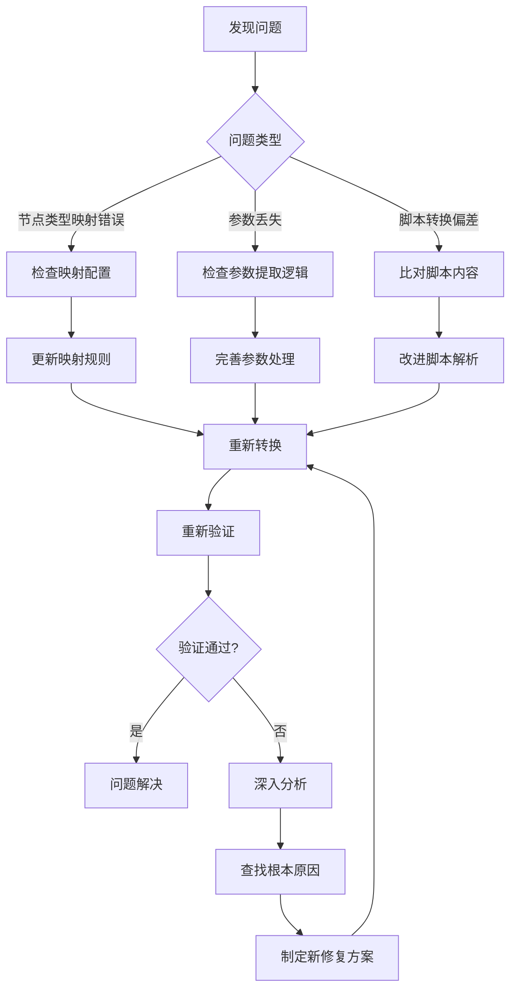

# 功能验证

<cite>
**本文档引用的文件**   
- [SpecUtil.java](file://spec/src/main/java/com/aliyun/dataworks/common/spec/SpecUtil.java)
- [SpecNode.java](file://spec/src/main/java/com/aliyun/dataworks/common/spec/domain/ref/SpecNode.java)
- [SpecWorkflow.java](file://spec/src/main/java/com/aliyun/dataworks/common/spec/domain/ref/SpecWorkflow.java)
- [DataWorksWorkflowSpec.java](file://spec/src/main/java/com/aliyun/dataworks/common/spec/domain/DataWorksWorkflowSpec.java)
- [SpecPackageValidator.java](file://client/migrationx/migrationx-domain/migrationx-domain-dataworks/src/main/java/com/aliyun/dataworks/migrationx/domain/dataworks/packages/validator/impl/SpecPackageValidator.java)
- [SpecFileValidator.java](file://client/migrationx/migrationx-domain/migrationx-domain-dataworks/src/main/java/com/aliyun/dataworks/migrationx/domain/dataworks/packages/validator/impl/SpecFileValidator.java)
- [spec.py](file://client/client-toolkits/src/main/bin/spec.py)
- [migrationx.py](file://client/migrationx/src/main/bin/migrationx.py)
- [reader.py](file://client/migrationx/src/main/bin/reader.py)
</cite>

## 目录
1. [引言](#引言)
2. [核心验证机制](#核心验证机制)
3. [节点逻辑与依赖关系验证](#节点逻辑与依赖关系验证)
4. [SpecUtil工具解析与比对](#specutil工具解析与比对)
5. [DataWorks OpenAPI配置校验](#dataworks-openapi配置校验)
6. [常见问题识别与修复](#常见问题识别与修复)
7. [自动化验证脚本示例](#自动化验证脚本示例)
8. [结论](#结论)

## 引言

在数据工作流迁移过程中，确保迁移后工作流的节点逻辑和依赖关系正确性至关重要。本文档详细说明了如何通过比对源系统和目标系统的节点配置、输入输出参数、脚本内容等来确保功能一致性。我们将重点介绍使用SpecUtil工具解析和比对工作流定义的方法，以及通过DataWorks OpenAPI获取实际配置进行校验的技术方案。同时，本文档将涵盖节点类型映射错误、参数丢失、脚本转换偏差等常见问题的识别与修复策略，并提供自动化验证脚本的实现示例。

## 核心验证机制

工作流迁移后的功能验证主要依赖于对工作流定义规范（Specification）的结构化解析和比对。系统采用基于JSON的规范定义格式，通过`SpecUtil`工具类实现规范的解析、序列化和验证功能。验证过程分为静态验证和动态验证两个层面：静态验证关注规范文件本身的结构完整性和语义正确性，而动态验证则通过DataWorks OpenAPI获取运行时配置进行一致性校验。



**图表来源**
- [SpecUtil.java](file://spec/src/main/java/com/aliyun/dataworks/common/spec/SpecUtil.java)

**本节来源**
- [SpecUtil.java](file://spec/src/main/java/com/aliyun/dataworks/common/spec/SpecUtil.java)

## 节点逻辑与依赖关系验证

### 节点配置验证

节点配置验证是确保迁移后工作流功能一致性的基础。系统通过`SpecNode`类定义了工作流中节点的完整配置模型，包括节点的基本属性、执行策略、资源需求、输入输出等。验证过程需要确保源系统和目标系统中对应节点的以下配置项保持一致：

- **节点标识与名称**：验证节点ID和名称是否正确映射
- **执行模式**：检查`instanceMode`属性是否正确设置
- **重试策略**：验证`rerunMode`、`rerunTimes`和`rerunInterval`配置
- **超时设置**：确认`timeout`和`timeoutUnit`的正确性
- **调度策略**：比对`strategy`配置是否一致



**图表来源**
- [SpecNode.java](file://spec/src/main/java/com/aliyun/dataworks/common/spec/domain/ref/SpecNode.java)

### 依赖关系验证

工作流的依赖关系决定了节点的执行顺序和条件。系统通过`SpecFlowDepend`类定义了节点间的依赖关系，包括正常依赖、跨周期依赖等类型。验证过程需要确保迁移后工作流的依赖关系图与源系统保持一致。



**图表来源**
- [SpecFlowDepend.java](file://spec/src/main/java/com/aliyun/dataworks/common/spec/domain/noref/SpecFlowDepend.java)
- [SpecDepend.java](file://spec/src/main/java/com/aliyun/dataworks/common/spec/domain/noref/SpecDepend.java)
- [DependencyType.java](file://spec/src/main/java/com/aliyun/dataworks/common/spec/domain/enums/DependencyType.java)

**本节来源**
- [SpecNode.java](file://spec/src/main/java/com/aliyun/dataworks/common/spec/domain/ref/SpecNode.java)
- [SpecWorkflow.java](file://spec/src/main/java/com/aliyun/dataworks/common/spec/domain/ref/SpecWorkflow.java)

## SpecUtil工具解析与比对

`SpecUtil`是工作流规范解析和比对的核心工具类，提供了将JSON格式的规范定义解析为Java对象、以及将Java对象序列化为JSON格式的功能。该工具还提供了获取特定实体、比对规范等实用方法。

### 规范解析

`SpecUtil.parseToDomain()`方法负责将JSON字符串解析为`Specification`对象。该方法使用`ToDomainRootParser`进行解析，确保规范定义的完整性和正确性。



**图表来源**
- [SpecUtil.java](file://spec/src/main/java/com/aliyun/dataworks/common/spec/SpecUtil.java)

### 规范比对

`SpecUtil`提供了`getMatchIdSpecRefEntity()`方法，用于根据UUID获取对应的规范实体（节点、工作流等）。该方法在验证过程中用于定位需要比对的特定实体。



**图表来源**
- [SpecUtil.java](file://spec/src/main/java/com/aliyun/dataworks/common/spec/SpecUtil.java)

**本节来源**
- [SpecUtil.java](file://spec/src/main/java/com/aliyun/dataworks/common/spec/SpecUtil.java)

## DataWorks OpenAPI配置校验

除了静态的规范文件比对外，还需要通过DataWorks OpenAPI获取目标系统中实际部署的工作流配置进行动态校验。这一过程确保了迁移不仅在定义层面正确，而且在实际运行环境中也保持一致。

### 配置获取流程



### 验证策略

动态验证采用分层比对策略：

1. **工作流层级比对**：比对工作流的基本信息、所有者、描述等
2. **节点层级比对**：逐个比对每个节点的配置
3. **依赖关系比对**：验证节点间的依赖关系图是否一致
4. **脚本内容比对**：确保脚本内容正确转换且无丢失

**本节来源**
- [SpecUtil.java](file://spec/src/main/java/com/aliyun/dataworks/common/spec/SpecUtil.java)
- [DataWorksWorkflowSpec.java](file://spec/src/main/java/com/aliyun/dataworks/common/spec/domain/DataWorksWorkflowSpec.java)

## 常见问题识别与修复

### 节点类型映射错误

节点类型映射错误是迁移过程中最常见的问题之一。不同系统间的节点类型可能存在差异，导致映射不准确。

**识别方法**：
- 检查`SpecNode`的`script.runtime.command`字段值
- 验证是否为预期的节点类型（如"ODPS_SQL"、"PYTHON"等）
- 比对源系统和目标系统的节点类型映射表

**修复方案**：
- 更新节点类型映射配置
- 在转换器中添加缺失的映射规则
- 对特殊节点类型进行自定义处理

### 参数丢失

参数丢失问题通常发生在节点参数转换过程中。

**识别方法**：
- 检查`SpecNode`的`inputs`和`parameters`字段
- 验证参数数量是否与源系统一致
- 比对参数名称、类型和默认值

**修复方案**：
- 完善参数提取逻辑
- 添加参数类型转换规则
- 实现参数默认值处理机制

### 脚本转换偏差

脚本转换偏差可能导致业务逻辑错误。

**识别方法**：
- 比对源脚本和目标脚本的内容
- 检查变量引用是否正确转换
- 验证脚本中的特殊语法是否被正确处理

**修复方案**：
- 改进脚本解析器
- 添加脚本模板机制
- 实现脚本内容校验功能



**图表来源**
- [SpecNode.java](file://spec/src/main/java/com/aliyun/dataworks/common/spec/domain/ref/SpecNode.java)
- [SpecUtil.java](file://spec/src/main/java/com/aliyun/dataworks/common/spec/SpecUtil.java)

**本节来源**
- [SpecNode.java](file://spec/src/main/java/com/aliyun/dataworks/common/spec/domain/ref/SpecNode.java)
- [SpecUtil.java](file://spec/src/main/java/com/aliyun/dataworks/common/spec/SpecUtil.java)

## 自动化验证脚本示例

以下是一个自动化验证脚本的示例，展示了如何使用提供的工具进行批量验证。

```python
#!/usr/bin/env python
# -*- coding: utf-8 -*-

import json
import os
import sys
from spec import SpecUtil

def validate_workflow(source_spec_path, target_spec_path):
    """
    验证源系统和目标系统工作流的一致性
    """
    # 读取源系统规范
    with open(source_spec_path, 'r') as f:
        source_spec_json = f.read()
    
    # 读取目标系统规范
    with open(target_spec_path, 'r') as f:
        target_spec_json = f.read()
    
    # 解析规范
    source_spec = SpecUtil.parseToDomain(source_spec_json)
    target_spec = SpecUtil.parseToDomain(target_spec_json)
    
    # 比对基本信息
    if source_spec.getKind() != target_spec.getKind():
        print(f"工作流类型不一致: {source_spec.getKind()} vs {target_spec.getKind()}")
        return False
    
    if source_spec.getVersion() != target_spec.getVersion():
        print(f"版本不一致: {source_spec.getVersion()} vs {target_spec.getVersion()}")
        return False
    
    # 比对节点配置
    source_nodes = source_spec.getSpec().getNodes()
    target_nodes = target_spec.getSpec().getNodes()
    
    if len(source_nodes) != len(target_nodes):
        print(f"节点数量不一致: {len(source_nodes)} vs {len(target_nodes)}")
        return False
    
    # 逐个比对节点
    for i, (source_node, target_node) in enumerate(zip(source_nodes, target_nodes)):
        if not validate_node(source_node, target_node):
            print(f"节点{i}配置不一致")
            return False
    
    # 比对依赖关系
    if not validate_dependencies(source_spec, target_spec):
        print("依赖关系不一致")
        return False
    
    print("验证通过")
    return True

def validate_node(source_node, target_node):
    """
    验证单个节点的配置一致性
    """
    # 比对基本属性
    if source_node.getName() != target_node.getName():
        print(f"节点名称不一致: {source_node.getName()} vs {target_node.getName()}")
        return False
    
    # 比对执行模式
    if source_node.getInstanceMode() != target_node.getInstanceMode():
        print(f"执行模式不一致: {source_node.getInstanceMode()} vs {target_node.getInstanceMode()}")
        return False
    
    # 比对重试策略
    if source_node.getRerunMode() != target_node.getRerunMode():
        print(f"重试模式不一致: {source_node.getRerunMode()} vs {target_node.getRerunMode()}")
        return False
    
    if source_node.getRerunTimes() != target_node.getRerunTimes():
        print(f"重试次数不一致: {source_node.getRerunTimes()} vs {target_node.getRerunTimes()}")
        return False
    
    # 比对脚本内容
    if source_node.getScript() and target_node.getScript():
        if source_node.getScript().getRuntime().getCommand() != target_node.getScript().getRuntime().getCommand():
            print(f"节点类型不一致: {source_node.getScript().getRuntime().getCommand()} vs {target_node.getScript().getRuntime().getCommand()}")
            return False
        
        # 这里可以添加更复杂的脚本内容比对逻辑
    
    return True

def validate_dependencies(source_spec, target_spec):
    """
    验证依赖关系的一致性
    """
    source_dependencies = source_spec.getSpec().getFlow()
    target_dependencies = target_spec.getSpec().getFlow()
    
    if len(source_dependencies) != len(target_dependencies):
        return False
    
    # 这里可以添加更详细的依赖关系比对逻辑
    # 例如比对每个依赖的源节点和目标节点
    
    return True

if __name__ == "__main__":
    if len(sys.argv) != 3:
        print("用法: python validate.py <源系统规范路径> <目标系统规范路径>")
        sys.exit(1)
    
    source_path = sys.argv[1]
    target_path = sys.argv[2]
    
    if not os.path.exists(source_path):
        print(f"源系统规范文件不存在: {source_path}")
        sys.exit(1)
    
    if not os.path.exists(target_path):
        print(f"目标系统规范文件不存在: {target_path}")
        sys.exit(1)
    
    success = validate_workflow(source_path, target_path)
    sys.exit(0 if success else 1)
```

**本节来源**
- [spec.py](file://client/client-toolkits/src/main/bin/spec.py)
- [SpecUtil.java](file://spec/src/main/java/com/aliyun/dataworks/common/spec/SpecUtil.java)

## 结论

工作流迁移后的功能验证是一个系统性的工程，需要从多个维度进行全面的比对和校验。通过使用SpecUtil工具对工作流定义进行解析和比对，结合DataWorks OpenAPI对实际配置进行动态验证，可以有效确保迁移后工作流的节点逻辑和依赖关系正确性。针对节点类型映射错误、参数丢失、脚本转换偏差等常见问题，需要建立完善的识别和修复机制。自动化验证脚本的实现能够大大提高验证效率，减少人工错误，为工作流迁移的成功提供有力保障。