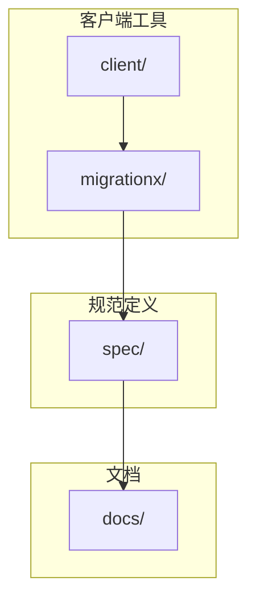
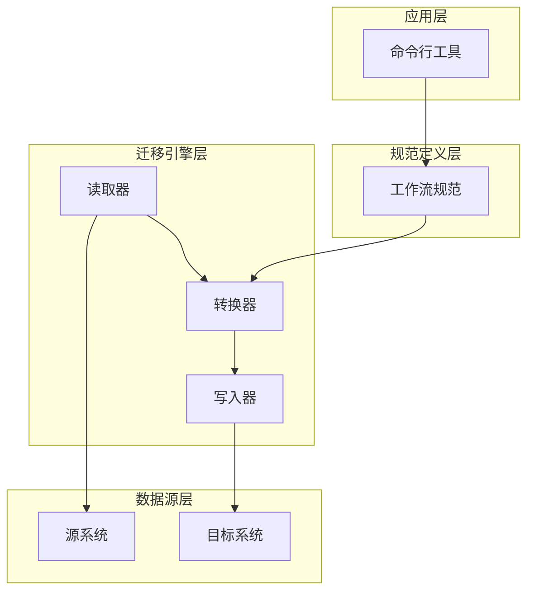
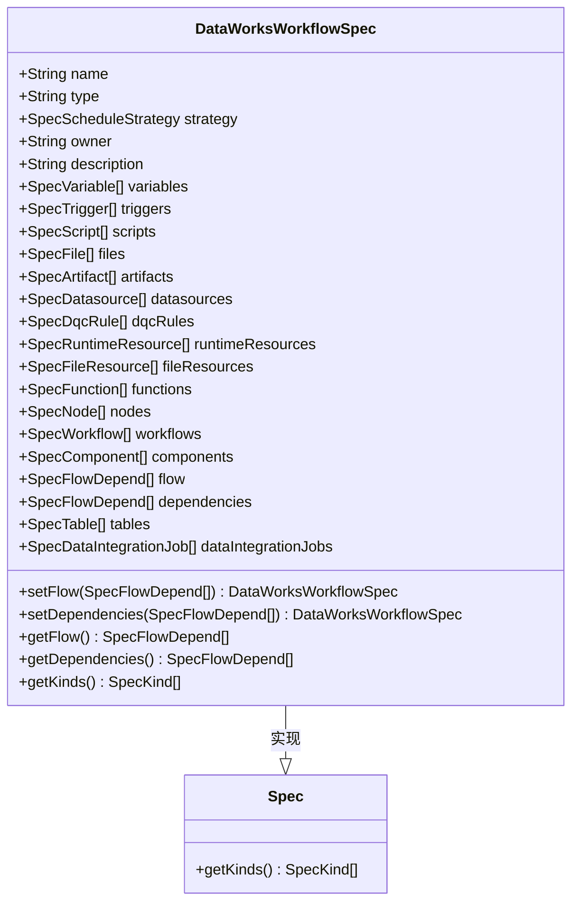
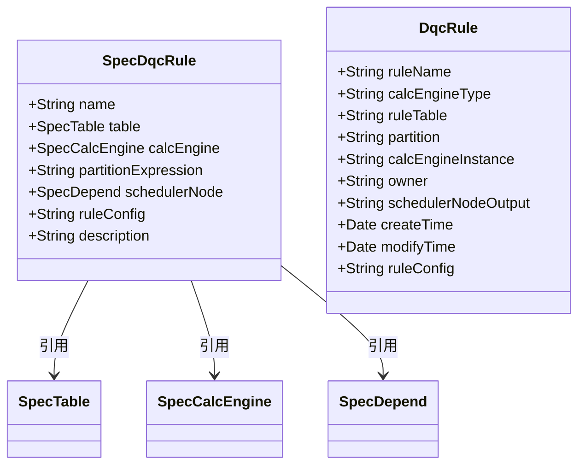
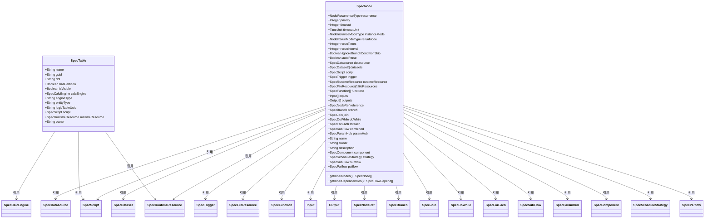
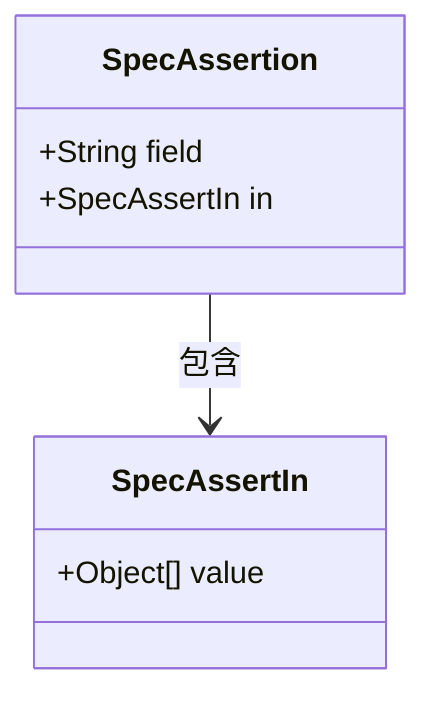
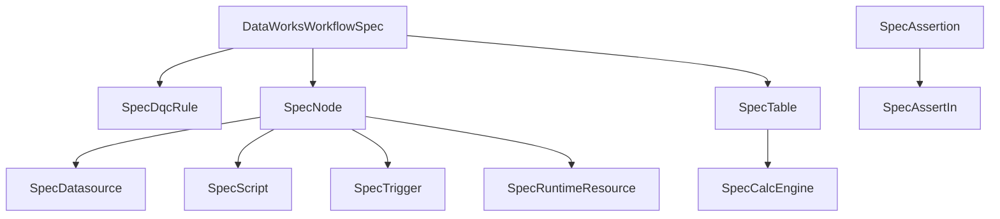

# 数据一致性验证

<cite>
**本文档中引用的文件**  
- [DataWorksWorkflowSpec.java](file://spec/src/main/java/com/aliyun/dataworks/common/spec/domain/DataWorksWorkflowSpec.java)
- [SpecDqcRule.java](file://spec/src/main/java/com/aliyun/dataworks/common/spec/domain/ref/SpecDqcRule.java)
- [SpecNode.java](file://spec/src/main/java/com/aliyun/dataworks/common/spec/domain/ref/SpecNode.java)
- [SpecTable.java](file://spec/src/main/java/com/aliyun/dataworks/common/spec/domain/ref/SpecTable.java)
- [SpecAssertion.java](file://spec/src/main/java/com/aliyun/dataworks/common/spec/domain/noref/SpecAssertion.java)
- [SpecAssertIn.java](file://spec/src/main/java/com/aliyun/dataworks/common/spec/domain/noref/SpecAssertIn.java)
- [DqcRule.java](file://client/migrationx/migrationx-domain/migrationx-domain-dataworks/src/main/java/com/aliyun/dataworks/migrationx/domain/dataworks/objects/entity/DqcRule.java)
- [DataSynchronizationQualityCheckCodeTest.java](file://spec/src/test/java/com/aliyun/dataworks/common/spec/domain/dw/codemodel/DataSynchronizationQualityCheckCodeTest.java)
- [usage_zh_CN.md](file://docs/migrationx/usage_zh_CN.md)
</cite>

## 目录
1. [引言](#引言)
2. [项目结构](#项目结构)
3. [核心组件](#核心组件)
4. [架构概述](#架构概述)
5. [详细组件分析](#详细组件分析)
6. [依赖分析](#依赖分析)
7. [性能考虑](#性能考虑)
8. [故障排除指南](#故障排除指南)
9. [结论](#结论)

## 引言
本文档旨在提供关于如何验证迁移后工作流处理的数据结果是否与源系统保持一致的详细指导。我们将探讨端到端的数据验证方案设计，包括输入数据、中间处理过程和最终输出数据的比对方法。通过抽样测试、数据校验脚本和业务指标核对来确认数据处理逻辑的正确性。此外，文档还将介绍针对不同节点类型（如SQL节点、DataX节点、Spark节点）的数据验证方法，以及处理精度差异、时区转换等问题的解决方案，以确保迁移后的数据质量。

## 项目结构
本项目采用模块化设计，主要分为客户端工具、迁移引擎、规范定义等几个部分。其中，`spec`模块定义了工作流规范的核心数据结构，`migrationx`模块负责实现从不同调度系统到DataWorks的迁移功能，`client`模块提供了命令行接口用于执行迁移任务。

**图示来源**  
- [DataWorksWorkflowSpec.java](file://spec/src/main/java/com/aliyun/dataworks/common/spec/domain/DataWorksWorkflowSpec.java)
- [usage_zh_CN.md](file://docs/migrationx/usage_zh_CN.md)

**本节来源**  
- [DataWorksWorkflowSpec.java](file://spec/src/main/java/com/aliyun/dataworks/common/spec/domain/DataWorksWorkflowSpec.java)
- [usage_zh_CN.md](file://docs/migrationx/usage_zh_CN.md)

## 核心组件
核心组件主要包括工作流规范定义、数据质量规则、节点定义、表定义等。这些组件共同构成了迁移过程中数据一致性验证的基础。

**本节来源**  
- [DataWorksWorkflowSpec.java](file://spec/src/main/java/com/aliyun/dataworks/common/spec/domain/DataWorksWorkflowSpec.java)
- [SpecDqcRule.java](file://spec/src/main/java/com/aliyun/dataworks/common/spec/domain/ref/SpecDqcRule.java)
- [SpecNode.java](file://spec/src/main/java/com/aliyun/dataworks/common/spec/domain/ref/SpecNode.java)
- [SpecTable.java](file://spec/src/main/java/com/aliyun/dataworks/common/spec/domain/ref/SpecTable.java)

## 架构概述
系统架构采用分层设计，从下至上分别为数据源层、迁移引擎层、规范定义层和应用层。各层之间通过明确定义的接口进行通信，保证了系统的可扩展性和维护性。

**图示来源**  
- [DataWorksWorkflowSpec.java](file://spec/src/main/java/com/aliyun/dataworks/common/spec/domain/DataWorksWorkflowSpec.java)
- [usage_zh_CN.md](file://docs/migrationx/usage_zh_CN.md)

## 详细组件分析

### 工作流规范分析
工作流规范是整个迁移过程的核心，它定义了工作流的所有属性和行为。

#### 类图

**图示来源**  
- [DataWorksWorkflowSpec.java](file://spec/src/main/java/com/aliyun/dataworks/common/spec/domain/DataWorksWorkflowSpec.java)
- [Spec.java](file://spec/src/main/java/com/aliyun/dataworks/common/spec/domain/Spec.java)

**本节来源**  
- [DataWorksWorkflowSpec.java](file://spec/src/main/java/com/aliyun/dataworks/common/spec/domain/DataWorksWorkflowSpec.java)

### 数据质量规则分析
数据质量规则用于定义数据验证的标准和条件。

#### 类图

**图示来源**  
- [SpecDqcRule.java](file://spec/src/main/java/com/aliyun/dataworks/common/spec/domain/ref/SpecDqcRule.java)
- [DqcRule.java](file://client/migrationx/migrationx-domain/migrationx-domain-dataworks/src/main/java/com/aliyun/dataworks/migrationx/domain/dataworks/objects/entity/DqcRule.java)

**本节来源**  
- [SpecDqcRule.java](file://spec/src/main/java/com/aliyun/dataworks/common/spec/domain/ref/SpecDqcRule.java)
- [DqcRule.java](file://client/migrationx/migrationx-domain/migrationx-domain-dataworks/src/main/java/com/aliyun/dataworks/migrationx/domain/dataworks/objects/entity/DqcRule.java)

### 节点与表定义分析
节点和表是工作流中的基本构建单元，它们定义了数据处理的具体操作和数据存储结构。

#### 类图

**图示来源**  
- [SpecNode.java](file://spec/src/main/java/com/aliyun/dataworks/common/spec/domain/ref/SpecNode.java)
- [SpecTable.java](file://spec/src/main/java/com/aliyun/dataworks/common/spec/domain/ref/SpecTable.java)

**本节来源**  
- [SpecNode.java](file://spec/src/main/java/com/aliyun/dataworks/common/spec/domain/ref/SpecNode.java)
- [SpecTable.java](file://spec/src/main/java/com/aliyun/dataworks/common/spec/domain/ref/SpecTable.java)

### 断言机制分析
断言机制用于在工作流中定义条件判断和分支逻辑。

#### 类图

**图示来源**  
- [SpecAssertion.java](file://spec/src/main/java/com/aliyun/dataworks/common/spec/domain/noref/SpecAssertion.java)
- [SpecAssertIn.java](file://spec/src/main/java/com/aliyun/dataworks/common/spec/domain/noref/SpecAssertIn.java)

**本节来源**  
- [SpecAssertion.java](file://spec/src/main/java/com/aliyun/dataworks/common/spec/domain/noref/SpecAssertion.java)
- [SpecAssertIn.java](file://spec/src/main/java/com/aliyun/dataworks/common/spec/domain/noref/SpecAssertIn.java)

## 依赖分析
系统各组件之间的依赖关系清晰，通过接口隔离和依赖注入实现了松耦合。

**图示来源**  
- [DataWorksWorkflowSpec.java](file://spec/src/main/java/com/aliyun/dataworks/common/spec/domain/DataWorksWorkflowSpec.java)
- [SpecDqcRule.java](file://spec/src/main/java/com/aliyun/dataworks/common/spec/domain/ref/SpecDqcRule.java)
- [SpecNode.java](file://spec/src/main/java/com/aliyun/dataworks/common/spec/domain/ref/SpecNode.java)
- [SpecTable.java](file://spec/src/main/java/com/aliyun/dataworks/common/spec/domain/ref/SpecTable.java)
- [SpecAssertion.java](file://spec/src/main/java/com/aliyun/dataworks/common/spec/domain/noref/SpecAssertion.java)
- [SpecAssertIn.java](file://spec/src/main/java/com/aliyun/dataworks/common/spec/domain/noref/SpecAssertIn.java)

**本节来源**  
- [DataWorksWorkflowSpec.java](file://spec/src/main/java/com/aliyun/dataworks/common/spec/domain/DataWorksWorkflowSpec.java)
- [SpecDqcRule.java](file://spec/src/main/java/com/aliyun/dataworks/common/spec/domain/ref/SpecDqcRule.java)
- [SpecNode.java](file://spec/src/main/java/com/aliyun/dataworks/common/spec/domain/ref/SpecNode.java)
- [SpecTable.java](file://spec/src/main/java/com/aliyun/dataworks/common/spec/domain/ref/SpecTable.java)
- [SpecAssertion.java](file://spec/src/main/java/com/aliyun/dataworks/common/spec/domain/noref/SpecAssertion.java)
- [SpecAssertIn.java](file://spec/src/main/java/com/aliyun/dataworks/common/spec/domain/noref/SpecAssertIn.java)

## 性能考虑
在设计数据一致性验证方案时，需要考虑以下性能因素：
- 验证过程不应显著影响工作流的正常执行
- 大量数据的比对应采用高效的算法和数据结构
- 分布式环境下的一致性验证需要考虑网络延迟和分区容忍性

## 故障排除指南
当遇到数据一致性问题时，可以按照以下步骤进行排查：
1. 检查源系统和目标系统的数据是否同步
2. 验证工作流配置是否正确
3. 检查数据质量规则是否按预期工作
4. 分析节点执行日志，查找异常信息

**本节来源**  
- [DataWorksWorkflowSpec.java](file://spec/src/main/java/com/aliyun/dataworks/common/spec/domain/DataWorksWorkflowSpec.java)
- [SpecDqcRule.java](file://spec/src/main/java/com/aliyun/dataworks/common/spec/domain/ref/SpecDqcRule.java)
- [SpecNode.java](file://spec/src/main/java/com/aliyun/dataworks/common/spec/domain/ref/SpecNode.java)

## 结论
本文档详细介绍了如何设计和实施数据一致性验证方案，涵盖了从工作流规范定义到具体验证机制的各个方面。通过合理利用系统提供的各种组件和工具，可以有效确保迁移后工作流处理的数据结果与源系统保持一致。