# 调度验证

<cite>
**本文档中引用的文件**   
- [trigger.schema.json](file://schema/trigger.schema.json)
- [SpecTrigger.schema.json](file://spec/src/main/resources/spec/schema/SpecTrigger.schema.json)
- [CycleWorkflow.schedule.schema.json](file://dwcli/dwcli/schemas/CycleWorkflow.schedule.schema.json)
- [ManualWorkflow.schedule.schema.json](file://dwcli/dwcli/schemas/ManualWorkflow.schedule.schema.json)
- [trigger.md](file://schema/docs/trigger.md)
- [spec-fields.md](file://docs/spec/spec-fields.md)
- [usage.md](file://docs/migrationx/usage.md)
- [dwcli/cli.py](file://dwcli/dwcli/cli.py)
- [TriggerConverter.java](file://client/migrationx/migrationx-transformer/src/main/java/com/aliyun/dataworks/migrationx/transformer/dataworks/converter/dolphinscheduler/v3/workflow/TriggerConverter.java)
- [CronExpressUtil.java](file://client/migrationx/migrationx-domain/migrationx-domain-dataworks/src/main/java/com/aliyun/dataworks/migrationx/domain/dataworks/utils/CronExpressUtil.java)
- [CronExpression.java](file://client/migrationx/migrationx-domain/migrationx-domain-dataworks/src/main/java/com/aliyun/dataworks/migrationx/domain/dataworks/utils/quartz/CronExpression.java)
- [dag_converter.py](file://client/migrationx-transformer/src/main/python/airflow_dag_parser/converter/dag_converter.py)
- [task_converter.py](file://client/migrationx-transformer/src/main/python/airflow_dag_parser/converter/task_converter.py)
</cite>

## 目录
1. [引言](#引言)
2. [调度配置结构](#调度配置结构)
3. [调度属性验证](#调度属性验证)
4. [dwcli工具使用](#dwcli工具使用)
5. [调度偏差识别与修正](#调度偏差识别与修正)
6. [跨系统调度转换](#跨系统调度转换)
7. [验证方法总结](#验证方法总结)

## 引言

调度验证是确保迁移后工作流能够按照预期时间正确执行的关键步骤。本文档详细说明如何验证迁移后工作流的调度策略和执行计划是否与源系统一致，重点介绍调度周期、依赖触发条件、执行时间等调度属性的正确性检查方法。

在数据工作流迁移过程中，调度配置的准确性至关重要。任何调度偏差都可能导致数据处理延迟、依赖关系断裂或业务逻辑错误。因此，必须建立一套完整的验证机制来确保调度配置的正确性。

**本文档中引用的文件**   
- [spec-fields.md](file://docs/spec/spec-fields.md)
- [usage.md](file://docs/migrationx/usage.md)

## 调度配置结构

### 调度工作流类型

在DataWorks中，工作流主要分为两种调度类型：周期调度工作流（CycleWorkflow）和手动调度工作流（ManualWorkflow）。这两种类型在调度配置上有显著差异。

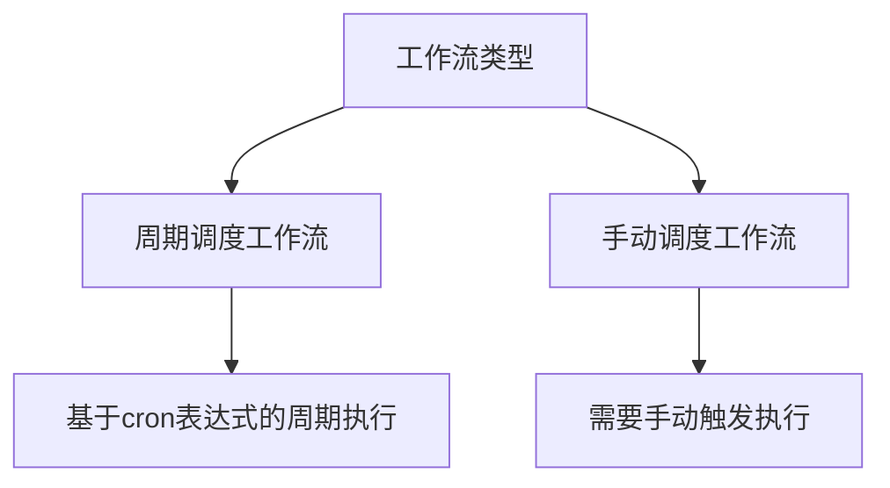

**Diagram sources**
- [CycleWorkflow.schedule.schema.json](file://dwcli/dwcli/schemas/CycleWorkflow.schedule.schema.json)
- [ManualWorkflow.schedule.schema.json](file://dwcli/dwcli/schemas/ManualWorkflow.schedule.schema.json)

### 调度触发器结构

调度触发器（Trigger）是工作流调度的核心配置，定义了工作流的执行时机和周期。触发器的主要属性包括：

- **id**: 触发器的唯一标识符
- **type**: 触发器类型，支持Scheduler（周期调度）和Manual（手动调度）两种
- **cron**: 周期调度的定时表达式
- **startTime**: 周期调度的起始生效时间
- **endTime**: 周期调度的结束生效时间
- **timezone**: 周期调度时间的时区

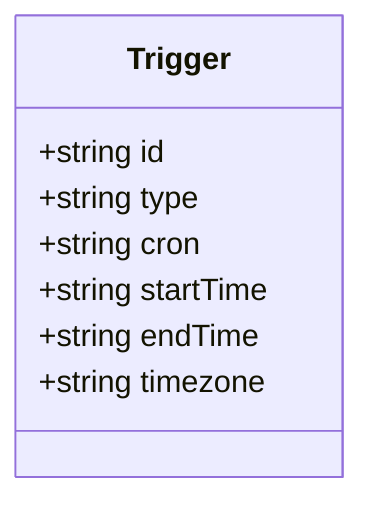

**Diagram sources**
- [trigger.schema.json](file://schema/trigger.schema.json)
- [SpecTrigger.schema.json](file://spec/src/main/resources/spec/schema/SpecTrigger.schema.json)

## 调度属性验证

### 调度周期验证

调度周期的正确性是确保工作流按时执行的基础。验证调度周期主要关注以下几个方面：

1. **Cron表达式准确性**: 确保迁移后的cron表达式与源系统完全一致
2. **执行频率**: 验证工作流的执行频率是否符合业务需求
3. **起止时间**: 检查调度的起始和结束时间是否正确配置

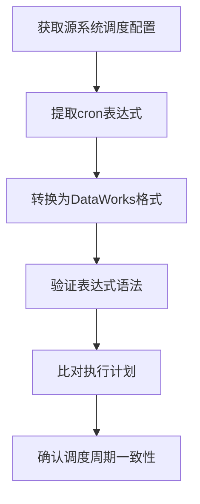

**Diagram sources**
- [CronExpression.java](file://client/migrationx/migrationx-domain/migrationx-domain-dataworks/src/main/java/com/aliyun/dataworks/migrationx/domain/dataworks/utils/quartz/CronExpression.java)
- [CronExpressUtil.java](file://client/migrationx/migrationx-domain/migrationx-domain-dataworks/src/main/java/com/aliyun/dataworks/migrationx/domain/dataworks/utils/CronExpressUtil.java)

### 依赖触发条件验证

工作流中的节点通常存在依赖关系，验证依赖触发条件的正确性至关重要：

1. **节点依赖关系**: 确认节点间的依赖关系是否正确映射
2. **跨周期依赖**: 验证跨周期依赖配置是否准确
3. **触发条件**: 检查触发条件是否符合业务逻辑

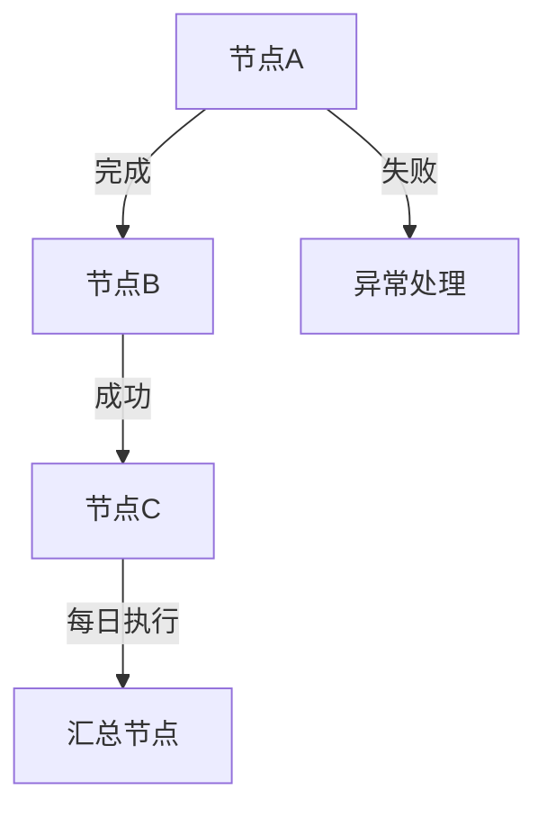

**Diagram sources**
- [CycleWorkflow.schedule.schema.json](file://dwcli/dwcli/schemas/CycleWorkflow.schedule.schema.json)
- [spec-fields.md](file://docs/spec/spec-fields.md)

### 执行时间验证

执行时间的准确性直接影响数据处理的时效性。验证执行时间需要关注：

1. **时区配置**: 确认时区设置是否正确
2. **执行延迟**: 检查是否存在意外的执行延迟
3. **时间偏移**: 验证是否存在时间偏移问题

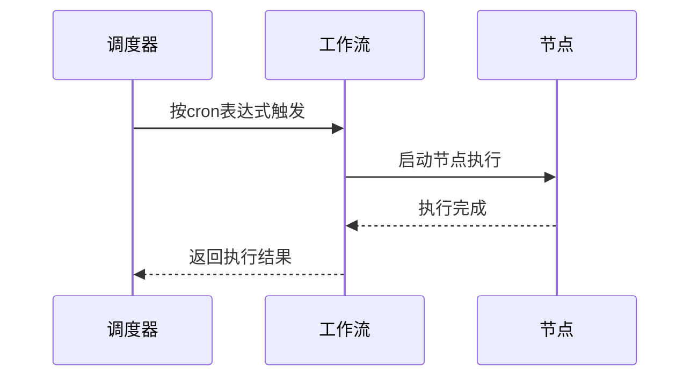

**Diagram sources**
- [TriggerConverter.java](file://client/migrationx/migrationx-transformer/src/main/java/com/aliyun/dataworks/migrationx/transformer/dataworks/converter/dolphinscheduler/v3/workflow/TriggerConverter.java)
- [task_converter.py](file://client/migrationx-transformer/src/main/python/airflow_dag_parser/converter/task_converter.py)

## dwcli工具使用

### dwcli工具概述

dwcli是一个强大的DataWorks命令行工具，用于管理FlowSpec配置即代码（CaC）。它提供了多种功能来帮助验证调度配置：

- **脚手架**: 使用模板创建结构化的对象目录
- **JSON路径操作**: 精确的配置管理（设置/取消设置/检查）
- **模式验证**: 严格的验证和详细的错误报告
- **代码管理**: 无缝编辑和管理代码文件

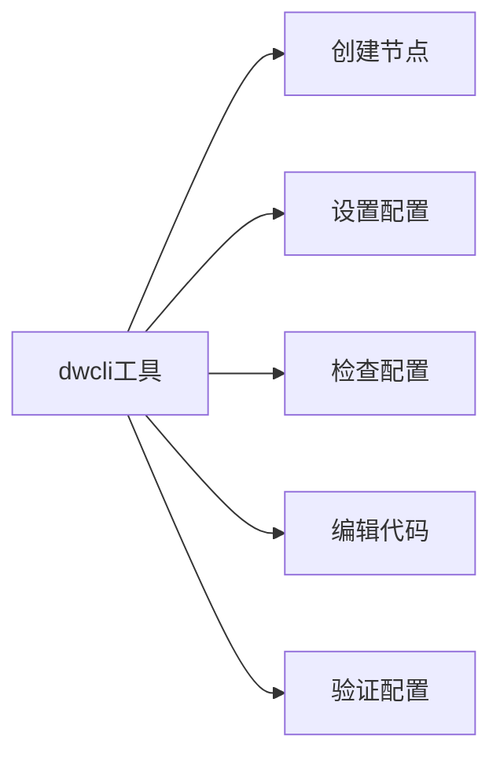

**Diagram sources**
- [dwcli/cli.py](file://dwcli/dwcli/cli.py)
- [README.md](file://dwcli/README.md)

### 导出调度配置

使用dwcli工具导出调度配置是验证过程的第一步。通过导出配置，可以与源系统进行详细比对：

```bash
# 创建新节点
dwcli node create ./tasks --name my-daily-task --template odps-sql-daily

# 设置配置
dwcli node set ./tasks/my-daily-task spec.timeout=3600 --type int

# 检查配置
dwcli node inspect ./tasks/my-daily-task spec.timeout

# 验证配置
dwcli node validate ./tasks/my-daily-task
```

**Section sources**
- [dwcli/cli.py](file://dwcli/dwcli/cli.py)
- [README.md](file://dwcli/README.md)

### 配置比对方法

导出调度配置后，需要与源系统进行比对，主要比对内容包括：

1. **Cron表达式转换**: 验证cron表达式是否正确转换
2. **依赖关系映射**: 确认依赖关系是否准确映射
3. **手工触发与周期触发**: 检查触发方式的对应关系

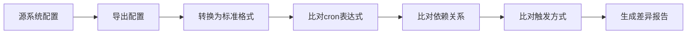

**Section sources**
- [TriggerConverter.java](file://client/migrationx/migrationx-transformer/src/main/java/com/aliyun/dataworks/migrationx/transformer/dataworks/converter/dolphinscheduler/v3/workflow/TriggerConverter.java)
- [dag_converter.py](file://client/migrationx-transformer/src/main/python/airflow_dag_parser/converter/dag_converter.py)

## 调度偏差识别与修正

### 偏差识别方法

识别调度偏差是确保迁移成功的关键步骤。主要识别方法包括：

1. **执行计划比对**: 将迁移后的执行计划与源系统进行详细比对
2. **日志分析**: 分析调度执行日志，识别异常模式
3. **时间戳验证**: 验证关键节点的时间戳是否符合预期

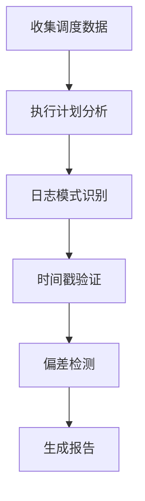

**Section sources**
- [CronExpression.java](file://client/migrationx/migrationx-domain/migrationx-domain-dataworks/src/main/java/com/aliyun/dataworks/migrationx/domain/dataworks/utils/quartz/CronExpression.java)
- [usage.md](file://docs/migrationx/usage.md)

### 修正策略

发现调度偏差后，需要采取相应的修正策略：

1. **配置调整**: 修改调度配置以纠正偏差
2. **重新迁移**: 在重大偏差情况下重新执行迁移
3. **手动干预**: 在紧急情况下进行手动调整

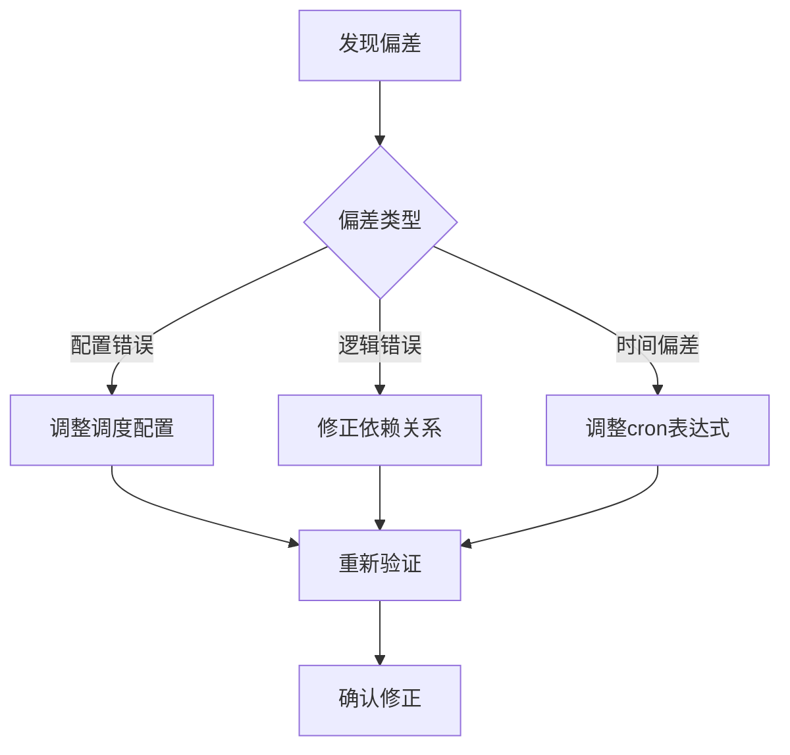

**Section sources**
- [TriggerConverter.java](file://client/migrationx/migrationx-transformer/src/main/java/com/aliyun/dataworks/migrationx/transformer/dataworks/converter/dolphinscheduler/v3/workflow/TriggerConverter.java)
- [CronExpressUtil.java](file://client/migrationx/migrationx-domain/migrationx-domain-dataworks/src/main/java/com/aliyun/dataworks/migrationx/domain/dataworks/utils/CronExpressUtil.java)

## 跨系统调度转换

### 不同系统间的调度映射

在迁移过程中，不同调度系统之间的调度策略需要进行准确映射：

1. **Airflow到DataWorks**: 处理Airflow的schedule_interval到DataWorks cron表达式的转换
2. **DolphinScheduler到DataWorks**: 转换DolphinScheduler的调度配置到DataWorks格式
3. **Azkaban到DataWorks**: 映射Azkaban的调度策略到DataWorks

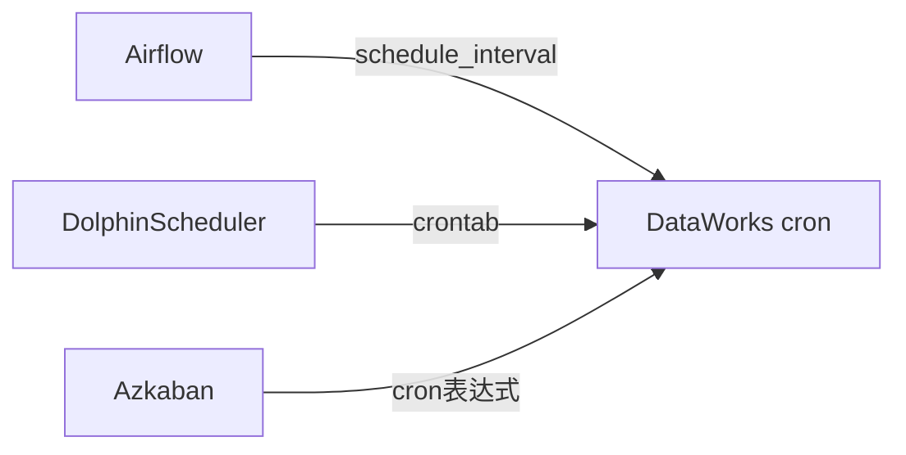

**Section sources**
- [dag_converter.py](file://client/migrationx-transformer/src/main/python/airflow_dag_parser/converter/dag_converter.py)
- [TriggerConverter.java](file://client/migrationx/migrationx-transformer/src/main/java/com/aliyun/dataworks/migrationx/transformer/dataworks/converter/dolphinscheduler/v3/workflow/TriggerConverter.java)

### 调度转换规则

调度转换需要遵循特定的规则以确保准确性：

1. **Cron表达式转换规则**: 定义标准的转换规则
2. **时区处理规则**: 统一时区处理逻辑
3. **特殊字符处理**: 正确处理特殊字符和表达式

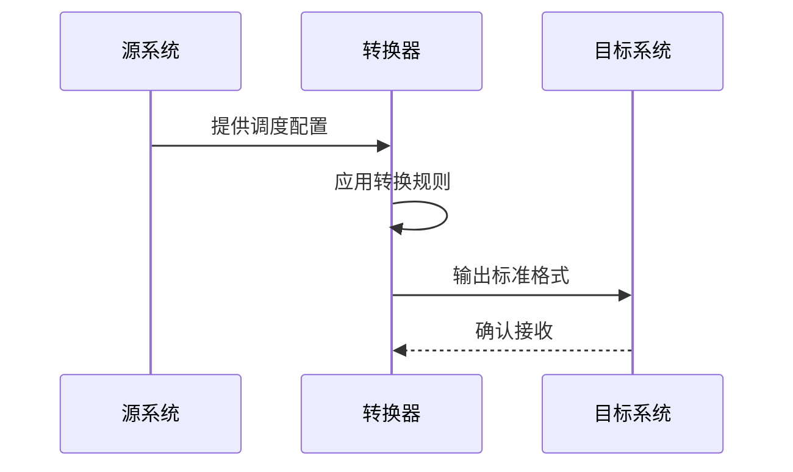

**Section sources**
- [CronExpressUtil.java](file://client/migrationx/migrationx-domain/migrationx-domain-dataworks/src/main/java/com/aliyun/dataworks/migrationx/domain/dataworks/utils/CronExpressUtil.java)
- [spec-fields.md](file://docs/spec/spec-fields.md)

## 验证方法总结

### 综合验证流程

完整的调度验证流程包括以下步骤：

1. **配置导出**: 使用dwcli工具导出调度配置
2. **结构比对**: 比对源系统和目标系统的配置结构
3. **属性验证**: 逐项验证调度属性的正确性
4. **执行测试**: 进行实际执行测试
5. **结果确认**: 确认迁移后的调度行为符合预期

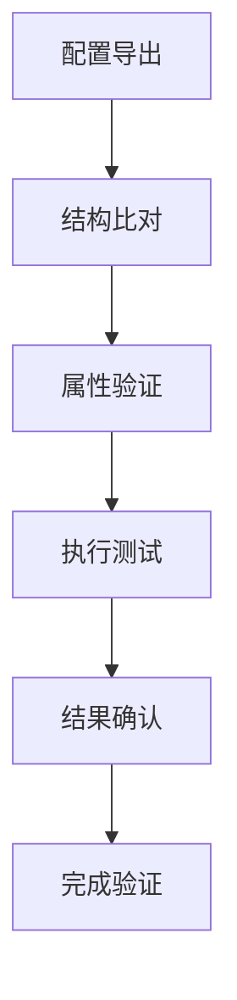

**Section sources**
- [dwcli/cli.py](file://dwcli/dwcli/cli.py)
- [usage.md](file://docs/migrationx/usage.md)

### 最佳实践

为确保调度验证的成功，建议遵循以下最佳实践：

1. **全面覆盖**: 验证所有调度属性，不遗漏任何细节
2. **自动化验证**: 尽可能使用自动化工具进行验证
3. **文档记录**: 详细记录验证过程和结果
4. **持续监控**: 迁移后持续监控调度执行情况

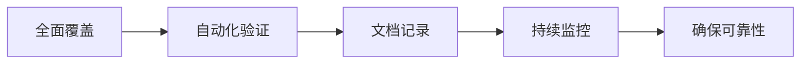

**Section sources**
- [README.md](file://dwcli/README.md)
- [spec-fields.md](file://docs/spec/spec-fields.md)