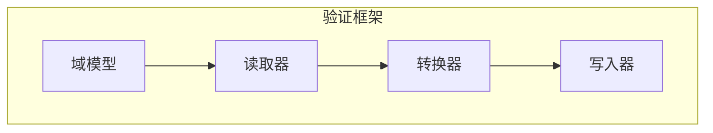
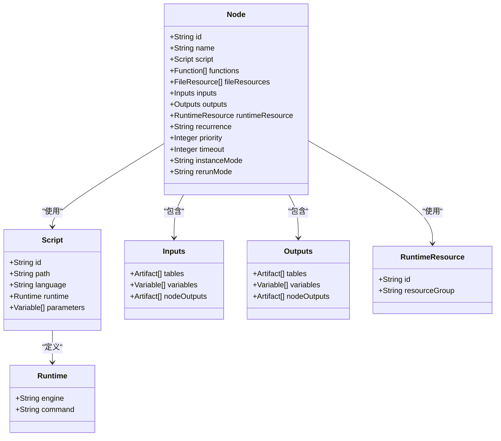
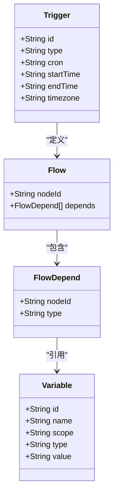
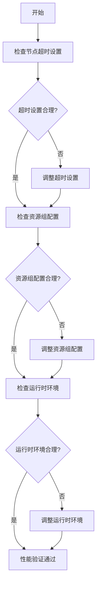
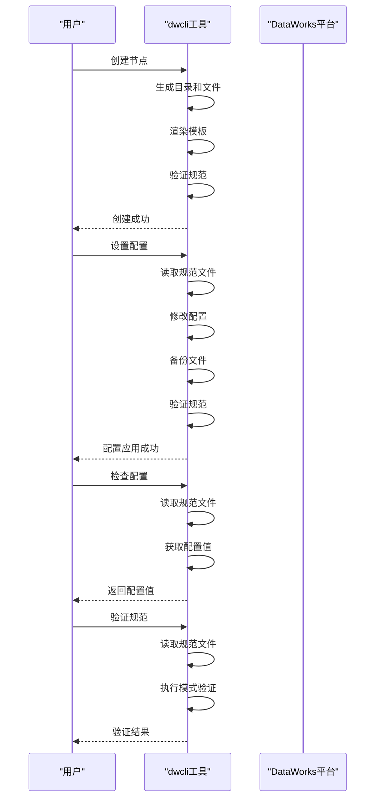
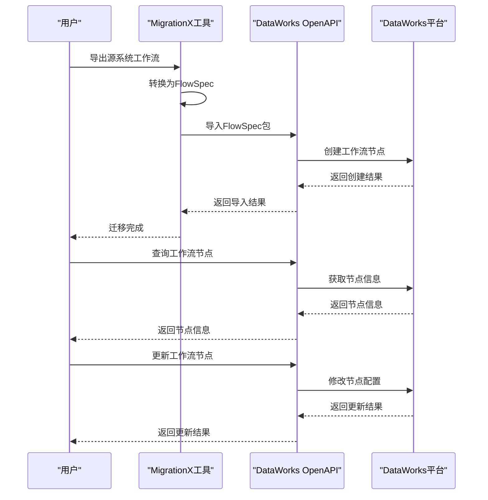
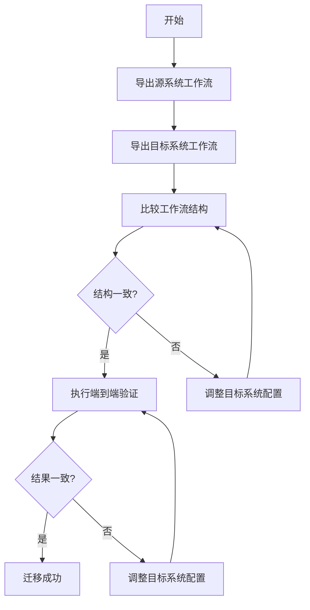
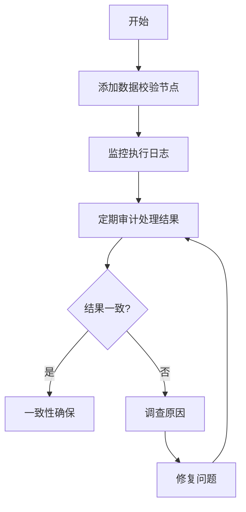

# 迁移后验证

<cite>
**本文档中引用的文件**  
- [README.md](file://README.md)
- [dwcli/README.md](file://dwcli/README.md)
- [dwcli/cli.py](file://dwcli/dwcli/cli.py)
- [dwcli/pkg/schema/validator.py](file://dwcli/dwcli/pkg/schema/validator.py)
- [spec/src/main/java/com/aliyun/dataworks/common/spec/utils/SpecValidateUtil.java](file://spec/src/main/java/com/aliyun/dataworks/common/spec/utils/SpecValidateUtil.java)
- [client/migrationx/migrationx-domain/migrationx-domain-dataworks/src/main/java/com/aliyun/dataworks/migrationx/domain/dataworks/packages/validator/PackageValidator.java](file://client/migrationx/migrationx-domain/migrationx-domain-dataworks/src/main/java/com/aliyun/dataworks/migrationx/domain/dataworks/packages/validator/PackageValidator.java)
- [client/migrationx/migrationx-domain/migrationx-domain-dataworks/src/main/java/com/aliyun/dataworks/migrationx/domain/dataworks/packages/validator/impl/SpecPackageValidator.java](file://client/migrationx/migrationx-domain/migrationx-domain-dataworks/src/main/java/com/aliyun/dataworks/migrationx/domain/dataworks/packages/validator/impl/SpecPackageValidator.java)
- [spec/src/main/java/com/aliyun/dataworks/common/spec/domain/DataWorksWorkflowSpec.java](file://spec/src/main/java/com/aliyun/dataworks/common/spec/domain/DataWorksWorkflowSpec.java)
- [schema/docs/flow-properties-flowworkflowspec-properties-flowworkflowspecedges-flowworkflowspecedge-properties-flowworkflowspecedgenodedepends.md](file://schema/docs/flow-properties-flowworkflowspec-properties-flowworkflowspecedges-flowworkflowspecedge-properties-flowworkflowspecedgenodedepends.md)
</cite>

## 目录
1. [引言](#引言)
2. [迁移后验证框架](#迁移后验证框架)
3. [功能验证](#功能验证)
4. [调度验证](#调度验证)
5. [性能验证](#性能验证)
6. [使用dwcli工具进行自动化测试](#使用dwcli工具进行自动化测试)
7. [使用DataWorks OpenAPI进行验证](#使用dataworks-openapi进行验证)
8. [验证检查清单](#验证检查清单)
9. [自动化测试脚本模板](#自动化测试脚本模板)
10. [案例分析：识别和修复迁移偏差](#案例分析识别和修复迁移偏差)
11. [确保数据处理结果一致性](#确保数据处理结果一致性)
12. [结论](#结论)

## 引言

迁移后验证是确保工作流从源系统成功迁移到DataWorks平台的关键步骤。本指南详细说明了如何验证迁移后工作流的完整性和正确性，包括功能验证、调度验证和性能验证。通过使用dwcli工具和DataWorks OpenAPI，可以对迁移后的工作流进行自动化测试，验证节点逻辑、依赖关系和调度策略是否与源系统一致。本文档提供了验证检查清单和自动化测试脚本模板，指导用户进行端到端的业务逻辑验证，并通过实际案例展示如何识别和修复迁移过程中引入的偏差，确保数据处理结果的一致性。

## 迁移后验证框架

迁移后验证框架基于DataWorks的FlowSpec规范，该规范定义了通用的工作流描述标准。MigrationX是一个基于FlowSpec的迁移工具，用于将不同工作流调度系统中的模型迁移到DataWorks工作流模型。该框架包括域模型、读取器、转换器和写入器四个主要组件，支持从多种调度系统（如DolphinScheduler）到DataWorks DataStudio的一键迁移。



**Diagram sources**
- [README.md](file://README.md#L421-L440)

**Section sources**
- [README.md](file://README.md#L1-L460)

## 功能验证

功能验证确保迁移后的工作流节点逻辑与源系统一致。这包括验证节点的输入、输出、脚本、函数、文件资源、运行时资源、重复性、优先级、超时、实例模式和重跑模式等属性。



**Diagram sources**
- [README.md](file://README.md#L87-L108)

**Section sources**
- [README.md](file://README.md#L87-L108)

## 调度验证

调度验证确保迁移后的工作流调度策略与源系统一致。这包括验证触发器的类型、cron表达式、开始时间、结束时间和时区等属性。



**Diagram sources**
- [README.md](file://README.md#L157-L258)

**Section sources**
- [README.md](file://README.md#L157-L258)

## 性能验证

性能验证确保迁移后的工作流在性能方面满足要求。这包括验证节点的超时设置、资源组配置和运行时环境等。



**Diagram sources**
- [spec/src/main/java/com/aliyun/dataworks/common/spec/utils/SpecValidateUtil.java](file://spec/src/main/java/com/aliyun/dataworks/common/spec/utils/SpecValidateUtil.java#L60-L105)

**Section sources**
- [spec/src/main/java/com/aliyun/dataworks/common/spec/utils/SpecValidateUtil.java](file://spec/src/main/java/com/aliyun/dataworks/common/spec/utils/SpecValidateUtil.java#L60-L105)

## 使用dwcli工具进行自动化测试

dwcli是一个强大的DataWorks FlowSpec配置即代码（CaC）管理工具，支持脚手架、JSON路径操作、模式验证、代码管理和跨平台操作。通过dwcli工具，可以创建、设置、检查、验证和编辑工作流节点。



**Diagram sources**
- [dwcli/README.md](file://dwcli/README.md#L1-L43)
- [dwcli/cli.py](file://dwcli/dwcli/cli.py#L1-L312)

**Section sources**
- [dwcli/README.md](file://dwcli/README.md#L1-L43)
- [dwcli/cli.py](file://dwcli/dwcli/cli.py#L1-L312)

## 使用DataWorks OpenAPI进行验证

通过DataWorks OpenAPI，可以将FlowSpec包导入DataWorks DataStudio，实现工作流的自动化迁移和验证。OpenAPI支持创建、更新、删除和查询工作流节点，确保迁移后的工作流与源系统一致。



**Diagram sources**
- [README.md](file://README.md#L419-L420)

**Section sources**
- [README.md](file://README.md#L419-L420)

## 验证检查清单

以下是一个迁移后验证的检查清单，确保工作流的完整性和正确性。

| 验证项 | 描述 | 状态 |
|:---:|:---:|:---:|
| 节点逻辑 | 验证节点的输入、输出、脚本、函数、文件资源、运行时资源、重复性、优先级、超时、实例模式和重跑模式等属性 |  |
| 依赖关系 | 验证工作流节点之间的依赖关系，包括正常依赖、跨周期依赖自身、跨周期依赖子节点和跨周期依赖其他节点 |  |
| 调度策略 | 验证触发器的类型、cron表达式、开始时间、结束时间和时区等属性 |  |
| 性能配置 | 验证节点的超时设置、资源组配置和运行时环境等 |  |
| 数据一致性 | 验证迁移后的工作流处理结果与源系统一致 |  |

**Section sources**
- [README.md](file://README.md#L260-L308)

## 自动化测试脚本模板

以下是一个使用dwcli工具进行自动化测试的脚本模板。

```bash
# 创建新节点
dwcli node create ./tasks --name my-daily-task --template odps-sql-daily

# 设置配置
dwcli node set ./tasks/my-daily-task spec.timeout=3600 --type int

# 检查配置
dwcli node inspect ./tasks/my-daily-task spec.timeout

# 编辑代码
dwcli node code edit ./tasks/my-daily-task

# 验证规范
dwcli node validate ./tasks/my-daily-task
```

**Section sources**
- [dwcli/README.md](file://dwcli/README.md#L21-L35)

## 案例分析：识别和修复迁移偏差

在实际迁移过程中，可能会引入一些偏差。通过以下步骤可以识别和修复这些偏差：

1. **比较源系统和目标系统的工作流结构**：使用dwcli工具导出源系统和目标系统的工作流规范，比较它们的节点、依赖关系和调度策略。
2. **执行端到端的业务逻辑验证**：运行迁移后的工作流，比较其处理结果与源系统的一致性。
3. **修复发现的偏差**：根据验证结果，调整目标系统的工作流配置，确保其与源系统一致。



**Diagram sources**
- [client/migrationx/migrationx-domain/migrationx-domain-dataworks/src/main/java/com/aliyun/dataworks/migrationx/domain/dataworks/packages/validator/impl/SpecPackageValidator.java](file://client/migrationx/migrationx-domain/migrationx-domain-dataworks/src/main/java/com/aliyun/dataworks/migrationx/domain/dataworks/packages/validator/impl/SpecPackageValidator.java#L1-L310)

**Section sources**
- [client/migrationx/migrationx-domain/migrationx-domain-dataworks/src/main/java/com/aliyun/dataworks/migrationx/domain/dataworks/packages/validator/impl/SpecPackageValidator.java](file://client/migrationx/migrationx-domain/migrationx-domain-dataworks/src/main/java/com/aliyun/dataworks/migrationx/domain/dataworks/packages/validator/impl/SpecPackageValidator.java#L1-L310)

## 确保数据处理结果一致性

确保数据处理结果一致性是迁移后验证的最终目标。通过以下措施可以确保一致性：

1. **数据校验**：在迁移后的工作流中添加数据校验节点，验证处理结果的正确性。
2. **日志监控**：监控工作流的执行日志，及时发现和解决异常。
3. **定期审计**：定期审计工作流的处理结果，确保其长期一致性。



**Diagram sources**
- [spec/src/main/java/com/aliyun/dataworks/common/spec/domain/DataWorksWorkflowSpec.java](file://spec/src/main/java/com/aliyun/dataworks/common/spec/domain/DataWorksWorkflowSpec.java#L1-L130)

**Section sources**
- [spec/src/main/java/com/aliyun/dataworks/common/spec/domain/DataWorksWorkflowSpec.java](file://spec/src/main/java/com/aliyun/dataworks/common/spec/domain/DataWorksWorkflowSpec.java#L1-L130)

## 结论

迁移后验证是确保工作流成功迁移的关键步骤。通过使用dwcli工具和DataWorks OpenAPI，可以实现工作流的自动化测试和验证，确保节点逻辑、依赖关系和调度策略与源系统一致。本文档提供的验证检查清单和自动化测试脚本模板，指导用户进行端到端的业务逻辑验证，并通过实际案例展示如何识别和修复迁移过程中引入的偏差，确保数据处理结果的一致性。