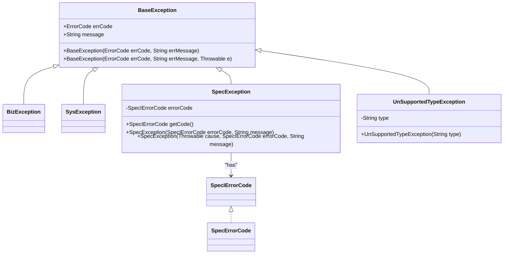
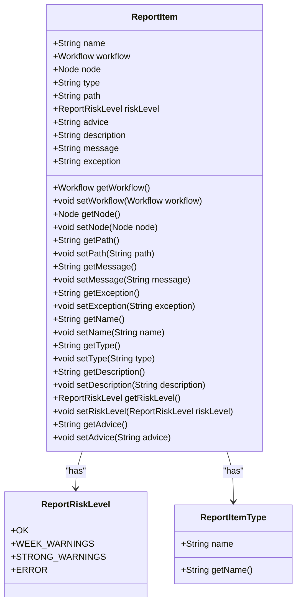
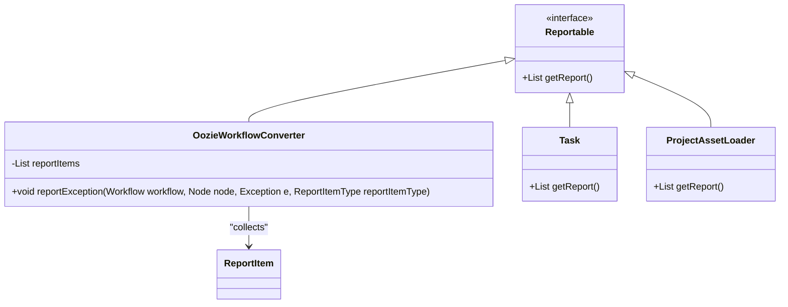
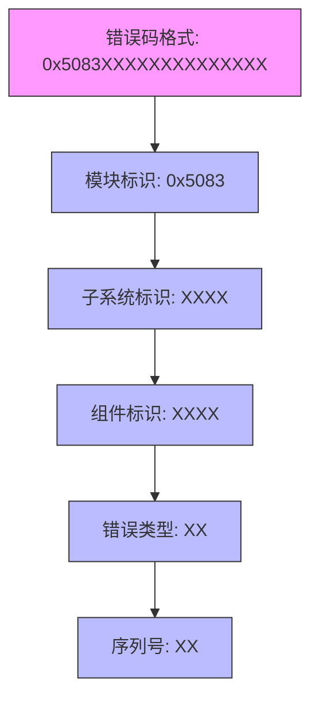
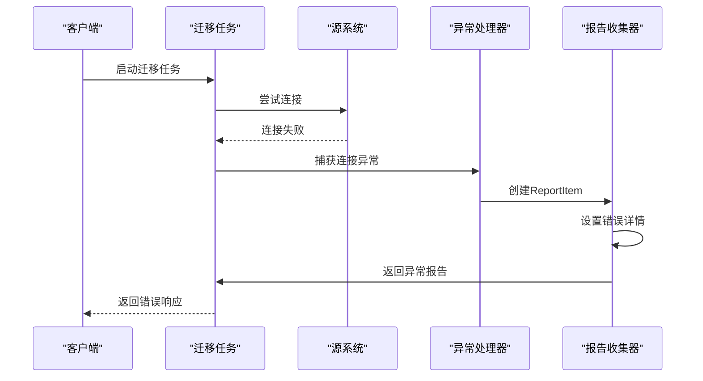
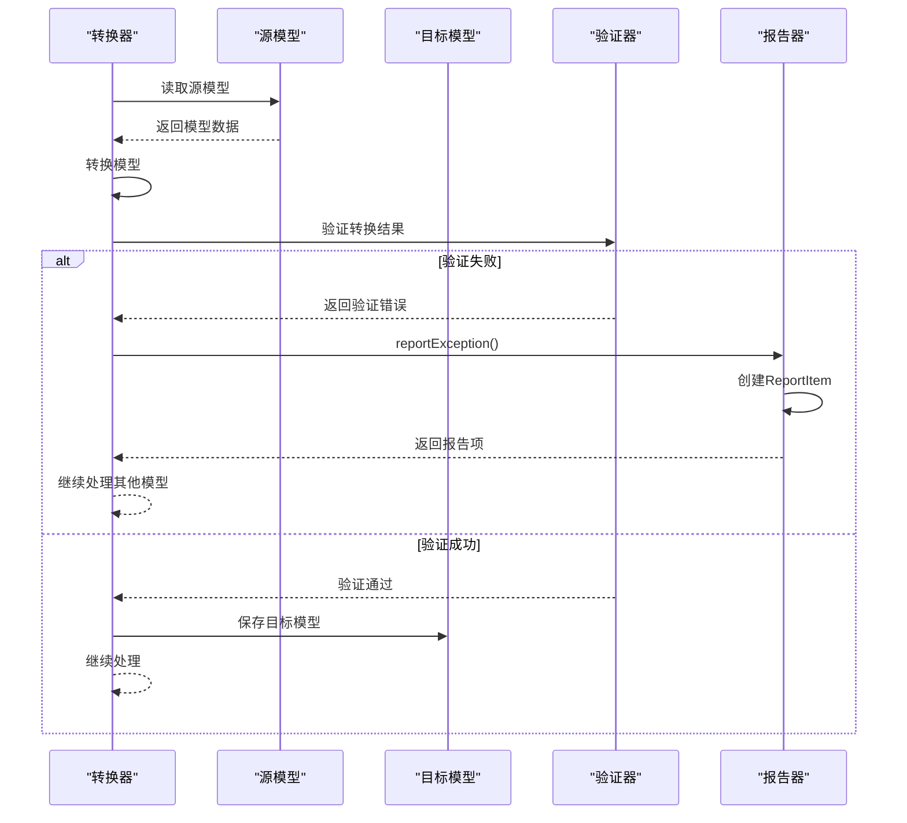
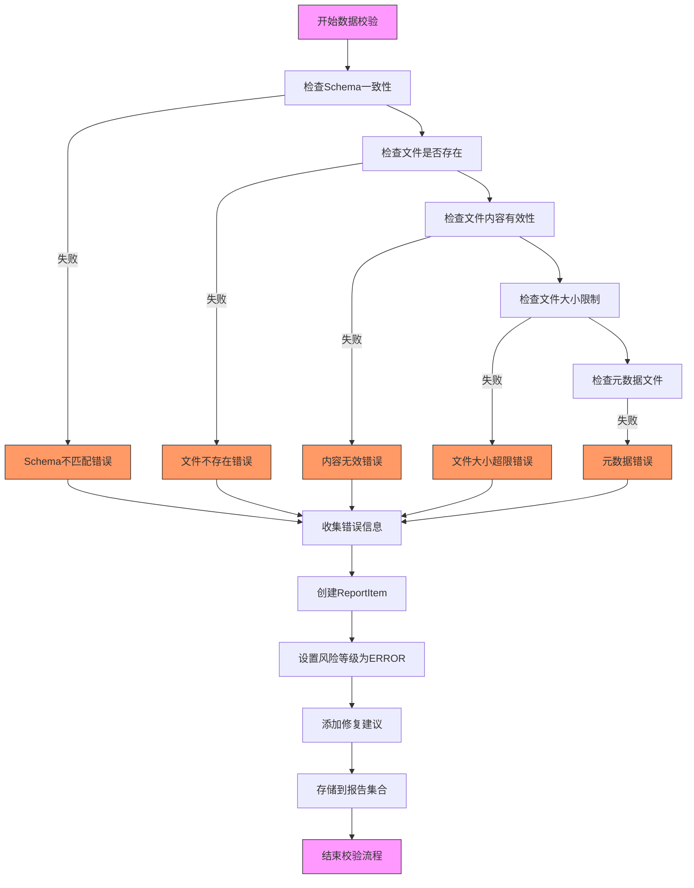
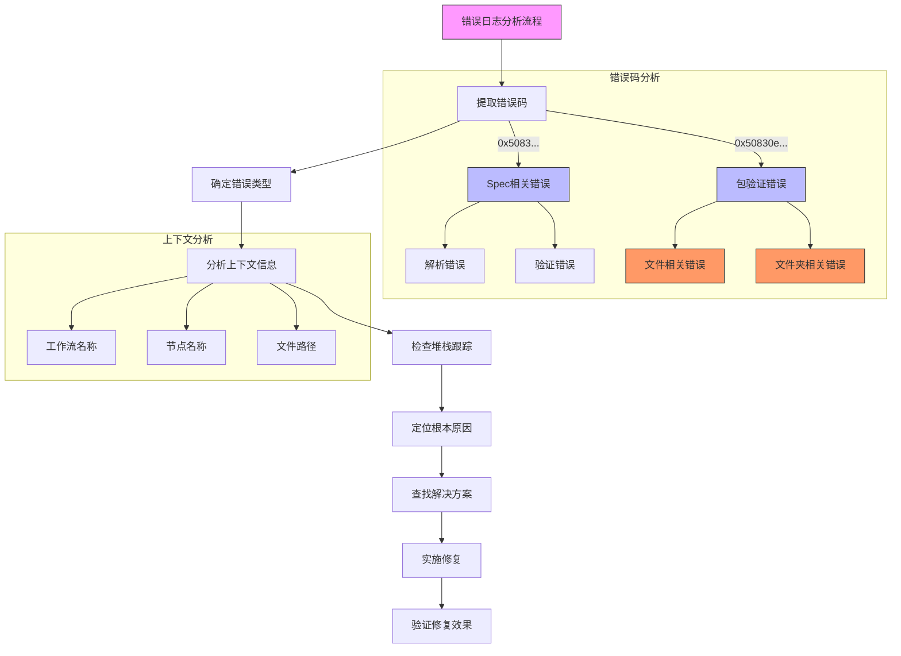

# 异常处理

<cite>
**本文档中引用的文件**  
- [ReportItem.java](file://client/migrationx/migrationx-transformer/src/main/java/com/aliyun/dataworks/migrationx/transformer/core/report/ReportItem.java)
- [Reportable.java](file://client/migrationx/migrationx-transformer/src/main/java/com/aliyun/dataworks/migrationx/transformer/core/report/Reportable.java)
- [ReportRiskLevel.java](file://client/migrationx/migrationx-transformer/src/main/java/com/aliyun/dataworks/migrationx/transformer/core/report/ReportRiskLevel.java)
- [ReportItemType.java](file://client/migrationx/migrationx-transformer/src/main/java/com/aliyun/dataworks/migrationx/transformer/core/report/ReportItemType.java)
- [SpecException.java](file://spec/src/main/java/com/aliyun/dataworks/common/spec/exception/SpecException.java)
- [SpecErrorCode.java](file://spec/src/main/java/com/aliyun/dataworks/common/spec/exception/SpecErrorCode.java)
- [BaseException.java](file://client/migrationx/migrationx-common/src/main/java/com/aliyun/migrationx/common/exception/BaseException.java)
- [PackageValidateErrorCode.java](file://client/migrationx/migrationx-domain/migrationx-domain-dataworks/src/main/java/com/aliyun/dataworks/migrationx/domain/dataworks/packages/enums/PackageValidateErrorCode.java)
</cite>

## 目录
1. [引言](#引言)
2. [异常处理机制](#异常处理机制)
3. [异常报告机制](#异常报告机制)
4. [错误码体系](#错误码体系)
5. [常见异常场景及处理](#常见异常场景及处理)
6. [异常排查指南](#异常排查指南)
7. [结论](#结论)

## 引言
本文档详细说明了在数据迁移执行过程中可能遇到的各类异常情况及其处理方法。重点描述了如何通过ReportItem和Reportable接口收集和展示转换过程中的警告和错误信息，以及异常报告的生成机制和错误码体系。同时提供了异常排查指南和解决方案，帮助用户根据错误日志定位问题根源，并给出常见转换错误的修复建议。

## 异常处理机制
系统采用分层的异常处理机制，确保在迁移过程中能够有效捕获、处理和报告各种异常情况。



**图示来源**
- [BaseException.java](file://client/migrationx/migrationx-common/src/main/java/com/aliyun/migrationx/common/exception/BaseException.java)
- [SpecException.java](file://spec/src/main/java/com/aliyun/dataworks/common/spec/exception/SpecException.java)
- [SpecErrorCode.java](file://spec/src/main/java/com/aliyun/dataworks/common/spec/exception/SpecErrorCode.java)

**本节来源**
- [BaseException.java](file://client/migrationx/migrationx-common/src/main/java/com/aliyun/migrationx/common/exception/BaseException.java#L28-L46)
- [SpecException.java](file://spec/src/main/java/com/aliyun/dataworks/common/spec/exception/SpecException.java#L22-L58)

## 异常报告机制
系统通过ReportItem和Reportable接口实现异常报告的收集和展示，确保所有转换过程中的警告和错误信息都能被有效记录。

### ReportItem结构
ReportItem是异常报告的基本单元，包含异常的详细信息：



**图示来源**
- [ReportItem.java](file://client/migrationx/migrationx-transformer/src/main/java/com/aliyun/dataworks/migrationx/transformer/core/report/ReportItem.java)
- [ReportRiskLevel.java](file://client/migrationx/migrationx-transformer/src/main/java/com/aliyun/dataworks/migrationx/transformer/core/report/ReportRiskLevel.java)
- [ReportItemType.java](file://client/migrationx/migrationx-transformer/src/main/java/com/aliyun/dataworks/migrationx/transformer/core/report/ReportItemType.java)

### Reportable接口
Reportable接口定义了获取报告的方法，所有可报告的组件都应实现此接口：



**图示来源**
- [Reportable.java](file://client/migrationx/migrationx-transformer/src/main/java/com/aliyun/dataworks/migrationx/transformer/core/report/Reportable.java)
- [OozieWorkflowConverter.java](file://client/migrationx/migrationx-transformer/src/main/java/com/aliyun/dataworks/migrationx/transformer/dataworks/converter/oozie/OozieWorkflowConverter.java)

**本节来源**
- [ReportItem.java](file://client/migrationx/migrationx-transformer/src/main/java/com/aliyun/dataworks/migrationx/transformer/core/report/ReportItem.java#L25-L117)
- [Reportable.java](file://client/migrationx/migrationx-transformer/src/main/java/com/aliyun/dataworks/migrationx/transformer/core/report/Reportable.java#L24-L31)
- [ReportRiskLevel.java](file://client/migrationx/migrationx-transformer/src/main/java/com/aliyun/dataworks/migrationx/transformer/core/report/ReportRiskLevel.java#L22-L42)
- [ReportItemType.java](file://client/migrationx/migrationx-transformer/src/main/java/com/aliyun/dataworks/migrationx/transformer/core/report/ReportItemType.java#L22-L120)

## 错误码体系
系统采用统一的错误码体系，确保错误信息的标准化和可追溯性。

### 错误码结构
错误码采用十六进制格式，具有特定的结构和含义：



### 核心错误码
系统定义了多种核心错误码，涵盖不同类型的异常情况：

```mermaid
erDiagram
SPEC_ERROR_CODE {
string code PK
string msg
string module
}
PACKAGE_VALIDATE_ERROR_CODE {
string errorCode PK
string errorMessage
string solution
}
SPEC_ERROR_CODE ||--o{ SPEC_EXCEPTION : "throws"
PACKAGE_VALIDATE_ERROR_CODE ||--o{ VALIDATION_PROCESS : "used in"
SPEC_ERROR_CODE {
"PARSER_NOT_FOUND" "0x5083000000000000"
"GET_ID_ERROR" "0x5083000000000001"
"FIELD_SET_FAIL" "0x5083000000000002"
"FIELD_NOT_FOUND" "0x5083000000000003"
"ENUM_NOT_EXIST" "0x5083000000000004"
"PARSE_ERROR" "0x5083000000000005"
"PARSER_LOAD_ERROR" "0x5083000000000006"
"DUPLICATE_ID" "0x5083000000000007"
"REF_ID_PARSER_ERROR" "0x5083000000000008"
"TARGET_ENTITY_NOT_FOUND" "0x5083000000000009"
"VALIDATE_ERROR" "0x5083000000000010"
"WRITER_LOAD_ERROR" "0x5083000000000011"
}
PACKAGE_VALIDATE_ERROR_CODE {
"VALIDATION_PASSED" "0x50830e0000000000"
"FOLDER_NOT_EXIST" "0x50830e0000000001"
"FILE_NOT_EXIST" "0x50830e0000000002"
"NOT_A_FOLDER" "0x50830e0000000003"
"FILE_CONTENT_INVALID" "0x50830e0000000004"
"FILE_SCHEMA_INVALID" "0x50830e0000000005"
"SPEC_PACKAGE_MISSING_FILE" "0x50830e0000000001b"
"SPEC_PACKAGE_MULTIPLE_FILES" "0x50830e0000000001c"
}
```

**图示来源**
- [SpecErrorCode.java](file://spec/src/main/java/com/aliyun/dataworks/common/spec/exception/SpecErrorCode.java)
- [PackageValidateErrorCode.java](file://client/migrationx/migrationx-domain/migrationx-domain-dataworks/src/main/java/com/aliyun/dataworks/migrationx/domain/dataworks/packages/enums/PackageValidateErrorCode.java)

**本节来源**
- [SpecErrorCode.java](file://spec/src/main/java/com/aliyun/dataworks/common/spec/exception/SpecErrorCode.java#L22-L110)
- [PackageValidateErrorCode.java](file://client/migrationx/migrationx-domain/migrationx-domain-dataworks/src/main/java/com/aliyun/dataworks/migrationx/domain/dataworks/packages/enums/PackageValidateErrorCode.java#L12-L151)

## 常见异常场景及处理
### 源系统连接失败
当无法连接到源系统时，系统会抛出相应的异常并记录详细的错误信息。



**图示来源**
- [BaseException.java](file://client/migrationx/migrationx-common/src/main/java/com/aliyun/migrationx/common/exception/BaseException.java)
- [ReportItem.java](file://client/migrationx/migrationx-transformer/src/main/java/com/aliyun/dataworks/migrationx/transformer/core/report/ReportItem.java)

### 模型转换错误
在模型转换过程中可能出现各种错误，系统会详细记录转换失败的原因。



**图示来源**
- [OozieWorkflowConverter.java](file://client/migrationx/migrationx-transformer/src/main/java/com/aliyun/dataworks/migrationx/transformer/dataworks/converter/oozie/OozieWorkflowConverter.java)
- [ReportItem.java](file://client/migrationx/migrationx-transformer/src/main/java/com/aliyun/dataworks/migrationx/transformer/core/report/ReportItem.java)

### 数据校验失败
数据校验失败是常见的异常情况，系统提供了详细的校验错误信息。



**图示来源**
- [PackageValidateErrorCode.java](file://client/migrationx/migrationx-domain/migrationx-domain-dataworks/src/main/java/com/aliyun/dataworks/migrationx/domain/dataworks/packages/enums/PackageValidateErrorCode.java)
- [ReportItem.java](file://client/migrationx/migrationx-transformer/src/main/java/com/aliyun/dataworks/migrationx/transformer/core/report/ReportItem.java)

**本节来源**
- [OozieWorkflowConverter.java](file://client/migrationx/migrationx-transformer/src/main/java/com/aliyun/dataworks/migrationx/transformer/dataworks/converter/oozie/OozieWorkflowConverter.java#L394-L402)
- [PackageValidateErrorCode.java](file://client/migrationx/migrationx-domain/migrationx-domain-dataworks/src/main/java/com/aliyun/dataworks/migrationx/domain/dataworks/packages/enums/PackageValidateErrorCode.java#L12-L151)

## 异常排查指南
### 错误日志分析
通过分析错误日志可以快速定位问题根源：



### 常见转换错误修复建议
针对常见的转换错误，提供以下修复建议：

| 错误类型 | 错误码 | 错误信息 | 修复建议 |
|---------|-------|---------|---------|
| 文件不存在 | 0x50830e0000000002 | File does not exist: {path}. | 创建正确的文件或移动相关文件到现有位置 |
| Schema不匹配 | 0x50830e0000000005 | File content does not conform to specification: {errorMessage}. | 根据规范检查并修正文件内容 |
| 文件大小超限 | 0x50830e0000000006 | File size exceeds limit: {limit}, {fileName}. | 减小文件大小或将文件拆分为多个小文件 |
| 缺少必需文件 | 0x50830e0000000007 | Missing required file: {fileName}. | 添加所需文件并确保名称和格式正确 |
| SPEC包缺少文件 | 0x50830e0000000001b | Missing required {fileType} file. Expected file with name pattern: '{expectedFileName}'. | 添加正确名称的{fileType}文件 |
| SPEC包多个文件 | 0x50830e0000000001c | Multiple {fileType} files exist. | 保留一个{fileType}文件，删除其他文件 |

**本节来源**
- [PackageValidateErrorCode.java](file://client/migrationx/migrationx-domain/migrationx-domain-dataworks/src/main/java/com/aliyun/dataworks/migrationx/domain/dataworks/packages/enums/PackageValidateErrorCode.java#L12-L151)
- [SpecErrorCode.java](file://spec/src/main/java/com/aliyun/dataworks/common/spec/exception/SpecErrorCode.java#L22-L110)

## 结论
本文档详细介绍了数据迁移过程中的异常处理最佳实践。通过ReportItem和Reportable接口，系统能够有效地收集和展示转换过程中的所有警告和错误信息。统一的错误码体系确保了错误信息的标准化和可追溯性。对于常见的异常场景，如源系统连接失败、模型转换错误和数据校验失败，系统提供了详细的错误报告和修复建议。通过遵循本文档中的异常排查指南，用户可以快速定位问题根源并实施有效的解决方案，确保迁移过程的顺利进行。