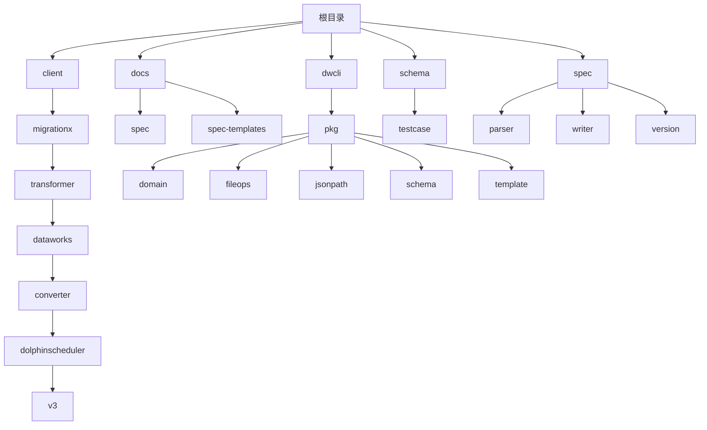
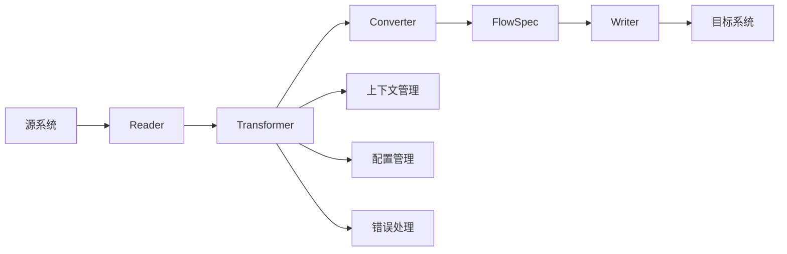
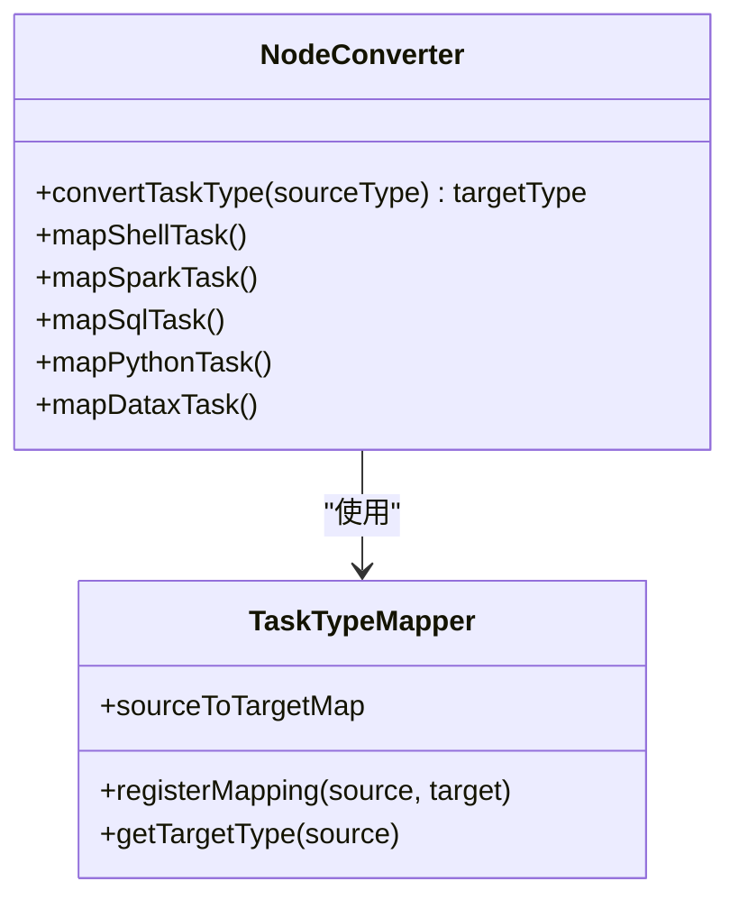
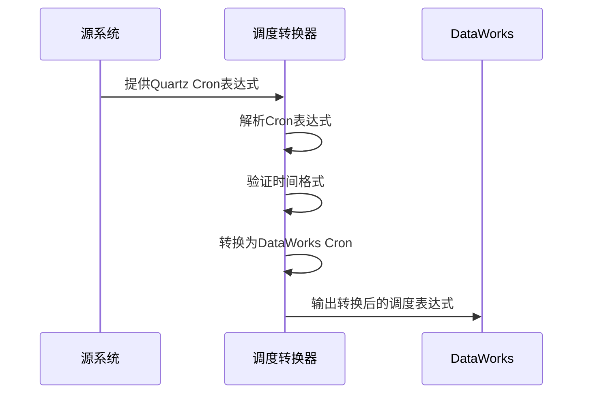
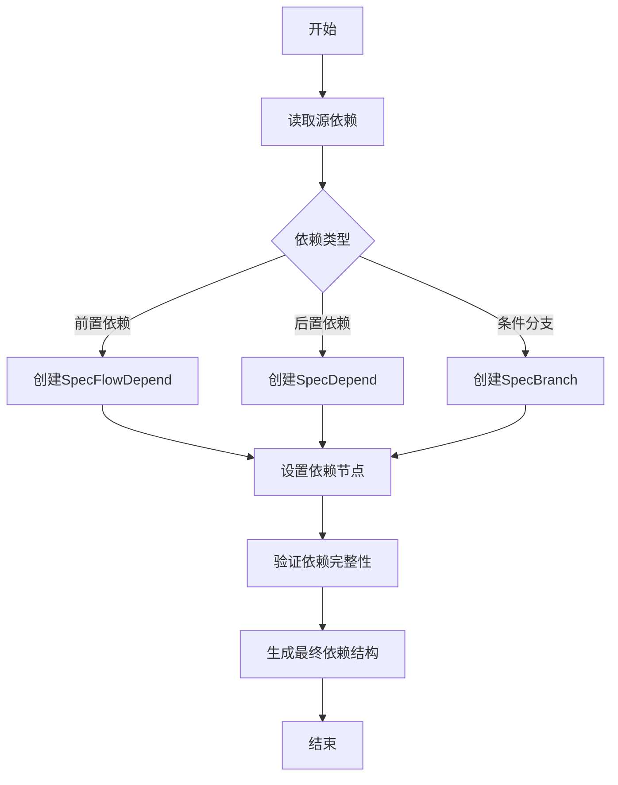
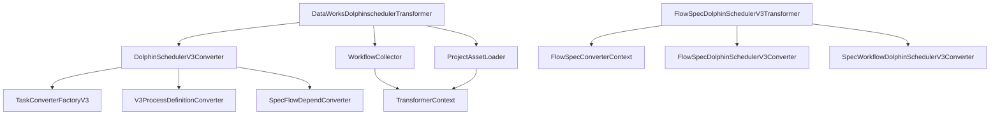

# 模型转换

<cite>
**本文档引用的文件**
- [DataWorksDolphinschedulerTransformer.java](file://client/migrationx/migrationx-transformer/src/main/java/com/aliyun/dataworks/migrationx/transformer/dataworks/transformer/DataWorksDolphinschedulerTransformer.java)
- [DolphinSchedulerV3Converter.java](file://client/migrationx/migrationx-transformer/src/main/java/com/aliyun/dataworks/migrationx/transformer/dataworks/converter/dolphinscheduler/v3/nodes/DolphinSchedulerV3Converter.java)
- [DolphinSchedulerV3WorkflowConverter.java](file://client/migrationx/migrationx-transformer/src/main/java/com/aliyun/dataworks/migrationx/transformer/dataworks/converter/dolphinscheduler/v3/workflow/DolphinSchedulerV3WorkflowConverter.java)
- [FlowSpecDolphinSchedulerV3Transformer.java](file://client/migrationx/migrationx-transformer/src/main/java/com/aliyun/dataworks/migrationx/transformer/dolphinscheduler/transformer/flowspec/FlowSpecDolphinSchedulerV3Transformer.java)
- [VersionConverterV2Impl.java](file://spec/src/main/java/com/aliyun/dataworks/common/spec/version/VersionConverterV2Impl.java)
- [FlowSpecCopier.java](file://spec/src/main/java/com/aliyun/dataworks/common/spec/utils/FlowSpecCopier.java)
</cite>

## 目录
1. [引言](#引言)
2. [项目结构](#项目结构)
3. [核心组件](#核心组件)
4. [架构概述](#架构概述)
5. [详细组件分析](#详细组件分析)
6. [依赖分析](#依赖分析)
7. [性能考虑](#性能考虑)
8. [故障排除指南](#故障排除指南)
9. [结论](#结论)

## 引言
本文档详细说明了DataWorks项目中Transformer模块如何将源系统的工作流模型转换为DataWorks的FlowSpec规范。重点描述了节点类型映射、调度表达式转换和依赖关系重构的实现机制。文档还解释了转换过程中如何处理不同系统的元数据差异，包括时间调度表达式转换（如Quartz到DataWorks Cron）、任务类型映射（如Shell任务、Spark任务等）和依赖关系转换（如前后置依赖、条件分支等）。通过代码示例展示转换器的核心实现逻辑，并提供调试转换过程的方法。

## 项目结构
DataWorks模型转换项目采用模块化架构，主要包含客户端、文档、命令行接口、规范定义等核心组件。项目结构清晰地分离了不同功能模块，便于维护和扩展。

**图源**
- [项目结构](file://client/migrationx/migrationx-transformer/src/main/java/com/aliyun/dataworks/migrationx/transformer/dataworks/transformer/DataWorksDolphinschedulerTransformer.java)

**节源**
- [项目结构](file://client/migrationx/migrationx-transformer/src/main/java/com/aliyun/dataworks/migrationx/transformer/dataworks/transformer/DataWorksDolphinschedulerTransformer.java)

## 核心组件
模型转换的核心组件主要包括Transformer、Converter和Spec处理器。Transformer负责整体转换流程的控制，Converter负责具体的转换逻辑，Spec处理器负责FlowSpec规范的解析和生成。

**节源**
- [DataWorksDolphinschedulerTransformer.java](file://client/migrationx/migrationx-transformer/src/main/java/com/aliyun/dataworks/migrationx/transformer/dataworks/transformer/DataWorksDolphinschedulerTransformer.java)
- [DolphinSchedulerV3Converter.java](file://client/migrationx/migrationx-transformer/src/main/java/com/aliyun/dataworks/migrationx/transformer/dataworks/converter/dolphinscheduler/v3/nodes/DolphinSchedulerV3Converter.java)

## 架构概述
模型转换的架构采用分层设计，从源系统读取工作流模型，经过转换器处理，最终生成符合DataWorks规范的FlowSpec。架构支持多种源系统，包括DolphinScheduler、Airflow等。

**图源**
- [DataWorksDolphinschedulerTransformer.java](file://client/migrationx/migrationx-transformer/src/main/java/com/aliyun/dataworks/migrationx/transformer/dataworks/transformer/DataWorksDolphinschedulerTransformer.java)

## 详细组件分析

### 节点类型映射分析
节点类型映射是模型转换的核心功能之一，负责将源系统的任务类型转换为DataWorks支持的节点类型。

**图源**
- [DolphinSchedulerV3Converter.java](file://client/migrationx/migrationx-transformer/src/main/java/com/aliyun/dataworks/migrationx/transformer/dataworks/converter/dolphinscheduler/v3/nodes/DolphinSchedulerV3Converter.java)

**节源**
- [DolphinSchedulerV3Converter.java](file://client/migrationx/migrationx-transformer/src/main/java/com/aliyun/dataworks/migrationx/transformer/dataworks/converter/dolphinscheduler/v3/nodes/DolphinSchedulerV3Converter.java)

### 调度表达式转换分析
调度表达式转换负责将不同系统的调度表达式（如Quartz Cron）转换为DataWorks兼容的调度格式。

**图源**
- [VersionConverterV2Impl.java](file://spec/src/main/java/com/aliyun/dataworks/common/spec/version/VersionConverterV2Impl.java)

**节源**
- [VersionConverterV2Impl.java](file://spec/src/main/java/com/aliyun/dataworks/common/spec/version/VersionConverterV2Impl.java)

### 依赖关系重构分析
依赖关系重构是确保工作流正确执行顺序的关键，负责将源系统的依赖关系转换为DataWorks的依赖规范。

**图源**
- [DolphinSchedulerV3WorkflowConverter.java](file://client/migrationx/migrationx-transformer/src/main/java/com/aliyun/dataworks/migrationx/transformer/dataworks/converter/dolphinscheduler/v3/workflow/DolphinSchedulerV3WorkflowConverter.java)

**节源**
- [DolphinSchedulerV3WorkflowConverter.java](file://client/migrationx/migrationx-transformer/src/main/java/com/aliyun/dataworks/migrationx/transformer/dataworks/converter/dolphinscheduler/v3/workflow/DolphinSchedulerV3WorkflowConverter.java)

## 依赖分析
模型转换组件之间的依赖关系复杂但清晰，通过合理的依赖管理确保了系统的稳定性和可扩展性。

**图源**
- [DataWorksDolphinschedulerTransformer.java](file://client/migrationx/migrationx-transformer/src/main/java/com/aliyun/dataworks/migrationx/transformer/dataworks/transformer/DataWorksDolphinschedulerTransformer.java)
- [FlowSpecDolphinSchedulerV3Transformer.java](file://client/migrationx/migrationx-transformer/src/main/java/com/aliyun/dataworks/migrationx/transformer/dolphinscheduler/transformer/flowspec/FlowSpecDolphinSchedulerV3Transformer.java)

**节源**
- [DataWorksDolphinschedulerTransformer.java](file://client/migrationx/migrationx-transformer/src/main/java/com/aliyun/dataworks/migrationx/transformer/dataworks/transformer/DataWorksDolphinschedulerTransformer.java)
- [FlowSpecDolphinSchedulerV3Transformer.java](file://client/migrationx/migrationx-transformer/src/main/java/com/aliyun/dataworks/migrationx/transformer/dolphinscheduler/transformer/flowspec/FlowSpecDolphinSchedulerV3Transformer.java)

## 性能考虑
在模型转换过程中，性能优化是关键考虑因素，特别是在处理大规模工作流时。

**节源**
- [性能优化策略](file://client/migrationx/migrationx-transformer/src/main/java/com/aliyun/dataworks/migrationx/transformer/core/common/Constants.java)

## 故障排除指南
当模型转换出现问题时，可以通过以下步骤进行排查和调试。

**节源**
- [错误处理机制](file://client/migrationx/migrationx-transformer/src/main/java/com/aliyun/dataworks/migrationx/transformer/core/report/ReportItem.java)
- [调试日志](file://client/migrationx/migrationx-transformer/src/main/java/com/aliyun/dataworks/migrationx/transformer/core/common/Context.java)

## 结论
DataWorks模型转换系统通过精心设计的架构和实现，成功实现了从多种源系统到DataWorks FlowSpec规范的高效转换。系统具有良好的扩展性和稳定性，能够处理复杂的元数据差异和依赖关系。通过持续优化和改进，该系统为数据工作流的迁移和管理提供了可靠的技术支持。