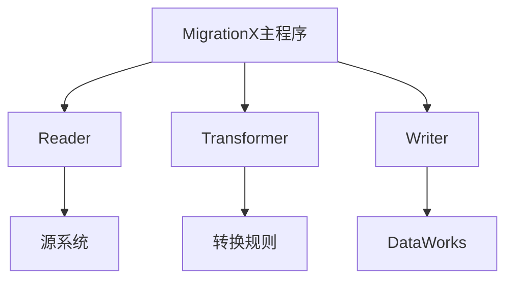
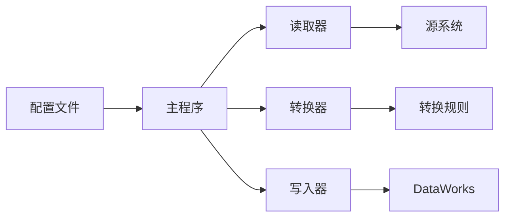
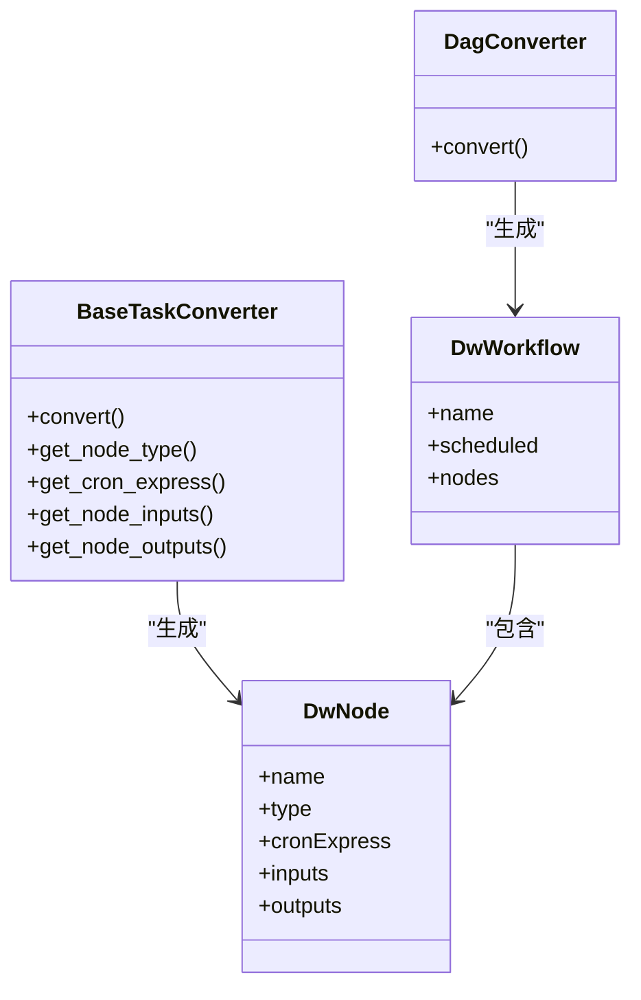
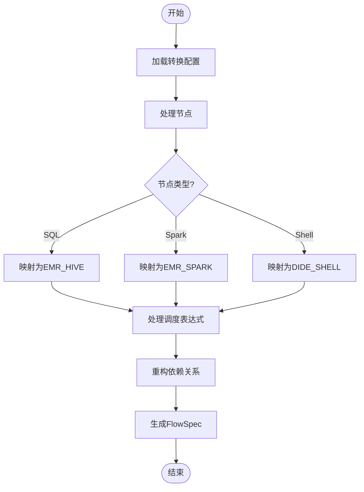
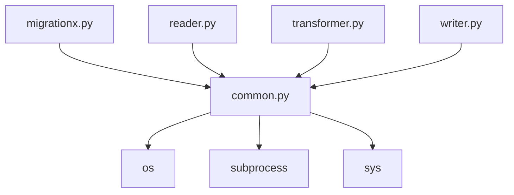

# 迁移执行

<cite>
**本文档中引用的文件**  
- [migrationx.py](file://client/migrationx/src/main/bin/migrationx.py)
- [migrationx.json](file://client/migrationx/src/main/conf/migrationx.json)
- [reader.py](file://client/migrationx/src/main/bin/reader.py)
- [transformer.py](file://client/migrationx/src/main/bin/transformer.py)
- [writer.py](file://client/migrationx/src/main/bin/writer.py)
- [common.py](file://client/client-common/src/main/bin/common.py)
- [dataworks-transformer-config.json](file://client/migrationx/migrationx-transformer/src/main/conf/dataworks-transformer-config.json)
- [dag_converter.py](file://client/migrationx/migrationx-reader/src/main/python/src/airflow_dag_parser/converter/dag_converter.py)
- [task_converter.py](file://client/migrationx/migrationx-reader/src/main/python/src/airflow_dag_parser/converter/task_converter.py)
- [dw_workflow.py](file://client/migrationx/migrationx-reader/src/main/python/src/airflow_dag_parser/models/dw_workflow.py)
- [dw_node.py](file://client/migrationx/migrationx-reader/src/main/python/src/airflow_dag_parser/models/dw_node.py)
</cite>

## 目录
1. [简介](#简介)
2. [项目结构](#项目结构)
3. [核心组件](#核心组件)
4. [架构概述](#架构概述)
5. [详细组件分析](#详细组件分析)
6. [依赖分析](#依赖分析)
7. [性能考虑](#性能考虑)
8. [故障排除指南](#故障排除指南)
9. [结论](#结论)

## 简介
本文档详细说明如何使用MigrationX工具链执行从源系统到DataWorks的自动化迁移。涵盖配置迁移任务、执行转换规则和处理转换结果的完整流程。重点描述Transformer模块如何将源系统的工作流模型转换为DataWorks的FlowSpec规范，包括节点类型映射、调度表达式转换和依赖关系重构的实现机制。提供命令行操作示例和配置文件模板，展示如何处理复杂的转换场景。

## 项目结构
MigrationX工具链采用模块化设计，包含读取器（reader）、转换器（transformer）和写入器（writer）三个核心组件。工具链通过配置文件驱动执行流程，支持多种源系统到DataWorks的迁移。

**Diagram sources**
- [migrationx.py](file://client/migrationx/src/main/bin/migrationx.py)
- [migrationx.json](file://client/migrationx/src/main/conf/migrationx.json)

**Section sources**
- [migrationx.py](file://client/migrationx/src/main/bin/migrationx.py)
- [migrationx.json](file://client/migrationx/src/main/conf/migrationx.json)

## 核心组件
MigrationX工具链的核心组件包括读取器、转换器和写入器，分别负责从源系统提取工作流定义、转换为DataWorks规范格式，以及将转换结果写入目标系统。

**Section sources**
- [reader.py](file://client/migrationx/src/main/bin/reader.py)
- [transformer.py](file://client/migrationx/src/main/bin/transformer.py)
- [writer.py](file://client/migrationx/src/main/bin/writer.py)

## 架构概述
MigrationX采用流水线架构，通过配置文件定义迁移任务的各个阶段。主程序按顺序执行读取、转换和写入操作，确保迁移过程的可靠性和可重复性。

**Diagram sources**
- [migrationx.py](file://client/migrationx/src/main/bin/migrationx.py)
- [common.py](file://client/client-common/src/main/bin/common.py)

## 详细组件分析

### 读取器组件分析
读取器组件负责从各种源系统（如Airflow、DolphinScheduler等）提取工作流定义。它通过适配器模式支持多种源系统，将不同格式的工作流元数据统一为内部表示。

**Diagram sources**
- [dag_converter.py](file://client/migrationx/migrationx-reader/src/main/python/src/airflow_dag_parser/converter/dag_converter.py)
- [task_converter.py](file://client/migrationx/migrationx-reader/src/main/python/src/airflow_dag_parser/converter/task_converter.py)
- [dw_workflow.py](file://client/migrationx/migrationx-reader/src/main/python/src/airflow_dag_parser/models/dw_workflow.py)
- [dw_node.py](file://client/migrationx/migrationx-reader/src/main/python/src/airflow_dag_parser/models/dw_node.py)

**Section sources**
- [dag_converter.py](file://client/migrationx/migrationx-reader/src/main/python/src/airflow_dag_parser/converter/dag_converter.py)
- [task_converter.py](file://client/migrationx/migrationx-reader/src/main/python/src/airflow_dag_parser/converter/task_converter.py)

### 转换器组件分析
转换器组件负责将读取器生成的内部工作流表示转换为DataWorks的FlowSpec规范。它通过配置文件中的映射规则处理节点类型转换、调度表达式转换和依赖关系重构。

**Diagram sources**
- [dataworks-transformer-config.json](file://client/migrationx/migrationx-transformer/src/main/conf/dataworks-transformer-config.json)
- [task_converter.py](file://client/migrationx/migrationx-reader/src/main/python/src/airflow_dag_parser/converter/task_converter.py)

**Section sources**
- [dataworks-transformer-config.json](file://client/migrationx/migrationx-transformer/src/main/conf/dataworks-transformer-config.json)
- [task_converter.py](file://client/migrationx/migrationx-reader/src/main/python/src/airflow_dag_parser/converter/task_converter.py)

### 写入器组件分析
写入器组件负责将转换后的FlowSpec规范写入DataWorks系统。它通过DataWorks API与目标系统交互，完成工作流的创建和部署。

**Section sources**
- [writer.py](file://client/migrationx/src/main/bin/writer.py)

## 依赖分析
MigrationX工具链的各个组件通过配置文件进行解耦，确保了良好的可扩展性和维护性。核心依赖关系包括配置管理、日志记录和跨平台兼容性。

**Diagram sources**
- [migrationx.py](file://client/migrationx/src/main/bin/migrationx.py)
- [common.py](file://client/client-common/src/main/bin/common.py)

**Section sources**
- [migrationx.py](file://client/migrationx/src/main/bin/migrationx.py)
- [common.py](file://client/client-common/src/main/bin/common.py)

## 性能考虑
MigrationX工具链在设计时考虑了大规模迁移场景的性能需求。通过批量处理、并行执行和错误容忍机制，确保在处理复杂工作流时的高效性和稳定性。

## 故障排除指南
当迁移过程中遇到问题时，可以检查以下方面：
- 确认源系统连接参数正确
- 验证转换配置文件的完整性
- 检查目标系统权限设置
- 查看日志文件中的详细错误信息

**Section sources**
- [common.py](file://client/client-common/src/main/bin/common.py)
- [migrationx.py](file://client/migrationx/src/main/bin/migrationx.py)

## 结论
MigrationX工具链提供了一套完整的从源系统到DataWorks的自动化迁移解决方案。通过模块化设计和灵活的配置机制，能够有效处理各种复杂的迁移场景，确保工作流定义的准确转换和可靠部署。