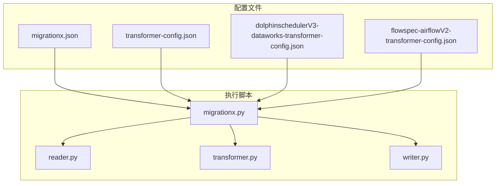
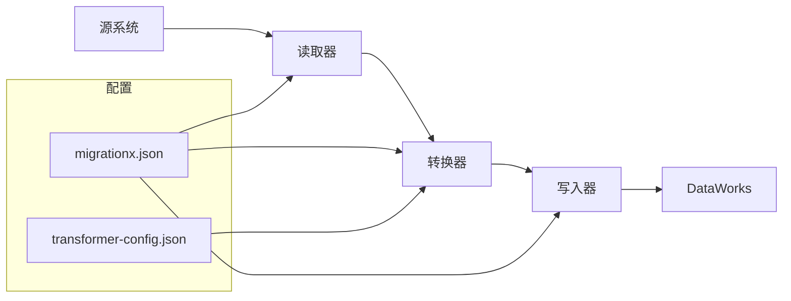
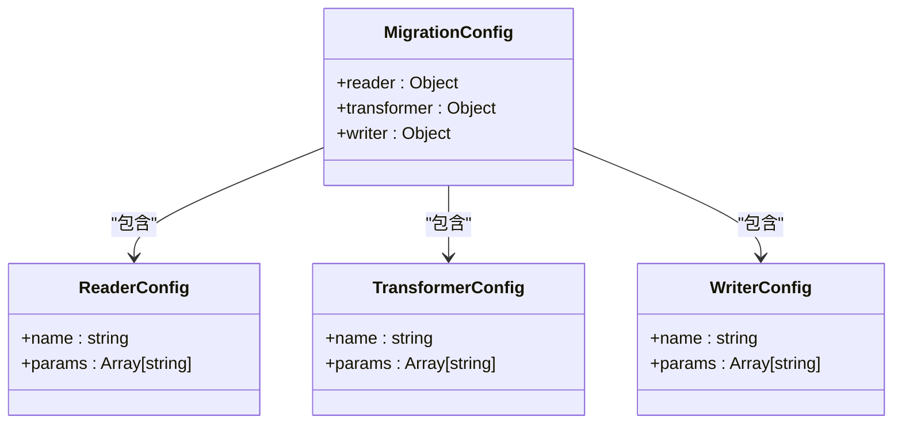
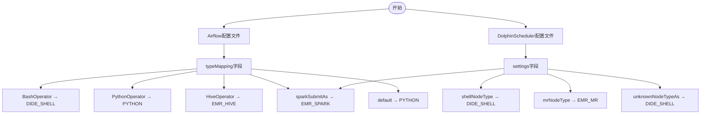
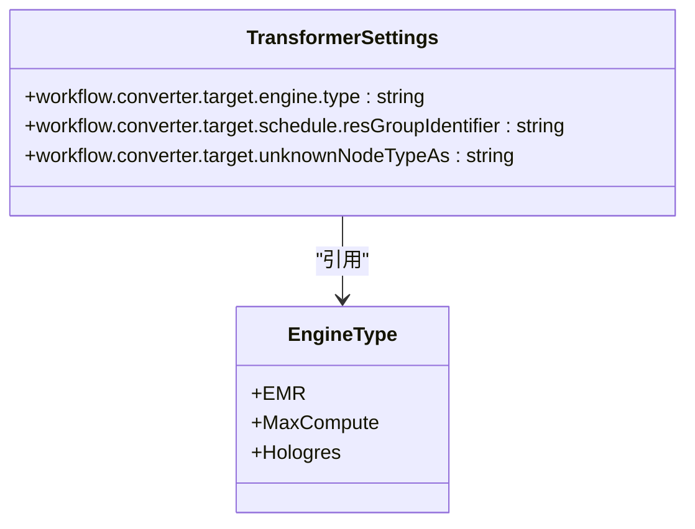
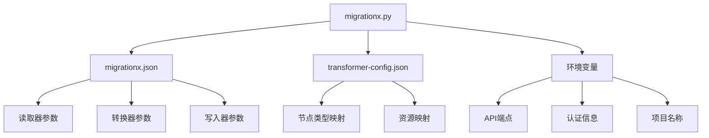

# 迁移配置

<cite>
**本文档中引用的文件**  
- [migrationx.json](file://client/migrationx/src/main/conf/migrationx.json)
- [dataworks-transformer-config.json](file://client/migrationx/migrationx-transformer/src/main/conf/dataworks-transformer-config.json)
- [dolphinschedulerV3-dataworks-transformer-config.json](file://client/migrationx/migrationx-transformer/src/main/conf/dolphinschedulerV3-dataworks-transformer-config.json)
- [flowspec-airflowV2-transformer-config.json](file://client/migrationx/migrationx-transformer/src/main/conf/flowspec-airflowV2-transformer-config.json)
- [dataworks-transformer-config-maxcompute-sample.json](file://client/migrationx/migrationx-transformer/src/main/conf/dataworks-transformer-config-maxcompute-sample.json)
- [dataworks-transformer-config-emr-sample.json](file://client/migrationx/migrationx-transformer/src/main/conf/dataworks-transformer-config-emr-sample.json)
- [TransformerContext.java](file://client/migrationx/migrationx-common/src/main/java/com/aliyun/migrationx/common/context/TransformerContext.java)
- [AirflowDumpItem.java](file://client/migrationx/migrationx-domain/migrationx-domain-airflow/src/main/java/com/aliyun/dataworks/migrationx/domain/dataworks/airflow/AirflowDumpItem.java)
- [migrationx.py](file://client/migrationx/src/main/bin/migrationx.py)
</cite>

## 目录
1. [简介](#简介)
2. [项目结构](#项目结构)
3. [核心组件](#核心组件)
4. [架构概述](#架构概述)
5. [详细组件分析](#详细组件分析)
6. [依赖分析](#依赖分析)
7. [性能考虑](#性能考虑)
8. [故障排除指南](#故障排除指南)
9. [结论](#结论)

## 简介
本文档详细说明如何配置MigrationX迁移任务，包括源系统连接参数、目标DataWorks项目配置、转换规则设置和执行环境配置。重点描述如何通过transformer-config.json文件定义节点类型映射规则、调度策略转换规则和资源映射规则，并提供完整的配置文件模板和参数说明。

## 项目结构
MigrationX工具的配置文件主要位于`client/migrationx`目录下，核心配置包括主配置文件`migrationx.json`和转换器配置文件`transformer-config.json`系列。这些文件共同定义了从源系统到DataWorks的完整迁移流程。

**图示来源**  
- [migrationx.json](file://client/migrationx/src/main/conf/migrationx.json)
- [migrationx.py](file://client/migrationx/src/main/bin/migrationx.py)

**本节来源**  
- [migrationx.json](file://client/migrationx/src/main/conf/migrationx.json)
- [migrationx.py](file://client/migrationx/src/main/bin/migrationx.py)

## 核心组件
MigrationX迁移框架由三个核心组件构成：读取器（reader）、转换器（transformer）和写入器（writer）。这些组件通过`migrationx.json`配置文件进行协调，实现从源系统到DataWorks的完整迁移流程。

**本节来源**  
- [migrationx.json](file://client/migrationx/src/main/conf/migrationx.json)
- [migrationx.py](file://client/migrationx/src/main/bin/migrationx.py)

## 架构概述
MigrationX采用管道式架构，将迁移过程分为读取、转换和写入三个阶段。每个阶段由独立的组件执行，通过配置文件进行参数传递和流程控制。

**图示来源**  
- [migrationx.json](file://client/migrationx/src/main/conf/migrationx.json)
- [migrationx.py](file://client/migrationx/src/main/bin/migrationx.py)

## 详细组件分析

### 配置文件结构分析
MigrationX的配置体系由主配置文件和转换器配置文件组成，分别控制迁移流程和转换规则。

#### 主配置文件 (migrationx.json)
主配置文件定义了迁移任务的整体流程，包括读取器、转换器和写入器的参数配置。

**图示来源**  
- [migrationx.json](file://client/migrationx/src/main/conf/migrationx.json)

**本节来源**  
- [migrationx.json](file://client/migrationx/src/main/conf/migrationx.json)

### 转换器配置分析
转换器配置文件是MigrationX的核心，定义了从源系统节点类型到DataWorks节点类型的映射规则。

#### 节点类型映射规则
转换器配置文件中的`typeMapping`或`settings`字段定义了不同源系统的节点类型映射规则。

**图示来源**  
- [flowspec-airflowV2-transformer-config.json](file://client/migrationx/migrationx-transformer/src/main/conf/flowspec-airflowV2-transformer-config.json)
- [dataworks-transformer-config.json](file://client/migrationx/migrationx-transformer/src/main/conf/dataworks-transformer-config.json)

#### 资源映射配置
转换器配置还支持资源组、计算引擎等资源的映射配置。

**图示来源**  
- [dataworks-transformer-config-emr-sample.json](file://client/migrationx/migrationx-transformer/src/main/conf/dataworks-transformer-config-emr-sample.json)
- [dataworks-transformer-config-maxcompute-sample.json](file://client/migrationx/migrationx-transformer/src/main/conf/dataworks-transformer-config-maxcompute-sample.json)

**本节来源**  
- [dataworks-transformer-config.json](file://client/migrationx/migrationx-transformer/src/main/conf/dataworks-transformer-config.json)
- [flowspec-airflowV2-transformer-config.json](file://client/migrationx/migrationx-transformer/src/main/conf/flowspec-airflowV2-transformer-config.json)
- [dataworks-transformer-config-maxcompute-sample.json](file://client/migrationx/migrationx-transformer/src/main/conf/dataworks-transformer-config-maxcompute-sample.json)
- [dataworks-transformer-config-emr-sample.json](file://client/migrationx/migrationx-transformer/src/main/conf/dataworks-transformer-config-emr-sample.json)

## 依赖分析
MigrationX各组件之间通过配置文件和环境变量进行通信，形成清晰的依赖关系。

**图示来源**  
- [migrationx.json](file://client/migrationx/src/main/conf/migrationx.json)
- [migrationx.py](file://client/migrationx/src/main/bin/migrationx.py)

**本节来源**  
- [migrationx.json](file://client/migrationx/src/main/conf/migrationx.json)
- [migrationx.py](file://client/migrationx/src/main/bin/migrationx.py)

## 性能考虑
MigrationX的性能主要受配置文件解析、数据转换和API调用频率的影响。通过合理配置`transformContinueWithError`和`specContinueWithError`参数，可以在遇到错误时继续执行，提高整体迁移效率。

## 故障排除指南
常见配置错误包括环境变量未设置、配置文件路径错误和节点类型映射不完整。建议使用示例配置文件作为模板，并根据实际需求进行修改。

**本节来源**  
- [migrationx.json](file://client/migrationx/src/main/conf/migrationx.json)
- [TransformerContext.java](file://client/migrationx/migrationx-common/src/main/java/com/aliyun/migrationx/common/context/TransformerContext.java)

## 结论
MigrationX提供了灵活的配置体系，通过主配置文件和转换器配置文件的组合，可以实现从多种源系统到DataWorks的平滑迁移。合理配置转换规则和资源映射，是确保迁移成功的关键。