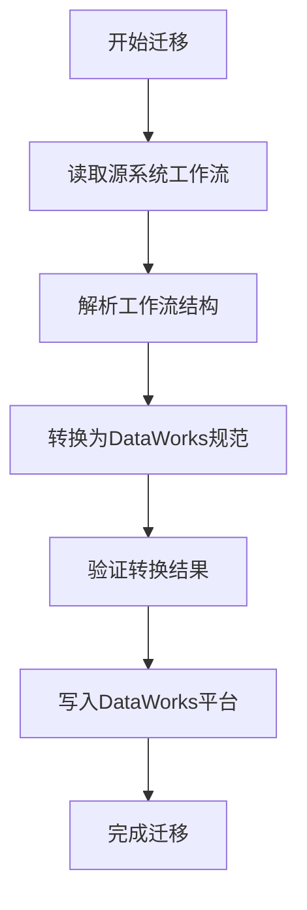
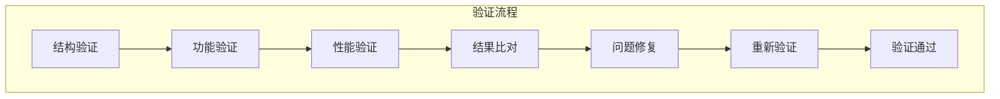
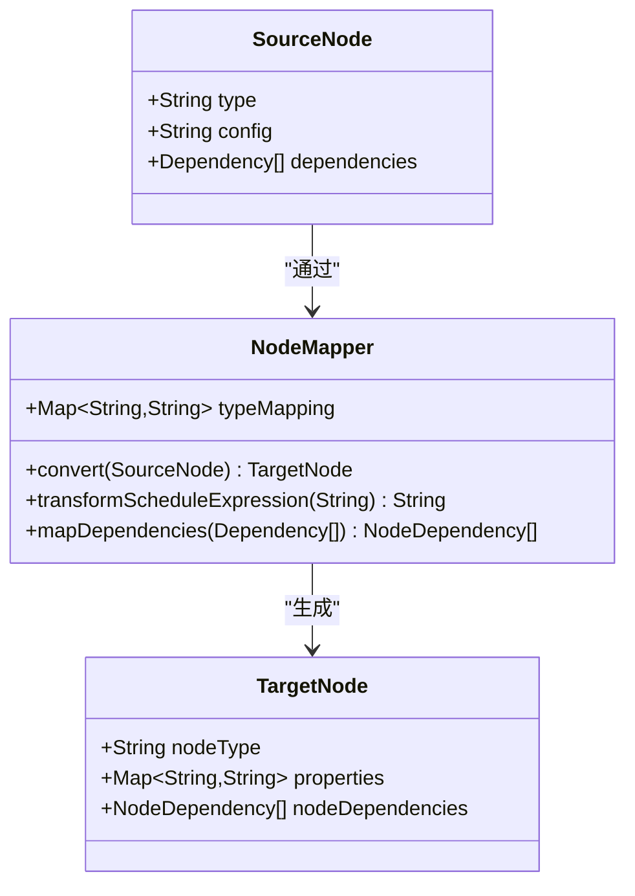
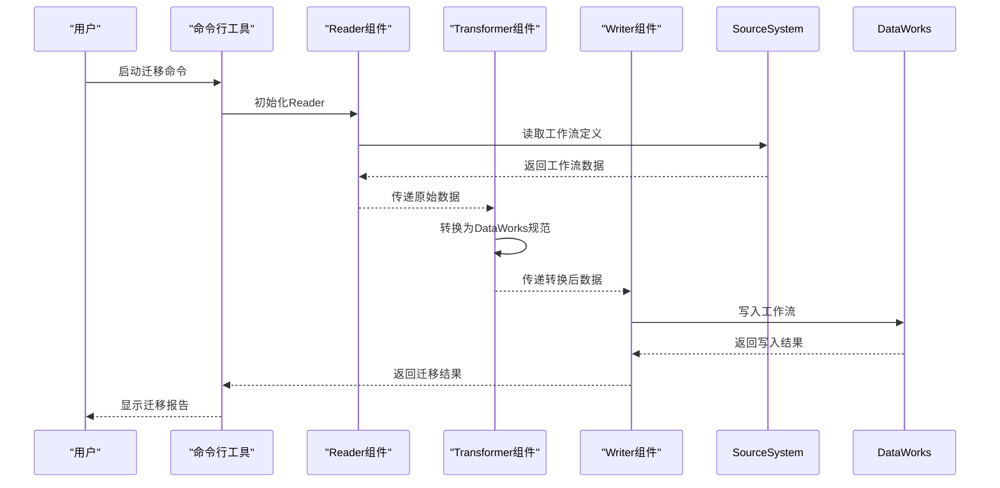

# 迁移策略

<cite>
**本文档中引用的文件**  
- [AirflowWorkflow.java](file://client/migrationx/migrationx-domain/migrationx-domain-airflow/src/main/java/com/aliyun/dataworks/migrationx/domain/dataworks/airflow/AirflowWorkflow.java)
- [AirflowNode.java](file://client/migrationx/migrationx-domain/migrationx-domain-airflow/src/main/java/com/aliyun/dataworks/migrationx/domain/dataworks/airflow/AirflowNode.java)
- [dag_converter.py](file://client/migrationx-transformer/src/main/python/airflow_dag_parser/converter/dag_converter.py)
- [task_converter.py](file://client/migrationx-transformer/src/main/python/airflow_dag_parser/converter/task_converter.py)
- [DolphinSchedulerReader.java](file://client/migrationx/migrationx-reader/src/main/java/com/aliyun/dataworks/migrationx/reader/dolphinscheduler/DolphinSchedulerReader.java)
- [DataWorksMigrationSpecificationImportWriter.java](file://client/migrationx/migrationx-writer/src/main/java/com/aliyun/dataworks/migrationx/writer/DataWorksMigrationSpecificationImportWriter.java)
- [migrationx.py](file://client/migrationx/src/main/bin/migrationx.py)
- [spec.py](file://client/client-toolkits/src/main/bin/spec.py)
</cite>

## 目录
1. [引言](#引言)
2. [迁移前评估](#迁移前评估)
3. [迁移执行步骤](#迁移执行步骤)
4. [迁移后验证方法](#迁移后验证方法)
5. [兼容性问题处理](#兼容性问题处理)
6. [数据一致性保障策略](#数据一致性保障策略)
7. [MigrationX工具链自动化迁移](#migrationx工具链自动化迁移)
8. [实际案例展示](#实际案例展示)
9. [常见陷阱与规避建议](#常见陷阱与规避建议)
10. [结论](#结论)

## 引言
dataworks-spec项目提供了一套完整的迁移解决方案，用于将不同调度系统（如Airflow、DolphinScheduler等）的工作流迁移到DataWorks平台。本文档详细阐述了迁移的最佳实践策略，包括迁移前的评估、迁移中的执行步骤、迁移后的验证方法，以及如何处理源系统与目标系统之间的兼容性问题。通过深入分析项目架构和核心组件，我们将展示如何利用MigrationX工具链实现自动化迁移，并提供实际案例来说明完整的迁移流程。

## 迁移前评估

在开始迁移之前，必须对现有调度系统进行全面评估。评估的主要内容包括工作流结构、节点类型、依赖关系、调度表达式和数据源配置。对于Airflow系统，需要分析DAG定义、任务节点类型（如BashOperator、PythonOperator等）、任务间的依赖关系以及cron调度表达式。对于DolphinScheduler系统，则需要评估工作流定义、任务节点类型（如Shell任务、SQL任务等）以及任务依赖配置。

评估过程中还需要考虑数据源的兼容性，包括数据库类型、表结构、分区策略等。同时，需要识别源系统中使用的自定义插件或扩展功能，这些可能需要特殊处理才能在DataWorks平台上实现等效功能。

**Section sources**
- [AirflowWorkflow.java](file://client/migrationx/migrationx-domain/migrationx-domain-airflow/src/main/java/com/aliyun/dataworks/migrationx/domain/dataworks/airflow/AirflowWorkflow.java#L1-L35)
- [AirflowNode.java](file://client/migrationx/migrationx-domain/migrationx-domain-airflow/src/main/java/com/aliyun/dataworks/migrationx/domain/dataworks/airflow/AirflowNode.java#L1-L44)

## 迁移执行步骤

迁移执行分为三个主要阶段：读取、转换和写入。首先，使用相应的Reader组件从源系统读取工作流定义。例如，对于Airflow系统，使用AirflowDagParser读取DAG定义文件；对于DolphinScheduler系统，使用DolphinSchedulerReader从数据库读取工作流定义。

**Diagram sources**
- [DolphinSchedulerReader.java](file://client/migrationx/migrationx-reader/src/main/java/com/aliyun/dataworks/migrationx/reader/dolphinscheduler/DolphinSchedulerReader.java#L1-L50)
- [migrationx.py](file://client/migrationx/src/main/bin/migrationx.py#L1-L30)

**Section sources**
- [migrationx.py](file://client/migrationx/src/main/bin/migrationx.py#L1-L100)
- [DolphinSchedulerReader.java](file://client/migrationx/migrationx-reader/src/main/java/com/aliyun/dataworks/migrationx/reader/dolphinscheduler/DolphinSchedulerReader.java#L1-L60)

## 迁移后验证方法

迁移完成后，必须进行严格的验证以确保工作流的正确性和完整性。验证过程包括结构验证、功能验证和性能验证三个层面。

结构验证主要检查迁移后的工作流是否完整保留了源系统的工作流结构，包括节点数量、节点类型、节点间的依赖关系等。功能验证通过执行测试工作流来验证各个节点的功能是否正常，特别是数据处理逻辑是否正确。性能验证则比较迁移前后工作流的执行性能，确保没有明显的性能下降。

验证过程中还需要检查调度表达式的正确转换，确保工作流在DataWorks平台上的调度行为与源系统一致。同时，需要验证数据源连接配置是否正确，确保数据读写操作能够正常执行。

**Diagram sources**
- [DataWorksMigrationSpecificationImportWriter.java](file://client/migrationx/migrationx-writer/src/main/java/com/aliyun/dataworks/migrationx/writer/DataWorksMigrationSpecificationImportWriter.java#L1-L40)
- [spec.py](file://client/client-toolkits/src/main/bin/spec.py#L1-L25)

**Section sources**
- [DataWorksMigrationSpecificationImportWriter.java](file://client/migrationx/migrationx-writer/src/main/java/com/aliyun/dataworks/migrationx/writer/DataWorksMigrationSpecificationImportWriter.java#L1-L50)
- [spec.py](file://client/client-toolkits/src/main/bin/spec.py#L1-L30)

## 兼容性问题处理

在迁移过程中，最大的挑战之一是处理源系统与DataWorks平台之间的兼容性问题。这些问题主要体现在节点类型映射、调度表达式转换和依赖关系处理三个方面。

### 节点类型映射
不同调度系统的节点类型需要映射到DataWorks平台的相应节点类型。例如，Airflow中的BashOperator可以映射到DataWorks的Shell节点，PythonOperator可以映射到PyODPS节点。对于没有直接对应关系的节点类型，需要通过组合多个DataWorks节点来实现等效功能。

### 调度表达式转换
源系统的调度表达式（如Airflow的cron表达式）需要转换为DataWorks平台支持的调度表达式。DataWorks使用自己的调度语法，需要将cron表达式转换为相应的周期调度配置。对于复杂的调度需求，可能需要使用DataWorks的高级调度功能来实现。

### 依赖关系处理
不同系统对依赖关系的处理方式有所不同。需要将源系统的依赖关系模型转换为DataWorks平台的依赖关系模型。这包括节点间的直接依赖、跨工作流依赖以及基于数据的依赖等。

**Diagram sources**
- [dag_converter.py](file://client/migrationx-transformer/src/main/python/airflow_dag_parser/converter/dag_converter.py#L1-L40)
- [task_converter.py](file://client/migrationx-transformer/src/main/python/airflow_dag_parser/converter/task_converter.py#L1-L35)

**Section sources**
- [dag_converter.py](file://client/migrationx-transformer/src/main/python/airflow_dag_parser/converter/dag_converter.py#L1-L50)
- [task_converter.py](file://client/migrationx-transformer/src/main/python/airflow_dag_parser/converter/task_converter.py#L1-L45)

## 数据一致性保障策略

为确保迁移过程中数据的一致性，需要实施多层次的保障策略。首先，在迁移前进行数据快照，记录源系统中所有相关数据的状态。然后，在迁移过程中采用增量迁移的方式，先迁移历史数据，再迁移增量数据。

迁移完成后，需要进行数据比对验证，确保源系统和目标系统中的数据完全一致。这包括表结构比对、数据量比对和抽样数据内容比对。对于正在运行的工作流，需要制定停机迁移或在线迁移方案，以最小化对业务的影响。

此外，还需要建立回滚机制，当迁移出现问题时能够快速恢复到迁移前的状态。这包括备份源系统配置、备份目标系统初始状态以及准备回滚脚本。

**Section sources**
- [DataWorksMigrationSpecificationImportWriter.java](file://client/migrationx/migrationx-writer/src/main/java/com/aliyun/dataworks/migrationx/writer/DataWorksMigrationSpecificationImportWriter.java#L20-L60)
- [spec.py](file://client/client-toolkits/src/main/bin/spec.py#L15-L40)

## MigrationX工具链自动化迁移

MigrationX工具链提供了完整的自动化迁移能力，大大简化了迁移过程。工具链由Reader、Transformer和Writer三个核心组件组成，分别负责读取源系统数据、转换为DataWorks规范和写入目标平台。

用户可以通过命令行工具启动迁移任务，指定源系统类型、源系统连接信息、目标项目信息等参数。工具链会自动执行读取、转换、验证和写入的完整流程，并生成详细的迁移报告。

**Diagram sources**
- [migrationx.py](file://client/migrationx/src/main/bin/migrationx.py#L1-L50)
- [DataWorksMigrationSpecificationImportWriter.java](file://client/migrationx/migrationx-writer/src/main/java/com/aliyun/dataworks/migrationx/writer/DataWorksMigrationSpecificationImportWriter.java#L1-L30)

**Section sources**
- [migrationx.py](file://client/migrationx/src/main/bin/migrationx.py#L1-L60)
- [DataWorksMigrationSpecificationImportWriter.java](file://client/migrationx/migrationx-writer/src/main/java/com/aliyun/dataworks/migrationx/writer/DataWorksMigrationSpecificationImportWriter.java#L1-L40)

## 实际案例展示

以从Airflow迁移到DataWorks的实际案例为例，展示完整的迁移流程。假设有一个Airflow工作流，包含三个任务节点：一个数据抽取任务（使用BashOperator）、一个数据处理任务（使用PythonOperator）和一个数据加载任务（使用MySqlOperator），任务间存在线性依赖关系。

迁移步骤如下：
1. 使用AirflowDagParser读取DAG定义文件
2. 解析任务节点和依赖关系
3. 将BashOperator转换为DataWorks Shell节点
4. 将PythonOperator转换为PyODPS节点
5. 将MySqlOperator转换为ODPS SQL节点
6. 转换cron调度表达式为DataWorks周期调度配置
7. 保持原有的线性依赖关系
8. 写入DataWorks平台并验证

通过这个案例，我们可以看到MigrationX工具链如何自动化处理各种兼容性问题，并确保迁移后的工作流功能等效。

**Section sources**
- [dag_converter.py](file://client/migrationx-transformer/src/main/python/airflow_dag_parser/converter/dag_converter.py#L10-L50)
- [task_converter.py](file://client/migrationx-transformer/src/main/python/airflow_dag_parser/converter/task_converter.py#L5-L40)

## 常见陷阱与规避建议

在迁移过程中，可能会遇到一些常见陷阱，需要提前识别并采取规避措施。

### 调度时区问题
不同系统可能使用不同的时区设置，导致调度时间不一致。建议在迁移前统一时区配置，并在转换调度表达式时明确指定时区。

### 依赖循环问题
源系统中可能存在隐式的依赖循环，在迁移过程中需要识别并解决。建议在转换前进行依赖关系分析，发现潜在的循环依赖。

### 资源配置差异
不同系统对计算资源的配置方式不同，可能导致迁移后性能问题。建议在迁移后进行性能测试，并根据需要调整资源配置。

### 自定义插件兼容性
源系统中使用的自定义插件可能无法直接在DataWorks平台上运行。建议提前评估插件功能，并准备替代方案。

### 数据精度丢失
在数据类型转换过程中可能发生精度丢失。建议在迁移前进行数据类型映射分析，并在迁移后进行数据验证。

## 结论

dataworks-spec项目的MigrationX工具链为从不同调度系统迁移到DataWorks平台提供了完整的解决方案。通过系统的迁移前评估、规范的迁移执行步骤、严格的迁移后验证以及有效的兼容性问题处理，可以确保迁移过程的顺利进行。自动化工具链大大降低了迁移的复杂性和风险，而数据一致性保障策略则确保了业务的连续性。遵循本文档的最佳实践，可以高效、安全地完成调度系统的迁移工作。