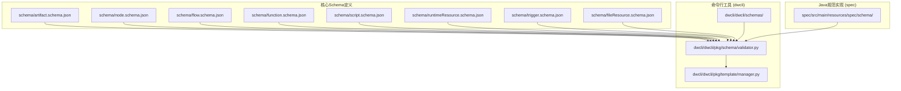
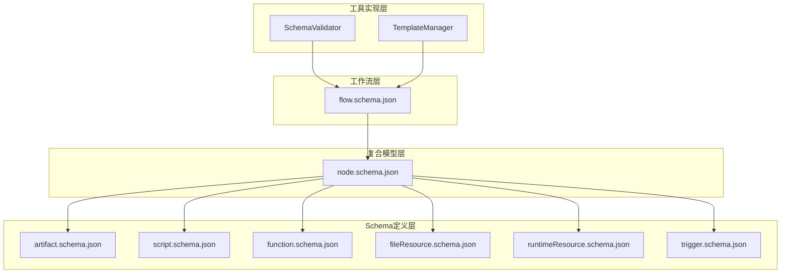
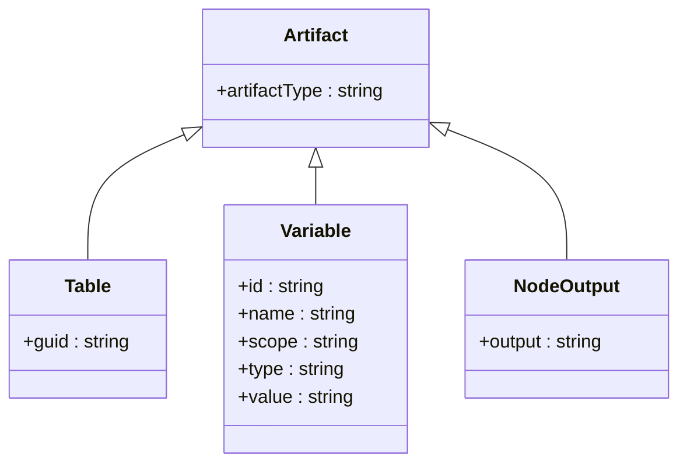
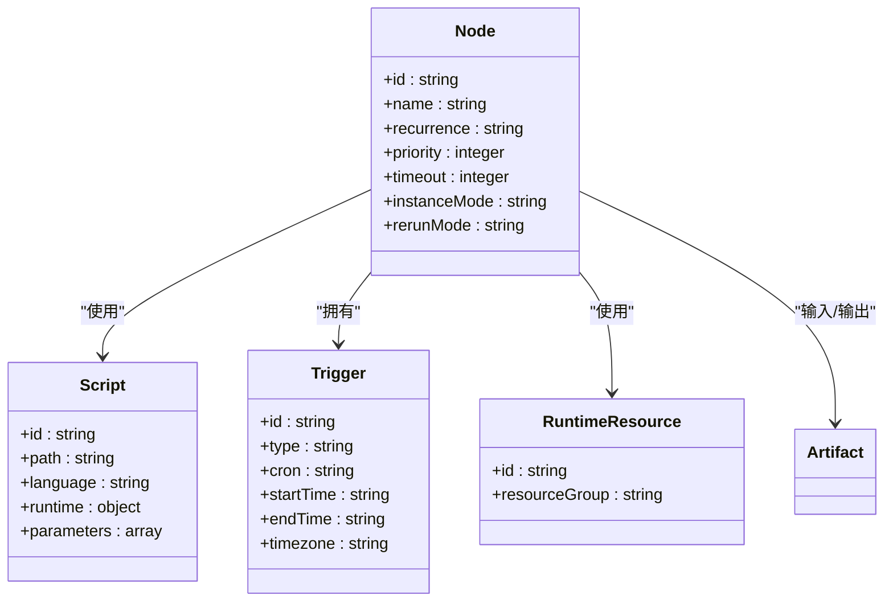
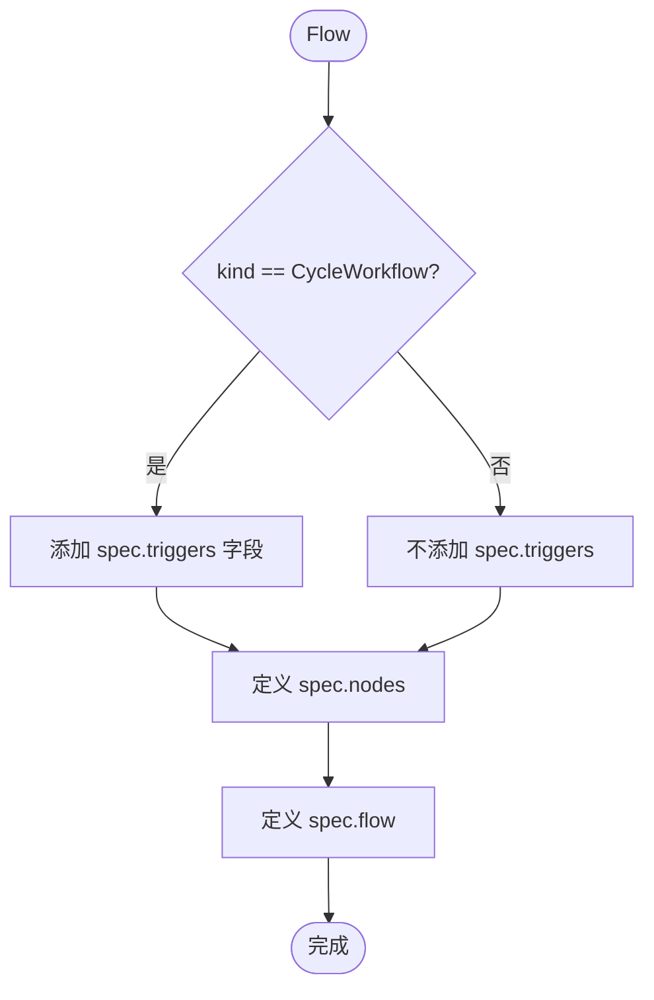
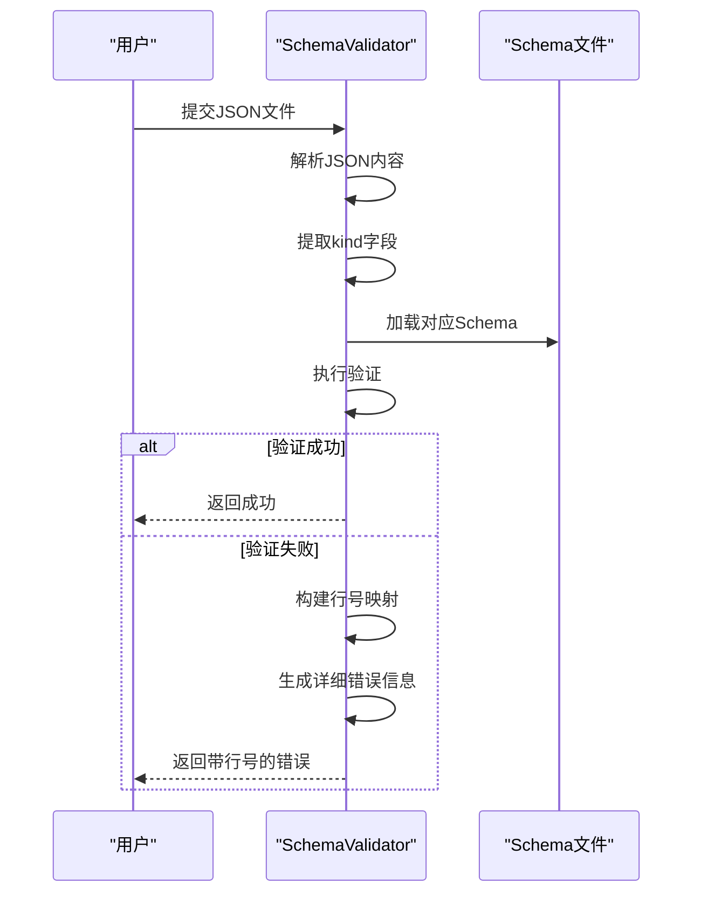
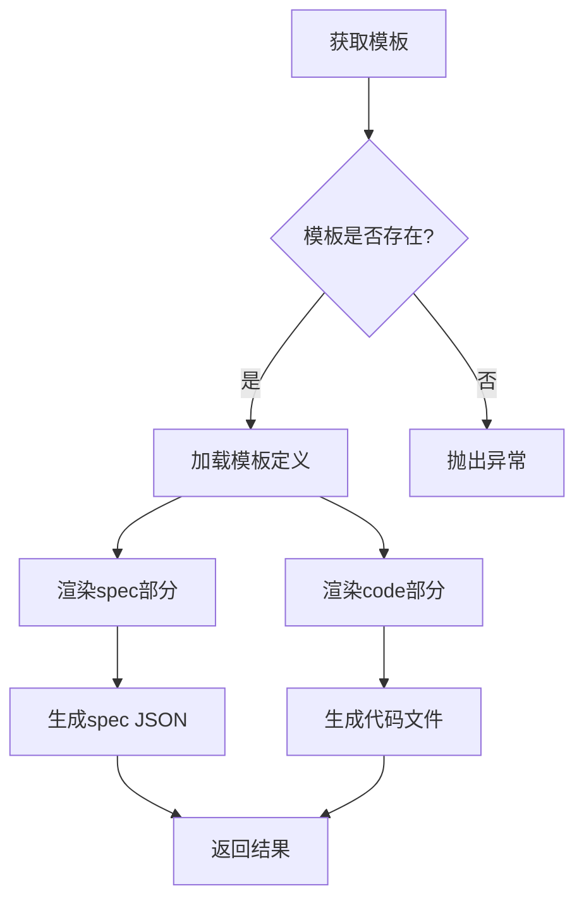
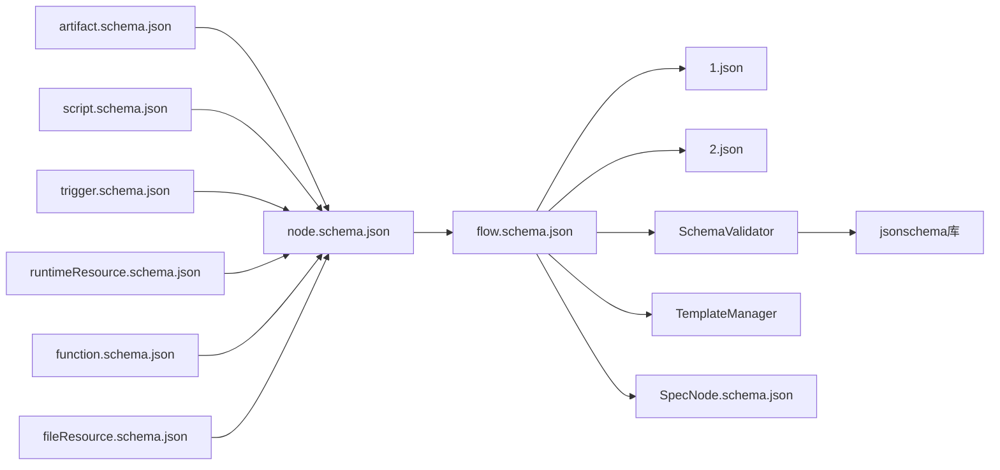

# JSON Schema体系完善

<cite>
**本文档引用的文件**
- [artifact.schema.json](file://schema/artifact.schema.json)
- [node.schema.json](file://schema/node.schema.json)
- [flow.schema.json](file://schema/flow.schema.json)
- [function.schema.json](file://schema/function.schema.json)
- [script.schema.json](file://schema/script.schema.json)
- [runtimeResource.schema.json](file://schema/runtimeResource.schema.json)
- [trigger.schema.json](file://schema/trigger.schema.json)
- [fileResource.schema.json](file://schema/fileResource.schema.json)
- [validator.py](file://dwcli/dwcli/pkg/schema/validator.py)
- [manager.py](file://dwcli/dwcli/pkg/template/manager.py)
- [DataWorksWorkflowSpec.schema.json](file://dwcli/dwcli/schemas/DataWorksWorkflowSpec.schema.json)
- [SpecWorkflow.schema.json](file://dwcli/dwcli/schemas/SpecWorkflow.schema.json)
- [SpecNode.schema.json](file://spec/src/main/resources/spec/schema/SpecNode.schema.json)
- [1.json](file://schema/testcase/1.json)
- [2.json](file://schema/testcase/2.json)
- [test_validator.py](file://dwcli/tests/test_validator.py)
</cite>

## 目录
1. [简介](#简介)
2. [项目结构](#项目结构)
3. [核心组件](#核心组件)
4. [架构概述](#架构概述)
5. [详细组件分析](#详细组件分析)
6. [依赖分析](#依赖分析)
7. [性能考虑](#性能考虑)
8. [故障排除指南](#故障排除指南)
9. [结论](#结论)

## 简介
本文档旨在全面分析和阐述DataWorks平台的JSON Schema体系，该体系用于定义和验证数据工作流的规范。该体系通过一系列JSON Schema文件定义了工作流、节点、资源等核心概念的结构和约束，并提供了相应的验证和模板管理工具。通过本分析，我们将深入了解该体系的设计原理、核心组件及其相互关系。

## 项目结构
项目结构清晰地划分了不同的功能模块，主要包括`schema`目录下的核心JSON Schema定义、`dwcli`中的命令行工具和验证器，以及`spec`中的Java实现。

**Diagram sources**
- [artifact.schema.json](file://schema/artifact.schema.json)
- [node.schema.json](file://schema/node.schema.json)
- [flow.schema.json](file://schema/flow.schema.json)
- [function.schema.json](file://schema/function.schema.json)
- [script.schema.json](file://schema/script.schema.json)
- [runtimeResource.schema.json](file://schema/runtimeResource.schema.json)
- [trigger.schema.json](file://schema/trigger.schema.json)
- [fileResource.schema.json](file://schema/fileResource.schema.json)
- [validator.py](file://dwcli/dwcli/pkg/schema/validator.py)
- [manager.py](file://dwcli/dwcli/pkg/template/manager.py)
- [DataWorksWorkflowSpec.schema.json](file://dwcli/dwcli/schemas/DataWorksWorkflowSpec.schema.json)
- [SpecNode.schema.json](file://spec/src/main/resources/spec/schema/SpecNode.schema.json)

**Section sources**
- [schema](file://schema)
- [dwcli](file://dwcli)
- [spec](file://spec)

## 核心组件
该体系的核心由一系列相互关联的JSON Schema文件构成，它们共同定义了数据工作流的完整模型。`flow.schema.json`作为顶层入口，定义了工作流的版本、类型和核心规范。`node.schema.json`则详细描述了工作流中每个节点的属性，包括脚本、触发器、输入输出等。`artifact.schema.json`是数据传递的核心，定义了节点间共享的表、变量和节点输出。此外，`script.schema.json`、`function.schema.json`等文件则分别定义了脚本、函数等具体资源的结构。这些Schema文件通过`$ref`关键字相互引用，形成了一个层次化的、可扩展的定义体系。

**Section sources**
- [artifact.schema.json](file://schema/artifact.schema.json)
- [node.schema.json](file://schema/node.schema.json)
- [flow.schema.json](file://schema/flow.schema.json)
- [function.schema.json](file://schema/function.schema.json)
- [script.schema.json](file://schema/script.schema.json)
- [runtimeResource.schema.json](file://schema/runtimeResource.schema.json)
- [trigger.schema.json](file://schema/trigger.schema.json)
- [fileResource.schema.json](file://schema/fileResource.schema.json)

## 架构概述
整个JSON Schema体系采用分层架构设计。最底层是原子化的Schema定义，如`artifact.schema.json`和`script.schema.json`，它们定义了最基本的数据单元。中间层是复合型Schema，如`node.schema.json`，它通过引用底层Schema来构建更复杂的节点模型。顶层是`flow.schema.json`，它将多个节点组织成一个完整的工作流，并通过`if/then`条件逻辑来区分不同类型的调度工作流（周期调度与手动触发）。在实现层面，`dwcli`工具包中的`SchemaValidator`负责加载这些Schema文件并执行验证，而`TemplateManager`则利用Jinja2模板引擎，根据预定义的模板生成符合Schema规范的实例。

**Diagram sources**
- [artifact.schema.json](file://schema/artifact.schema.json)
- [node.schema.json](file://schema/node.schema.json)
- [flow.schema.json](file://schema/flow.schema.json)
- [function.schema.json](file://schema/function.schema.json)
- [script.schema.json](file://schema/script.schema.json)
- [runtimeResource.schema.json](file://schema/runtimeResource.schema.json)
- [trigger.schema.json](file://schema/trigger.schema.json)
- [fileResource.schema.json](file://schema/fileResource.schema.json)
- [validator.py](file://dwcli/dwcli/pkg/schema/validator.py)
- [manager.py](file://dwcli/dwcli/pkg/template/manager.py)

## 详细组件分析
### 核心Schema组件分析
#### Artifact Schema分析
`artifact.schema.json`是整个体系中数据抽象的核心。它通过`oneOf`关键字实现了多态性，根据`artifactType`字段的值（"Table"、"Variable"或"NodeOutput"）来决定具体的结构。这种设计允许在`node.schema.json`的输入输出中统一使用`Artifact`类型，极大地提高了模型的灵活性和可扩展性。例如，一个节点的输入可以同时包含来自上游节点的`NodeOutput`和来自数据表的`Table`。

**Diagram sources**
- [artifact.schema.json](file://schema/artifact.schema.json)

#### Node Schema分析
`node.schema.json`定义了工作流中节点的完整配置。它不仅包含了节点的ID、名称等基本信息，还通过`inputs`和`outputs`字段引用了`artifact.schema.json`，从而建立了节点间的数据依赖关系。`script`字段引用了`script.schema.json`，将节点的执行逻辑与配置分离。`trigger`字段则定义了节点的触发方式，支持周期调度和手动触发。此外，`recurrence`、`priority`、`timeout`等字段为节点的调度行为提供了精细的控制。

**Diagram sources**
- [node.schema.json](file://schema/node.schema.json)
- [script.schema.json](file://schema/script.schema.json)
- [trigger.schema.json](file://schema/trigger.schema.json)
- [runtimeResource.schema.json](file://schema/runtimeResource.schema.json)
- [artifact.schema.json](file://schema/artifact.schema.json)

#### Flow Schema分析
`flow.schema.json`作为工作流的顶层容器，其结构清晰地反映了工作流的组成。`spec.nodes`数组包含了所有节点，`spec.flow`数组则定义了节点间的依赖关系，通过`nodeId`和`depends`字段形成一个有向无环图（DAG）。`if/then`语句的使用是该Schema的一个亮点，它实现了条件验证。当`kind`为`CycleWorkflow`时，`then`分支会强制要求`spec.triggers`字段存在，这确保了周期调度工作流必须定义触发器，而手动触发工作流则没有此要求。

**Diagram sources**
- [flow.schema.json](file://schema/flow.schema.json)

### 验证与模板组件分析
#### Schema验证器分析
`dwcli/pkg/schema/validator.py`中的`SchemaValidator`类是确保数据符合Schema规范的关键。它首先从内置目录和用户配置目录加载所有Schema文件，并将其存储在内存中。在验证时，它根据JSON数据中的`kind`字段动态选择对应的Schema进行验证。该验证器的一个重要特性是能够将JSON Schema的验证错误映射到源文件的具体行号，这极大地提升了用户体验。它通过解析JSON文件的缩进结构来构建一个路径到行号的映射表，从而在验证失败时能精确定位错误位置。

**Diagram sources**
- [validator.py](file://dwcli/dwcli/pkg/schema/validator.py)

#### 模板管理器分析
`dwcli/pkg/template/manager.py`中的`TemplateManager`类负责模板的管理和渲染。它支持从内置和用户目录加载模板，并使用Jinja2模板引擎将上下文数据填充到模板中，生成最终的JSON实例。模板不仅支持生成`spec`部分，还支持生成关联的代码文件（如SQL脚本），这使得它成为一个强大的代码生成工具。模板的结构非常灵活，可以定义单个文件或多个文件的生成规则。

**Diagram sources**
- [manager.py](file://dwcli/dwcli/pkg/template/manager.py)

**Section sources**
- [validator.py](file://dwcli/dwcli/pkg/schema/validator.py)
- [manager.py](file://dwcli/dwcli/pkg/template/manager.py)

## 依赖分析
该体系的依赖关系清晰且合理。核心的JSON Schema文件之间通过`$ref`形成强依赖，例如`node.schema.json`依赖于`artifact.schema.json`、`script.schema.json`等多个文件。`dwcli`工具包依赖于这些Schema文件进行验证，并依赖于`jsonschema`库执行具体的验证逻辑。`spec`模块中的Java实现也引用了这些Schema文件，确保了前后端对数据模型的理解一致。测试文件（如`testcase/1.json`）则依赖于`flow.schema.json`来验证其正确性，形成了一个完整的验证闭环。

**Diagram sources**
- [artifact.schema.json](file://schema/artifact.schema.json)
- [node.schema.json](file://schema/node.schema.json)
- [flow.schema.json](file://schema/flow.schema.json)
- [function.schema.json](file://schema/function.schema.json)
- [script.schema.json](file://schema/script.schema.json)
- [runtimeResource.schema.json](file://schema/runtimeResource.schema.json)
- [trigger.schema.json](file://schema/trigger.schema.json)
- [fileResource.schema.json](file://schema/fileResource.schema.json)
- [validator.py](file://dwcli/dwcli/pkg/schema/validator.py)
- [manager.py](file://dwcli/dwcli/pkg/template/manager.py)
- [SpecNode.schema.json](file://spec/src/main/resources/spec/schema/SpecNode.schema.json)
- [1.json](file://schema/testcase/1.json)
- [2.json](file://schema/testcase/2.json)

**Section sources**
- [schema](file://schema)
- [dwcli](file://dwcli)
- [spec](file://spec)

## 性能考虑
该体系在性能方面主要考虑了Schema加载和验证效率。`SchemaValidator`在初始化时会一次性加载所有Schema文件到内存中，避免了在每次验证时重复读取文件的I/O开销。对于大型工作流的验证，由于JSON Schema的验证过程是递归的，其时间复杂度与JSON数据的大小成正比。为了优化性能，建议保持Schema定义的简洁性，并避免过度嵌套。此外，`TemplateManager`的渲染性能主要取决于Jinja2引擎的效率，对于复杂的模板，预编译模板可以带来一定的性能提升。

## 故障排除指南
当遇到Schema验证失败时，应首先检查`dwcli`工具输出的错误信息，它会明确指出错误类型、路径和行号。常见的错误包括：
- **缺少必填字段**：确保所有`required`字段都已提供。
- **类型不匹配**：检查字段值的类型是否与Schema定义一致（如将字符串赋值给整数字段）。
- **枚举值无效**：确认字段值是否在`enum`列表中。
- **引用路径错误**：检查`$ref`路径是否正确，文件是否存在。

对于模板渲染问题，应检查上下文数据是否完整，以及模板中的变量名是否与上下文中的键名匹配。

**Section sources**
- [validator.py](file://dwcli/dwcli/pkg/schema/validator.py)
- [test_validator.py](file://dwcli/tests/test_validator.py)

## 结论
DataWorks的JSON Schema体系设计精良，通过分层和模块化的方式，构建了一个强大且灵活的数据工作流描述语言。其核心优势在于：
1.  **清晰的分层结构**：从原子Schema到复合模型，再到顶层工作流，层次分明。
2.  **强大的验证能力**：`SchemaValidator`提供了精确到行号的错误反馈，极大提升了开发效率。
3.  **高效的代码生成**：`TemplateManager`结合Jinja2，实现了从模板到实例的自动化生成。
4.  **良好的扩展性**：通过`$ref`和`oneOf`等机制，体系易于扩展以支持新的节点类型和资源。

该体系为数据工作流的标准化和自动化奠定了坚实的基础，是DataWorks平台的核心技术之一。