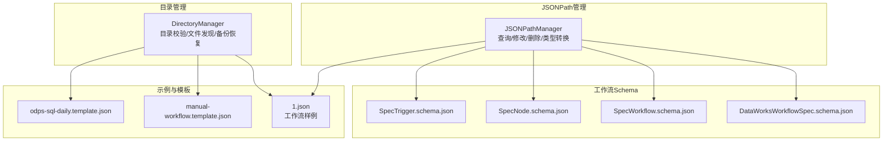
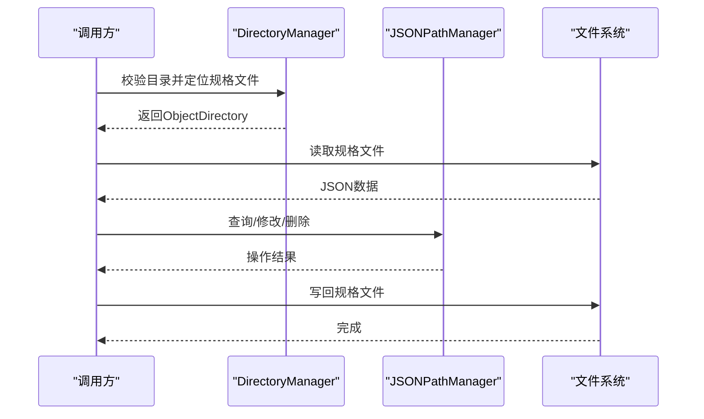
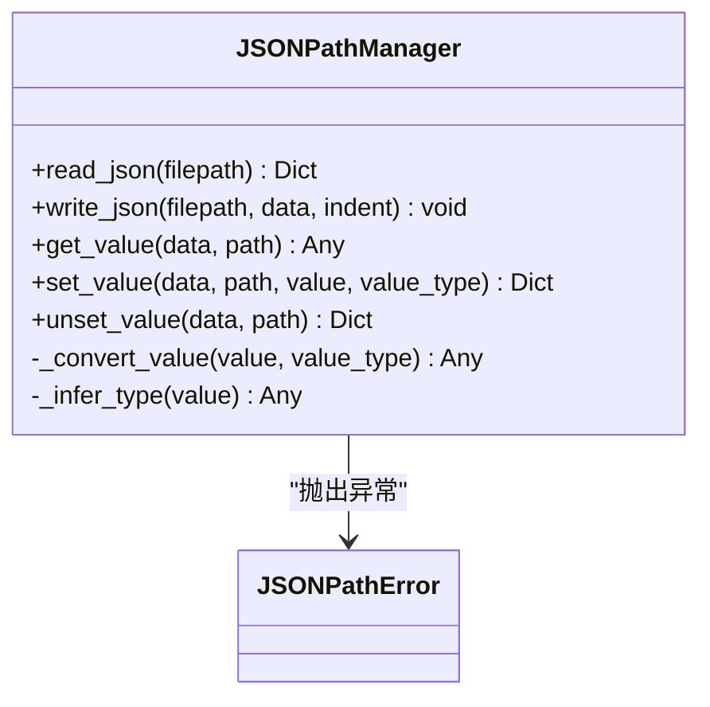
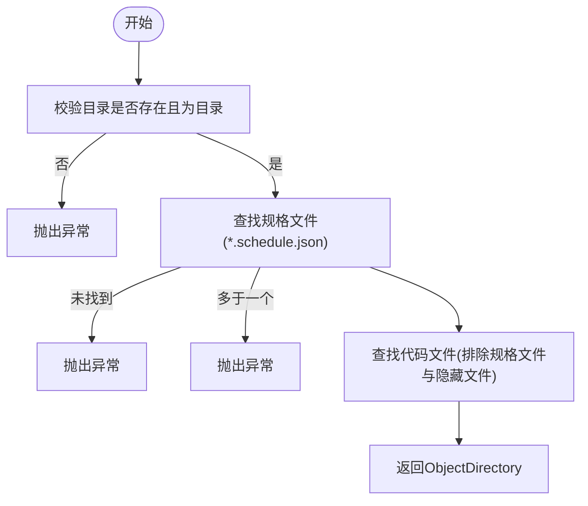
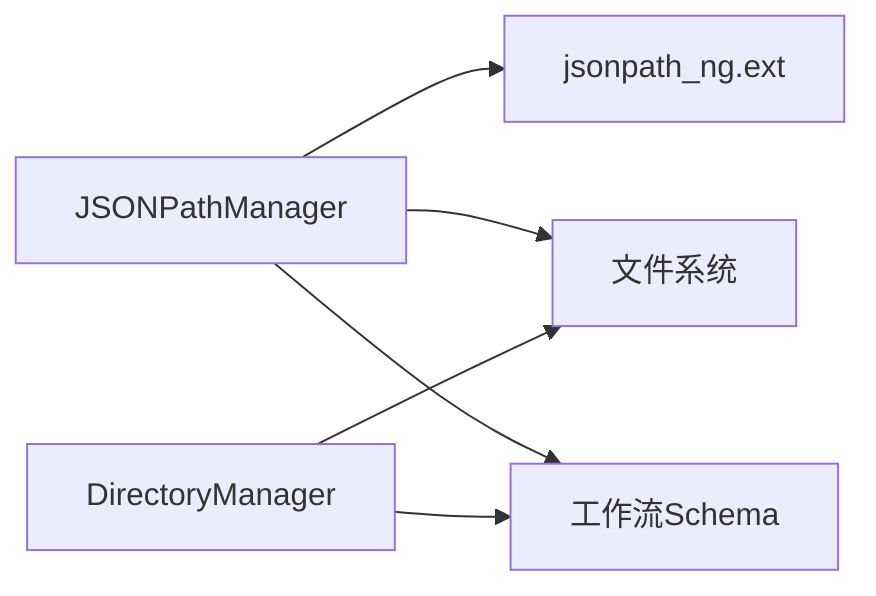

# JSONPath管理

<cite>
**本文引用的文件列表**
- [manager.py](file://dwcli/dwcli/pkg/jsonpath/manager.py)
- [directory.py](file://dwcli/dwcli/pkg/domain/directory.py)
- [test_jsonpath.py](file://dwcli/tests/test_jsonpath.py)
- [DataWorksWorkflowSpec.schema.json](file://spec/src/main/resources/spec/schema/DataWorksWorkflowSpec.schema.json)
- [SpecWorkflow.schema.json](file://spec/src/main/resources/spec/schema/SpecWorkflow.schema.json)
- [SpecNode.schema.json](file://spec/src/main/resources/spec/schema/SpecNode.schema.json)
- [SpecTrigger.schema.json](file://spec/src/main/resources/spec/schema/SpecTrigger.schema.json)
- [1.json](file://schema/testcase/1.json)
- [manual-workflow.template.json](file://dwcli/dwcli/templates/manual-workflow.template.json)
- [odps-sql-daily.template.json](file://dwcli/dwcli/templates/odps-sql-daily.template.json)
</cite>

## 目录
1. [简介](#简介)
2. [项目结构](#项目结构)
3. [核心组件](#核心组件)
4. [架构总览](#架构总览)
5. [详细组件分析](#详细组件分析)
6. [依赖关系分析](#依赖关系分析)
7. [性能考量](#性能考量)
8. [故障排查指南](#故障排查指南)
9. [结论](#结论)
10. [附录：常见JSONPath查询与操作模式](#附录常见jsonpath查询与操作模式)

## 简介
本文件围绕 dwcli 中的 JSONPath 管理能力展开，系统性说明如何使用 JSONPath 表达式对复杂工作流 JSON 结构进行查询、修改与删除；解释其基于 jsonpath-ng 库的查询引擎实现机制；并结合目录管理模块 directory.py 实现批量修改与跨工作流配置管理。文档同时提供常见查询模式示例、性能优化建议与安全最佳实践，帮助读者在工作流自动化配置与批量处理中高效、安全地使用 JSONPath。

## 项目结构
- JSONPath 管理器位于 dwcli/pkg/jsonpath/manager.py，提供读取/写入 JSON 文件、基于 JSONPath 的查询与修改、以及值类型转换与推断能力。
- 目录管理位于 dwcli/pkg/domain/directory.py，负责校验对象目录结构、定位工作流规格文件与代码文件、备份与恢复等。
- 测试用例位于 dwcli/tests/test_jsonpath.py，覆盖 get/set/unset 基本操作与类型推断。
- 工作流 JSON 结构参考 schema 定义与测试样例，包含节点、触发器、运行时资源、脚本等关键字段。

图表来源
- [manager.py](file://dwcli/dwcli/pkg/jsonpath/manager.py#L1-L153)
- [directory.py](file://dwcli/dwcli/pkg/domain/directory.py#L1-L85)
- [DataWorksWorkflowSpec.schema.json](file://spec/src/main/resources/spec/schema/DataWorksWorkflowSpec.schema.json#L1-L119)
- [SpecWorkflow.schema.json](file://spec/src/main/resources/spec/schema/SpecWorkflow.schema.json#L1-L56)
- [SpecNode.schema.json](file://spec/src/main/resources/spec/schema/SpecNode.schema.json#L1-L114)
- [SpecTrigger.schema.json](file://spec/src/main/resources/spec/schema/SpecTrigger.schema.json#L1-L51)
- [1.json](file://schema/testcase/1.json#L1-L125)
- [manual-workflow.template.json](file://dwcli/dwcli/templates/manual-workflow.template.json#L1-L28)
- [odps-sql-daily.template.json](file://dwcli/dwcli/templates/odps-sql-daily.template.json#L1-L28)

章节来源
- [manager.py](file://dwcli/dwcli/pkg/jsonpath/manager.py#L1-L153)
- [directory.py](file://dwcli/dwcli/pkg/domain/directory.py#L1-L85)

## 核心组件
- JSONPathManager：封装 JSON 文件读写、基于 JSONPath 的查询、设置与删除操作，以及字符串到目标类型的转换与自动推断。
- DirectoryManager：校验工作流对象目录结构，定位规格文件与代码文件，支持备份与恢复。

章节来源
- [manager.py](file://dwcli/dwcli/pkg/jsonpath/manager.py#L1-L153)
- [directory.py](file://dwcli/dwcli/pkg/domain/directory.py#L1-L85)

## 架构总览
JSONPath 管理器通过 jsonpath-ng 扩展解析器执行查询，返回匹配结果集合；对于修改操作，采用路径分段解析与惰性创建策略，确保路径不存在时自动补全对象或数组；类型转换支持显式指定类型或自动推断，保证写入值的语义正确性。目录管理器为批量处理提供基础能力，确保每个工作流对象目录内仅存在一个规格文件且可选一个代码文件。

图表来源
- [directory.py](file://dwcli/dwcli/pkg/domain/directory.py#L20-L85)
- [manager.py](file://dwcli/dwcli/pkg/jsonpath/manager.py#L12-L23)

## 详细组件分析

### JSONPathManager 组件分析
- 读取与写入：提供读取与写入 JSON 文件的能力，写入时支持缩进与 UTF-8 编码。
- 查询 get_value：使用扩展解析器解析 JSONPath 表达式，返回单个值、空值或多个匹配值的列表。
- 修改 set_value：将字符串值按类型转换后写入指定路径；路径中间缺失的对象或数组会自动创建；数组索引越界会自动补齐。
- 删除 unset_value：删除指定路径的键或数组元素；若路径不存在则抛出错误。
- 类型转换与推断：支持显式类型（字符串、整数、浮点、布尔、JSON）与自动推断（布尔、整数、浮点、JSON 对象/数组、原始字符串）。

图表来源
- [manager.py](file://dwcli/dwcli/pkg/jsonpath/manager.py#L12-L153)

章节来源
- [manager.py](file://dwcli/dwcli/pkg/jsonpath/manager.py#L12-L153)

### DirectoryManager 组件分析
- 校验 validate_directory：确保目录存在且为目录，且仅包含一个规格文件；可选地定位代码文件。
- 创建 create_directory：按需创建目录，支持强制覆盖。
- 备份与恢复 backup_file/restore_backup/remove_backup：对规格文件进行备份、恢复与清理。

图表来源
- [directory.py](file://dwcli/dwcli/pkg/domain/directory.py#L20-L59)

章节来源
- [directory.py](file://dwcli/dwcli/pkg/domain/directory.py#L1-L85)

### JSONPath 查询引擎与表达式解析机制
- 使用 jsonpath_ng.ext 解析器，支持扩展语法（如通配符、递归下降等），get_value 通过 find 返回匹配集合。
- 路径分段解析：将形如 "a.b[0].c" 的路径标准化为 "a.b.0.c"，逐段访问或创建对象/数组。
- 匹配结果处理：无匹配返回 None；单匹配返回该值；多匹配返回值列表。

章节来源
- [manager.py](file://dwcli/dwcli/pkg/jsonpath/manager.py#L24-L39)

### 类型转换与推断
- 显式类型转换：支持 string/str、int/integer、float/number、bool/boolean、json。
- 自动推断：优先识别布尔、整数、浮点；其次尝试 JSON 解析；最后保留原字符串。

章节来源
- [manager.py](file://dwcli/dwcli/pkg/jsonpath/manager.py#L108-L153)

## 依赖关系分析
- JSONPathManager 依赖 jsonpath_ng.ext 进行表达式解析与匹配。
- JSONPathManager 与 DirectoryManager 在工作流批量处理场景下协同：先通过 DirectoryManager 校验与定位工作流对象，再对 JSON 数据进行查询与修改。
- 工作流 Schema 为 JSONPath 查询提供结构约束与字段参考，确保查询路径与实际结构一致。

图表来源
- [manager.py](file://dwcli/dwcli/pkg/jsonpath/manager.py#L1-L10)
- [directory.py](file://dwcli/dwcli/pkg/domain/directory.py#L1-L85)
- [DataWorksWorkflowSpec.schema.json](file://spec/src/main/resources/spec/schema/DataWorksWorkflowSpec.schema.json#L1-L119)

章节来源
- [manager.py](file://dwcli/dwcli/pkg/jsonpath/manager.py#L1-L10)
- [directory.py](file://dwcli/dwcli/pkg/domain/directory.py#L1-L85)
- [DataWorksWorkflowSpec.schema.json](file://spec/src/main/resources/spec/schema/DataWorksWorkflowSpec.schema.json#L1-L119)

## 性能考量
- 查询性能优化
  - 尽量使用精确路径前缀减少匹配范围，避免过长的通配符链。
  - 合理拆分多次查询，避免一次性对大对象执行复杂表达式。
  - 对频繁使用的表达式，可在上层缓存匹配结果以减少重复解析。
- 写入性能优化
  - 批量修改时尽量合并为一次写入，减少多次 IO。
  - 避免在热路径上频繁创建深层嵌套对象或数组，提前预分配。
- 类型转换开销
  - 显式指定类型可避免不必要的自动推断逻辑，提高稳定性与速度。
  - 大量 JSON 字符串转换时，建议统一格式化输入，减少异常重试。

[本节为通用性能建议，不直接分析具体文件，故无章节来源]

## 故障排查指南
- 路径不存在或类型不匹配
  - get_value 返回 None 或抛出 JSONPathError。
  - set_value 在数组索引越界或非数组位置期望列表时抛错。
  - unset_value 在键/索引不存在时抛错。
- 类型转换失败
  - _convert_value/_infer_type 在无法转换时抛错，检查输入字符串是否符合目标类型。
- 目录结构异常
  - DirectoryManager.validate_directory 在找不到或找到多个规格文件、或代码文件数量不唯一时抛错。

章节来源
- [manager.py](file://dwcli/dwcli/pkg/jsonpath/manager.py#L41-L106)
- [directory.py](file://dwcli/dwcli/pkg/domain/directory.py#L20-L59)

## 结论
JSONPathManager 提供了对复杂工作流 JSON 结构的高效查询与修改能力，结合 DirectoryManager 的目录校验与备份恢复机制，能够支撑大规模工作流的自动化配置与批量处理。通过合理的查询模式、类型转换策略与安全实践，可以在保证性能的同时提升系统的可靠性与可维护性。

[本节为总结性内容，不直接分析具体文件，故无章节来源]

## 附录：常见JSONPath查询与操作模式

### 基于 Schema 的查询模式
- 查找所有节点
  - 表达式：spec.nodes[*]
  - 用途：遍历节点数组，用于统计、筛选或批量修改。
- 查找特定类型节点
  - 表达式：spec.nodes[?(@.type=='ODPS_SQL')]
  - 用途：定位某类节点，便于统一调整脚本路径或参数。
- 提取调度配置
  - 表达式：spec.triggers[*].cron
  - 用途：导出或批量修改定时表达式。
- 修改资源参数
  - 表达式：spec.runtimeResources[?(@.resourceGroup=='group_xxx')].resourceGroupId
  - 用途：批量替换运行时资源组标识。
- 修改节点超时与重试
  - 表达式：spec.nodes[*].timeout
  - 表达式：spec.nodes[*].rerunTimes
  - 用途：统一调整节点超时与重试次数。

章节来源
- [DataWorksWorkflowSpec.schema.json](file://spec/src/main/resources/spec/schema/DataWorksWorkflowSpec.schema.json#L1-L119)
- [SpecWorkflow.schema.json](file://spec/src/main/resources/spec/schema/SpecWorkflow.schema.json#L1-L56)
- [SpecNode.schema.json](file://spec/src/main/resources/spec/schema/SpecNode.schema.json#L1-L114)
- [SpecTrigger.schema.json](file://spec/src/main/resources/spec/schema/SpecTrigger.schema.json#L1-L51)

### 基于示例样例的查询模式
- 查找节点 id 与名称
  - 表达式：spec.nodes[*].id
  - 表达式：spec.nodes[*].name
- 查找节点脚本路径
  - 表达式：spec.nodes[*].script.path
- 查找节点触发器类型与 cron
  - 表达式：spec.nodes[*].trigger.type
  - 表达式：spec.nodes[*].trigger.cron
- 查找运行时资源组
  - 表达式：spec.nodes[*].runtimeResource.resourceGroup

章节来源
- [1.json](file://schema/testcase/1.json#L1-L125)

### 批量修改与跨工作流配置管理
- 步骤
  1) 使用 DirectoryManager.validate_directory 校验工作流对象目录，定位规格文件与代码文件。
  2) 读取规格文件为 JSON 数据。
  3) 使用 JSONPathManager.get_value 获取需要批量调整的字段集合。
  4) 使用 JSONPathManager.set_value 对目标路径进行批量赋值。
  5) 使用 DirectoryManager.backup_file 对规格文件进行备份。
  6) 使用 JSONPathManager.write_json 写回更新后的数据。
  7) 可选：DirectoryManager.restore_backup/DirectoryManager.remove_backup 管理备份。
- 注意事项
  - 在修改前务必备份，防止误操作导致不可逆损失。
  - 对数组索引的修改要确保目标索引存在或允许自动补齐。
  - 对类型敏感的字段（如超时、重试次数、布尔开关）建议显式指定类型转换。

章节来源
- [directory.py](file://dwcli/dwcli/pkg/domain/directory.py#L20-L85)
- [manager.py](file://dwcli/dwcli/pkg/jsonpath/manager.py#L12-L23)
- [test_jsonpath.py](file://dwcli/tests/test_jsonpath.py#L1-L104)

### 安全最佳实践
- 输入验证与白名单
  - 限制允许的 JSONPath 表达式集合，避免任意表达式执行。
  - 对用户输入的路径进行白名单校验，仅允许受控字段与结构。
- 权限控制
  - 仅对必要文件开放读写权限，避免越权修改。
- 类型约束
  - 对数值、布尔、JSON 等字段强制类型转换，防止意外字符串污染。
- 备份与回滚
  - 所有批量修改前必须备份，失败时及时回滚。
- 日志审计
  - 记录每次查询与修改的路径、旧值、新值与操作者，便于追溯。

[本节为通用安全建议，不直接分析具体文件，故无章节来源]