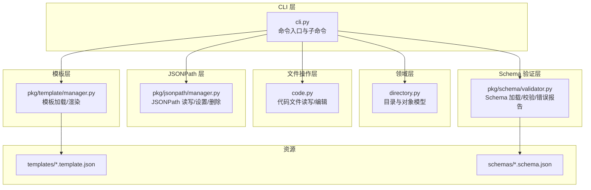
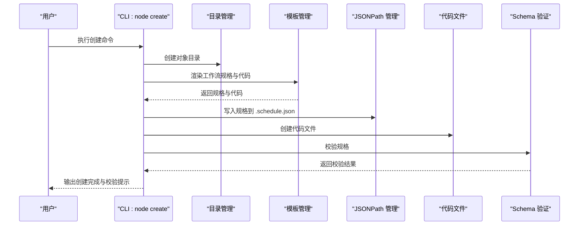
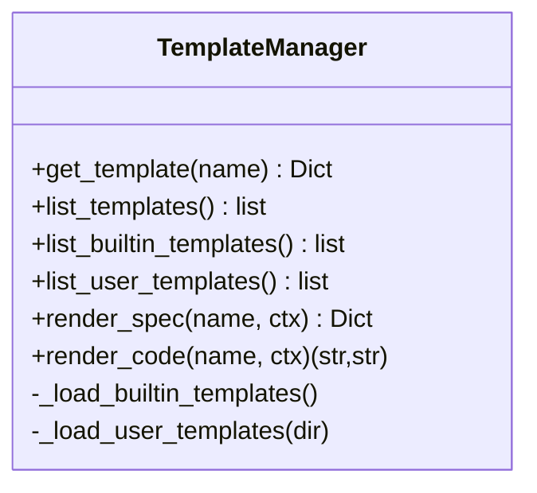
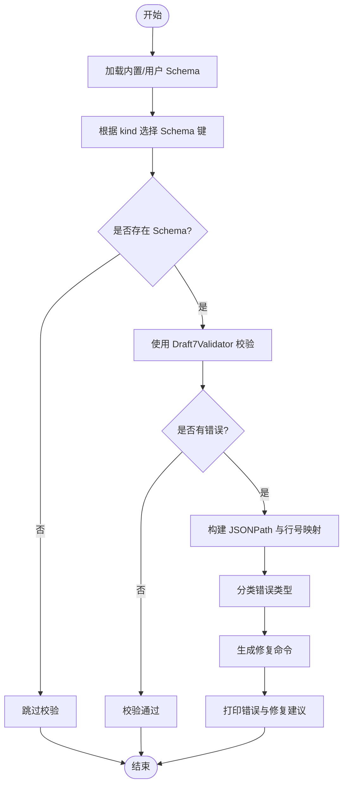
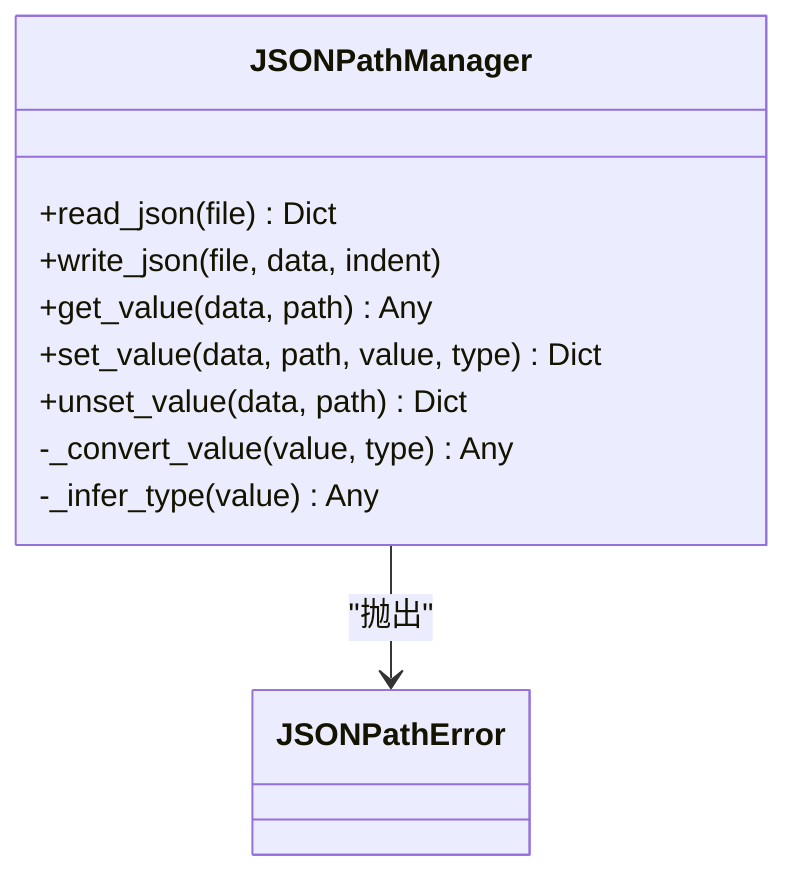
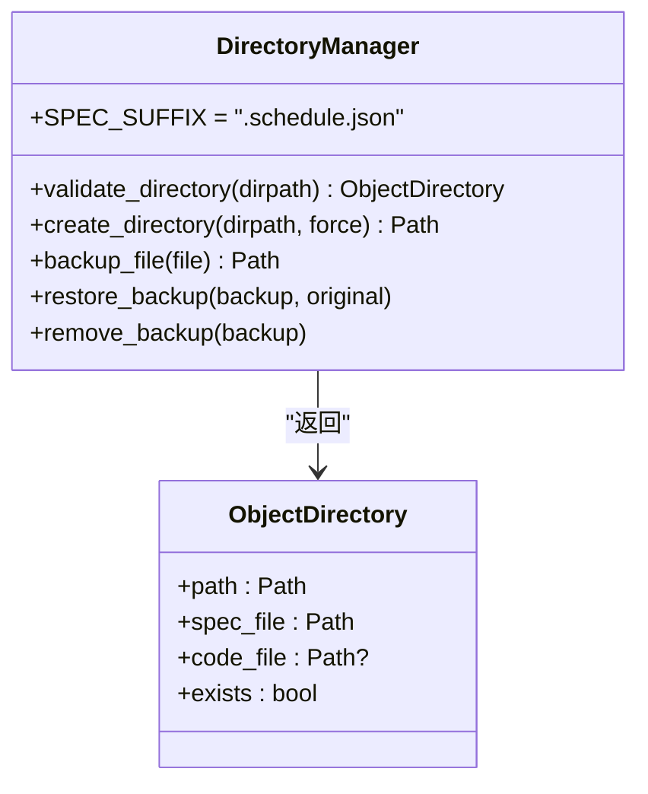
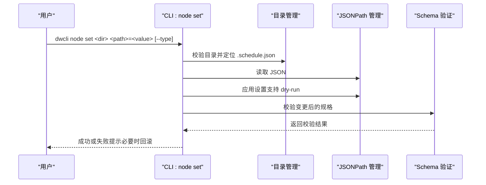
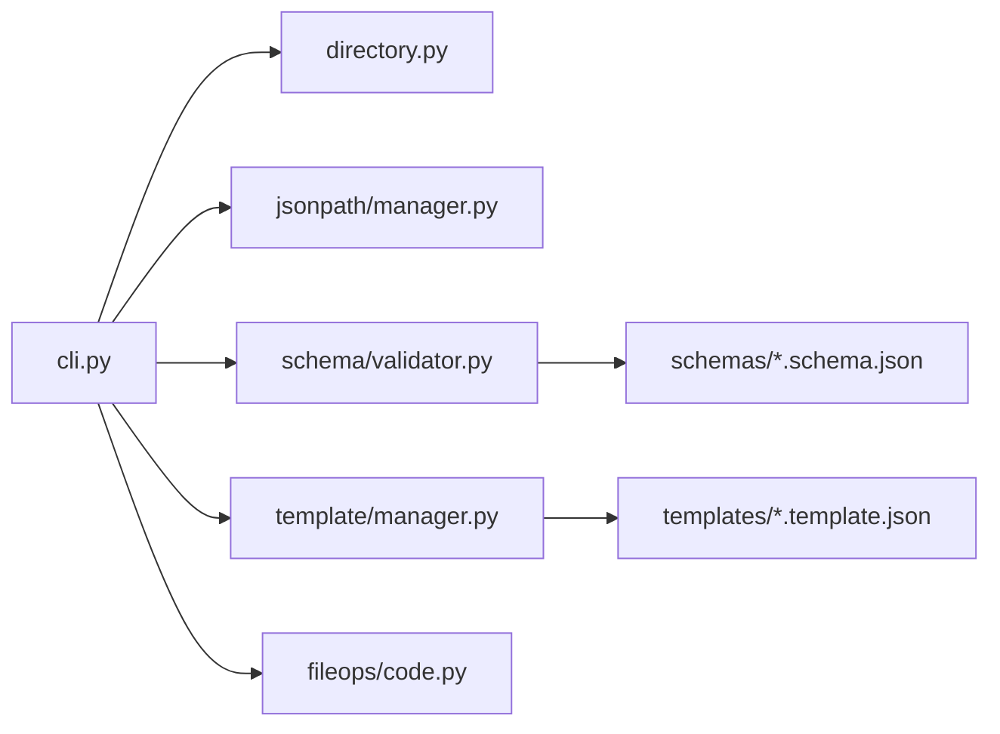

# 命令行工具

<cite>
**本文引用的文件列表**
- [cli.py](file://dwcli/dwcli/cli.py)
- [manager.py（模板）](file://dwcli/dwcli/pkg/template/manager.py)
- [manager.py（JSONPath）](file://dwcli/dwcli/pkg/jsonpath/manager.py)
- [validator.py（Schema）](file://dwcli/dwcli/pkg/schema/validator.py)
- [directory.py](file://dwcli/dwcli/pkg/domain/directory.py)
- [code.py](file://dwcli/dwcli/pkg/fileops/code.py)
- [odps-sql-daily.template.json](file://dwcli/dwcli/templates/odps-sql-daily.template.json)
- [manual-workflow.template.json](file://dwcli/dwcli/templates/manual-workflow.template.json)
- [python-daily.template.json](file://dwcli/dwcli/templates/python-daily.template.json)
- [shell-daily.template.json](file://dwcli/dwcli/templates/shell-daily.template.json)
- [CycleWorkflow.schedule.schema.json](file://dwcli/dwcli/schemas/CycleWorkflow.schedule.schema.json)
- [README.md（dwcli）](file://dwcli/README.md)
- [setup.py](file://dwcli/setup.py)
- [test_template.py](file://dwcli/tests/test_template.py)
- [test_validator.py](file://dwcli/tests/test_validator.py)
- [test_jsonpath.py](file://dwcli/tests/test_jsonpath.py)
</cite>

## 目录
1. [简介](#简介)
2. [项目结构](#项目结构)
3. [核心组件](#核心组件)
4. [架构总览](#架构总览)
5. [详细组件分析](#详细组件分析)
6. [依赖关系分析](#依赖关系分析)
7. [性能考量](#性能考量)
8. [故障排查指南](#故障排查指南)
9. [结论](#结论)
10. [附录](#附录)

## 简介
本文件面向开发者与运维人员，系统化阐述命令行工具 dwcli 的设计与实现，重点覆盖以下能力：
- 模板管理：通过模板渲染生成标准化工作流对象目录与脚本文件
- 模式验证：基于 JSON Schema 对工作流定义进行严格校验，并输出可执行的修复建议
- JSONPath 操作：支持对工作流配置进行精确查询、设置与删除
- 主入口 CLI：提供完整的创建、编辑、验证、部署工作流的命令行流程

同时，文档解释了该工具与 DataWorks FlowSpec 规范的集成方式，给出常见配置错误的解决方案与模板设计最佳实践，帮助用户高效、安全地管理数据工作流。

## 项目结构
dwcli 采用“模块化分层”的组织方式：
- CLI 层：命令定义与参数解析，负责编排各子系统
- 领域层：目录结构与对象模型抽象，确保对象目录一致性
- 文件操作层：代码文件读写与编辑器集成
- 模板层：内置与用户自定义模板加载与渲染
- JSONPath 层：配置读取、写入与路径操作
- Schema 验证层：内置与用户自定义 Schema 加载与校验

图表来源
- [cli.py](file://dwcli/dwcli/cli.py#L1-L312)
- [directory.py](file://dwcli/dwcli/pkg/domain/directory.py#L1-L85)
- [code.py](file://dwcli/dwcli/pkg/fileops/code.py#L1-L70)
- [manager.py（模板）](file://dwcli/dwcli/pkg/template/manager.py#L1-L123)
- [manager.py（JSONPath）](file://dwcli/dwcli/pkg/jsonpath/manager.py#L1-L153)
- [validator.py（Schema）](file://dwcli/dwcli/pkg/schema/validator.py#L1-L231)
- [odps-sql-daily.template.json](file://dwcli/dwcli/templates/odps-sql-daily.template.json#L1-L28)
- [CycleWorkflow.schedule.schema.json](file://dwcli/dwcli/schemas/CycleWorkflow.schedule.schema.json#L1-L136)

章节来源
- [cli.py](file://dwcli/dwcli/cli.py#L1-L312)
- [setup.py](file://dwcli/setup.py#L1-L39)

## 核心组件
- CLI 入口与命令组：定义 node、code 子命令组及具体命令，统一处理异常与退出码
- 目录管理：校验对象目录结构，定位唯一 .schedule.json 与代码文件，提供备份/恢复
- 模板管理：加载内置与用户模板，按上下文渲染工作流规格与代码
- JSONPath 管理：读取/写入 JSON，按路径设置/删除值，自动类型推断与转换
- Schema 验证：加载内置与用户 Schema，按 kind 决定匹配规则，输出带行号与修复建议的错误信息

章节来源
- [cli.py](file://dwcli/dwcli/cli.py#L1-L312)
- [directory.py](file://dwcli/dwcli/pkg/domain/directory.py#L1-L85)
- [manager.py（模板）](file://dwcli/dwcli/pkg/template/manager.py#L1-L123)
- [manager.py（JSONPath）](file://dwcli/dwcli/pkg/jsonpath/manager.py#L1-L153)
- [validator.py（Schema）](file://dwcli/dwcli/pkg/schema/validator.py#L1-L231)

## 架构总览
dwcli 的控制流围绕“对象目录”展开：创建时由模板生成 .schedule.json 与代码文件；修改时通过 JSONPath 设置/删除字段并即时验证；查看时支持 JSON/YAML/raw 输出；编辑代码通过系统默认编辑器打开。

图表来源
- [cli.py](file://dwcli/dwcli/cli.py#L22-L66)
- [directory.py](file://dwcli/dwcli/pkg/domain/directory.py#L61-L68)
- [manager.py（模板）](file://dwcli/dwcli/pkg/template/manager.py#L100-L123)
- [manager.py（JSONPath）](file://dwcli/dwcli/pkg/jsonpath/manager.py#L12-L23)
- [code.py](file://dwcli/dwcli/pkg/fileops/code.py#L63-L70)
- [validator.py（Schema）](file://dwcli/dwcli/pkg/schema/validator.py#L61-L82)

## 详细组件分析

### 模板管理（template/manager.py）
- 加载策略
  - 内置模板：从包内 templates 目录加载所有 *.template.json，按文件名 stem 作为模板名注册
  - 用户模板：默认从用户配置目录加载，优先级高于内置模板
- 渲染接口
  - 渲染工作流规格：将模板中的 spec 字段作为 Jinja2 模板，按上下文渲染为字典
  - 渲染代码：将模板中的 code.content 作为模板，按上下文渲染为字符串，返回扩展名与内容
- 上下文变量
  - name：对象名称
  - owner：所有者（支持默认值）
- 使用示例
  - odps-sql-daily.template.json：生成 CycleWorkflow，节点类型为 ODPS_SQL，脚本路径为 {name}.sql
  - manual-workflow.template.json：生成 ManualWorkflow，节点类型为 SHELL，脚本路径为 {name}.sh
  - python-daily.template.json：生成 CycleWorkflow，节点类型为 PYTHON，脚本路径为 {name}.py
  - shell-daily.template.json：生成 CycleWorkflow，节点类型为 SHELL，脚本路径为 {name}.sh

图表来源
- [manager.py（模板）](file://dwcli/dwcli/pkg/template/manager.py#L1-L123)
- [odps-sql-daily.template.json](file://dwcli/dwcli/templates/odps-sql-daily.template.json#L1-L28)
- [manual-workflow.template.json](file://dwcli/dwcli/templates/manual-workflow.template.json#L1-L28)
- [python-daily.template.json](file://dwcli/dwcli/templates/python-daily.template.json#L1-L29)
- [shell-daily.template.json](file://dwcli/dwcli/templates/shell-daily.template.json#L1-L29)

章节来源
- [manager.py（模板）](file://dwcli/dwcli/pkg/template/manager.py#L1-L123)
- [odps-sql-daily.template.json](file://dwcli/dwcli/templates/odps-sql-daily.template.json#L1-L28)
- [manual-workflow.template.json](file://dwcli/dwcli/templates/manual-workflow.template.json#L1-L28)
- [python-daily.template.json](file://dwcli/dwcli/templates/python-daily.template.json#L1-L29)
- [shell-daily.template.json](file://dwcli/dwcli/templates/shell-daily.template.json#L1-L29)
- [test_template.py](file://dwcli/tests/test_template.py#L1-L81)

### 模式验证（schema/validator.py）
- Schema 加载
  - 内置 Schema：从包内 schemas 目录加载 *.schema.json，以文件名 stem 作为键注册
  - 用户 Schema：从用户配置目录加载，覆盖同名内置 Schema
- 匹配规则
  - 依据工作流 kind 自动选择 {kind}.schedule 或 {kind} 作为 Schema 键
  - 若未找到对应 Schema，则跳过校验
- 校验流程
  - 使用 Draft7Validator 迭代错误
  - 构建 JSONPath 与行号映射，分类错误类型（类型不匹配、缺失必填、枚举值无效、长度/范围约束等）
  - 生成可执行的修复命令（如 dwcli node set …），便于快速修正
- 输出格式
  - 详细的错误类型、路径、原因、行号与修复建议

图表来源
- [validator.py（Schema）](file://dwcli/dwcli/pkg/schema/validator.py#L1-L231)
- [CycleWorkflow.schedule.schema.json](file://dwcli/dwcli/schemas/CycleWorkflow.schedule.schema.json#L1-L136)

章节来源
- [validator.py（Schema）](file://dwcli/dwcli/pkg/schema/validator.py#L1-L231)
- [CycleWorkflow.schedule.schema.json](file://dwcli/dwcli/schemas/CycleWorkflow.schedule.schema.json#L1-L136)
- [test_validator.py](file://dwcli/tests/test_validator.py#L1-L165)

### JSONPath 管理（jsonpath/manager.py）
- 读写 JSON：提供读取与格式化写入接口
- 查询：支持简单字段、嵌套字段、数组索引与多值返回
- 设置：支持自动类型推断与显式类型转换（string/int/float/bool/json），并按路径自动补齐结构
- 删除：支持删除字段或数组元素
- 错误处理：统一抛出 JSONPathError，便于上层捕获与回滚

图表来源
- [manager.py（JSONPath）](file://dwcli/dwcli/pkg/jsonpath/manager.py#L1-L153)

章节来源
- [manager.py（JSONPath）](file://dwcli/dwcli/pkg/jsonpath/manager.py#L1-L153)
- [test_jsonpath.py](file://dwcli/tests/test_jsonpath.py#L1-L104)

### 目录与对象模型（domain/directory.py）
- 校验对象目录：确保目录存在且仅包含一个 .schedule.json，自动识别唯一代码文件
- 创建目录：支持强制覆盖
- 备份/恢复：在修改前自动备份 .schedule.json，失败时恢复

图表来源
- [directory.py](file://dwcli/dwcli/pkg/domain/directory.py#L1-L85)

章节来源
- [directory.py](file://dwcli/dwcli/pkg/domain/directory.py#L1-L85)

### 代码文件管理（fileops/code.py）
- 读取/写入：支持备份写入与回滚
- 编辑器：自动检测 EDITOR 环境变量，否则按平台选择默认编辑器
- 创建：在对象目录中创建指定扩展名的代码文件

章节来源
- [code.py](file://dwcli/dwcli/pkg/fileops/code.py#L1-L70)

### CLI 主入口与使用示例（cli.py）
- node create：创建对象目录，渲染模板，写入 .schedule.json 与代码文件，随后进行 Schema 校验
- node set：设置单个或多个 JSONPath 路径，支持 dry-run 预览，失败自动回滚
- node unset：删除 JSONPath 路径，支持 dry-run 预览
- node inspect：按 JSONPath 查询并以 JSON/YAML/raw 输出
- node validate：对对象目录进行 Schema 校验
- code edit/get/set：编辑/读取/写入代码文件
- 异常处理：统一输出彩色错误信息并设置非零退出码

图表来源
- [cli.py](file://dwcli/dwcli/cli.py#L68-L174)
- [directory.py](file://dwcli/dwcli/pkg/domain/directory.py#L24-L45)
- [manager.py（JSONPath）](file://dwcli/dwcli/pkg/jsonpath/manager.py#L12-L23)
- [validator.py（Schema）](file://dwcli/dwcli/pkg/schema/validator.py#L61-L82)

章节来源
- [cli.py](file://dwcli/dwcli/cli.py#L1-L312)
- [README.md（dwcli）](file://dwcli/README.md#L1-L43)

## 依赖关系分析
- CLI 依赖：目录管理、JSONPath 管理、Schema 验证、模板管理、代码文件管理
- 模板管理依赖：Jinja2（渲染）、包内 templates 资源
- JSONPath 管理依赖：jsonpath_ng.ext（路径解析）
- Schema 验证依赖：jsonschema（校验）、包内 schemas 资源
- 安装依赖：click、jsonschema、jinja2、rich、pyyaml 等

图表来源
- [cli.py](file://dwcli/dwcli/cli.py#L1-L312)
- [setup.py](file://dwcli/setup.py#L1-L39)

章节来源
- [setup.py](file://dwcli/setup.py#L1-L39)

## 性能考量
- 模板渲染：Jinja2 渲染开销与上下文大小成正比，建议保持上下文简洁
- JSONPath 操作：路径越深、数组层级越多，遍历成本越高；尽量使用短路径与明确索引
- Schema 校验：Draft7Validator 会遍历全部错误，数据规模大时建议先局部校验或拆分对象
- I/O 操作：写入 .schedule.json 与代码文件时注意磁盘性能；批量修改建议使用 dry-run 预览

## 故障排查指南
- 模板不存在
  - 现象：渲染时报错
  - 排查：确认模板名是否存在于内置或用户模板目录
  - 参考：模板管理加载与渲染逻辑
- JSONPath 路径错误
  - 现象：设置/删除报错
  - 排查：检查路径语法、数组索引越界、类型不匹配
  - 参考：JSONPath 管理器的类型推断与错误处理
- Schema 校验失败
  - 现象：输出错误类型、路径、原因与修复命令
  - 排查：对照修复命令逐项修正；必要时提供自定义 Schema
  - 参考：Schema 验证器的错误分类与修复命令生成
- 目录结构异常
  - 现象：找不到 .schedule.json 或存在多个
  - 排查：确保对象目录仅包含一个 .schedule.json，且代码文件唯一
- 代码文件编辑失败
  - 现象：编辑器无法启动
  - 排查：检查 EDITOR 环境变量或系统默认编辑器

章节来源
- [manager.py（模板）](file://dwcli/dwcli/pkg/template/manager.py#L1-L123)
- [manager.py（JSONPath）](file://dwcli/dwcli/pkg/jsonpath/manager.py#L1-L153)
- [validator.py（Schema）](file://dwcli/dwcli/pkg/schema/validator.py#L1-L231)
- [directory.py](file://dwcli/dwcli/pkg/domain/directory.py#L1-L85)
- [code.py](file://dwcli/dwcli/pkg/fileops/code.py#L1-L70)

## 结论
dwcli 将“模板化生成、JSONPath 精准操作、Schema 严格校验”三者有机结合，形成从创建到维护的完整工作流。通过清晰的模块边界与完善的错误反馈机制，用户可以以命令行方式高效、安全地管理 DataWorks FlowSpec 工作流。建议在团队内推广模板复用与 Schema 维护，持续提升配置质量与一致性。

## 附录

### 使用示例（基于 CLI）
- 创建对象目录与工作流
  - 示例：创建 ODPS SQL 日常任务
  - 步骤：dwcli node create ./tasks --name my-daily-task --template odps-sql-daily
- 设置配置
  - 示例：设置超时时间
  - 步骤：dwcli node set ./tasks/my-daily-task spec.timeout=3600 --type int
- 查看配置
  - 示例：查看超时时间
  - 步骤：dwcli node inspect ./tasks/my-daily-task spec.timeout
- 编辑代码
  - 示例：打开编辑器
  - 步骤：dwcli node code edit ./tasks/my-daily-task
- 验证工作流
  - 示例：校验当前对象目录
  - 步骤：dwcli node validate ./tasks/my-daily-task

章节来源
- [README.md（dwcli）](file://dwcli/README.md#L1-L43)
- [cli.py](file://dwcli/dwcli/cli.py#L22-L312)

### 与核心 Spec 规范的集成
- 模板与 Schema 的耦合
  - 模板渲染生成符合 Spec 的工作流规格
  - Schema 验证确保生成物满足规范约束
- 常见配置错误与修复
  - 类型不匹配：按修复命令调整类型
  - 缺失必填字段：按修复命令补充字段
  - 枚举值无效：按修复命令选择有效枚举值
  - 范围/长度约束：按修复命令调整数值或字符串长度

章节来源
- [validator.py（Schema）](file://dwcli/dwcli/pkg/schema/validator.py#L146-L208)
- [CycleWorkflow.schedule.schema.json](file://dwcli/dwcli/schemas/CycleWorkflow.schedule.schema.json#L1-L136)

### 模板设计最佳实践
- 明确上下文变量：name、owner 等，避免硬编码
- 结构化字段：将节点类型、脚本路径、运行时配置等放入模板，便于复用
- 默认值与可选字段：利用 Jinja2 过滤器提供默认值，增强健壮性
- 多语言模板：为不同语言提供独立模板，统一命名约定

章节来源
- [odps-sql-daily.template.json](file://dwcli/dwcli/templates/odps-sql-daily.template.json#L1-L28)
- [manual-workflow.template.json](file://dwcli/dwcli/templates/manual-workflow.template.json#L1-L28)
- [python-daily.template.json](file://dwcli/dwcli/templates/python-daily.template.json#L1-L29)
- [shell-daily.template.json](file://dwcli/dwcli/templates/shell-daily.template.json#L1-L29)