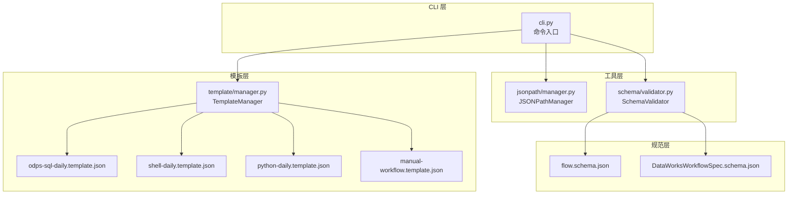
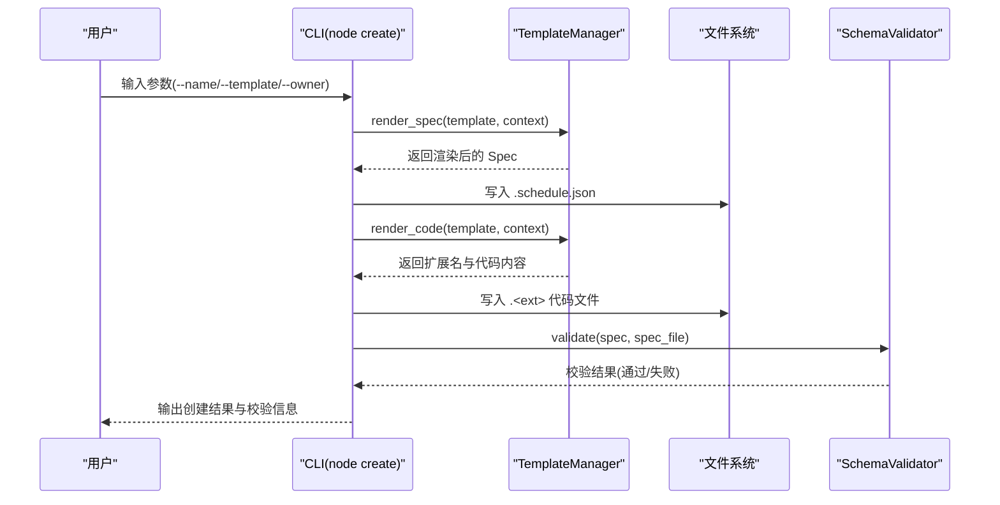
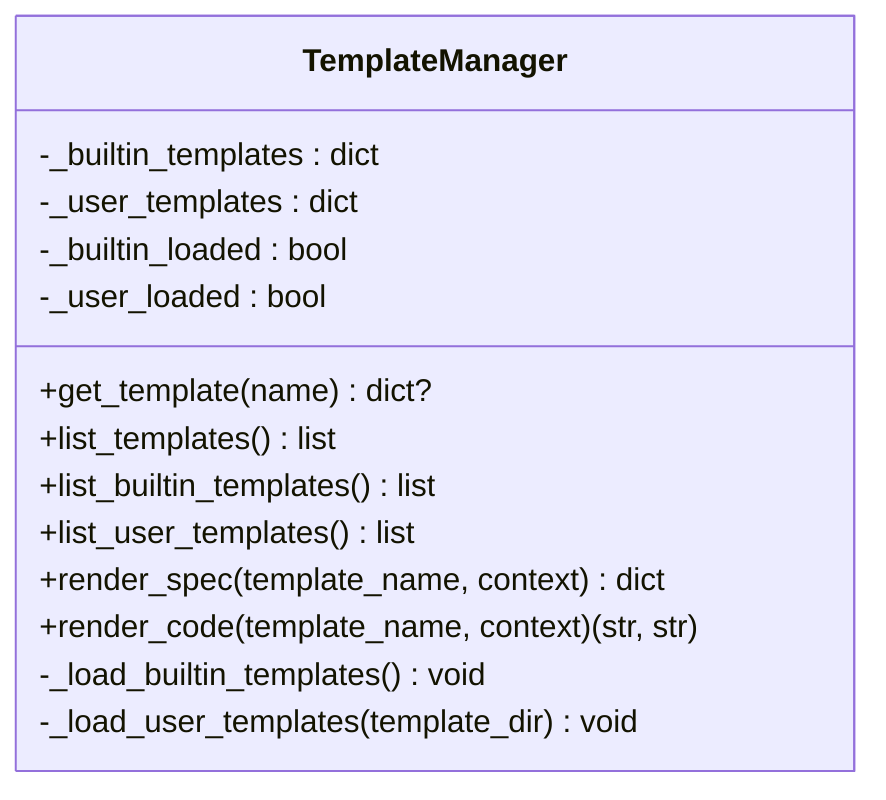
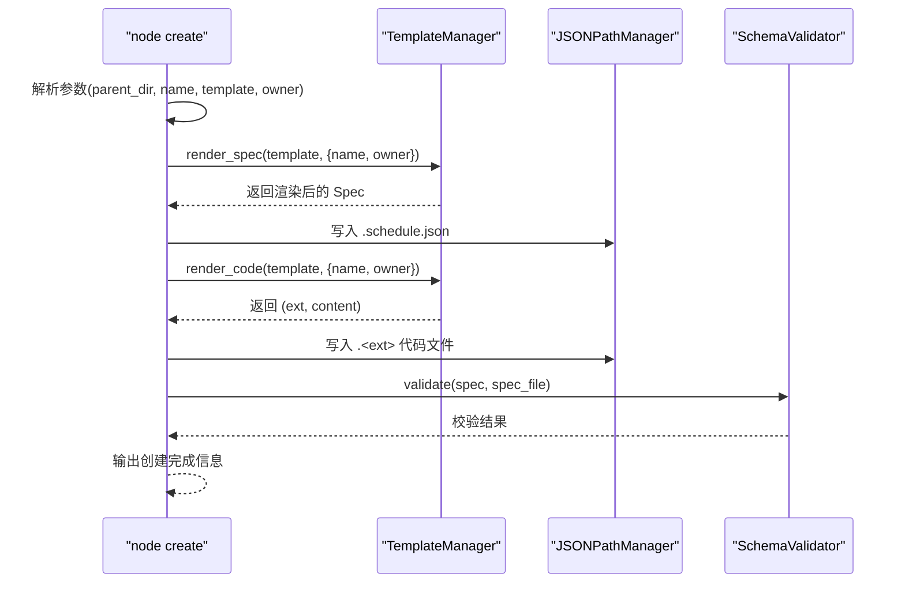
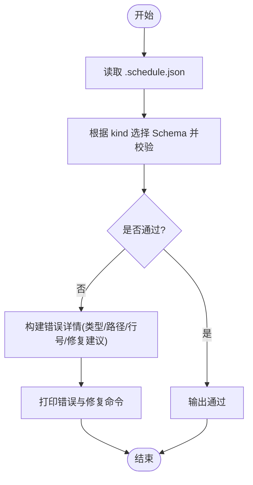
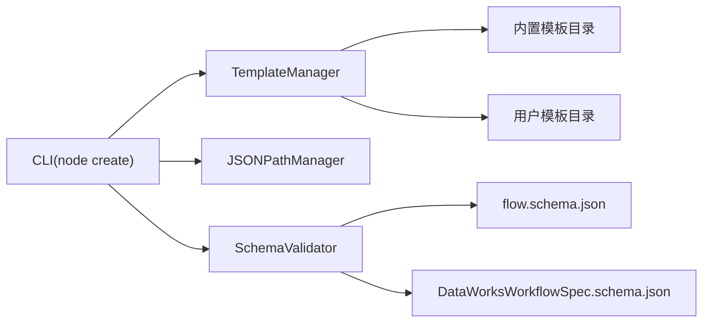

# 模板管理

<cite>
**本文引用的文件**
- [dwcli/dwcli/pkg/template/manager.py](file://dwcli/dwcli/pkg/template/manager.py)
- [dwcli/dwcli/cli.py](file://dwcli/dwcli/cli.py)
- [dwcli/dwcli/templates/odps-sql-daily.template.json](file://dwcli/dwcli/templates/odps-sql-daily.template.json)
- [dwcli/dwcli/templates/manual-workflow.template.json](file://dwcli/dwcli/templates/manual-workflow.template.json)
- [dwcli/dwcli/templates/python-daily.template.json](file://dwcli/dwcli/templates/python-daily.template.json)
- [dwcli/dwcli/templates/shell-daily.template.json](file://dwcli/dwcli/templates/shell-daily.template.json)
- [dwcli/dwcli/pkg/jsonpath/manager.py](file://dwcli/dwcli/pkg/jsonpath/manager.py)
- [dwcli/dwcli/pkg/schema/validator.py](file://dwcli/dwcli/pkg/schema/validator.py)
- [schema/flow.schema.json](file://schema/flow.schema.json)
- [spec/src/main/resources/spec/schema/DataWorksWorkflowSpec.schema.json](file://spec/src/main/resources/spec/schema/DataWorksWorkflowSpec.schema.json)
- [dwcli/docs/TEMPLATE_GUIDE.md](file://dwcli/docs/TEMPLATE_GUIDE.md)
- [dwcli/docs/USER_GUIDE.md](file://dwcli/docs/USER_GUIDE.md)
- [dwcli/tests/test_template.py](file://dwcli/tests/test_template.py)
</cite>

## 目录
1. [简介](#简介)
2. [项目结构](#项目结构)
3. [核心组件](#核心组件)
4. [架构总览](#架构总览)
5. [详细组件分析](#详细组件分析)
6. [依赖分析](#依赖分析)
7. [性能考虑](#性能考虑)
8. [故障排查指南](#故障排查指南)
9. [结论](#结论)
10. [附录](#附录)

## 简介
本文件围绕 DataWorks 规范下的模板管理能力展开，重点说明 dwcli 中 template/manager.py 如何实现模板的加载、解析与实例化，以及与 JSON 模板文件的交互机制；同时梳理 odps-sql-daily.template.json 等模板文件的结构设计（工作流定义、节点配置、调度策略等），并提供使用模板创建新工作流的完整流程与最佳实践，帮助读者快速构建符合 DataWorksWorkflowSpec 标准的工作流。

## 项目结构
模板管理相关的核心文件分布如下：
- 模板加载与渲染：dwcli/dwcli/pkg/template/manager.py
- CLI 入口与模板使用：dwcli/dwcli/cli.py
- 内置模板样例：dwcli/dwcli/templates/*.template.json
- JSONPath 管理与 Schema 校验：dwcli/dwcli/pkg/jsonpath/manager.py、dwcli/dwcli/pkg/schema/validator.py
- 规范 Schema：schema/flow.schema.json、spec/src/main/resources/spec/schema/DataWorksWorkflowSpec.schema.json
- 文档与测试：dwcli/docs/TEMPLATE_GUIDE.md、dwcli/docs/USER_GUIDE.md、dwcli/tests/test_template.py

图表来源
- [dwcli/dwcli/cli.py](file://dwcli/dwcli/cli.py#L22-L66)
- [dwcli/dwcli/pkg/template/manager.py](file://dwcli/dwcli/pkg/template/manager.py#L1-L123)
- [dwcli/dwcli/templates/odps-sql-daily.template.json](file://dwcli/dwcli/templates/odps-sql-daily.template.json#L1-L28)
- [dwcli/dwcli/templates/shell-daily.template.json](file://dwcli/dwcli/templates/shell-daily.template.json#L1-L29)
- [dwcli/dwcli/templates/python-daily.template.json](file://dwcli/dwcli/templates/python-daily.template.json#L1-L29)
- [dwcli/dwcli/templates/manual-workflow.template.json](file://dwcli/dwcli/templates/manual-workflow.template.json#L1-L28)
- [dwcli/dwcli/pkg/jsonpath/manager.py](file://dwcli/dwcli/pkg/jsonpath/manager.py#L1-L153)
- [dwcli/dwcli/pkg/schema/validator.py](file://dwcli/dwcli/pkg/schema/validator.py#L1-L231)
- [schema/flow.schema.json](file://schema/flow.schema.json#L1-L202)
- [spec/src/main/resources/spec/schema/DataWorksWorkflowSpec.schema.json](file://spec/src/main/resources/spec/schema/DataWorksWorkflowSpec.schema.json#L1-L119)

章节来源
- [dwcli/dwcli/pkg/template/manager.py](file://dwcli/dwcli/pkg/template/manager.py#L1-L123)
- [dwcli/dwcli/cli.py](file://dwcli/dwcli/cli.py#L22-L66)

## 核心组件
- TemplateManager：负责内置与用户模板的加载、模板列表查询、模板渲染（工作流 Spec 渲染与代码模板渲染）。
- CLI node create：通过 TemplateManager 渲染模板，生成工作流 Spec 与代码文件，并进行 Schema 校验。
- JSONPathManager：提供 JSONPath 读写、赋值、删除等能力，支撑对生成的 Spec 进行后续编辑。
- SchemaValidator：基于 JSON Schema 对 Spec 进行校验，输出错误类型、路径、行号及修复建议。

章节来源
- [dwcli/dwcli/pkg/template/manager.py](file://dwcli/dwcli/pkg/template/manager.py#L1-L123)
- [dwcli/dwcli/cli.py](file://dwcli/dwcli/cli.py#L22-L66)
- [dwcli/dwcli/pkg/jsonpath/manager.py](file://dwcli/dwcli/pkg/jsonpath/manager.py#L1-L153)
- [dwcli/dwcli/pkg/schema/validator.py](file://dwcli/dwcli/pkg/schema/validator.py#L1-L231)

## 架构总览
模板管理的端到端流程如下：
1. CLI 接收用户输入（父目录、对象名、模板名、所有者等）。
2. TemplateManager 加载模板（内置与用户），根据上下文渲染 Spec 与代码。
3. CLI 将渲染结果写入目标目录，生成 .schedule.json 与对应扩展名的代码文件。
4. SchemaValidator 基于 Spec 的 kind 自动匹配 Schema 并执行校验，输出错误与修复建议。

图表来源
- [dwcli/dwcli/cli.py](file://dwcli/dwcli/cli.py#L22-L66)
- [dwcli/dwcli/pkg/template/manager.py](file://dwcli/dwcli/pkg/template/manager.py#L100-L123)
- [dwcli/dwcli/pkg/schema/validator.py](file://dwcli/dwcli/pkg/schema/validator.py#L61-L83)

## 详细组件分析

### TemplateManager 组件分析
TemplateManager 的职责包括：
- 内置模板与用户模板的加载与缓存
- 模板列表查询（内置/用户/合并）
- 模板渲染：将 spec 字段按 Jinja2 模板引擎渲染；将 code.content 按模板渲染并返回扩展名与内容

图表来源
- [dwcli/dwcli/pkg/template/manager.py](file://dwcli/dwcli/pkg/template/manager.py#L1-L123)

章节来源
- [dwcli/dwcli/pkg/template/manager.py](file://dwcli/dwcli/pkg/template/manager.py#L1-L123)

### CLI node create 命令与模板交互
- 命令行为：创建对象目录，生成 .schedule.json 与代码文件。
- 关键步骤：构造上下文（name、owner），调用 TemplateManager 渲染 Spec 与代码，随后进行 Schema 校验。

图表来源
- [dwcli/dwcli/cli.py](file://dwcli/dwcli/cli.py#L22-L66)
- [dwcli/dwcli/pkg/template/manager.py](file://dwcli/dwcli/pkg/template/manager.py#L100-L123)
- [dwcli/dwcli/pkg/jsonpath/manager.py](file://dwcli/dwcli/pkg/jsonpath/manager.py#L12-L23)
- [dwcli/dwcli/pkg/schema/validator.py](file://dwcli/dwcli/pkg/schema/validator.py#L61-L83)

章节来源
- [dwcli/dwcli/cli.py](file://dwcli/dwcli/cli.py#L22-L66)

### JSONPathManager 与 SchemaValidator
- JSONPathManager：提供读取、写入、按 JSONPath 设置/删除值的能力，支持类型推断与显式类型转换。
- SchemaValidator：自动根据 Spec 的 kind 选择 Schema，执行校验并输出错误详情与修复建议。

图表来源
- [dwcli/dwcli/pkg/jsonpath/manager.py](file://dwcli/dwcli/pkg/jsonpath/manager.py#L12-L153)
- [dwcli/dwcli/pkg/schema/validator.py](file://dwcli/dwcli/pkg/schema/validator.py#L61-L231)

章节来源
- [dwcli/dwcli/pkg/jsonpath/manager.py](file://dwcli/dwcli/pkg/jsonpath/manager.py#L1-L153)
- [dwcli/dwcli/pkg/schema/validator.py](file://dwcli/dwcli/pkg/schema/validator.py#L1-L231)

### 模板文件结构与字段说明
以内置模板为例，模板文件包含两个顶层字段：
- spec：工作流 Spec 的完整结构，包含 version、kind、metadata、spec.nodes、spec.flow 等。
- code：代码模板定义，包含 extension（扩展名）与 content（模板内容）。

以 odps-sql-daily.template.json 为例：
- kind：CycleWorkflow（周期调度）
- metadata.name：使用 {{ name }} 变量
- metadata.owner：使用 {{ owner | default('admin') }} 提供默认值
- nodes：包含一个 ODPS_SQL 类型节点，脚本路径为 {{ name }}.sql
- code：扩展名为 sql，content 为模板字符串

其他模板（shell-daily、python-daily、manual-workflow）遵循相同结构，仅节点类型与默认脚本扩展不同。

章节来源
- [dwcli/dwcli/templates/odps-sql-daily.template.json](file://dwcli/dwcli/templates/odps-sql-daily.template.json#L1-L28)
- [dwcli/dwcli/templates/shell-daily.template.json](file://dwcli/dwcli/templates/shell-daily.template.json#L1-L29)
- [dwcli/dwcli/templates/python-daily.template.json](file://dwcli/dwcli/templates/python-daily.template.json#L1-L29)
- [dwcli/dwcli/templates/manual-workflow.template.json](file://dwcli/dwcli/templates/manual-workflow.template.json#L1-L28)

### 与 DataWorksWorkflowSpec 的集成
- flow.schema.json 定义了 Flow 的通用规范，包含 kind（CycleWorkflow、ManualWorkflow）、metadata、spec.nodes、spec.flow 等字段。
- DataWorksWorkflowSpec.schema.json 定义了更细粒度的 DataWorksWorkflowSpec 字段（如 triggers、scripts、nodes、flow 等），用于更高层级的规范。
- CLI 在创建后会调用 SchemaValidator 对生成的 Spec 进行校验，确保生成的工作流符合规范。

章节来源
- [schema/flow.schema.json](file://schema/flow.schema.json#L1-L202)
- [spec/src/main/resources/spec/schema/DataWorksWorkflowSpec.schema.json](file://spec/src/main/resources/spec/schema/DataWorksWorkflowSpec.schema.json#L1-L119)
- [dwcli/dwcli/pkg/schema/validator.py](file://dwcli/dwcli/pkg/schema/validator.py#L61-L83)

### 使用模板创建新工作流的完整流程（无代码示例）
- 步骤1：准备父目录与对象名，选择模板（如 odps-sql-daily）。
- 步骤2：CLI 调用 TemplateManager 渲染 Spec，写入 .schedule.json。
- 步骤3：CLI 调用 TemplateManager 渲染代码模板，写入 .sql 文件。
- 步骤4：CLI 调用 SchemaValidator 校验生成的 Spec，输出校验结果。
- 步骤5：如需调整，使用 JSONPathManager 的 set/unset/inspect 命令进行修改与验证。

章节来源
- [dwcli/dwcli/cli.py](file://dwcli/dwcli/cli.py#L22-L66)
- [dwcli/dwcli/pkg/template/manager.py](file://dwcli/dwcli/pkg/template/manager.py#L100-L123)
- [dwcli/dwcli/pkg/jsonpath/manager.py](file://dwcli/dwcli/pkg/jsonpath/manager.py#L12-L153)
- [dwcli/dwcli/pkg/schema/validator.py](file://dwcli/dwcli/pkg/schema/validator.py#L61-L83)

### 变量替换与参数化配置
- 模板中使用 Jinja2 变量（如 {{ name }}、{{ owner | default('admin') }}）进行参数化。
- CLI 传入上下文（name、owner），TemplateManager 渲染后写入 Spec 与代码文件。
- 测试用例验证了渲染结果与默认值行为。

章节来源
- [dwcli/dwcli/pkg/template/manager.py](file://dwcli/dwcli/pkg/template/manager.py#L100-L123)
- [dwcli/tests/test_template.py](file://dwcli/tests/test_template.py#L1-L81)

### 模板设计最佳实践
- 命名规范：使用 <engine>-<schedule-type> 的描述性名称（如 spark-daily、flink-streaming）。
- 必需字段：确保 spec 完整、code.extension 与 code.content 存在。
- 变量使用：始终使用 {{ name }} 作为主标识，为 {{ owner }} 提供默认值；在代码模板中添加注释与 TODO 标记。
- 节点类型与默认值：设置正确的 type、合理的 timeout、必要时包含 runtime 配置。
- 测试模板：创建测试节点并验证生成的 .schedule.json 与代码文件。

章节来源
- [dwcli/docs/TEMPLATE_GUIDE.md](file://dwcli/docs/TEMPLATE_GUIDE.md#L170-L200)
- [dwcli/docs/TEMPLATE_GUIDE.md](file://dwcli/docs/TEMPLATE_GUIDE.md#L214-L246)

## 依赖分析
- TemplateManager 依赖：
  - 内置模板目录（dwcli/templates/*.template.json）
  - 用户模板目录（~/.config/dwcli/templates/*.template.json）
  - Jinja2 模板引擎（用于渲染）
- CLI 依赖 TemplateManager、JSONPathManager、SchemaValidator
- SchemaValidator 依赖 JSON Schema（flow.schema.json、DataWorksWorkflowSpec.schema.json）

图表来源
- [dwcli/dwcli/pkg/template/manager.py](file://dwcli/dwcli/pkg/template/manager.py#L1-L123)
- [dwcli/dwcli/cli.py](file://dwcli/dwcli/cli.py#L22-L66)
- [dwcli/dwcli/pkg/schema/validator.py](file://dwcli/dwcli/pkg/schema/validator.py#L1-L231)
- [schema/flow.schema.json](file://schema/flow.schema.json#L1-L202)
- [spec/src/main/resources/spec/schema/DataWorksWorkflowSpec.schema.json](file://spec/src/main/resources/spec/schema/DataWorksWorkflowSpec.schema.json#L1-L119)

章节来源
- [dwcli/dwcli/pkg/template/manager.py](file://dwcli/dwcli/pkg/template/manager.py#L1-L123)
- [dwcli/dwcli/cli.py](file://dwcli/dwcli/cli.py#L22-L66)
- [dwcli/dwcli/pkg/schema/validator.py](file://dwcli/dwcli/pkg/schema/validator.py#L1-L231)

## 性能考虑
- 模板加载采用惰性加载与内存缓存，避免重复 IO 与解析。
- 渲染阶段使用内存字符串与 JSON 序列化，复杂度与模板大小线性相关。
- CLI 在创建后立即进行 Schema 校验，避免后续大量无效操作。

[本节为通用指导，不涉及具体文件分析]

## 故障排查指南
- 模板未找到：检查模板名是否存在于内置或用户模板中；确认文件命名与扩展名正确。
- 渲染失败：检查模板中变量是否在上下文中提供；确认 owner 默认值过滤器使用正确。
- 校验失败：根据 SchemaValidator 输出的错误类型、路径、行号与修复建议进行修正。
- JSONPath 操作异常：检查路径格式、数组索引与类型转换；使用 dry-run 预览变更。

章节来源
- [dwcli/dwcli/pkg/template/manager.py](file://dwcli/dwcli/pkg/template/manager.py#L100-L123)
- [dwcli/dwcli/pkg/schema/validator.py](file://dwcli/dwcli/pkg/schema/validator.py#L61-L231)
- [dwcli/dwcli/pkg/jsonpath/manager.py](file://dwcli/dwcli/pkg/jsonpath/manager.py#L12-L153)
- [dwcli/docs/USER_GUIDE.md](file://dwcli/docs/USER_GUIDE.md#L400-L423)

## 结论
TemplateManager 通过文件化的模板机制，结合 Jinja2 渲染与 CLI 工作流，实现了模板的高效加载、参数化渲染与标准化输出。配合 JSONPath 与 Schema 校验，能够确保生成的工作流既可复用又符合 DataWorksWorkflowSpec 标准。通过内置模板与用户模板的组合，团队可以快速建立可共享、可演进的模板体系。

[本节为总结性内容，不涉及具体文件分析]

## 附录
- 模板目录结构与文档参考：
  - [TEMPLATE_GUIDE.md](file://dwcli/docs/TEMPLATE_GUIDE.md#L1-L246)
  - [USER_GUIDE.md](file://dwcli/docs/USER_GUIDE.md#L1-L423)
- 测试用例参考：
  - [test_template.py](file://dwcli/tests/test_template.py#L1-L81)