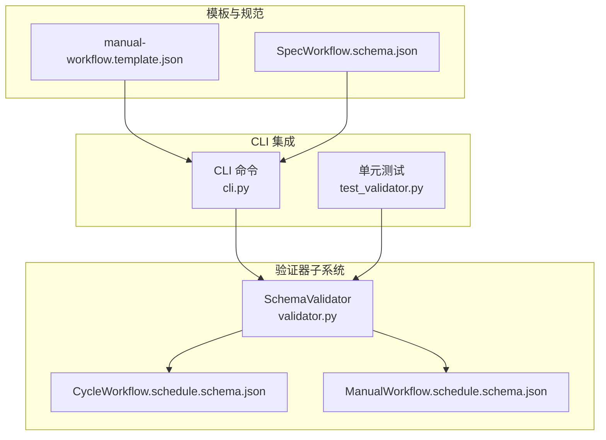
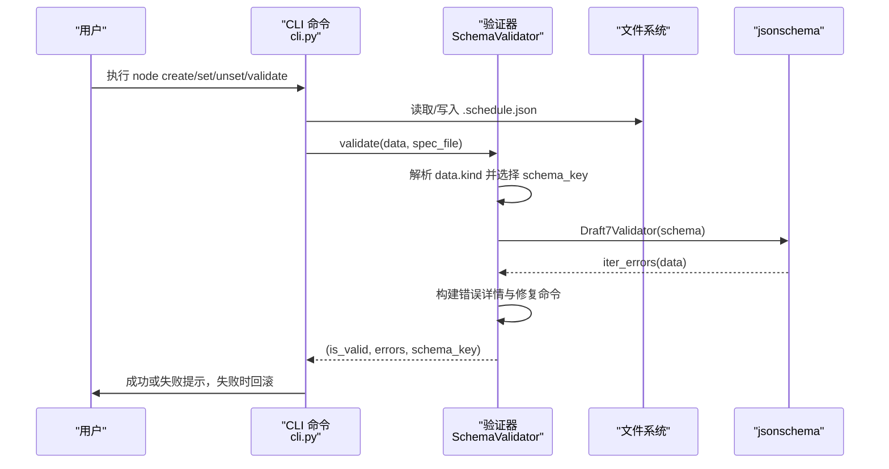
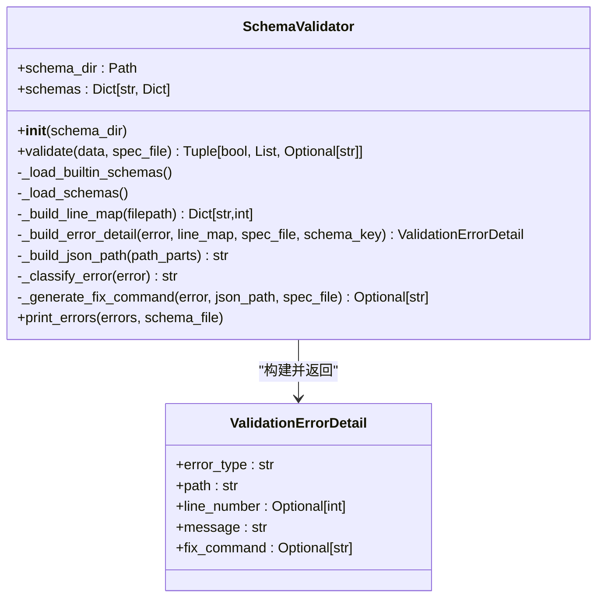
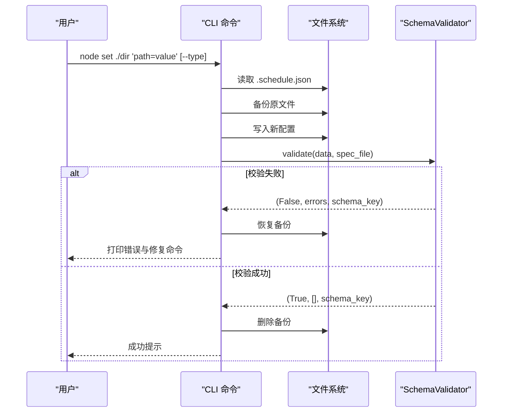
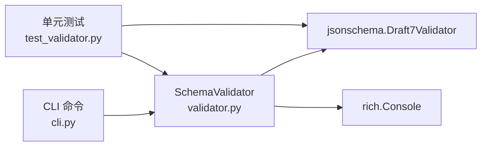
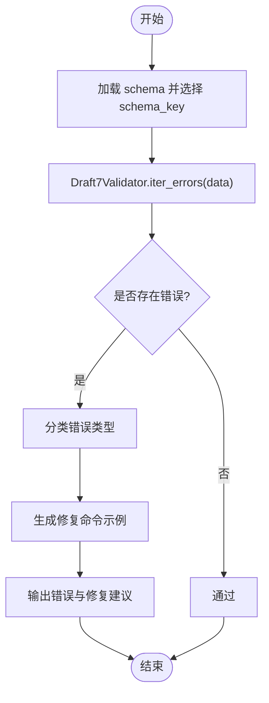

# 验证器

<cite>
**本文引用的文件**
- [validator.py](file://dwcli/dwcli/pkg/schema/validator.py)
- [CycleWorkflow.schedule.schema.json](file://dwcli/dwcli/schemas/CycleWorkflow.schedule.schema.json)
- [ManualWorkflow.schedule.schema.json](file://dwcli/dwcli/schemas/ManualWorkflow.schedule.schema.json)
- [cli.py](file://dwcli/dwcli/cli.py)
- [test_validator.py](file://dwcli/tests/test_validator.py)
- [SCHEMA_CONFIGURATION.md](file://dwcli/docs/SCHEMA_CONFIGURATION.md)
- [README.md](file://dwcli/dwcli/schemas/README.md)
- [manual-workflow.template.json](file://dwcli/dwcli/templates/manual-workflow.template.json)
- [SpecWorkflow.schema.json](file://spec/src/main/resources/spec/schema/SpecWorkflow.schema.json)
</cite>

## 目录
1. [简介](#简介)
2. [项目结构](#项目结构)
3. [核心组件](#核心组件)
4. [架构总览](#架构总览)
5. [详细组件分析](#详细组件分析)
6. [依赖关系分析](#依赖关系分析)
7. [性能考量](#性能考量)
8. [故障排除指南](#故障排除指南)
9. [结论](#结论)
10. [附录](#附录)

## 简介
本文件系统性阐述验证器功能，重点围绕 dwcli 中的 SchemaValidator 如何基于 JSON Schema 对工作流定义进行结构与语义验证，以及如何通过 CycleWorkflow.schedule.schema.json 和 ManualWorkflow.schedule.schema.json 两个核心模式文件实现对工作流类型、调度配置与节点属性的约束。文档同时提供验证器使用示例、常见错误类型与定位方法、与 Spec 规范的协同机制，以及扩展自定义验证规则的方法。

## 项目结构
验证器位于 dwcli 子模块中，核心文件包括：
- 验证器实现：dwcli/dwcli/pkg/schema/validator.py
- 核心模式文件：CycleWorkflow.schedule.schema.json、ManualWorkflow.schedule.schema.json
- CLI 集成：dwcli/dwcli/cli.py
- 单元测试：dwcli/tests/test_validator.py
- 使用说明与示例：dwcli/docs/SCHEMA_CONFIGURATION.md、dwcli/dwcli/schemas/README.md
- 模板示例：dwcli/dwcli/templates/manual-workflow.template.json
- 规范参考：spec/src/main/resources/spec/schema/SpecWorkflow.schema.json

图表来源
- [validator.py](file://dwcli/dwcli/pkg/schema/validator.py#L1-L231)
- [CycleWorkflow.schedule.schema.json](file://dwcli/dwcli/schemas/CycleWorkflow.schedule.schema.json#L1-L136)
- [ManualWorkflow.schedule.schema.json](file://dwcli/dwcli/schemas/ManualWorkflow.schedule.schema.json#L1-L103)
- [cli.py](file://dwcli/dwcli/cli.py#L1-L312)
- [test_validator.py](file://dwcli/tests/test_validator.py#L1-L165)
- [manual-workflow.template.json](file://dwcli/dwcli/templates/manual-workflow.template.json#L1-L28)
- [SpecWorkflow.schema.json](file://spec/src/main/resources/spec/schema/SpecWorkflow.schema.json#L1-L57)

章节来源
- [validator.py](file://dwcli/dwcli/pkg/schema/validator.py#L1-L231)
- [cli.py](file://dwcli/dwcli/cli.py#L1-L312)

## 核心组件
- SchemaValidator：负责加载内置与用户自定义的 JSON Schema，执行校验，构建错误详情与修复建议，并输出可读的错误报告。
- CycleWorkflow.schedule.schema.json：约束周期调度工作流的结构与字段，包括版本、类型、元数据、节点、依赖与触发器等。
- ManualWorkflow.schedule.schema.json：约束手动触发工作流的结构与字段，与周期版类似但不含定时触发器。
- CLI 集成：在节点创建、设置、取消、验证等命令中自动触发验证，失败时回滚并打印错误与修复建议。
- 单元测试：覆盖加载、类型错误、缺失字段、枚举错误、行号映射与修复命令生成等场景。

章节来源
- [validator.py](file://dwcli/dwcli/pkg/schema/validator.py#L1-L231)
- [CycleWorkflow.schedule.schema.json](file://dwcli/dwcli/schemas/CycleWorkflow.schedule.schema.json#L1-L136)
- [ManualWorkflow.schedule.schema.json](file://dwcli/dwcli/schemas/ManualWorkflow.schedule.schema.json#L1-L103)
- [cli.py](file://dwcli/dwcli/cli.py#L1-L312)
- [test_validator.py](file://dwcli/tests/test_validator.py#L1-L165)

## 架构总览
验证器采用“模式驱动”的架构：SchemaValidator 从内置与用户配置目录加载 JSON Schema，按数据中的 kind 选择对应模式，使用 jsonschema 的 Draft7Validator 迭代校验，再将错误转换为人类可读的明细与修复建议。CLI 在关键操作前后调用验证器，确保工作流定义始终满足约束。

图表来源
- [cli.py](file://dwcli/dwcli/cli.py#L1-L312)
- [validator.py](file://dwcli/dwcli/pkg/schema/validator.py#L61-L131)

## 详细组件分析

### 组件一：SchemaValidator 类
- 加载策略
  - 内置模式：从包内 schemas 目录加载，键名由文件名去除 .schema 后缀得到。
  - 用户模式：从用户配置目录 ~/.config/dwcli/schemas 加载，优先级高于内置。
- 校验流程
  - 依据 data['kind'] 生成 schema_key（优先尝试 "<kind>.schedule"），若未找到则回退到 "<kind>"；若仍不存在则跳过校验。
  - 使用 Draft7Validator 对数据进行迭代校验，收集所有错误。
  - 构建 JSON Path、行号映射、错误分类与修复命令。
- 错误分类
  - 类型不匹配、缺少必填字段、枚举值无效、正则不匹配、长度/范围约束违反等。
- 修复建议
  - 基于错误类型生成 dwcli node set 命令示例，包含路径与类型提示，便于快速修正。

图表来源
- [validator.py](file://dwcli/dwcli/pkg/schema/validator.py#L1-L231)

章节来源
- [validator.py](file://dwcli/dwcli/pkg/schema/validator.py#L1-L231)

### 组件二：CycleWorkflow.schedule.schema.json
- 顶层约束
  - 必填字段：version、kind、spec
  - kind 限定为 "CycleWorkflow"
  - version 支持主次版本号格式
- metadata
  - name、owner、description 等基础元信息
- spec.nodes
  - 节点数组，每个节点至少包含 id、name、type
  - type 枚举覆盖多种计算引擎与虚拟节点
  - timeout 整数秒，范围 0..86400
  - script.path 必填，runtime 可选
  - runtime.engine、memory、cores 等可选运行时参数
- flow
  - 节点依赖关系，包含 nodeId 与 depends 数组
- trigger
  - type 枚举支持 Scheduler/Manual
  - cron 支持表达式

章节来源
- [CycleWorkflow.schedule.schema.json](file://dwcli/dwcli/schemas/CycleWorkflow.schedule.schema.json#L1-L136)

### 组件三：ManualWorkflow.schedule.schema.json
- 顶层约束
  - 必填字段：version、kind、spec
  - kind 限定为 "ManualWorkflow"
  - version 支持主次版本号格式
- metadata
  - name、owner、description
- spec.nodes
  - 节点数组，每个节点至少包含 id、name、type
  - type 枚举与周期版一致
  - script.path 必填
- flow
  - 节点依赖关系，包含 nodeId 与 depends 数组

章节来源
- [ManualWorkflow.schedule.schema.json](file://dwcli/dwcli/schemas/ManualWorkflow.schedule.schema.json#L1-L103)

### 组件四：CLI 集成与自动验证
- node create：创建对象目录与 .schedule.json 后立即验证，失败打印错误并继续提示。
- node set/unset：修改前备份，验证失败则回滚并打印错误与修复命令。
- node validate：独立验证当前配置是否符合所选 schema。

图表来源
- [cli.py](file://dwcli/dwcli/cli.py#L68-L173)
- [validator.py](file://dwcli/dwcli/pkg/schema/validator.py#L61-L131)

章节来源
- [cli.py](file://dwcli/dwcli/cli.py#L1-L312)

### 组件五：单元测试与示例
- 加载自定义 schema 并参与验证
- 覆盖类型错误、缺失必填、枚举错误等典型场景
- 行号映射与修复命令生成的断言

章节来源
- [test_validator.py](file://dwcli/tests/test_validator.py#L1-L165)

### 组件六：使用说明与示例
- dwcli/docs/SCHEMA_CONFIGURATION.md 提供了完整的使用示例与常见错误类型说明。
- dwcli/dwcli/schemas/README.md 展示了内置模式的详细结构与约束，便于理解字段含义与范围。
- manual-workflow.template.json 提供了手动工作流的模板结构，便于对照学习。

章节来源
- [SCHEMA_CONFIGURATION.md](file://dwcli/docs/SCHEMA_CONFIGURATION.md#L43-L297)
- [README.md](file://dwcli/dwcli/schemas/README.md#L1-L563)
- [manual-workflow.template.json](file://dwcli/dwcli/templates/manual-workflow.template.json#L1-L28)

### 组件七：与 Spec 规范的协同
- SpecWorkflow.schema.json 描述了更高层的工作流规范（如脚本、触发器、输入输出、策略等），与 schedule 层的 JSON Schema 形成互补：前者关注领域模型与引用关系，后者聚焦配置层面的结构与约束。
- 在实际使用中，先以 schedule schema 确保配置合法，再结合 Spec 规范进行更广泛的模型一致性检查。

章节来源
- [SpecWorkflow.schema.json](file://spec/src/main/resources/spec/schema/SpecWorkflow.schema.json#L1-L57)

## 依赖关系分析
- 内部依赖
  - SchemaValidator 依赖 jsonschema.Draft7Validator 进行模式校验。
  - CLI 通过 SchemaValidator 实现自动验证与回滚。
  - 单元测试直接构造 jsonschema.ValidationError 以验证修复命令生成逻辑。
- 外部依赖
  - rich 用于美化控制台输出。
  - jsonschema 作为核心验证库。
  - pathlib 与正则表达式用于路径解析与行号映射。

图表来源
- [validator.py](file://dwcli/dwcli/pkg/schema/validator.py#L1-L231)
- [cli.py](file://dwcli/dwcli/cli.py#L1-L312)
- [test_validator.py](file://dwcli/tests/test_validator.py#L1-L165)

章节来源
- [validator.py](file://dwcli/dwcli/pkg/schema/validator.py#L1-L231)
- [cli.py](file://dwcli/dwcli/cli.py#L1-L312)
- [test_validator.py](file://dwcli/tests/test_validator.py#L1-L165)

## 性能考量
- 模式加载
  - 内置与用户模式均一次性加载至内存字典，后续校验直接命中，避免重复 IO。
- 校验过程
  - 使用 Draft7Validator.iter_errors 迭代收集所有错误，适合交互式 CLI 场景。
- 行号映射
  - 通过逐行扫描与缩进推导构建路径映射，复杂度与文件大小线性相关，通常开销较小。
- 建议
  - 对大型工作流配置，尽量保持 schema 精简与合理分层，减少不必要的嵌套与冗余约束。

## 故障排除指南
- 常见错误类型与定位
  - 类型不匹配：timeout 应为整数，实际为字符串或负数；通过最小/最大值约束与类型声明发现。
  - 缺少必填字段：如 spec.nodes、script.path、type 等；由 required 约束触发。
  - 枚举值无效：kind 或 type 不在允许集合；由 enum 约束触发。
  - 正则不匹配：version、cron、脚本路径等不符合 pattern；由 pattern 约束触发。
  - 长度/范围约束违反：name、description、timeout 超出 minLength/maxLength 或 minimum/maximum。
- 定位方法
  - 利用 SchemaValidator 的行号映射，将 JSON Path 映射到源文件行号，快速定位问题字段。
  - 查看错误类型与消息，结合修复命令示例快速修正。
- 回滚机制
  - CLI 在 set/unset 失败时自动恢复备份，避免污染配置文件。

章节来源
- [validator.py](file://dwcli/dwcli/pkg/schema/validator.py#L112-L208)
- [cli.py](file://dwcli/dwcli/cli.py#L68-L173)
- [SCHEMA_CONFIGURATION.md](file://dwcli/docs/SCHEMA_CONFIGURATION.md#L235-L246)

## 结论
验证器通过 JSON Schema 将工作流配置的结构与语义约束显式化，配合 CLI 的自动验证与回滚机制，显著提升了配置的正确性与一致性。CycleWorkflow.schedule.schema.json 与 ManualWorkflow.schedule.schema.json 分别覆盖了周期调度与手动触发两类工作流的关键字段与约束，结合 Spec 规范可实现从配置到模型的双重保障。通过自定义 schema，团队可以进一步细化组织级约束，形成标准化的配置治理能力。

## 附录

### 使用示例与最佳实践
- 自动验证
  - 创建节点后自动验证生成的配置。
  - 修改配置后自动验证，失败回滚并提示修复命令。
- 手动验证
  - 使用 node validate 对现有配置进行全面检查。
- 自定义验证规则
  - 在 ~/.config/dwcli/schemas 下新增自定义 schema 文件，文件命名遵循 "<Kind>.schedule.schema.json"，即可被 SchemaValidator 自动加载并应用。

章节来源
- [cli.py](file://dwcli/dwcli/cli.py#L213-L233)
- [README.md](file://dwcli/dwcli/schemas/README.md#L441-L470)
- [SCHEMA_CONFIGURATION.md](file://dwcli/docs/SCHEMA_CONFIGURATION.md#L66-L93)

### 关键流程图：类型不匹配检测

图表来源
- [validator.py](file://dwcli/dwcli/pkg/schema/validator.py#L61-L131)
- [test_validator.py](file://dwcli/tests/test_validator.py#L148-L165)