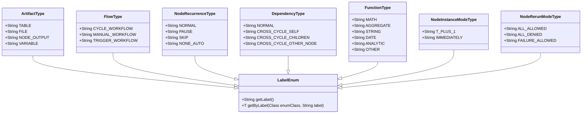
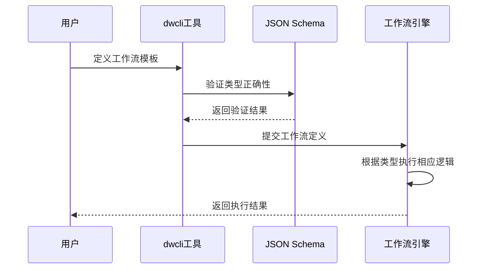
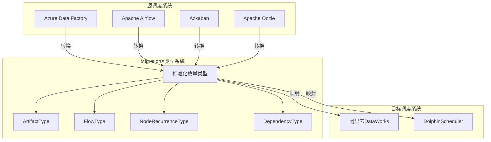

# 实体类型系统

<cite>
**本文档中引用的文件**  
- [ArtifactType.java](file://spec/src/main/java/com/aliyun/dataworks/common/spec/domain/enums/ArtifactType.java)
- [FlowType.java](file://spec/src/main/java/com/aliyun/dataworks/common/spec/domain/enums/FlowType.java)
- [NodeRecurrenceType.java](file://spec/src/main/java/com/aliyun/dataworks/common/spec/domain/enums/NodeRecurrenceType.java)
- [DependencyType.java](file://spec/src/main/java/com/aliyun/dataworks/common/spec/domain/enums/DependencyType.java)
- [FunctionType.java](file://spec/src/main/java/com/aliyun/dataworks/common/spec/domain/enums/FunctionType.java)
- [NodeInstanceModeType.java](file://spec/src/main/java/com/aliyun/dataworks/common/spec/domain/enums/NodeInstanceModeType.java)
- [NodeRerunModeType.java](file://spec/src/main/java/com/aliyun/dataworks/common/spec/domain/enums/NodeRerunModeType.java)
- [LabelEnum.java](file://spec/src/main/java/com/aliyun/dataworks/common/spec/domain/interfaces/LabelEnum.java)
- [CycleType.java](file://spec/src/main/java/com/aliyun/dataworks/common/spec/domain/enums/CycleType.java)
- [FailureStrategy.java](file://spec/src/main/java/com/aliyun/dataworks/common/spec/domain/enums/FailureStrategy.java)
- [PriorityWeightStrategy.java](file://spec/src/main/java/com/aliyun/dataworks/common/spec/domain/enums/PriorityWeightStrategy.java)
- [SourceType.java](file://spec/src/main/java/com/aliyun/dataworks/common/spec/domain/enums/SourceType.java)
- [SpecKind.java](file://spec/src/main/java/com/aliyun/dataworks/common/spec/domain/enums/SpecKind.java)
- [VariableScopeType.java](file://spec/src/main/java/com/aliyun/dataworks/common/spec/domain/enums/VariableScopeType.java)
- [VariableType.java](file://spec/src/main/java/com/aliyun/dataworks/common/spec/domain/enums/VariableType.java)
- [SpecEntityType.java](file://spec/src/main/java/com/aliyun/dataworks/common/spec/domain/enums/SpecEntityType.java)
</cite>

## 目录
1. [引言](#引言)
2. [核心枚举类型详解](#核心枚举类型详解)
3. [实体类型系统架构](#实体类型系统架构)
4. [类型系统在工作流中的应用](#类型系统在工作流中的应用)
5. [跨调度系统类型映射机制](#跨调度系统类型映射机制)
6. [与dwcli工具的集成](#与dwcli工具的集成)
7. [类型错误处理与扩展实践](#类型错误处理与扩展实践)
8. [结论](#结论)

## 引言
实体类型系统是MigrationX平台的核心基础架构之一，为工作流规范定义了标准化的类型体系。该系统通过一系列精心设计的枚举类型，实现了对工件、工作流、节点调度等关键概念的精确建模。本文档全面阐述了这些枚举类型的作用、使用场景和业务含义，以及它们在模型转换、工具集成和错误处理中的重要作用。

## 核心枚举类型详解

### ArtifactType（工件类型）
ArtifactType枚举定义了工作流中各种工件的类型，是数据资产管理的基础。

**业务含义**：
- **TABLE（表）**：表示数据库或数据仓库中的表实体，用于数据存储和查询
- **FILE（文件）**：表示文件系统中的文件资源，可用于脚本、配置或数据文件
- **NODE_OUTPUT（节点输出）**：表示工作流节点执行后产生的输出结果
- **VARIABLE（变量）**：表示工作流中使用的变量，用于参数传递和状态管理

这些类型在工作流执行中决定了数据的组织形式和访问方式，是构建数据依赖关系的基础。

**Section sources**
- [ArtifactType.java](file://spec/src/main/java/com/aliyun/dataworks/common/spec/domain/enums/ArtifactType.java#L24-L43)

### FlowType（工作流类型）
FlowType枚举定义了工作流的三种主要执行模式。

**业务含义**：
- **CYCLE_WORKFLOW（周期工作流）**：按预定时间周期自动执行的工作流，适用于定时数据处理任务
- **MANUAL_WORKFLOW（手动工作流）**：需要人工触发执行的工作流，适用于临时性或审批类任务
- **TRIGGER_WORKFLOW（触发工作流）**：由特定事件触发执行的工作流，适用于实时响应场景

不同工作流类型决定了调度策略、触发机制和监控方式，在工作流执行中具有根本性影响。

**Section sources**
- [FlowType.java](file://spec/src/main/java/com/aliyun/dataworks/common/spec/domain/enums/FlowType.java#L26-L39)

### NodeRecurrenceType（节点重复类型）
NodeRecurrenceType枚举定义了节点的调度状态和执行策略。

**业务含义**：
- **NORMAL（正常）**：节点按正常调度计划执行
- **PAUSE（暂停）**：暂停节点的调度，但保留配置
- **SKIP（跳过）**：跳过本次执行，但保持后续调度
- **NONE_AUTO（非自动）**：节点不参与自动调度，需要手动触发

这些类型直接影响工作流的执行流程和调度行为，是实现灵活调度策略的关键。

**Section sources**
- [NodeRecurrenceType.java](file://spec/src/main/java/com/aliyun/dataworks/common/spec/domain/enums/NodeRecurrenceType.java#L24-L44)

### DependencyType（依赖类型）
DependencyType枚举定义了工作流节点间的依赖关系类型。

**业务含义**：
- **NORMAL（正常依赖）**：标准的前后置依赖关系
- **CROSS_CYCLE_SELF（跨周期自依赖）**：节点依赖于自身在前一个周期的执行结果
- **CROSS_CYCLE_CHILDREN（跨周期子依赖）**：节点依赖于子节点在前一个周期的执行结果
- **CROSS_CYCLE_OTHER_NODE（跨周期其他节点依赖）**：节点依赖于其他节点在前一个周期的执行结果

这些依赖类型支持复杂的数据处理场景，特别是在周期性数据处理中确保数据一致性。

**Section sources**
- [DependencyType.java](file://spec/src/main/java/com/aliyun/dataworks/common/spec/domain/enums/DependencyType.java#L24-L44)

### FunctionType（函数类型）
FunctionType枚举对工作流中使用的函数进行分类。

**业务含义**：
- **MATH（数学运算）**：数学计算函数
- **AGGREGATE（聚合）**：数据聚合函数
- **STRING（字符串处理）**：字符串操作函数
- **DATE（日期处理）**：日期时间处理函数
- **ANALYTIC（窗口函数）**：分析型窗口函数
- **OTHER（其他）**：未分类的其他函数

这种分类有助于函数管理和优化，支持智能推荐和性能分析。

**Section sources**
- [FunctionType.java](file://spec/src/main/java/com/aliyun/dataworks/common/spec/domain/enums/FunctionType.java#L24-L55)

### NodeInstanceModeType（节点实例模式类型）
NodeInstanceModeType枚举定义了节点实例的创建模式。

**业务含义**：
- **T_PLUS_1（T+1模式）**：延迟一天创建实例，适用于批处理场景
- **IMMEDIATELY（立即模式）**：实时创建实例，适用于流处理场景

这种模式选择直接影响数据处理的时效性和资源消耗。

**Section sources**
- [NodeInstanceModeType.java](file://spec/src/main/java/com/aliyun/dataworks/common/spec/domain/enums/NodeInstanceModeType.java#L24-L34)

### NodeRerunModeType（节点重跑模式类型）
NodeRerunModeType枚举定义了节点的重跑策略。

**业务含义**：
- **ALL_ALLOWED（允许重跑）**：任何情况下都允许重跑
- **ALL_DENIED（禁止重跑）**：任何情况下都禁止重跑
- **FAILURE_ALLOWED（失败允许重跑）**：仅在失败时允许重跑

这些策略对于数据质量和运维管理至关重要，防止不必要的重复计算。

**Section sources**
- [NodeRerunModeType.java](file://spec/src/main/java/com/aliyun/dataworks/common/spec/domain/enums/NodeRerunModeType.java#L24-L39)

## 实体类型系统架构

**Diagram sources**
- [LabelEnum.java](file://spec/src/main/java/com/aliyun/dataworks/common/spec/domain/interfaces/LabelEnum.java#L24-L48)
- [ArtifactType.java](file://spec/src/main/java/com/aliyun/dataworks/common/spec/domain/enums/ArtifactType.java#L24-L43)
- [FlowType.java](file://spec/src/main/java/com/aliyun/dataworks/common/spec/domain/enums/FlowType.java#L26-L39)
- [NodeRecurrenceType.java](file://spec/src/main/java/com/aliyun/dataworks/common/spec/domain/enums/NodeRecurrenceType.java#L24-L44)
- [DependencyType.java](file://spec/src/main/java/com/aliyun/dataworks/common/spec/domain/enums/DependencyType.java#L24-L44)
- [FunctionType.java](file://spec/src/main/java/com/aliyun/dataworks/common/spec/domain/enums/FunctionType.java#L24-L55)
- [NodeInstanceModeType.java](file://spec/src/main/java/com/aliyun/dataworks/common/spec/domain/enums/NodeInstanceModeType.java#L24-L34)
- [NodeRerunModeType.java](file://spec/src/main/java/com/aliyun/dataworks/common/spec/domain/enums/NodeRerunModeType.java#L24-L39)

## 类型系统在工作流中的应用

### 工作流定义中的类型使用
在工作流定义中，这些枚举类型通过JSON Schema进行约束和验证。例如，一个周期工作流的定义必须指定FlowType为CYCLE_WORKFLOW，同时其节点的NodeRecurrenceType必须与调度周期相匹配。

**Diagram sources**
- [FlowType.java](file://spec/src/main/java/com/aliyun/dataworks/common/spec/domain/enums/FlowType.java#L26-L39)
- [NodeRecurrenceType.java](file://spec/src/main/java/com/aliyun/dataworks/common/spec/domain/enums/NodeRecurrenceType.java#L24-L44)

### 类型验证流程
类型系统通过LabelEnum接口提供的getByLabel方法实现类型安全的解析和验证。当接收到工作流定义时，系统会根据标签值查找对应的枚举实例，确保类型值的合法性。

**Section sources**
- [LabelEnum.java](file://spec/src/main/java/com/aliyun/dataworks/common/spec/domain/interfaces/LabelEnum.java#L41-L47)

## 跨调度系统类型映射机制

**Diagram sources**
- [ArtifactType.java](file://spec/src/main/java/com/aliyun/dataworks/common/spec/domain/enums/ArtifactType.java#L24-L43)
- [FlowType.java](file://spec/src/main/java/com/aliyun/dataworks/common/spec/domain/enums/FlowType.java#L26-L39)
- [NodeRecurrenceType.java](file://spec/src/main/java/com/aliyun/dataworks/common/spec/domain/enums/NodeRecurrenceType.java#L24-L44)
- [DependencyType.java](file://spec/src/main/java/com/aliyun/dataworks/common/spec/domain/enums/DependencyType.java#L24-L44)

MigrationX通过标准化的实体类型系统作为中间层，实现了不同调度系统间的模型转换。每个调度系统的特有概念都被映射到标准化的枚举类型上，确保了转换的一致性和可靠性。

## 与dwcli工具的集成

### 模板验证
dwcli工具利用实体类型系统进行模板验证，确保用户定义的工作流符合规范要求。当用户创建或修改模板时，dwcli会检查所有类型字段的合法性。

### 配置生成
在配置生成过程中，dwcli根据选定的类型生成相应的配置代码，包括调度策略、依赖关系和执行模式等。

**Section sources**
- [dwcli/cli.py](file://dwcli/dwcli/cli.py)
- [dwcli/schema/validator.py](file://dwcli/dwcli/pkg/schema/validator.py)

## 类型错误处理与扩展实践

### 类型不匹配解决方案
当出现类型不匹配时，系统会抛出明确的错误信息，如"未知的枚举类型: {0}, 取值: {1}"。解决方案包括：
1. 检查枚举值的拼写和大小写
2. 确认使用的枚举类型是否适用于当前上下文
3. 验证JSON Schema定义的约束条件

### 类型转换错误处理
对于类型转换错误，建议：
1. 使用LabelEnum的getByLabel方法进行安全转换
2. 实现适当的错误处理和回退机制
3. 提供详细的错误日志和诊断信息

### 类型扩展最佳实践
当需要扩展类型系统时，应遵循以下最佳实践：
1. 继承LabelEnum接口确保类型一致性
2. 提供清晰的业务含义说明
3. 在JSON Schema中定义相应的约束
4. 更新相关文档和示例
5. 实现向后兼容的转换逻辑

**Section sources**
- [LabelEnum.java](file://spec/src/main/java/com/aliyun/dataworks/common/spec/domain/interfaces/LabelEnum.java#L24-L48)
- [i18n/zh_CN.json](file://client/migrationx/migrationx-common/src/test/resources/i18n/zh_CN.json#L2)

## 结论
实体类型系统通过一系列精心设计的枚举类型，为MigrationX平台提供了坚实的基础架构。这些类型不仅定义了工作流的核心概念，还支持跨系统模型转换、工具集成和错误处理。通过标准化的类型体系，MigrationX实现了不同调度系统间的无缝集成，为用户提供了一致的开发体验。