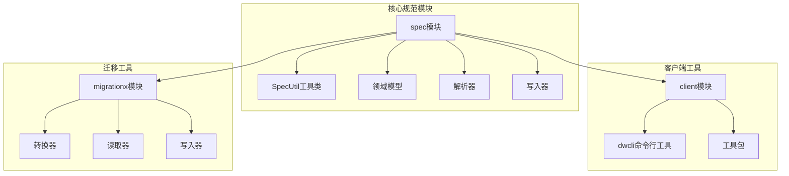
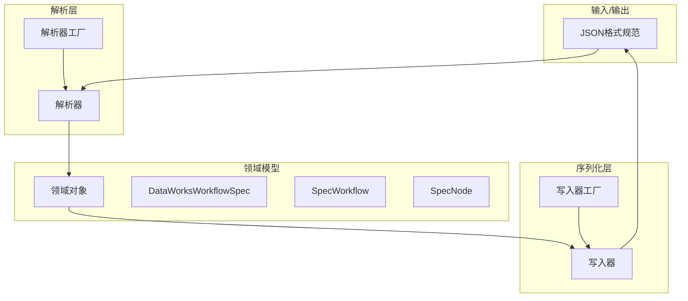
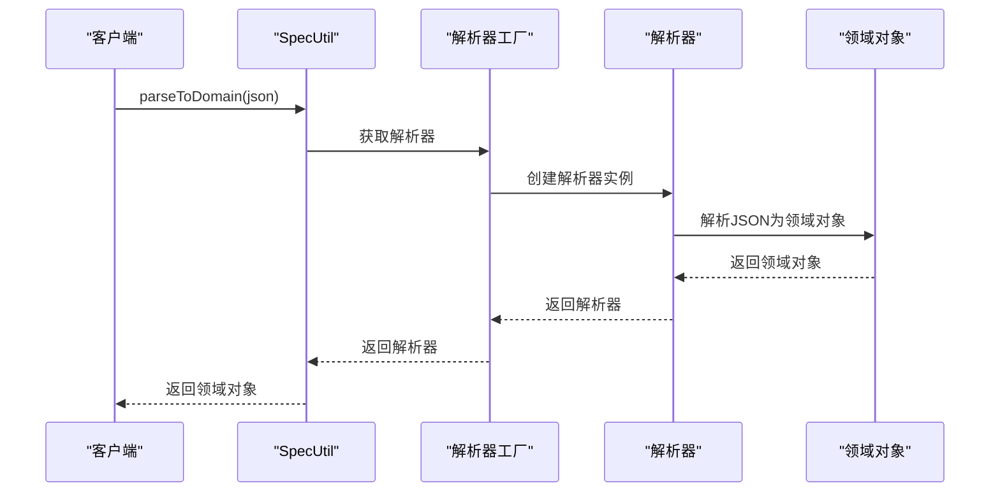
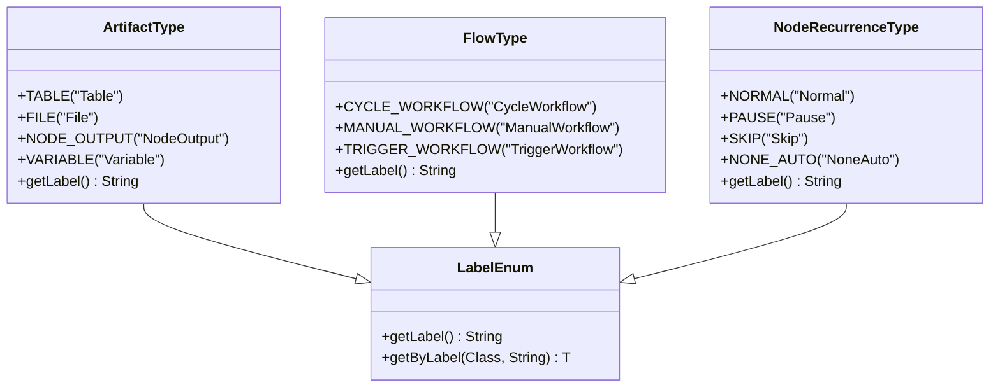
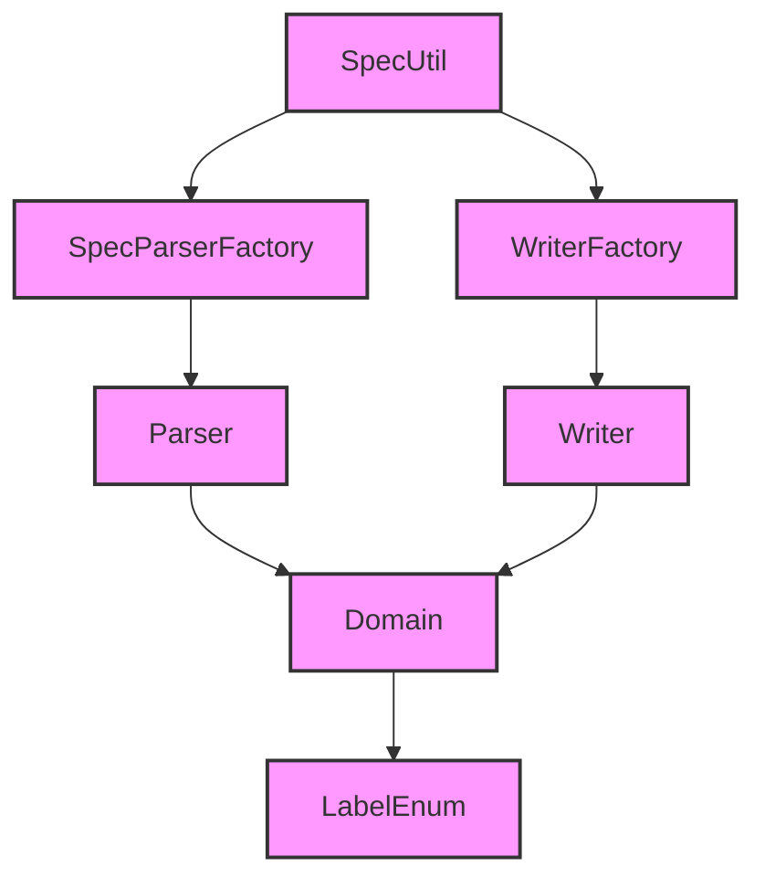

# 工作流描述规范

<cite>
**本文档中引用的文件**  
- [SpecUtil.java](file://spec/src/main/java/com/aliyun/dataworks/common/spec/SpecUtil.java)
- [ArtifactType.java](file://spec/src/main/java/com/aliyun/dataworks/common/spec/domain/enums/ArtifactType.java)
- [FlowType.java](file://spec/src/main/java/com/aliyun/dataworks/common/spec/domain/enums/FlowType.java)
- [NodeRecurrenceType.java](file://spec/src/main/java/com/aliyun/dataworks/common/spec/domain/enums/NodeRecurrenceType.java)
- [DataWorksWorkflowSpec.java](file://spec/src/main/java/com/aliyun/dataworks/common/spec/domain/DataWorksWorkflowSpec.java)
- [SpecKind.java](file://spec/src/main/java/com/aliyun/dataworks/common/spec/domain/enums/SpecKind.java)
- [SpecWorkflow.java](file://spec/src/main/java/com/aliyun/dataworks/common/spec/domain/ref/SpecWorkflow.java)
- [SpecNode.java](file://spec/src/main/java/com/aliyun/dataworks/common/spec/domain/ref/SpecNode.java)
- [SpecWorkflowParser.java](file://spec/src/main/java/com/aliyun/dataworks/common/spec/parser/impl/SpecWorkflowParser.java)
- [SpecNodeParser.java](file://spec/src/main/java/com/aliyun/dataworks/common/spec/parser/impl/SpecNodeParser.java)
- [WriterFactory.java](file://spec/src/main/java/com/aliyun/dataworks/common/spec/writer/WriterFactory.java)
- [SpecParserFactory.java](file://spec/src/main/java/com/aliyun/dataworks/common/spec/parser/SpecParserFactory.java)
</cite>

## 目录
1. [简介](#简介)
2. [项目结构](#项目结构)
3. [核心组件](#核心组件)
4. [架构概述](#架构概述)
5. [详细组件分析](#详细组件分析)
6. [依赖分析](#依赖分析)
7. [性能考虑](#性能考虑)
8. [故障排除指南](#故障排除指南)
9. [结论](#结论)

## 简介
本文档全面阐述了数据工工作流描述规范（Spec）的解析与序列化机制，详细解释了`SpecUtil.parseToDomain()`和`SpecUtil.writeToSpec()`的实现原理和使用方法。文档深入分析了实体类型系统，包括`ArtifactType`、`FlowType`、`NodeRecurrenceType`等枚举类型的作用，以及工作流类型（周期工作流、手动工作流、触发式工作流）的结构差异和应用场景。同时，系统介绍了节点类型体系，涵盖ODPS SQL、EMR Spark、Hologres同步等各类节点的模型定义。通过来自spec模块的实际代码示例，展示了如何创建、解析和验证工作流规范，并解释了该规范与其他组件（如MigrationX转换器和dwcli工具）的集成方式。

## 项目结构
本项目采用模块化设计，主要分为客户端工具、迁移工具和核心规范模块。核心规范模块（spec）定义了工作流描述的统一模型和解析机制，而客户端工具（client）和迁移工具（migrationx）则基于此规范实现具体功能。

**Diagram sources**
- [SpecUtil.java](file://spec/src/main/java/com/aliyun/dataworks/common/spec/SpecUtil.java)
- [DataWorksWorkflowSpec.java](file://spec/src/main/java/com/aliyun/dataworks/common/spec/domain/DataWorksWorkflowSpec.java)

**Section sources**
- [SpecUtil.java](file://spec/src/main/java/com/aliyun/dataworks/common/spec/SpecUtil.java)
- [DataWorksWorkflowSpec.java](file://spec/src/main/java/com/aliyun/dataworks/common/spec/domain/DataWorksWorkflowSpec.java)

## 核心组件
工作流描述规范的核心组件包括解析器（Parser）、写入器（Writer）和工具类（SpecUtil）。这些组件共同实现了工作流规范的解析、序列化和验证功能。

**Section sources**
- [SpecUtil.java](file://spec/src/main/java/com/aliyun/dataworks/common/spec/SpecUtil.java)
- [SpecParserFactory.java](file://spec/src/main/java/com/aliyun/dataworks/common/spec/parser/SpecParserFactory.java)
- [WriterFactory.java](file://spec/src/main/java/com/aliyun/dataworks/common/spec/writer/WriterFactory.java)

## 架构概述
工作流描述规范的架构设计遵循领域驱动设计（DDD）原则，将工作流的描述分为领域模型、解析层和序列化层。领域模型定义了工作流的核心概念，解析层负责将JSON格式的规范转换为领域对象，序列化层则负责将领域对象转换回JSON格式。

**Diagram sources**
- [SpecUtil.java](file://spec/src/main/java/com/aliyun/dataworks/common/spec/SpecUtil.java)
- [SpecParserFactory.java](file://spec/src/main/java/com/aliyun/dataworks/common/spec/parser/SpecParserFactory.java)
- [WriterFactory.java](file://spec/src/main/java/com/aliyun/dataworks/common/spec/writer/WriterFactory.java)

## 详细组件分析
### SpecUtil工具类分析
`SpecUtil`是工作流描述规范的核心工具类，提供了`parseToDomain()`和`writeToSpec()`两个关键方法，用于实现规范的解析和序列化。

#### 解析与序列化机制
`SpecUtil.parseToDomain()`方法将JSON字符串解析为领域对象，而`SpecUtil.writeToSpec()`方法则将领域对象序列化为格式化的JSON字符串。这两个方法通过解析器工厂和写入器工厂实现具体的解析和序列化逻辑。

**Diagram sources**
- [SpecUtil.java](file://spec/src/main/java/com/aliyun/dataworks/common/spec/SpecUtil.java)
- [SpecParserFactory.java](file://spec/src/main/java/com/aliyun/dataworks/common/spec/parser/SpecParserFactory.java)

#### 实体类型系统
工作流描述规范定义了多个枚举类型来表示不同的实体类型，包括`ArtifactType`、`FlowType`和`NodeRecurrenceType`。

**Diagram sources**
- [ArtifactType.java](file://spec/src/main/java/com/aliyun/dataworks/common/spec/domain/enums/ArtifactType.java)
- [FlowType.java](file://spec/src/main/java/com/aliyun/dataworks/common/spec/domain/enums/FlowType.java)
- [NodeRecurrenceType.java](file://spec/src/main/java/com/aliyun/dataworks/common/spec/domain/enums/NodeRecurrenceType.java)
- [LabelEnum.java](file://spec/src/main/java/com/aliyun/dataworks/common/spec/domain/interfaces/LabelEnum.java)

**Section sources**
- [ArtifactType.java](file://spec/src/main/java/com/aliyun/dataworks/common/spec/domain/enums/ArtifactType.java)
- [FlowType.java](file://spec/src/main/java/com/aliyun/dataworks/common/spec/domain/enums/FlowType.java)
- [NodeRecurrenceType.java](file://spec/src/main/java/com/aliyun/dataworks/common/spec/domain/enums/NodeRecurrenceType.java)

### 工作流类型分析
工作流描述规范支持多种工作流类型，包括周期工作流、手动工作流和触发式工作流。这些类型通过`FlowType`枚举和`SpecKind`枚举进行定义。

```mermaid
classDiagram
class FlowType {
+CYCLE_WORKFLOW("CycleWorkflow")
+MANUAL_WORKFLOW("ManualWorkflow")
+TRIGGER_WORKFLOW("TriggerWorkflow")
}
class SpecKind {
+CYCLE_WORKFLOW("CycleWorkflow")
+MANUAL_WORKFLOW("ManualWorkflow")
+TRIGGER_WORKFLOW("TriggerWorkflow")
+MANUAL_NODE("ManualNode")
+TEMPORARY_WORKFLOW("TemporaryWorkflow")
+PAIFLOW("PaiFlow")
}
class DataWorksWorkflowSpec {
+name String
+type String
+strategy SpecScheduleStrategy
+owner String
+description String
+variables List<SpecVariable>
+triggers List<SpecTrigger>
+scripts List<SpecScript>
+nodes List<SpecNode>
+workflows List<SpecWorkflow>
+flow List<SpecFlowDepend>
+getKinds() List<SpecKind>
}
class SpecWorkflow {
+script SpecScript
+trigger SpecTrigger
+inputs List<Input>
+outputs List<Output>
+strategy SpecScheduleStrategy
+nodes List<SpecNode>
+dependencies List<SpecFlowDepend>
+type String
+name String
+owner String
+description String
+citable Boolean
}
FlowType <|-- DataWorksWorkflowSpec
SpecKind <|-- DataWorksWorkflowSpec
DataWorksWorkflowSpec --> SpecWorkflow
```

**Diagram sources**
- [FlowType.java](file://spec/src/main/java/com/aliyun/dataworks/common/spec/domain/enums/FlowType.java)
- [SpecKind.java](file://spec/src/main/java/com/aliyun/dataworks/common/spec/domain/enums/SpecKind.java)
- [DataWorksWorkflowSpec.java](file://spec/src/main/java/com/aliyun/dataworks/common/spec/domain/DataWorksWorkflowSpec.java)
- [SpecWorkflow.java](file://spec/src/main/java/com/aliyun/dataworks/common/spec/domain/ref/SpecWorkflow.java)

**Section sources**
- [FlowType.java](file://spec/src/main/java/com/aliyun/dataworks/common/spec/domain/enums/FlowType.java)
- [SpecKind.java](file://spec/src/main/java/com/aliyun/dataworks/common/spec/domain/enums/SpecKind.java)
- [DataWorksWorkflowSpec.java](file://spec/src/main/java/com/aliyun/dataworks/common/spec/domain/DataWorksWorkflowSpec.java)

### 节点类型体系分析
工作流描述规范定义了丰富的节点类型体系，通过`SpecNode`类和相关组件实现。节点可以包含各种子结构，如分支、循环、子流程等。

```mermaid
classDiagram
class SpecNode {
+recurrence NodeRecurrenceType
+priority Integer
+timeout Integer
+timeoutUnit TimeUnit
+instanceMode NodeInstanceModeType
+rerunMode NodeRerunModeType
+rerunTimes Integer
+rerunInterval Integer
+ignoreBranchConditionSkip Boolean
+autoParse Boolean
+datasource SpecDatasource
+datasets List<SpecDataset>
+script SpecScript
+trigger SpecTrigger
+runtimeResource SpecRuntimeResource
+fileResources List<SpecFileResource>
+functions List<SpecFunction>
+inputs List<Input>
+outputs List<Output>
+reference SpecNodeRef
+branch SpecBranch
+join SpecJoin
+doWhile SpecDoWhile
+foreach SpecForEach
+combined SpecSubFlow
+paramHub SpecParamHub
+name String
+owner String
+description String
+component SpecComponent
+strategy SpecScheduleStrategy
+subflow SpecSubFlow
+paiflow SpecPaiflow
}
class SpecBranch {
+condition String
+then SpecWorkflow
+else SpecWorkflow
}
class SpecJoin {
+branches List<SpecJoinBranch>
+strategy String
}
class SpecDoWhile {
+specWhile SpecNode
+nodes List<SpecNode>
+flow List<SpecFlowDepend>
+condition String
}
class SpecForEach {
+nodes List<SpecNode>
+flow List<SpecFlowDepend>
+collection String
+variable String
}
class SpecSubFlow {
+nodes List<SpecNode>
+dependencies List<SpecFlowDepend>
}
class SpecPaiflow {
+nodes List<SpecNode>
+flow List<SpecFlowDepend>
}
SpecNode --> SpecBranch
SpecNode --> SpecJoin
SpecNode --> SpecDoWhile
SpecNode --> SpecForEach
SpecNode --> SpecSubFlow
SpecNode --> SpecPaiflow
```

**Diagram sources**
- [SpecNode.java](file://spec/src/main/java/com/aliyun/dataworks/common/spec/domain/ref/SpecNode.java)
- [SpecBranch.java](file://spec/src/main/java/com/aliyun/dataworks/common/spec/domain/noref/SpecBranch.java)
- [SpecJoin.java](file://spec/src/main/java/com/aliyun/dataworks/common/spec/domain/noref/SpecJoin.java)
- [SpecDoWhile.java](file://spec/src/main/java/com/aliyun/dataworks/common/spec/domain/noref/SpecDoWhile.java)
- [SpecForEach.java](file://spec/src/main/java/com/aliyun/dataworks/common/spec/domain/noref/SpecForEach.java)
- [SpecSubFlow.java](file://spec/src/main/java/com/aliyun/dataworks/common/spec/domain/noref/SpecSubFlow.java)
- [SpecPaiflow.java](file://spec/src/main/java/com/aliyun/dataworks/common/spec/domain/noref/SpecPaiflow.java)

**Section sources**
- [SpecNode.java](file://spec/src/main/java/com/aliyun/dataworks/common/spec/domain/ref/SpecNode.java)

## 依赖分析
工作流描述规范的各个组件之间存在明确的依赖关系，这些关系通过工厂模式和反射机制实现动态加载。

**Diagram sources**
- [SpecUtil.java](file://spec/src/main/java/com/aliyun/dataworks/common/spec/SpecUtil.java)
- [SpecParserFactory.java](file://spec/src/main/java/com/aliyun/dataworks/common/spec/parser/SpecParserFactory.java)
- [WriterFactory.java](file://spec/src/main/java/com/aliyun/dataworks/common/spec/writer/WriterFactory.java)

**Section sources**
- [SpecUtil.java](file://spec/src/main/java/com/aliyun/dataworks/common/spec/SpecUtil.java)
- [SpecParserFactory.java](file://spec/src/main/java/com/aliyun/dataworks/common/spec/parser/SpecParserFactory.java)
- [WriterFactory.java](file://spec/src/main/java/com/aliyun/dataworks/common/spec/writer/WriterFactory.java)

## 性能考虑
在使用工作流描述规范时，需要注意以下性能考虑：

1. **解析性能**：由于使用了反射机制，解析大量规范时可能会有性能开销。建议在初始化时预加载解析器和写入器。
2. **内存使用**：领域对象的创建和存储会占用内存，对于大型工作流，需要考虑内存使用情况。
3. **序列化效率**：使用`JSON.toJSONString()`进行序列化时，可以考虑使用流式输出来减少内存占用。

## 故障排除指南
在使用工作流描述规范时，可能会遇到以下常见问题：

1. **解析错误**：检查JSON格式是否正确，确保所有必需字段都存在。
2. **验证失败**：确保领域对象的约束条件得到满足，如版本号、类型等。
3. **依赖缺失**：确保所有必需的依赖项都已正确配置。

**Section sources**
- [SpecUtil.java](file://spec/src/main/java/com/aliyun/dataworks/common/spec/SpecUtil.java)
- [SpecValidateUtil.java](file://spec/src/main/java/com/aliyun/dataworks/common/spec/utils/SpecValidateUtil.java)

## 结论
工作流描述规范提供了一套完整的机制来定义、解析和序列化数据工工作流。通过`SpecUtil`工具类，开发者可以方便地在JSON格式和领域对象之间进行转换。规范的模块化设计和丰富的类型系统使其能够支持各种复杂的工作流场景。与MigrationX转换器和dwcli工具的集成，进一步增强了其在实际项目中的应用价值。