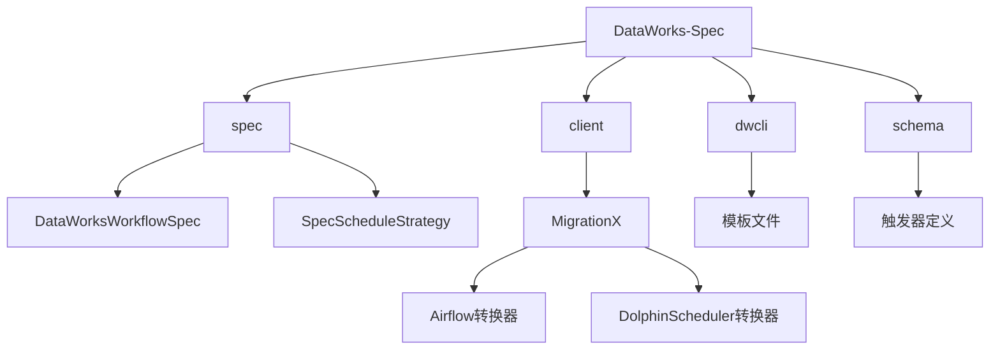
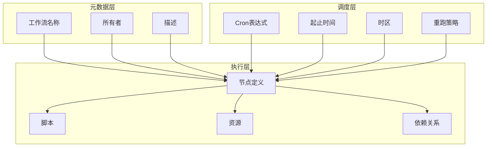
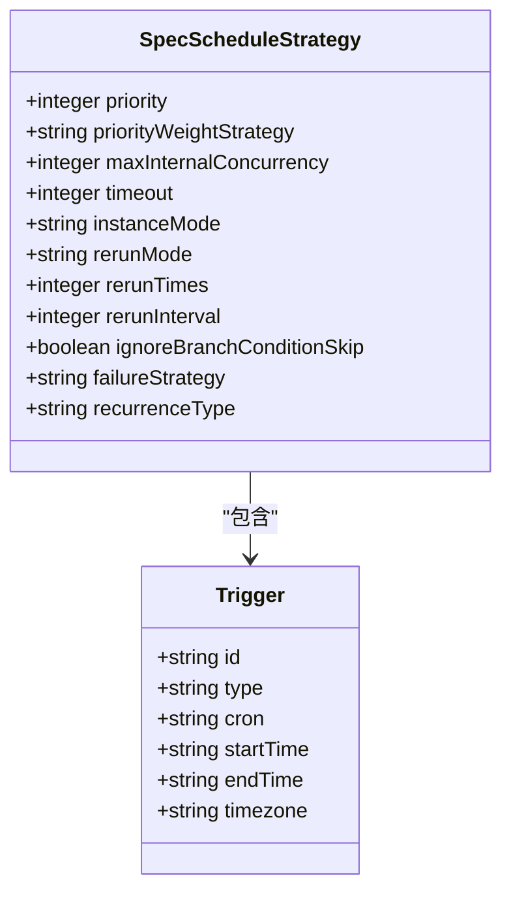
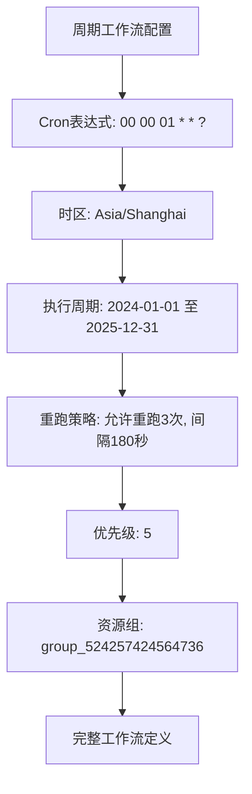
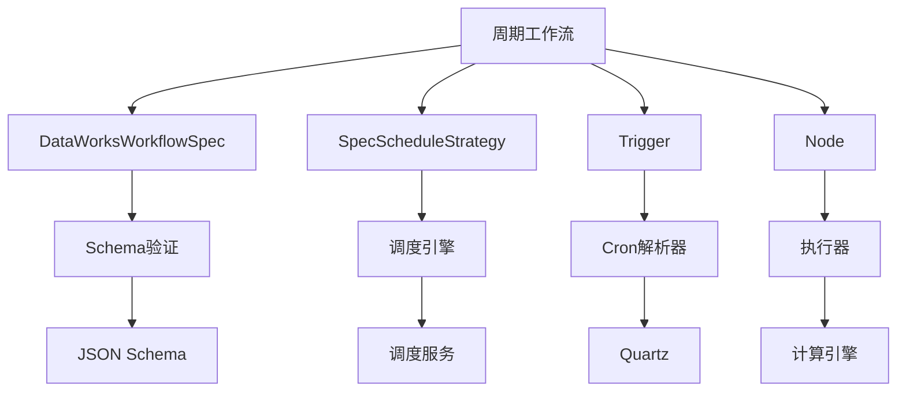

# 周期工作流

<cite>
**本文档引用的文件**
- [DataWorksWorkflowSpec.schema.json](file://spec/src/main/resources/spec/schema/DataWorksWorkflowSpec.schema.json)
- [SpecScheduleStrategy.schema.json](file://spec/src/main/resources/spec/schema/SpecScheduleStrategy.schema.json)
- [trigger-properties-cron.md](file://schema/docs/trigger-properties-cron.md)
- [trigger-properties-starttime.md](file://schema/docs/trigger-properties-starttime.md)
- [trigger-properties-endtime.md](file://schema/docs/trigger-properties-endtime.md)
- [trigger-properties-timezone.md](file://schema/docs/trigger-properties-timezone.md)
- [cycle-workflow.md](file://docs/spec-templates/workflows/cycle-workflow.md)
- [odps-sql-daily.template.json](file://dwcli/dwcli/templates/odps-sql-daily.template.json)
- [AirflowDagConverter.java](file://client/migrationx/migrationx-transformer/src/main/java/com/aliyun/dataworks/migrationx/transformer/dataworks/converter/airflow/AirflowDagConverter.java)
</cite>

## 目录
1. [简介](#简介)
2. [项目结构](#项目结构)
3. [核心组件](#核心组件)
4. [架构概述](#架构概述)
5. [详细组件分析](#详细组件分析)
6. [依赖分析](#依赖分析)
7. [性能考虑](#性能考虑)
8. [故障排除指南](#故障排除指南)
9. [结论](#结论)

## 简介
周期工作流是DataWorks平台中用于定期执行数据处理任务的核心组件。它通过cron表达式定义调度策略，支持复杂的节点依赖关系和重跑策略，能够满足企业级数据处理的自动化需求。本文档深入分析周期工作流在DataWorksWorkflowSpec中的结构定义，重点说明其调度策略的配置方式，并提供实际应用示例。

## 项目结构
DataWorks规范项目采用模块化设计，主要包含客户端工具、迁移转换器、规范定义和CLI工具等组件。周期工作流的相关定义分布在多个模块中，通过JSON Schema进行标准化描述。



**图源**
- [DataWorksWorkflowSpec.schema.json](file://spec/src/main/resources/spec/schema/DataWorksWorkflowSpec.schema.json)
- [SpecScheduleStrategy.schema.json](file://spec/src/main/resources/spec/schema/SpecScheduleStrategy.schema.json)

**本节来源**
- [DataWorksWorkflowSpec.schema.json](file://spec/src/main/resources/spec/schema/DataWorksWorkflowSpec.schema.json)
- [SpecScheduleStrategy.schema.json](file://spec/src/main/resources/spec/schema/SpecScheduleStrategy.schema.json)

## 核心组件
周期工作流的核心组件包括工作流定义、调度策略、节点配置和依赖关系。这些组件通过DataWorksWorkflowSpec进行统一描述，确保了配置的一致性和可移植性。

**本节来源**
- [DataWorksWorkflowSpec.schema.json](file://spec/src/main/resources/spec/schema/DataWorksWorkflowSpec.schema.json)
- [SpecScheduleStrategy.schema.json](file://spec/src/main/resources/spec/schema/SpecScheduleStrategy.schema.json)

## 架构概述
周期工作流的架构基于声明式配置，通过JSON格式的规范文件定义整个工作流的行为。架构分为三层：元数据层、调度层和执行层。



**图源**
- [DataWorksWorkflowSpec.schema.json](file://spec/src/main/resources/spec/schema/DataWorksWorkflowSpec.schema.json)
- [cycle-workflow.md](file://docs/spec-templates/workflows/cycle-workflow.md)

## 详细组件分析

### 调度策略配置
周期工作流的调度策略通过SpecScheduleStrategy进行配置，包含优先级、并发控制、超时设置、重跑模式等关键参数。

#### 调度参数配置


**图源**
- [SpecScheduleStrategy.schema.json](file://spec/src/main/resources/spec/schema/SpecScheduleStrategy.schema.json)
- [trigger-properties-cron.md](file://schema/docs/trigger-properties-cron.md)

#### 实际配置示例


**图源**
- [cycle-workflow.md](file://docs/spec-templates/workflows/cycle-workflow.md)
- [odps-sql-daily.template.json](file://dwcli/dwcli/templates/odps-sql-daily.template.json)

**本节来源**
- [SpecScheduleStrategy.schema.json](file://spec/src/main/resources/spec/schema/SpecScheduleStrategy.schema.json)
- [trigger-properties-cron.md](file://schema/docs/trigger-properties-cron.md)
- [trigger-properties-starttime.md](file://schema/docs/trigger-properties-starttime.md)
- [trigger-properties-endtime.md](file://schema/docs/trigger-properties-endtime.md)
- [trigger-properties-timezone.md](file://schema/docs/trigger-properties-timezone.md)

### 节点依赖关系
周期工作流支持多种依赖关系类型，包括同周期依赖和跨周期依赖，能够满足复杂的数据处理场景需求。

```mermaid
graph LR
A[节点A] --> B[节点B]
A --> C[节点C]
B --> D[节点D]
C --> D
D --> E[节点E]
style A fill:#f9f,stroke:#333
style B fill:#bbf,stroke:#333
style C fill:#bbf,stroke:#333
style D fill:#f96,stroke:#333
style E fill:#9f9,stroke:#333
classDef start fill:#f9f,stroke:#333;
classDef process fill:#bbf,stroke:#333;
classDef merge fill:#f96,stroke:#333;
classDef end fill:#9f9,stroke:#333;
class A start
class B,C process
class D merge
class E end
```

**图源**
- [cycle-workflow.md](file://docs/spec-templates/workflows/cycle-workflow.md)

**本节来源**
- [cycle-workflow.md](file://docs/spec-templates/workflows/cycle-workflow.md)

## 依赖分析
周期工作流系统包含多个关键依赖组件，这些组件协同工作以实现完整的调度功能。



**图源**
- [DataWorksWorkflowSpec.schema.json](file://spec/src/main/resources/spec/schema/DataWorksWorkflowSpec.schema.json)
- [SpecScheduleStrategy.schema.json](file://spec/src/main/resources/spec/schema/SpecScheduleStrategy.schema.json)

**本节来源**
- [DataWorksWorkflowSpec.schema.json](file://spec/src/main/resources/spec/schema/DataWorksWorkflowSpec.schema.json)
- [SpecScheduleStrategy.schema.json](file://spec/src/main/resources/spec/schema/SpecScheduleStrategy.schema.json)

## 性能考虑
在设计和配置周期工作流时，需要考虑以下性能优化建议：
- 合理设置重跑间隔，避免过于频繁的重试导致系统负载过高
- 根据任务实际运行时间设置适当的超时时间
- 使用合适的资源组隔离不同优先级的任务
- 优化Cron表达式，避免不必要的调度触发
- 合理设置并发度，平衡资源利用率和任务响应速度

## 故障排除指南
针对周期工作流常见的调度配置错误和执行异常，提供以下解决方案：
- **Cron表达式错误**：使用标准的Quartz Cron格式，确保表达式语法正确
- **时区配置错误**：明确指定时区，避免因时区差异导致调度时间偏差
- **循环依赖**：检查依赖关系，确保不会形成循环依赖
- **资源不足**：检查资源组配置，确保有足够的计算资源
- **超时问题**：根据任务实际运行时间调整超时设置

**本节来源**
- [cycle-workflow.md](file://docs/spec-templates/workflows/cycle-workflow.md)

## 结论
周期工作流作为DataWorks平台的核心功能，提供了强大的调度能力和灵活的配置选项。通过标准化的JSON Schema定义，确保了工作流配置的一致性和可移植性。结合MigrationX转换器，能够实现从其他调度系统（如Airflow、DolphinScheduler）的平滑迁移。合理配置调度策略和优化性能参数，可以有效提升数据处理任务的可靠性和效率。