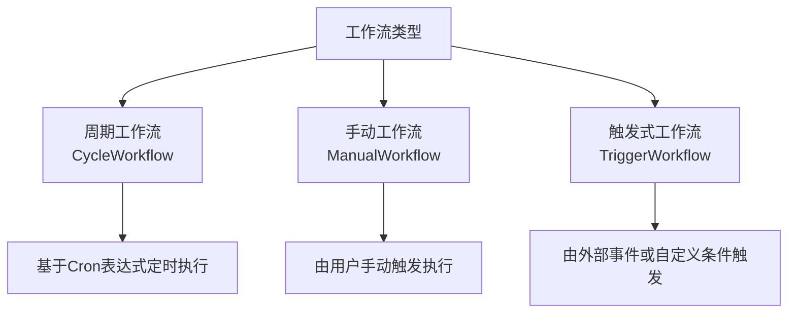
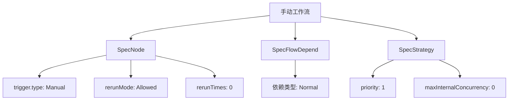
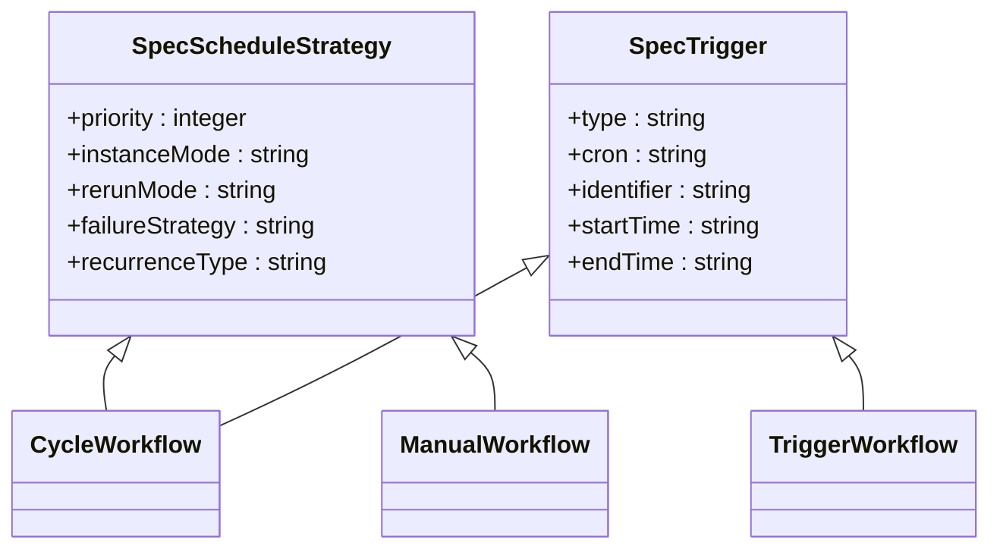

# 工作流类型

<cite>
**本文档引用的文件**
- [DataWorksWorkflowSpec.java](file://spec/src/main/java/com/aliyun/dataworks/common/spec/domain/DataWorksWorkflowSpec.java)
- [SpecKind.java](file://spec/src/main/java/com/aliyun/dataworks/common/spec/domain/enums/SpecKind.java)
- [DataWorksWorkflowSpec.schema.json](file://spec/src/main/resources/spec/schema/DataWorksWorkflowSpec.schema.json)
- [SpecScheduleStrategy.schema.json](file://spec/src/main/resources/spec/schema/SpecScheduleStrategy.schema.json)
- [SpecTrigger.schema.json](file://spec/src/main/resources/spec/schema/SpecTrigger.schema.json)
- [cycle_workflow.json](file://spec/src/test/resources/version/1.x.y/cycle_workflow.json)
- [manual_workflow.json](file://spec/src/test/resources/version/1.x.y/manual_workflow.json)
- [trigger_workflow.json](file://spec/src/test/resources/version/1.x.y/trigger_workflow.json)
- [cycle-workflow.md](file://docs/spec-templates/workflows/cycle-workflow.md)
- [manual-workflow.md](file://docs/spec-templates/workflows/manual-workflow.md)
- [migrationx-domain-dolphinscheduler](file://client/migrationx/migrationx-domain/migrationx-domain-dolphinscheduler)
- [migrationx-domain-airflow](file://client/migrationx/migrationx-domain/migrationx-domain-airflow)
- [dwcli](file://dwcli)
</cite>

## 目录
1. [引言](#引言)
2. [工作流类型概述](#工作流类型概述)
3. [周期工作流 (CycleWorkflow)](#周期工作流-cycleworkflow)
4. [手动工作流 (ManualWorkflow)](#手动工作流-manualworkflow)
5. [触发式工作流 (TriggerWorkflow)](#触发式工作流-triggerworkflow)
6. [调度策略与触发机制](#调度策略与触发机制)
7. [MigrationX 转换器集成](#migrationx-转换器集成)
8. [dwcli 工具模板](#dwcli-工具模板)
9. [配置错误与异常处理](#配置错误与异常处理)
10. [性能优化建议](#性能优化建议)

## 引言

本文档深入分析 DataWorks 工作流规范（DataWorksWorkflowSpec）中的三种核心工作流类型：周期工作流、手动工作流和触发式工作流。文档详细阐述了它们在结构上的差异、应用场景、调度策略（SpecScheduleStrategy）和触发机制（SpecTrigger）的配置方式。同时，提供了实际代码示例，说明了这些类型如何与 MigrationX 转换器集成，特别是在从 DolphinScheduler 或 Airflow 迁移时的类型映射逻辑，并介绍了在 dwcli 工具中的模板实现。最后，针对配置错误和调度异常提供了解决方案，并给出了性能优化建议。

## 工作流类型概述

在 DataWorks 规范中，工作流类型由 `SpecKind` 枚举定义，主要分为三种：`CYCLE_WORKFLOW`（周期工作流）、`MANUAL_WORKFLOW`（手动工作流）和 `TRIGGER_WORKFLOW`（触发式工作流）。这三种类型在 `DataWorksWorkflowSpec` 类中通过 `kind` 字段进行区分，其核心差异在于触发方式和调度策略。



**Diagram sources**
- [DataWorksWorkflowSpec.java](file://spec/src/main/java/com/aliyun/dataworks/common/spec/domain/DataWorksWorkflowSpec.java)
- [SpecKind.java](file://spec/src/main/java/com/aliyun/dataworks/common/spec/domain/enums/SpecKind.java)

## 周期工作流 (CycleWorkflow)

周期工作流是 DataWorks 中最常见和核心的工作流类型，用于处理需要按固定时间周期（如每日、每小时）自动执行的数据处理任务。

### 结构与配置

周期工作流的核心特征是必须包含一个或多个 `SpecTrigger`，其 `type` 为 `"Scheduler"`，并配置 `cron` 表达式来定义调度周期。工作流的 `kind` 字段必须设置为 `"CycleWorkflow"`。

从 `cycle_workflow.json` 示例文件可以看出，一个典型的周期工作流包含：
- **`spec.triggers`**: 定义了工作流的调度计划，包括 `cron` 表达式、`startTime`、`endTime` 和 `timezone`。
- **`spec.nodes`**: 包含多个任务节点，每个节点也必须配置 `trigger`，通常引用工作流级别的触发器。
- **`spec.flow`**: 定义了节点之间的依赖关系，支持同周期依赖和跨周期依赖。

```mermaid
graph TD
A[周期工作流] --> B[SpecTrigger]
B --> C[type: Scheduler]
B --> D[cron: "00 12 00 * * ?"]
B --> E[startTime: "1970-01-01 00:00:00"]
B --> F[endTime: "9999-01-01 00:00:00"]
A --> G[SpecNode]
G --> H[recurrence: Normal]
G --> I[instanceMode: T+1]
G --> J[rerunMode: Allowed]
A --> K[SpecFlowDepend]
K --> L[依赖类型: Normal]
K --> M[依赖类型: CrossCycleDependsOnSelf]
```

**Diagram sources**
- [DataWorksWorkflowSpec.schema.json](file://spec/src/main/resources/spec/schema/DataWorksWorkflowSpec.schema.json)
- [SpecTrigger.schema.json](file://spec/src/main/resources/spec/schema/SpecTrigger.schema.json)
- [cycle_workflow.json](file://spec/src/test/resources/version/1.x.y/cycle_workflow.json)

### 应用场景

周期工作流适用于所有需要定时执行的批处理任务，例如：
- 每日用户行为数据统计
- 每小时的业务指标计算
- 每月财务报表生成
- 周期性的数据清洗和ETL作业

**Section sources**
- [cycle-workflow.md](file://docs/spec-templates/workflows/cycle-workflow.md)
- [cycle_workflow.json](file://spec/src/test/resources/version/1.x.y/cycle_workflow.json)

## 手动工作流 (ManualWorkflow)

手动工作流是一种无需配置周期性调度，而是由用户或系统通过手动操作来触发执行的工作流。

### 结构与配置

手动工作流的关键特征是**不包含** `spec.triggers` 数组。相反，其内部的每个 `SpecNode` 的 `trigger.type` 必须设置为 `"Manual"`。工作流的 `kind` 字段为 `"ManualWorkflow"`。

从 `manual_workflow.json` 示例文件可以看出：
- **`spec.strategy`**: 可以配置工作流级别的优先级 (`priority`) 和最大内部并发数 (`maxInternalConcurrency`)。
- **`spec.nodes`**: 每个节点的 `trigger` 对象中，`type` 为 `"Manual"`，表示该节点需要手动触发。
- **`spec.flow`**: 定义了节点间的执行顺序依赖，但不支持跨周期依赖。



**Diagram sources**
- [DataWorksWorkflowSpec.schema.json](file://spec/src/main/resources/spec/schema/DataWorksWorkflowSpec.schema.json)
- [SpecTrigger.schema.json](file://spec/src/main/resources/spec/schema/SpecTrigger.schema.json)
- [manual_workflow.json](file://spec/src/test/resources/version/1.x.y/manual_workflow.json)

### 应用场景

手动工作流适用于临时性、一次性或需要人工干预的场景，例如：
- 数据修复和补录任务
- 开发和测试环境中的功能验证
- 一次性数据迁移或初始化
- 需要人工审批后才能执行的流程

**Section sources**
- [manual-workflow.md](file://docs/spec-templates/workflows/manual-workflow.md)
- [manual_workflow.json](file://spec/src/test/resources/version/1.x.y/manual_workflow.json)

## 触发式工作流 (TriggerWorkflow)

触发式工作流是一种由外部事件或自定义条件触发执行的工作流，它不依赖于固定的时间表。

### 结构与配置

触发式工作流的 `kind` 字段为 `"TriggerWorkflow"`。其触发器 `trigger.type` 通常为 `"Custom"`，并使用 `identifier` 字段来关联特定的事件源（如 Kafka 主题、OSS 事件等）。

从 `trigger_workflow.json` 示例文件可以看出：
- **`spec.trigger`**: `type` 为 `"Custom"`，`identifier` 为 `"kafka0903"`，表明该工作流由名为 `kafka0903` 的事件源触发。
- **`spec.nodes`**: 内部节点的 `trigger` 也配置为 `"Custom"` 并使用相同的 `identifier`，确保整个工作流对同一事件作出响应。
- **`spec.strategy`**: 其 `recurrenceType` 通常为 `"NoneAuto"`，表示不进行自动周期性调度。

```mermaid
graph TD
A[触发式工作流] --> B[SpecTrigger]
B --> C[type: Custom]
B --> D[identifier: "kafka0903"]
B --> E[startTime: "1970-01-01 00:00:00"]
B --> F[endTime: "9999-01-01 00:00:00"]
A --> G[SpecNode]
G --> H[trigger.type: Custom]
G --> I[identifier: "kafka0903"]
G --> J[recurrenceType: NoneAuto]
```

**Diagram sources**
- [DataWorksWorkflowSpec.schema.json](file://spec/src/main/resources/spec/schema/DataWorksWorkflowSpec.schema.json)
- [SpecTrigger.schema.json](file://spec/src/main/resources/spec/schema/SpecTrigger.schema.json)
- [trigger_workflow.json](file://spec/src/test/resources/version/1.x.y/trigger_workflow.json)

### 应用场景

触发式工作流适用于事件驱动的实时或近实时处理场景，例如：
- 当新文件上传到 OSS 时，自动触发数据处理流程
- 当 Kafka 消息队列中有新消息时，启动流式计算
- 响应 API 调用或 Webhook 事件

## 调度策略与触发机制

### 调度策略 (SpecScheduleStrategy)

`SpecScheduleStrategy` 定义了工作流或节点的运行时行为，其核心配置项包括：
- **`priority`**: 优先级，数值越大优先级越高。
- **`instanceMode`**: 实例化模式，`T+1` 表示次日生效，`Immediately` 表示立即生效。
- **`rerunMode`**: 重跑模式，`Allowed` 允许重跑，`Denied` 拒绝重跑。
- **`failureStrategy`**: 失败策略，`Break` 表示失败后中断，`Continue` 表示失败后继续。
- **`recurrenceType`**: 重复类型，`Normal` 表示正常周期，`NoneAuto` 表示无自动周期。

### 触发机制 (SpecTrigger)

`SpecTrigger` 定义了工作流的启动条件，其核心配置项包括：
- **`type`**: 触发器类型，`Scheduler` 用于周期调度，`Manual` 用于手动触发，`Custom` 用于事件触发。
- **`cron`**: Cron 表达式，仅当 `type` 为 `Scheduler` 时必需。
- **`identifier`**: 标识符，用于 `Custom` 类型的触发器，关联特定事件源。



**Diagram sources**
- [SpecScheduleStrategy.schema.json](file://spec/src/main/resources/spec/schema/SpecScheduleStrategy.schema.json)
- [SpecTrigger.schema.json](file://spec/src/main/resources/spec/schema/SpecTrigger.schema.json)

## MigrationX 转换器集成

MigrationX 是一个用于将不同调度系统的工作流迁移到 DataWorks 的工具。它通过转换器（Transformer）实现不同类型工作流的映射。

### 类型映射逻辑

- **从 DolphinScheduler 迁移**:
  - DolphinScheduler 的 `SCHEDULER` 类型任务映射为 DataWorks 的 `CYCLE_WORKFLOW`。
  - `MANUAL` 类型任务映射为 `MANUAL_WORKFLOW`。
  - 依赖于 `CONDITIONS` 或 `DEPENDENT` 任务的流程，会根据其触发逻辑转换为 `TRIGGER_WORKFLOW` 或带有复杂依赖的 `CYCLE_WORKFLOW`。

- **从 Airflow 迁移**:
  - Airflow 的 `DAG`（有 `schedule_interval`）映射为 `CYCLE_WORKFLOW`。
  - `DAG`（`schedule_interval=None`）映射为 `MANUAL_WORKFLOW`。
  - 基于 `ExternalTaskSensor` 或 `S3KeySensor` 等传感器的任务，会转换为 `TRIGGER_WORKFLOW`。

**Section sources**
- [migrationx-domain-dolphinscheduler](file://client/migrationx/migrationx-domain/migrationx-domain-dolphinscheduler)
- [migrationx-domain-airflow](file://client/migrationx/migrationx-domain/migrationx-domain-airflow)

## dwcli 工具模板

`dwcli` 是一个命令行工具，用于管理和操作 DataWorks 工作流。它通过 JSON 模板来定义不同类型的工作流。

### 模板实现

`dwcli` 的模板位于 `dwcli/templates/` 目录下，例如：
- `odps-sql-daily.template.json`: 定义了一个每日执行的 ODPS SQL 周期工作流模板，其中 `kind` 为 `CycleWorkflow`，并预置了 `cron` 表达式。
- `shell-daily.template.json`: 类似地，定义了每日执行的 Shell 脚本周期工作流。
- `manual-workflow.template.json`: 定义了一个手动工作流模板，`kind` 为 `ManualWorkflow`，且不包含 `triggers` 字段。

这些模板通过占位符（如 `{{workflow_name}}`）实现参数化，使得用户可以快速生成符合规范的工作流定义。

**Section sources**
- [dwcli](file://dwcli)

## 配置错误与异常处理

### 常见配置错误

1.  **周期工作流缺少触发器**: `CYCLE_WORKFLOW` 必须包含 `spec.triggers`，否则会解析失败。
2.  **手动工作流误配触发器**: `MANUAL_WORKFLOW` 中不应定义 `spec.triggers`，否则可能导致调度冲突。
3.  **ID 冲突**: 工作流内所有节点的 `id` 必须唯一，否则会引发运行时错误。
4.  **循环依赖**: `spec.flow` 中定义的依赖关系不能形成闭环，否则工作流将无法启动。

### 调度异常处理

- **任务超时**: 检查 `timeout` 配置是否过短，或任务本身是否存在性能瓶颈。
- **重跑失败**: 确认 `rerunMode` 是否设置为 `Allowed`，并检查 `rerunTimes` 是否足够。
- **跨周期依赖失败**: 确保上游周期任务已成功运行，且依赖的实例存在。

## 性能优化建议

1.  **合理设置优先级**: 为关键任务设置更高的 `priority`，确保其在资源紧张时优先执行。
2.  **优化重试策略**: 避免设置过高的 `rerunTimes`，防止因短暂故障导致长时间重试，占用资源。
3.  **精细化资源分配**: 使用 `runtimeResource` 将不同类型的任务分配到不同的资源组，避免资源争抢。
4.  **避免过度依赖**: 尽量减少跨周期依赖的使用，因为它会增加调度的复杂性和延迟。
5.  **监控与告警**: 为关键工作流配置运行时监控和失败告警，以便及时发现和处理异常。