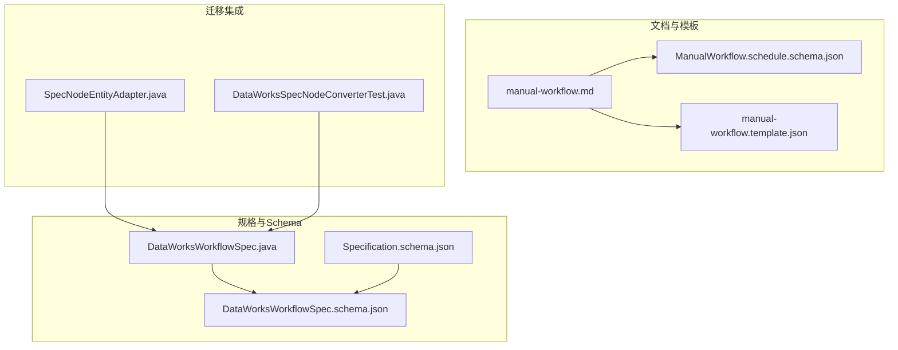
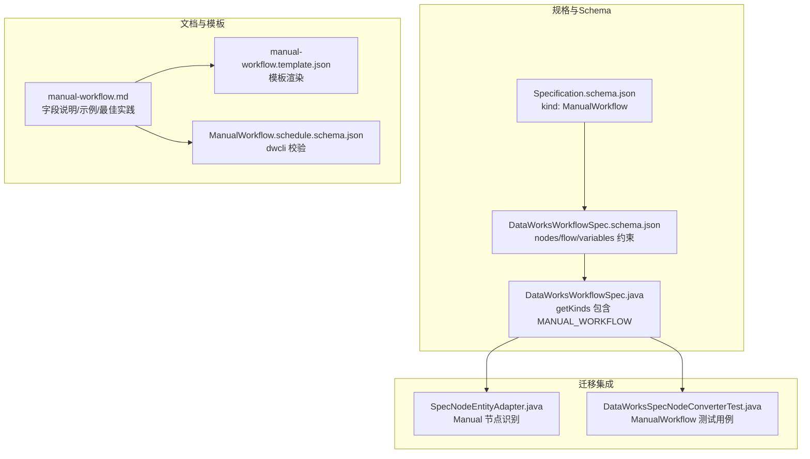
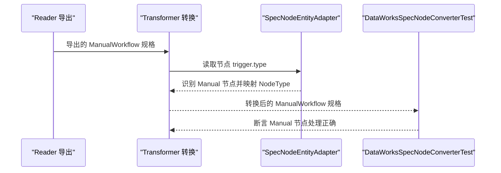
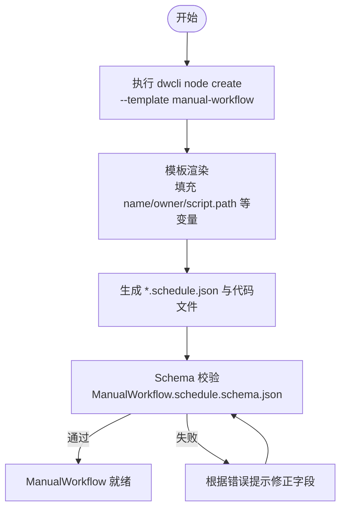
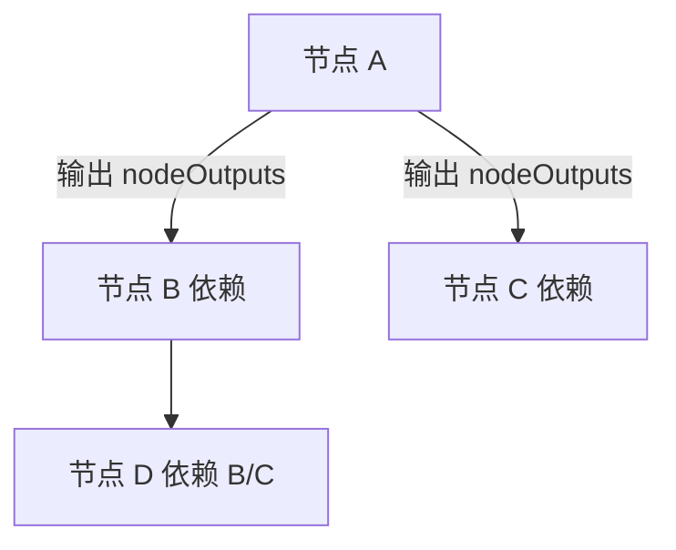
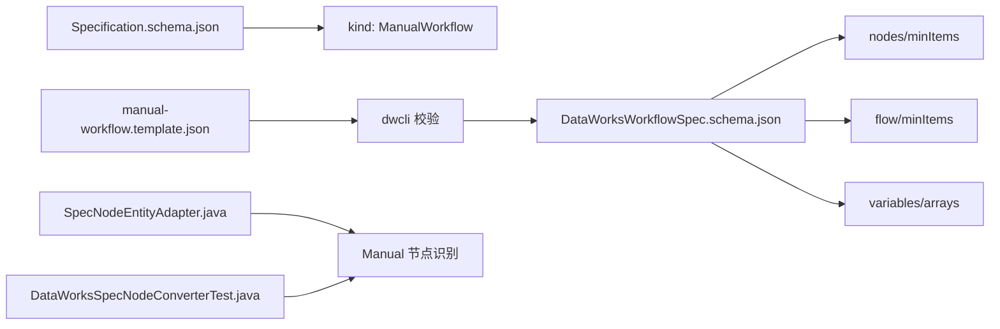

# 手动工作流

<cite>
**本文引用的文件**
- [DataWorksWorkflowSpec.java](file://spec/src/main/java/com/aliyun/dataworks/common/spec/domain/DataWorksWorkflowSpec.java)
- [DataWorksWorkflowSpec.schema.json](file://spec/src/main/resources/spec/schema/DataWorksWorkflowSpec.schema.json)
- [Specification.schema.json](file://spec/src/main/resources/spec/schema/Specification.schema.json)
- [manual-workflow.md](file://docs/spec-templates/workflows/manual-workflow.md)
- [ManualWorkflow.schedule.schema.json](file://dwcli/dwcli/schemas/ManualWorkflow.schedule.schema.json)
- [manual-workflow.template.json](file://dwcli/dwcli/templates/manual-workflow.template.json)
- [USER_GUIDE.md](file://dwcli/docs/USER_GUIDE.md)
- [TEMPLATE_GUIDE.md](file://dwcli/docs/TEMPLATE_GUIDE.md)
- [manual_workflow.json](file://spec/src/test/resources/version/1.x.y/manual_workflow.json)
- [manual.json](file://spec/src/test/resources/nodemodel/manual.json)
- [SpecNodeEntityAdapter.java](file://client/migrationx/migrationx-domain/migrationx-domain-dataworks/src/main/java/com/aliyun/dataworks/migrationx/domain/dataworks/service/spec/entity/SpecNodeEntityAdapter.java)
- [DataWorksSpecNodeConverterTest.java](file://client/migrationx/migrationx-domain/migrationx-domain-dataworks/src/test/java/com/aliyun/dataworks/migrationx/domain/dataworks/service/converter/DataWorksSpecNodeConverterTest.java)
</cite>

## 目录
1. [简介](#简介)
2. [项目结构](#项目结构)
3. [核心组件](#核心组件)
4. [架构总览](#架构总览)
5. [详细组件分析](#详细组件分析)
6. [依赖分析](#依赖分析)
7. [性能考虑](#性能考虑)
8. [故障排查指南](#故障排查指南)
9. [结论](#结论)
10. [附录](#附录)

## 简介
本章节聚焦“手动工作流”（ManualWorkflow），系统阐述其在 DataWorksWorkflowSpec 中的结构定义、无需调度配置的特性以及典型适用场景（如数据补录、紧急任务执行、一次性迁移等）。同时，结合 dwcli 模板与 Schema，说明如何定义完整的手动工作流，包括节点间依赖关系与执行模式；并解释与 MigrationX 转换器的集成方式，特别是从源系统迁移一次性任务时的处理逻辑；最后提供执行过程中的常见问题与最佳实践建议。

## 项目结构
围绕 ManualWorkflow 的相关文件主要分布在如下区域：
- 规格定义与 Schema：spec 模块下的 DataWorksWorkflowSpec 类与 JSON Schema
- 文档与模板：docs/spec-templates 下的手动工作流文档，以及 dwcli 的模板与 Schema
- 迁移集成：MigrationX 领域与转换测试用例，体现 ManualWorkflow 的识别与处理

图表来源
- [DataWorksWorkflowSpec.java](file://spec/src/main/java/com/aliyun/dataworks/common/spec/domain/DataWorksWorkflowSpec.java#L1-L130)
- [DataWorksWorkflowSpec.schema.json](file://spec/src/main/resources/spec/schema/DataWorksWorkflowSpec.schema.json#L1-L119)
- [Specification.schema.json](file://spec/src/main/resources/spec/schema/Specification.schema.json#L1-L67)
- [manual-workflow.md](file://docs/spec-templates/workflows/manual-workflow.md#L1-L236)
- [ManualWorkflow.schedule.schema.json](file://dwcli/dwcli/schemas/ManualWorkflow.schedule.schema.json#L1-L103)
- [manual-workflow.template.json](file://dwcli/dwcli/templates/manual-workflow.template.json#L1-L28)
- [SpecNodeEntityAdapter.java](file://client/migrationx/migrationx-domain/migrationx-domain-dataworks/src/main/java/com/aliyun/dataworks/migrationx/domain/dataworks/service/spec/entity/SpecNodeEntityAdapter.java#L207-L241)
- [DataWorksSpecNodeConverterTest.java](file://client/migrationx/migrationx-domain/migrationx-domain-dataworks/src/test/java/com/aliyun/dataworks/migrationx/domain/dataworks/service/converter/DataWorksSpecNodeConverterTest.java#L286-L315)

章节来源
- [DataWorksWorkflowSpec.java](file://spec/src/main/java/com/aliyun/dataworks/common/spec/domain/DataWorksWorkflowSpec.java#L1-L130)
- [DataWorksWorkflowSpec.schema.json](file://spec/src/main/resources/spec/schema/DataWorksWorkflowSpec.schema.json#L1-L119)
- [Specification.schema.json](file://spec/src/main/resources/spec/schema/Specification.schema.json#L1-L67)
- [manual-workflow.md](file://docs/spec-templates/workflows/manual-workflow.md#L1-L236)
- [ManualWorkflow.schedule.schema.json](file://dwcli/dwcli/schemas/ManualWorkflow.schedule.schema.json#L1-L103)
- [manual-workflow.template.json](file://dwcli/dwcli/templates/manual-workflow.template.json#L1-L28)
- [SpecNodeEntityAdapter.java](file://client/migrationx/migrationx-domain/migrationx-domain-dataworks/src/main/java/com/aliyun/dataworks/migrationx/domain/dataworks/service/spec/entity/SpecNodeEntityAdapter.java#L207-L241)
- [DataWorksSpecNodeConverterTest.java](file://client/migrationx/migrationx-domain/migrationx-domain-dataworks/src/test/java/com/aliyun/dataworks/migrationx/domain/dataworks/service/converter/DataWorksSpecNodeConverterTest.java#L286-L315)

## 核心组件
- DataWorksWorkflowSpec：承载工作流规格的根实体，包含节点、依赖、变量、触发器、运行资源等字段，并通过 getKinds 返回 ManualWorkflow 等工作流类型枚举。
- JSON Schema：Specification.schema.json 限定 kind 必须为 ManualWorkflow；DataWorksWorkflowSpec.schema.json 定义了 nodes、flow、variables 等集合字段的最小数量要求。
- 文档与模板：manual-workflow.md 提供 ManualWorkflow 的字段说明、示例与最佳实践；dwcli 的 ManualWorkflow.schedule.schema.json 与 manual-workflow.template.json 提供 dwcli 层面的校验与模板渲染。

章节来源
- [DataWorksWorkflowSpec.java](file://spec/src/main/java/com/aliyun/dataworks/common/spec/domain/DataWorksWorkflowSpec.java#L60-L130)
- [DataWorksWorkflowSpec.schema.json](file://spec/src/main/resources/spec/schema/DataWorksWorkflowSpec.schema.json#L1-L119)
- [Specification.schema.json](file://spec/src/main/resources/spec/schema/Specification.schema.json#L1-L67)
- [manual-workflow.md](file://docs/spec-templates/workflows/manual-workflow.md#L1-L236)
- [ManualWorkflow.schedule.schema.json](file://dwcli/dwcli/schemas/ManualWorkflow.schedule.schema.json#L1-L103)
- [manual-workflow.template.json](file://dwcli/dwcli/templates/manual-workflow.template.json#L1-L28)

## 架构总览
ManualWorkflow 的执行与落地涉及以下层次：
- 规格层：DataWorksWorkflowSpec 定义工作流结构，Specification.schema.json 与 DataWorksWorkflowSpec.schema.json 约束字段与集合最小数量。
- 文档与模板层：manual-workflow.md 提供字段说明与示例；dwcli 的模板与 Schema 用于生成与校验。
- 迁移集成层：MigrationX 通过适配器与转换测试识别 ManualWorkflow 并处理节点触发类型为 Manual 的节点。

图表来源
- [Specification.schema.json](file://spec/src/main/resources/spec/schema/Specification.schema.json#L1-L67)
- [DataWorksWorkflowSpec.schema.json](file://spec/src/main/resources/spec/schema/DataWorksWorkflowSpec.schema.json#L1-L119)
- [DataWorksWorkflowSpec.java](file://spec/src/main/java/com/aliyun/dataworks/common/spec/domain/DataWorksWorkflowSpec.java#L110-L130)
- [manual-workflow.md](file://docs/spec-templates/workflows/manual-workflow.md#L1-L236)
- [manual-workflow.template.json](file://dwcli/dwcli/templates/manual-workflow.template.json#L1-L28)
- [ManualWorkflow.schedule.schema.json](file://dwcli/dwcli/schemas/ManualWorkflow.schedule.schema.json#L1-L103)
- [SpecNodeEntityAdapter.java](file://client/migrationx/migrationx-domain/migrationx-domain-dataworks/src/main/java/com/aliyun/dataworks/migrationx/domain/dataworks/service/spec/entity/SpecNodeEntityAdapter.java#L207-L241)
- [DataWorksSpecNodeConverterTest.java](file://client/migrationx/migrationx-domain/migrationx-domain-dataworks/src/test/java/com/aliyun/dataworks/migrationx/domain/dataworks/service/converter/DataWorksSpecNodeConverterTest.java#L286-L315)

## 详细组件分析

### ManualWorkflow 结构与无需调度配置
- 结构要点
  - kind 必须为 ManualWorkflow（由 Specification.schema.json 约束）
  - 不需要 spec.triggers 定义（manual-workflow.md 明确）
  - 节点 trigger.type 必须为 Manual（manual-workflow.md 明确）
  - nodes 至少包含一个节点（DataWorksWorkflowSpec.schema.json 的 nodes 字段 minItems 约束）
  - flow 至少包含一条依赖（DataWorksWorkflowSpec.schema.json 的 flow 字段 minItems 约束）

- 关键字段说明
  - strategy：工作流策略（如优先级、并发控制等），ManualWorkflow 仍可配置
  - variables：工作流级变量
  - nodes：节点数组，每个节点包含触发器、脚本、运行资源、输入输出等
  - flow：节点依赖关系，定义上游输出到下游节点的依赖

- 示例参考
  - 完整示例与字段说明见 manual-workflow.md
  - 测试样例见 manual_workflow.json 与 manual.json

章节来源
- [Specification.schema.json](file://spec/src/main/resources/spec/schema/Specification.schema.json#L1-L67)
- [DataWorksWorkflowSpec.schema.json](file://spec/src/main/resources/spec/schema/DataWorksWorkflowSpec.schema.json#L1-L119)
- [manual-workflow.md](file://docs/spec-templates/workflows/manual-workflow.md#L1-L236)
- [manual_workflow.json](file://spec/src/test/resources/version/1.x.y/manual_workflow.json#L1-L550)
- [manual.json](file://spec/src/test/resources/nodemodel/manual.json#L1-L109)

### ManualWorkflow 与 MigrationX 转换器集成
- Manual 节点识别
  - SpecNodeEntityAdapter 通过节点 trigger.type 判断是否为 Manual 节点，并映射为 NodeType.MANUAL，从而在转换过程中正确处理 ManualWorkflow 的节点属性
- 转换测试
  - DataWorksSpecNodeConverterTest 包含对 ManualWorkflow 的节点处理测试用例，验证 Manual 节点在转换过程中的行为

图表来源
- [SpecNodeEntityAdapter.java](file://client/migrationx/migrationx-domain/migrationx-domain-dataworks/src/main/java/com/aliyun/dataworks/migrationx/domain/dataworks/service/spec/entity/SpecNodeEntityAdapter.java#L207-L241)
- [DataWorksSpecNodeConverterTest.java](file://client/migrationx/migrationx-domain/migrationx-domain-dataworks/src/test/java/com/aliyun/dataworks/migrationx/domain/dataworks/service/converter/DataWorksSpecNodeConverterTest.java#L286-L315)

章节来源
- [SpecNodeEntityAdapter.java](file://client/migrationx/migrationx-domain/migrationx-domain-dataworks/src/main/java/com/aliyun/dataworks/migrationx/domain/dataworks/service/spec/entity/SpecNodeEntityAdapter.java#L207-L241)
- [DataWorksSpecNodeConverterTest.java](file://client/migrationx/migrationx-domain/migrationx-domain-dataworks/src/test/java/com/aliyun/dataworks/migrationx/domain/dataworks/service/converter/DataWorksSpecNodeConverterTest.java#L286-L315)

### dwcli 模板实现与调用方式
- 模板与 Schema
  - manual-workflow.template.json 提供 ManualWorkflow 的模板骨架，包含 metadata、nodes、flow 等字段
  - ManualWorkflow.schedule.schema.json 用于 dwcli 的 JSON Schema 校验，确保生成的 ManualWorkflow 符合规范
- 命令行使用
  - USER_GUIDE.md 提供 dwcli node create 命令创建 ManualWorkflow 的示例，使用 --template manual-workflow
  - TEMPLATE_GUIDE.md 说明模板位置与变量替换机制

图表来源
- [manual-workflow.template.json](file://dwcli/dwcli/templates/manual-workflow.template.json#L1-L28)
- [ManualWorkflow.schedule.schema.json](file://dwcli/dwcli/schemas/ManualWorkflow.schedule.schema.json#L1-L103)
- [USER_GUIDE.md](file://dwcli/docs/USER_GUIDE.md#L1-L72)
- [TEMPLATE_GUIDE.md](file://dwcli/docs/TEMPLATE_GUIDE.md#L1-L71)

章节来源
- [manual-workflow.template.json](file://dwcli/dwcli/templates/manual-workflow.template.json#L1-L28)
- [ManualWorkflow.schedule.schema.json](file://dwcli/dwcli/schemas/ManualWorkflow.schedule.schema.json#L1-L103)
- [USER_GUIDE.md](file://dwcli/docs/USER_GUIDE.md#L1-L72)
- [TEMPLATE_GUIDE.md](file://dwcli/docs/TEMPLATE_GUIDE.md#L1-L71)

### 依赖关系与执行模式
- 依赖定义
  - flow 字段定义节点依赖，上游节点通过 outputs 的 nodeOutputs 与下游 depends 的 output/refTableName 建立关联
- 执行模式
  - ManualWorkflow 不包含 spec.triggers，节点 trigger.type 为 Manual，表示按需手动触发执行
  - strategy 可配置优先级与并发策略，影响执行队列与资源分配

图表来源
- [manual-workflow.md](file://docs/spec-templates/workflows/manual-workflow.md#L126-L139)
- [manual_workflow.json](file://spec/src/test/resources/version/1.x.y/manual_workflow.json#L462-L533)
- [manual.json](file://spec/src/test/resources/nodemodel/manual.json#L93-L108)

章节来源
- [manual-workflow.md](file://docs/spec-templates/workflows/manual-workflow.md#L126-L139)
- [manual_workflow.json](file://spec/src/test/resources/version/1.x.y/manual_workflow.json#L462-L533)
- [manual.json](file://spec/src/test/resources/nodemodel/manual.json#L93-L108)

## 依赖分析
- 组件耦合
  - DataWorksWorkflowSpec.java 通过 getKinds 暴露 ManualWorkflow 类型，Specification.schema.json 与 DataWorksWorkflowSpec.schema.json 共同约束 ManualWorkflow 的字段与集合最小数量
  - dwcli 的模板与 Schema 与 ManualWorkflow 的字段保持一致，确保生成的规格可通过 Schema 校验
  - MigrationX 的适配器与测试用例依赖 ManualWorkflow 的节点触发类型为 Manual 的事实进行处理

图表来源
- [Specification.schema.json](file://spec/src/main/resources/spec/schema/Specification.schema.json#L1-L67)
- [DataWorksWorkflowSpec.schema.json](file://spec/src/main/resources/spec/schema/DataWorksWorkflowSpec.schema.json#L1-L119)
- [manual-workflow.template.json](file://dwcli/dwcli/templates/manual-workflow.template.json#L1-L28)
- [SpecNodeEntityAdapter.java](file://client/migrationx/migrationx-domain/migrationx-domain-dataworks/src/main/java/com/aliyun/dataworks/migrationx/domain/dataworks/service/spec/entity/SpecNodeEntityAdapter.java#L207-L241)
- [DataWorksSpecNodeConverterTest.java](file://client/migrationx/migrationx-domain/migrationx-domain-dataworks/src/test/java/com/aliyun/dataworks/migrationx/domain/dataworks/service/converter/DataWorksSpecNodeConverterTest.java#L286-L315)

章节来源
- [Specification.schema.json](file://spec/src/main/resources/spec/schema/Specification.schema.json#L1-L67)
- [DataWorksWorkflowSpec.schema.json](file://spec/src/main/resources/spec/schema/DataWorksWorkflowSpec.schema.json#L1-L119)
- [manual-workflow.template.json](file://dwcli/dwcli/templates/manual-workflow.template.json#L1-L28)
- [SpecNodeEntityAdapter.java](file://client/migrationx/migrationx-domain/migrationx-domain-dataworks/src/main/java/com/aliyun/dataworks/migrationx/domain/dataworks/service/spec/entity/SpecNodeEntityAdapter.java#L207-L241)
- [DataWorksSpecNodeConverterTest.java](file://client/migrationx/migrationx-domain/migrationx-domain-dataworks/src/test/java/com/aliyun/dataworks/migrationx/domain/dataworks/service/converter/DataWorksSpecNodeConverterTest.java#L286-L315)

## 性能考虑
- 并发与优先级
  - strategy.maxInternalConcurrency 控制内部并发上限，0 表示不限制；priority 与 priorityWeightStrategy 影响排队与资源分配
- 超时与重试
  - 节点 timeout、rerunMode、rerunTimes、rerunInterval 等参数影响单次执行耗时与失败重试策略
- 依赖深度
  - flow 中的依赖链过深可能增加执行等待时间，应合理拆分任务与合并必要依赖

[本节为通用指导，不直接分析具体文件]

## 故障排查指南
- 权限不足
  - 现象：节点执行失败，提示权限不足
  - 处理：确认节点使用的 datasource、runtimeResource、脚本访问权限；在 runtimeResource 中选择具备所需权限的资源组
- 资源争用
  - 现象：执行排队或失败，提示资源不足
  - 处理：调整 strategy.priority 与 strategy.maxInternalConcurrency；优化节点 timeout 与 rerunInterval，避免长时间占用资源
- Schema 校验失败
  - 现象：dwcli 校验报错，指出字段缺失或类型不符
  - 处理：依据错误路径与行号修正字段；确保 nodes、flow、variables 等集合满足最小数量要求；确保 kind 为 ManualWorkflow
- ManualWorkflow 规则违反
  - 现象：包含 spec.triggers 或节点 trigger.type 非 Manual
  - 处理：移除 spec.triggers；将所有节点 trigger.type 设为 Manual；确保节点 ID 唯一

章节来源
- [manual-workflow.md](file://docs/spec-templates/workflows/manual-workflow.md#L214-L236)
- [ManualWorkflow.schedule.schema.json](file://dwcli/dwcli/schemas/ManualWorkflow.schedule.schema.json#L1-L103)

## 结论
ManualWorkflow 通过“无需调度配置”的设计，为临时、一次性与紧急任务提供了灵活的执行模式。借助 DataWorksWorkflowSpec 的结构化定义、Schema 的强约束与 dwcli 的模板与校验能力，开发者可以快速生成与维护高质量的 ManualWorkflow。配合 MigrationX 的节点识别与转换测试，ManualWorkflow 在从源系统迁移一次性任务时也能得到稳定处理。实践中应重视依赖设计、超时与重试策略、资源与权限配置，以获得更可靠的执行体验。

[本节为总结性内容，不直接分析具体文件]

## 附录
- 实际代码示例路径
  - 完整 ManualWorkflow 示例：[manual-workflow.md](file://docs/spec-templates/workflows/manual-workflow.md#L16-L139)
  - 测试样例（版本 1.x.y）：[manual_workflow.json](file://spec/src/test/resources/version/1.x.y/manual_workflow.json#L1-L550)
  - 测试样例（节点模型）：[manual.json](file://spec/src/test/resources/nodemodel/manual.json#L1-L109)
- dwcli 使用示例路径
  - 创建 ManualWorkflow：[USER_GUIDE.md](file://dwcli/docs/USER_GUIDE.md#L21-L49)
  - 模板变量与渲染：[TEMPLATE_GUIDE.md](file://dwcli/docs/TEMPLATE_GUIDE.md#L35-L68)
- MigrationX 集成路径
  - Manual 节点识别：[SpecNodeEntityAdapter.java](file://client/migrationx/migrationx-domain/migrationx-domain-dataworks/src/main/java/com/aliyun/dataworks/migrationx/domain/dataworks/service/spec/entity/SpecNodeEntityAdapter.java#L207-L241)
  - 转换测试用例：[DataWorksSpecNodeConverterTest.java](file://client/migrationx/migrationx-domain/migrationx-domain-dataworks/src/test/java/com/aliyun/dataworks/migrationx/domain/dataworks/service/converter/DataWorksSpecNodeConverterTest.java#L286-L315)