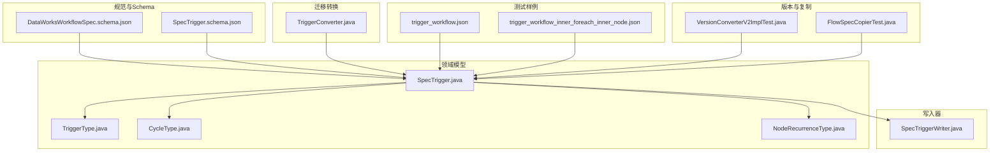
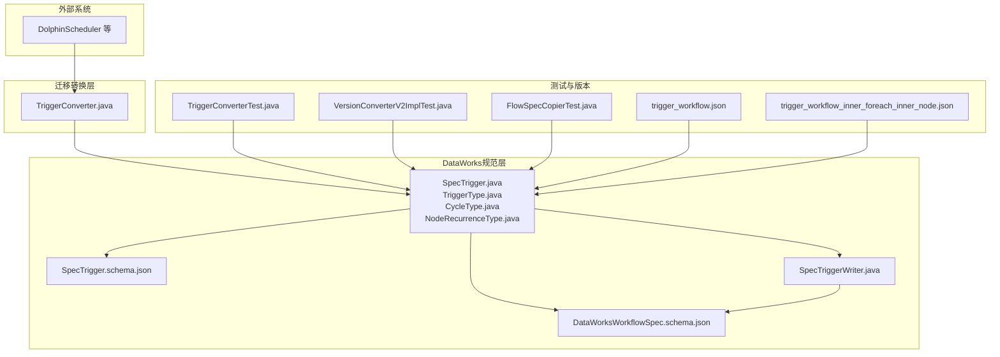
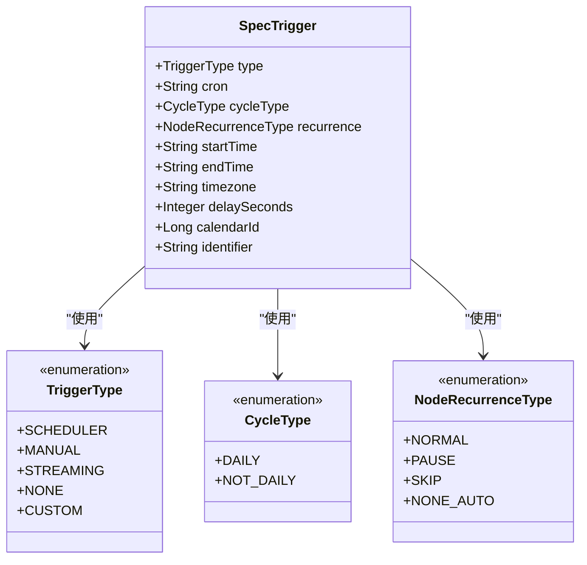
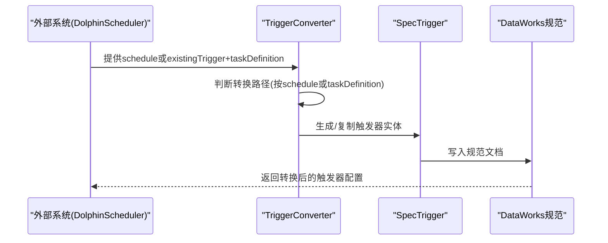
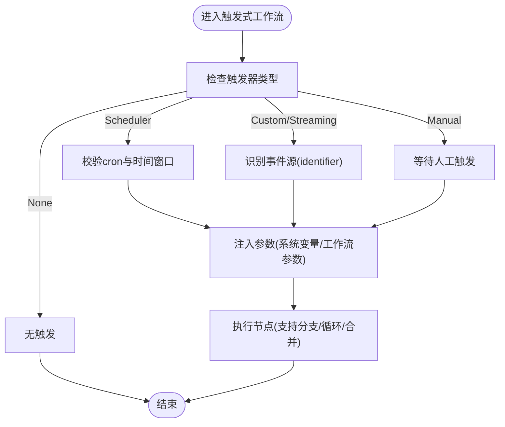
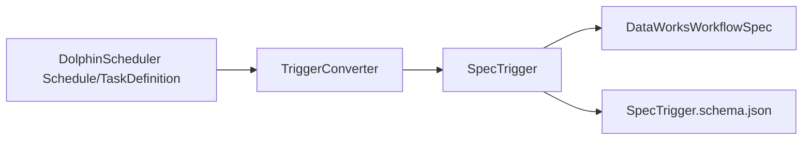

# 触发式工作流

<cite>
**本文引用的文件列表**
- [DataWorksWorkflowSpec.schema.json](file://spec/src/main/resources/spec/schema/DataWorksWorkflowSpec.schema.json)
- [SpecTrigger.schema.json](file://spec/src/main/resources/spec/schema/SpecTrigger.schema.json)
- [SpecTrigger.java](file://spec/src/main/java/com/aliyun/dataworks/common/spec/domain/ref/SpecTrigger.java)
- [TriggerType.java](file://spec/src/main/java/com/aliyun/dataworks/common/spec/domain/enums/TriggerType.java)
- [CycleType.java](file://spec/src/main/java/com/aliyun/dataworks/common/spec/domain/enums/CycleType.java)
- [NodeRecurrenceType.java](file://spec/src/main/java/com/aliyun/dataworks/common/spec/domain/enums/NodeRecurrenceType.java)
- [SpecTriggerWriter.java](file://spec/src/main/java/com/aliyun/dataworks/common/spec/writer/impl/SpecTriggerWriter.java)
- [TriggerConverter.java](file://client/migrationx/migrationx-transformer/src/main/java/com/aliyun/dataworks/migrationx/transformer/flowspec/converter/dolphinscheduler/common/TriggerConverter.java)
- [TriggerConverterTest.java](file://client/migrationx/migrationx-transformer/src/test/java/com/aliyun/dataworks/migrationx/transformer/dataworks/converter/dolphinscheduler/v3/workflow/TriggerConverterTest.java)
- [trigger_workflow.json](file://spec/src/test/resources/version/1.x.y/trigger_workflow.json)
- [trigger_workflow_inner_foreach_inner_node.json](file://spec/src/test/resources/version/1.x.y/trigger_workflow_inner_foreach_inner_node.json)
- [FlowSpecCopierTest.java](file://spec/src/test/java/com/aliyun/dataworks/common/spec/utils/FlowSpecCopierTest.java)
- [VersionConverterV2ImplTest.java](file://spec/src/test/java/com/aliyun/dataworks/common/spec/version/VersionConverterV2ImplTest.java)
- [index.md](file://docs/migrationx/index.md)
</cite>

## 目录
1. [引言](#引言)
2. [项目结构](#项目结构)
3. [核心组件](#核心组件)
4. [架构总览](#架构总览)
5. [详细组件分析](#详细组件分析)
6. [依赖关系分析](#依赖关系分析)
7. [性能考量](#性能考量)
8. [故障排查指南](#故障排查指南)
9. [结论](#结论)
10. [附录](#附录)

## 引言
本章节聚焦于DataWorks中的“触发式工作流”（TriggerWorkflow），系统性阐述其在DataWorksWorkflowSpec中的结构定义、触发机制（SpecTrigger）的配置方式、事件源与触发条件、参数传递、与MigrationX转换器的集成映射，以及与其他工作流类型的组合使用模式。同时，针对事件丢失、触发延迟等常见问题提出解决方案与可靠性保障建议（重试、监控告警等）。

## 项目结构
围绕触发式工作流的关键文件分布如下：
- 规范与Schema：DataWorksWorkflowSpec与SpecTrigger的JSON Schema定义，约束字段与取值范围
- 领域模型：SpecTrigger及其枚举类型（TriggerType、CycleType、NodeRecurrenceType）
- 写入器：SpecTriggerWriter负责将触发器实体写入规范文档
- 迁移转换：TriggerConverter负责将外部系统（如DolphinScheduler）的触发配置映射为DataWorks触发器
- 测试样例：trigger_workflow.json与trigger_workflow_inner_foreach_inner_node.json展示了完整触发式工作流的示例
- 版本与复制：VersionConverterV2ImplTest与FlowSpecCopierTest验证触发式工作流在版本转换与复制过程中的行为

图表来源
- [DataWorksWorkflowSpec.schema.json](file://spec/src/main/resources/spec/schema/DataWorksWorkflowSpec.schema.json#L1-L119)
- [SpecTrigger.schema.json](file://spec/src/main/resources/spec/schema/SpecTrigger.schema.json#L1-L51)
- [SpecTrigger.java](file://spec/src/main/java/com/aliyun/dataworks/common/spec/domain/ref/SpecTrigger.java#L1-L51)
- [TriggerType.java](file://spec/src/main/java/com/aliyun/dataworks/common/spec/domain/enums/TriggerType.java#L1-L56)
- [CycleType.java](file://spec/src/main/java/com/aliyun/dataworks/common/spec/domain/enums/CycleType.java#L1-L47)
- [NodeRecurrenceType.java](file://spec/src/main/java/com/aliyun/dataworks/common/spec/domain/enums/NodeRecurrenceType.java#L1-L56)
- [SpecTriggerWriter.java](file://spec/src/main/java/com/aliyun/dataworks/common/spec/writer/impl/SpecTriggerWriter.java#L1-L31)
- [TriggerConverter.java](file://client/migrationx/migrationx-transformer/src/main/java/com/aliyun/dataworks/migrationx/transformer/flowspec/converter/dolphinscheduler/common/TriggerConverter.java#L1-L110)
- [trigger_workflow.json](file://spec/src/test/resources/version/1.x.y/trigger_workflow.json#L1-L154)
- [trigger_workflow_inner_foreach_inner_node.json](file://spec/src/test/resources/version/1.x.y/trigger_workflow_inner_foreach_inner_node.json#L1-L227)
- [VersionConverterV2ImplTest.java](file://spec/src/test/java/com/aliyun/dataworks/common/spec/version/VersionConverterV2ImplTest.java#L426-L442)
- [FlowSpecCopierTest.java](file://spec/src/test/java/com/aliyun/dataworks/common/spec/utils/FlowSpecCopierTest.java#L210-L246)

章节来源
- [DataWorksWorkflowSpec.schema.json](file://spec/src/main/resources/spec/schema/DataWorksWorkflowSpec.schema.json#L1-L119)
- [SpecTrigger.schema.json](file://spec/src/main/resources/spec/schema/SpecTrigger.schema.json#L1-L51)

## 核心组件
- DataWorksWorkflowSpec（工作流规范）：包含triggers数组字段，用于声明该工作流的触发器集合；至少包含一个触发器
- SpecTrigger（触发器实体）：包含触发类型、周期表达式、起止时间、时区、延迟秒数、日历标识、自定义标识等字段
- TriggerType（触发类型枚举）：支持Scheduler（定时）、Manual（手动）、Streaming（流式）、None（无）、Custom（自定义）
- CycleType（周期类型枚举）：Daily（日）、NotDaily（非日）
- NodeRecurrenceType（节点重复类型枚举）：Normal（正常）、Pause（暂停）、Skip（跳过）、NoneAuto（无自动调度）

章节来源
- [DataWorksWorkflowSpec.schema.json](file://spec/src/main/resources/spec/schema/DataWorksWorkflowSpec.schema.json#L1-L119)
- [SpecTrigger.schema.json](file://spec/src/main/resources/spec/schema/SpecTrigger.schema.json#L1-L51)
- [SpecTrigger.java](file://spec/src/main/java/com/aliyun/dataworks/common/spec/domain/ref/SpecTrigger.java#L1-L51)
- [TriggerType.java](file://spec/src/main/java/com/aliyun/dataworks/common/spec/domain/enums/TriggerType.java#L1-L56)
- [CycleType.java](file://spec/src/main/java/com/aliyun/dataworks/common/spec/domain/enums/CycleType.java#L1-L47)
- [NodeRecurrenceType.java](file://spec/src/main/java/com/aliyun/dataworks/common/spec/domain/enums/NodeRecurrenceType.java#L1-L56)

## 架构总览
触发式工作流在DataWorks中的整体架构由“规范定义—领域模型—写入器—迁移转换—测试样例—版本与复制”构成。迁移转换器（TriggerConverter）负责将外部系统的触发配置映射为DataWorks的SpecTrigger，确保事件驱动架构的系统在迁移后仍能保持一致的触发语义。

图表来源
- [TriggerConverter.java](file://client/migrationx/migrationx-transformer/src/main/java/com/aliyun/dataworks/migrationx/transformer/flowspec/converter/dolphinscheduler/common/TriggerConverter.java#L1-L110)
- [DataWorksWorkflowSpec.schema.json](file://spec/src/main/resources/spec/schema/DataWorksWorkflowSpec.schema.json#L1-L119)
- [SpecTrigger.schema.json](file://spec/src/main/resources/spec/schema/SpecTrigger.schema.json#L1-L51)
- [SpecTrigger.java](file://spec/src/main/java/com/aliyun/dataworks/common/spec/domain/ref/SpecTrigger.java#L1-L51)
- [TriggerType.java](file://spec/src/main/java/com/aliyun/dataworks/common/spec/domain/enums/TriggerType.java#L1-L56)
- [CycleType.java](file://spec/src/main/java/com/aliyun/dataworks/common/spec/domain/enums/CycleType.java#L1-L47)
- [NodeRecurrenceType.java](file://spec/src/main/java/com/aliyun/dataworks/common/spec/domain/enums/NodeRecurrenceType.java#L1-L56)
- [SpecTriggerWriter.java](file://spec/src/main/java/com/aliyun/dataworks/common/spec/writer/impl/SpecTriggerWriter.java#L1-L31)
- [TriggerConverterTest.java](file://client/migrationx/migrationx-transformer/src/test/java/com/aliyun/dataworks/migrationx/transformer/dataworks/converter/dolphinscheduler/v3/workflow/TriggerConverterTest.java#L101-L184)
- [VersionConverterV2ImplTest.java](file://spec/src/test/java/com/aliyun/dataworks/common/spec/version/VersionConverterV2ImplTest.java#L426-L442)
- [FlowSpecCopierTest.java](file://spec/src/test/java/com/aliyun/dataworks/common/spec/utils/FlowSpecCopierTest.java#L210-L246)
- [trigger_workflow.json](file://spec/src/test/resources/version/1.x.y/trigger_workflow.json#L1-L154)
- [trigger_workflow_inner_foreach_inner_node.json](file://spec/src/test/resources/version/1.x.y/trigger_workflow_inner_foreach_inner_node.json#L1-L227)

## 详细组件分析

### 触发器实体与枚举类图

图表来源
- [SpecTrigger.java](file://spec/src/main/java/com/aliyun/dataworks/common/spec/domain/ref/SpecTrigger.java#L1-L51)
- [TriggerType.java](file://spec/src/main/java/com/aliyun/dataworks/common/spec/domain/enums/TriggerType.java#L1-L56)
- [CycleType.java](file://spec/src/main/java/com/aliyun/dataworks/common/spec/domain/enums/CycleType.java#L1-L47)
- [NodeRecurrenceType.java](file://spec/src/main/java/com/aliyun/dataworks/common/spec/domain/enums/NodeRecurrenceType.java#L1-L56)

章节来源
- [SpecTrigger.java](file://spec/src/main/java/com/aliyun/dataworks/common/spec/domain/ref/SpecTrigger.java#L1-L51)
- [TriggerType.java](file://spec/src/main/java/com/aliyun/dataworks/common/spec/domain/enums/TriggerType.java#L1-L56)
- [CycleType.java](file://spec/src/main/java/com/aliyun/dataworks/common/spec/domain/enums/CycleType.java#L1-L47)
- [NodeRecurrenceType.java](file://spec/src/main/java/com/aliyun/dataworks/common/spec/domain/enums/NodeRecurrenceType.java#L1-L56)

### 触发式工作流的结构与Schema
- DataWorksWorkflowSpec中triggers字段为数组，且最小长度为1，确保每个工作流至少有一个触发器
- SpecTrigger的Schema定义了触发器的核心字段：type、cron、recurrence、startTime、endTime、timezone、delaySeconds、calendarId、identifier
- TriggerType支持多种触发类型，其中Custom常用于事件驱动场景；Scheduler用于定时触发；Manual用于手动触发；Streaming用于流式事件；None表示无触发

章节来源
- [DataWorksWorkflowSpec.schema.json](file://spec/src/main/resources/spec/schema/DataWorksWorkflowSpec.schema.json#L1-L119)
- [SpecTrigger.schema.json](file://spec/src/main/resources/spec/schema/SpecTrigger.schema.json#L1-L51)
- [TriggerType.java](file://spec/src/main/java/com/aliyun/dataworks/common/spec/domain/enums/TriggerType.java#L1-L56)

### 触发机制配置：事件源、触发条件与参数传递
- 事件源与触发条件
  - Custom类型触发器通过identifier标识外部事件源（例如Kafka主题、消息队列等），结合startTime/endTime与timezone限定事件生效窗口
  - Scheduler类型通过cron表达式与时区控制周期性触发
  - Manual类型用于人工触发
  - Streaming类型用于流式事件驱动
- 参数传递
  - 工作流与节点可通过参数系统（变量、系统变量）在触发时注入上下文参数，参见测试样例中的变量定义与参数传递
- 示例参考
  - 完整触发式工作流示例：[trigger_workflow.json](file://spec/src/test/resources/version/1.x.y/trigger_workflow.json#L1-L154)
  - 包含嵌套循环节点的触发式工作流示例：[trigger_workflow_inner_foreach_inner_node.json](file://spec/src/test/resources/version/1.x.y/trigger_workflow_inner_foreach_inner_node.json#L1-L227)

章节来源
- [trigger_workflow.json](file://spec/src/test/resources/version/1.x.y/trigger_workflow.json#L1-L154)
- [trigger_workflow_inner_foreach_inner_node.json](file://spec/src/test/resources/version/1.x.y/trigger_workflow_inner_foreach_inner_node.json#L1-L227)

### 触发式工作流与MigrationX转换器的集成
- TriggerConverter负责将外部系统的触发配置映射为DataWorks的SpecTrigger
  - 当存在schedule时，按定时规则生成Scheduler触发器（包含id、type、cron、startTime、endTime、timezone、delaySeconds）
  - 当存在现有SpecTrigger与TaskDefinition时，基于现有触发器复制并覆盖delaySeconds与recurrence（根据任务标志）
  - 提供cron表达式转换工具，兼容不同系统的cron格式差异
- 测试验证
  - TriggerConverterTest验证了空schedule生成Manual触发器、基于TaskDefinition设置delaySeconds与recurrence、异常处理等场景
  - VersionConverterV2ImplTest验证了触发式工作流在版本转换后保持Kind为TriggerWorkflow，且工作流结构正确
  - FlowSpecCopierTest验证了触发式工作流复制过程中分支输出与依赖关系的正确性

图表来源
- [TriggerConverter.java](file://client/migrationx/migrationx-transformer/src/main/java/com/aliyun/dataworks/migrationx/transformer/flowspec/converter/dolphinscheduler/common/TriggerConverter.java#L1-L110)
- [TriggerConverterTest.java](file://client/migrationx/migrationx-transformer/src/test/java/com/aliyun/dataworks/migrationx/transformer/dataworks/converter/dolphinscheduler/v3/workflow/TriggerConverterTest.java#L101-L184)
- [VersionConverterV2ImplTest.java](file://spec/src/test/java/com/aliyun/dataworks/common/spec/version/VersionConverterV2ImplTest.java#L426-L442)
- [FlowSpecCopierTest.java](file://spec/src/test/java/com/aliyun/dataworks/common/spec/utils/FlowSpecCopierTest.java#L210-L246)

章节来源
- [TriggerConverter.java](file://client/migrationx/migrationx-transformer/src/main/java/com/aliyun/dataworks/migrationx/transformer/flowspec/converter/dolphinscheduler/common/TriggerConverter.java#L1-L110)
- [TriggerConverterTest.java](file://client/migrationx/migrationx-transformer/src/test/java/com/aliyun/dataworks/migrationx/transformer/dataworks/converter/dolphinscheduler/v3/workflow/TriggerConverterTest.java#L101-L184)
- [VersionConverterV2ImplTest.java](file://spec/src/test/java/com/aliyun/dataworks/common/spec/version/VersionConverterV2ImplTest.java#L426-L442)
- [FlowSpecCopierTest.java](file://spec/src/test/java/com/aliyun/dataworks/common/spec/utils/FlowSpecCopierTest.java#L210-L246)

### 触发式工作流与其他工作流类型的组合使用模式
- 分支与合并：触发式工作流可与分支、合并节点组合，实现多路并发与条件汇聚
- 循环与遍历：可在触发式工作流内嵌套循环节点，按输入数据集逐条执行
- 复制与版本转换：触发式工作流在复制与版本转换后仍保持一致性，参见测试用例

章节来源
- [FlowSpecCopierTest.java](file://spec/src/test/java/com/aliyun/dataworks/common/spec/utils/FlowSpecCopierTest.java#L210-L246)
- [trigger_workflow_inner_foreach_inner_node.json](file://spec/src/test/resources/version/1.x.y/trigger_workflow_inner_foreach_inner_node.json#L1-L227)

### 触发式工作流的算法流程（条件判断与参数传递）

图表来源
- [SpecTrigger.schema.json](file://spec/src/main/resources/spec/schema/SpecTrigger.schema.json#L1-L51)
- [TriggerType.java](file://spec/src/main/java/com/aliyun/dataworks/common/spec/domain/enums/TriggerType.java#L1-L56)
- [trigger_workflow.json](file://spec/src/test/resources/version/1.x.y/trigger_workflow.json#L1-L154)

## 依赖关系分析
- 组件耦合与内聚
  - SpecTrigger与TriggerType、CycleType、NodeRecurrenceType形成高内聚的触发器模型
  - TriggerConverter依赖外部系统的Schedule与TaskDefinition，通过CronExpressUtil与DateUtils进行格式转换与日期处理
- 外部依赖与集成点
  - MigrationX模块提供从多种调度引擎到DataWorks的转换能力，TriggerConverter是关键集成点
- 可能的循环依赖
  - 当前结构以单向依赖为主：外部系统→转换器→DataWorks模型→规范文档，未发现循环依赖迹象

图表来源
- [TriggerConverter.java](file://client/migrationx/migrationx-transformer/src/main/java/com/aliyun/dataworks/migrationx/transformer/flowspec/converter/dolphinscheduler/common/TriggerConverter.java#L1-L110)
- [SpecTrigger.java](file://spec/src/main/java/com/aliyun/dataworks/common/spec/domain/ref/SpecTrigger.java#L1-L51)
- [DataWorksWorkflowSpec.schema.json](file://spec/src/main/resources/spec/schema/DataWorksWorkflowSpec.schema.json#L1-L119)
- [SpecTrigger.schema.json](file://spec/src/main/resources/spec/schema/SpecTrigger.schema.json#L1-L51)

章节来源
- [TriggerConverter.java](file://client/migrationx/migrationx-transformer/src/main/java/com/aliyun/dataworks/migrationx/transformer/flowspec/converter/dolphinscheduler/common/TriggerConverter.java#L1-L110)
- [SpecTrigger.java](file://spec/src/main/java/com/aliyun/dataworks/common/spec/domain/ref/SpecTrigger.java#L1-L51)

## 性能考量
- 触发器解析与转换
  - cron表达式转换与日期格式化为轻量级操作，通常不会成为性能瓶颈
  - 对于大规模工作流，建议在转换阶段缓存常用映射（如cron转换结果），减少重复计算
- 执行路径选择
  - TriggerConverter根据是否存在schedule或taskDefinition快速分支，避免不必要的计算
- 写入与序列化
  - 使用SpecTriggerWriter进行规范化写入，建议在批量写入时采用流式或分批策略，降低内存占用

## 故障排查指南
- 事件丢失
  - 确认Custom/Streaming触发器的identifier是否与外部事件源一致
  - 检查startTime/endTime与timezone是否覆盖事件发生的时间窗口
  - 参考测试用例中的触发器配置，确保字段齐全
- 触发延迟
  - 检查delaySeconds配置是否合理；TriggerConverter在节点级别会基于任务定义的延迟时间覆盖delaySeconds
  - 若使用DolphinScheduler，确认cron表达式转换是否成功（TriggerConverterTest覆盖了异常场景）
- 版本转换与复制问题
  - 触发式工作流在版本转换后应保持Kind为TriggerWorkflow，且工作流结构不变
  - 复制触发式工作流时，分支输出与依赖关系需保持一致性

章节来源
- [TriggerConverterTest.java](file://client/migrationx/migrationx-transformer/src/test/java/com/aliyun/dataworks/migrationx/transformer/dataworks/converter/dolphinscheduler/v3/workflow/TriggerConverterTest.java#L101-L184)
- [VersionConverterV2ImplTest.java](file://spec/src/test/java/com/aliyun/dataworks/common/spec/version/VersionConverterV2ImplTest.java#L426-L442)
- [FlowSpecCopierTest.java](file://spec/src/test/java/com/aliyun/dataworks/common/spec/utils/FlowSpecCopierTest.java#L210-L246)

## 结论
触发式工作流通过SpecTrigger与TriggerType等核心组件，实现了对事件驱动场景的完整支持。借助MigrationX的TriggerConverter，外部系统（如DolphinScheduler）的触发配置可被准确映射到DataWorks规范中。配合分支、循环与合并节点，触发式工作流能够灵活地组织复杂的数据处理流程。通过合理的参数传递、版本转换与复制策略，以及针对事件丢失与延迟的排查手段，可以有效提升触发式工作流的可靠性与稳定性。

## 附录
- 迁移与转换概览：参见MigrationX文档索引
  - [index.md](file://docs/migrationx/index.md#L1-L31)