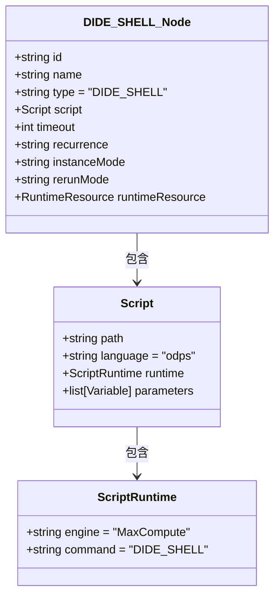
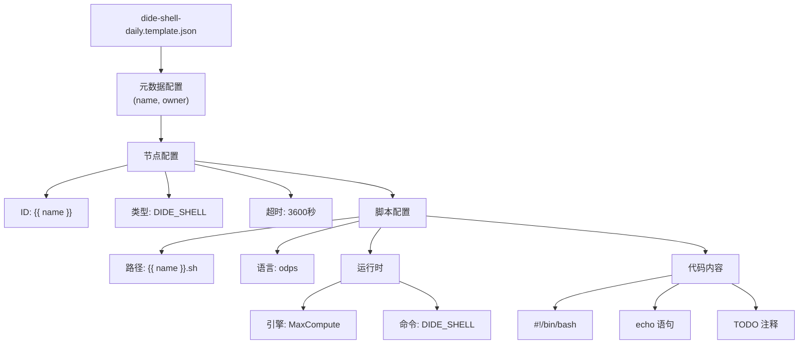
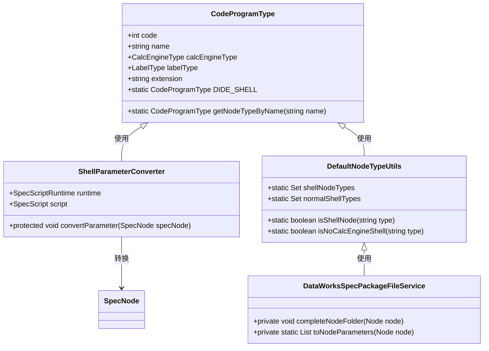
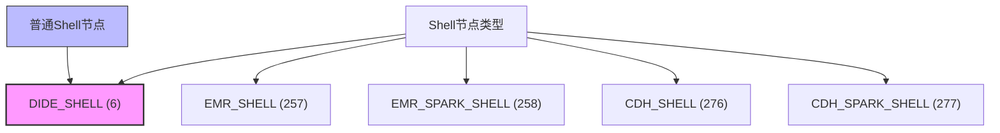

# DIDE_SHELL节点支持

<cite>
**本文档引用的文件**
- [dide-shell-daily.template.json](file://dwcli/dwcli/templates/dide-shell-daily.template.json)
- [dide_shell_test.sh](file://dwcli/myworkspace/dide_shell_test/dide_shell_test.sh)
- [dide_shell.json](file://spec/src/test/resources/nodemodel/dide_shell.json)
- [node.schema.json](file://schema/node.schema.json)
- [script.schema.json](file://schema/script.schema.json)
- [CodeProgramType.java](file://spec/src/main/java/com/aliyun/dataworks/common/spec/domain/dw/types/CodeProgramType.java)
- [DefaultNodeTypeUtils.java](file://client/migrationx/migrationx-domain/migrationx-domain-dataworks/src/main/java/com/aliyun/dataworks/migrationx/domain/dataworks/utils/DefaultNodeTypeUtils.java)
- [ShellParameterConverter.java](file://client/migrationx/migrationx-transformer/src/main/java/com/aliyun/dataworks/migrationx/transformer/dataworks/converter/dolphinscheduler/v2/workflow/parameters/ShellParameterConverter.java)
- [DataWorksSpecPackageFileService.java](file://client/migrationx/migrationx-domain/migrationx-domain-dataworks/src/main/java/com/aliyun/dataworks/migrationx/domain/dataworks/service/impl/DataWorksSpecPackageFileService.java)
- [BasicNodeSpecHandlerTest.java](file://client/migrationx/migrationx-domain/migrationx-domain-dataworks/src/test/java/com/aliyun/dataworks/migrationx/domain/dataworks/service/spec/handler/BasicNodeSpecHandlerTest.java)
</cite>

## 目录
1. [简介](#简介)
2. [DIDE_SHELL节点概述](#dide_shell节点概述)
3. [核心配置结构](#核心配置结构)
4. [模板与示例](#模板与示例)
5. [代码实现与解析](#代码实现与解析)
6. [参数与变量支持](#参数与变量支持)
7. [运行时环境配置](#运行时环境配置)
8. [与其他节点类型的关系](#与其他节点类型的关系)
9. [最佳实践](#最佳实践)

## 简介
DIDE_SHELL节点是DataWorks平台中用于执行Shell脚本的重要节点类型，支持在DIDE（Data Integration Development Environment）环境中运行各种Shell命令和脚本。本文档详细介绍了DIDE_SHELL节点的配置、实现和使用方法。

## DIDE_SHELL节点概述

DIDE_SHELL节点是一种特殊类型的计算节点，用于在DataWorks工作流中执行Shell脚本。该节点类型在系统中被定义为`DIDE_SHELL`，具有特定的配置要求和执行环境。

DIDE_SHELL节点的主要特点包括：
- 支持标准Shell脚本语法
- 可以在MaxCompute等计算引擎上运行
- 支持参数化配置和变量引用
- 具有完整的超时控制和资源管理功能

**本节来源**
- [CodeProgramType.java](file://spec/src/main/java/com/aliyun/dataworks/common/spec/domain/dw/types/CodeProgramType.java#L34)
- [dide_shell.json](file://spec/src/test/resources/nodemodel/dide_shell.json#L7)

## 核心配置结构

DIDE_SHELL节点的配置遵循DataWorks规范中的节点定义结构，主要包含以下关键字段：



**图示来源**
- [node.schema.json](file://schema/node.schema.json#L1-L160)
- [script.schema.json](file://schema/script.schema.json#L1-L51)

**本节来源**
- [node.schema.json](file://schema/node.schema.json#L1-L160)
- [script.schema.json](file://schema/script.schema.json#L1-L51)

## 模板与示例

DIDE_SHELL节点的配置可以通过模板快速生成，系统提供了标准的模板文件来简化创建过程。

### 模板结构


**图示来源**
- [dide-shell-daily.template.json](file://dwcli/dwcli/templates/dide-shell-daily.template.json#L1-L33)

### 实际示例
在`myworkspace`目录中，`dide_shell_test`工作区提供了一个实际的DIDE_SHELL节点示例：

```bash
#!/bin/bash
# DIDE Shell Script for dide_shell_test
# This script runs in DataWorks DIDE environment

echo "Hello from DIDE_SHELL node: dide_shell_test"
echo "Current date: $(date)"

# TODO: Add your DIDE shell logic here
```

该示例展示了DIDE_SHELL节点的标准脚本结构，包括Shebang行、注释和基本的Shell命令。

**本节来源**
- [dide-shell-daily.template.json](file://dwcli/dwcli/templates/dide-shell-daily.template.json#L1-L33)
- [dide_shell_test.sh](file://dwcli/myworkspace/dide_shell_test/dide_shell_test.sh#L1-L8)

## 代码实现与解析

DIDE_SHELL节点的实现涉及多个组件和类，这些组件共同协作来解析和执行节点配置。

### 核心类关系


**图示来源**
- [CodeProgramType.java](file://spec/src/main/java/com/aliyun/dataworks/common/spec/domain/dw/types/CodeProgramType.java#L34)
- [DefaultNodeTypeUtils.java](file://client/migrationx/migrationx-domain/migrationx-domain-dataworks/src/main/java/com/aliyun/dataworks/migrationx/domain/dataworks/utils/DefaultNodeTypeUtils.java#L80-L85)
- [ShellParameterConverter.java](file://client/migrationx/migrationx-transformer/src/main/java/com/aliyun/dataworks/migrationx/transformer/dataworks/converter/dolphinscheduler/v2/workflow/parameters/ShellParameterConverter.java#L42-L70)

### 枚举定义
`CodeProgramType`枚举中明确定义了DIDE_SHELL节点类型：

```java
DIDE_SHELL(6, "DIDE_SHELL", CalcEngineType.GENERAL, null, ".sh")
```

这个定义包含了节点类型的关键信息：
- 代码：6
- 名称：DIDE_SHELL
- 计算引擎类型：GENERAL
- 扩展名：.sh

**本节来源**
- [CodeProgramType.java](file://spec/src/main/java/com/aliyun/dataworks/common/spec/domain/dw/types/CodeProgramType.java#L34)
- [DefaultNodeTypeUtils.java](file://client/migrationx/migrationx-domain/migrationx-domain-dataworks/src/main/java/com/aliyun/dataworks/migrationx/domain/dataworks/utils/DefaultNodeTypeUtils.java#L80-L85)
- [ShellParameterConverter.java](file://client/migrationx/migrationx-transformer/src/main/java/com/aliyun/dataworks/migrationx/transformer/dataworks/converter/dolphinscheduler/v2/workflow/parameters/ShellParameterConverter.java#L42-L70)

## 参数与变量支持

DIDE_SHELL节点支持丰富的参数和变量配置，允许用户在运行时动态传递值。

### 参数配置
节点支持通过`parameters`字段配置参数，这些参数可以在脚本中引用：

```json
"parameters": [
  {
    "artifactType": "Variable",
    "name": "2",
    "scope": "NodeParameter",
    "type": "System",
    "value": "222222"
  },
  {
    "artifactType": "Variable",
    "name": "1",
    "scope": "NodeParameter",
    "type": "System",
    "value": "111111"
  }
]
```

### 变量处理
系统通过`toNodeParameters`方法将节点参数转换为规范变量：

```java
private static List<SpecVariable> toNodeParameters(Node node) {
    return Arrays.stream(StringUtils.split(StringUtils.trim(StringUtils.defaultIfBlank(node.getParameter(), "")), " "))
        .filter(StringUtils::isNotBlank)
        .map(kv -> StringUtils.split(kv, "="))
        .filter(Objects::nonNull)
        .filter(kvPair -> kvPair.length > 0)
        .map(kvPair -> {
            SpecVariable var = new SpecVariable();
            var.setName(kvPair[0]);
            var.setType(VariableType.CONSTANT);
            var.setScope(VariableScopeType.NODE_PARAMETER);
            var.setValue(kvPair.length > 1 ? kvPair[1] : "");
            return var;
        }).collect(Collectors.toList());
}
```

**本节来源**
- [dide_shell.json](file://spec/src/test/resources/nodemodel/dide_shell.json#L22-L44)
- [DataWorksSpecPackageFileService.java](file://client/migrationx/migrationx-domain/migrationx-domain-dataworks/src/main/java/com/aliyun/dataworks/migrationx/domain/dataworks/service/impl/DataWorksSpecPackageFileService.java#L414-L428)
- [BasicNodeSpecHandlerTest.java](file://client/migrationx/migrationx-domain/migrationx-domain-dataworks/src/test/java/com/aliyun/dataworks/migrationx/domain/dataworks/service/spec/handler/BasicNodeSpecHandlerTest.java#L117-L123)

## 运行时环境配置

DIDE_SHELL节点的运行时环境配置确保了脚本在正确的上下文中执行。

### 运行时配置
运行时配置通过`SpecScriptRuntime`对象定义：

```json
"runtime": {
  "engine": "MaxCompute",
  "command": "DIDE_SHELL"
}
```

### 文件夹结构
系统通过`completeNodeFolder`方法确定节点的文件夹结构：

```java
private void completeNodeFolder(Node node) {
    CodeProgramType prgType = CodeProgramType.valueOf(node.getType());
    CalcEngineType engineType = prgType.getCalcEngineType();
    LabelType labelType = prgType.getLabelType();
    List<String> paths = new ArrayList<>();
    Optional.ofNullable(engineType).ifPresent(e -> paths.add(e.getDisplayName(locale)));
    Optional.ofNullable(labelType).ifPresent(e -> paths.add(e.getDisplayName(locale)));
    node.setFolder(Joiner.on(File.separator).join(paths));
}
```

对于DIDE_SHELL节点，由于其计算引擎类型为GENERAL，文件夹结构相对简单。

**本节来源**
- [dide_shell.json](file://spec/src/test/resources/nodemodel/dide_shell.json#L19-L21)
- [DataWorksSpecPackageFileService.java](file://client/migrationx/migrationx-domain/migrationx-domain-dataworks/src/main/java/com/aliyun/dataworks/migrationx/domain/dataworks/service/impl/DataWorksSpecPackageFileService.java#L430-L438)

## 与其他节点类型的关系

DIDE_SHELL节点与其他Shell类型节点有密切的关系，它们共享相似的处理逻辑。

### 节点类型分类


**图示来源**
- [CodeProgramType.java](file://spec/src/main/java/com/aliyun/dataworks/common/spec/domain/dw/types/CodeProgramType.java#L34)
- [DefaultNodeTypeUtils.java](file://client/migrationx/migrationx-domain/migrationx-domain-dataworks/src/main/java/com/aliyun/dataworks/migrationx/domain/dataworks/utils/DefaultNodeTypeUtils.java#L80-L85)

### 类型判断
系统通过`DefaultNodeTypeUtils`类中的集合来管理Shell节点类型：

```java
private static final Set<CodeProgramType> shellNodeTypes = new HashSet<>();
private static final Set<CodeProgramType> normalShellTypes = new HashSet<>();

static {
    shellNodeTypes.addAll(Arrays.asList(
        CodeProgramType.DIDE_SHELL, CodeProgramType.EMR_SHELL, CodeProgramType.EMR_SPARK_SHELL,
        CodeProgramType.CDH_SHELL, CodeProgramType.CDH_SPARK_SHELL
    ));
    
    normalShellTypes.add(CodeProgramType.DIDE_SHELL);
}
```

这种设计允许系统统一处理各种Shell节点，同时为特定类型的节点提供特殊处理。

**本节来源**
- [CodeProgramType.java](file://spec/src/main/java/com/aliyun/dataworks/common/spec/domain/dw/types/CodeProgramType.java#L34)
- [DefaultNodeTypeUtils.java](file://client/migrationx/migrationx-domain/migrationx-domain-dataworks/src/main/java/com/aliyun/dataworks/migrationx/domain/dataworks/utils/DefaultNodeTypeUtils.java#L80-L85)

## 最佳实践

### 模板使用
使用`dide-shell-daily.template.json`模板可以快速创建新的DIDE_SHELL节点：

```json
{
  "spec": {
    "version": "1.0",
    "kind": "CycleWorkflow",
    "metadata": {
      "name": "{{ name }}",
      "owner": "{{ owner | default('admin') }}"
    },
    "spec": {
      "nodes": [
        {
          "id": "{{ name }}",
          "name": "{{ name }}",
          "type": "DIDE_SHELL",
          "timeout": 3600,
          "script": {
            "path": "{{ name }}.sh",
            "language": "odps",
            "runtime": {
              "engine": "MaxCompute",
              "command": "DIDE_SHELL"
            }
          }
        }
      ],
      "flow": []
    }
  },
  "code": {
    "extension": "sh",
    "content": "#!/bin/bash\n# DIDE Shell Script for {{ name }}\n# This script runs in DataWorks DIDE environment\n\necho \"Hello from DIDE_SHELL node: {{ name }}\"\necho \"Current date: $(date)\"\n\n# TODO: Add your DIDE shell logic here\n"
  }
}
```

### 脚本编写建议
1. 始终包含Shebang行（`#!/bin/bash`）
2. 添加描述性注释
3. 使用变量引用而非硬编码值
4. 包含错误处理逻辑
5. 设置合理的超时时间

### 参数化配置
利用参数化配置提高脚本的灵活性：

```json
"parameters": [
  {
    "name": "date",
    "value": "${yyyymmdd}",
    "scope": "NodeParameter"
  },
  {
    "name": "region",
    "value": "cn-hangzhou",
    "scope": "NodeParameter"
  }
]
```

**本节来源**
- [dide-shell-daily.template.json](file://dwcli/dwcli/templates/dide-shell-daily.template.json#L1-L33)
- [dide_shell_test.sh](file://dwcli/myworkspace/dide_shell_test/dide_shell_test.sh#L1-L8)