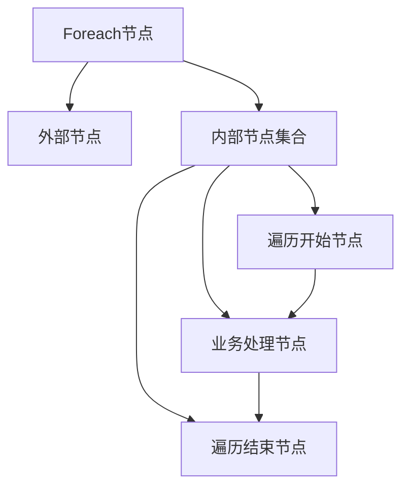
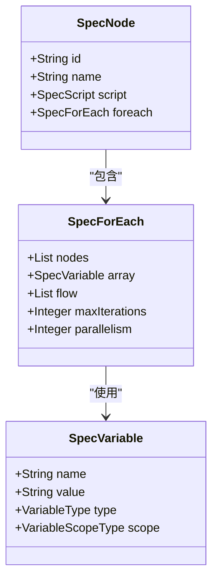
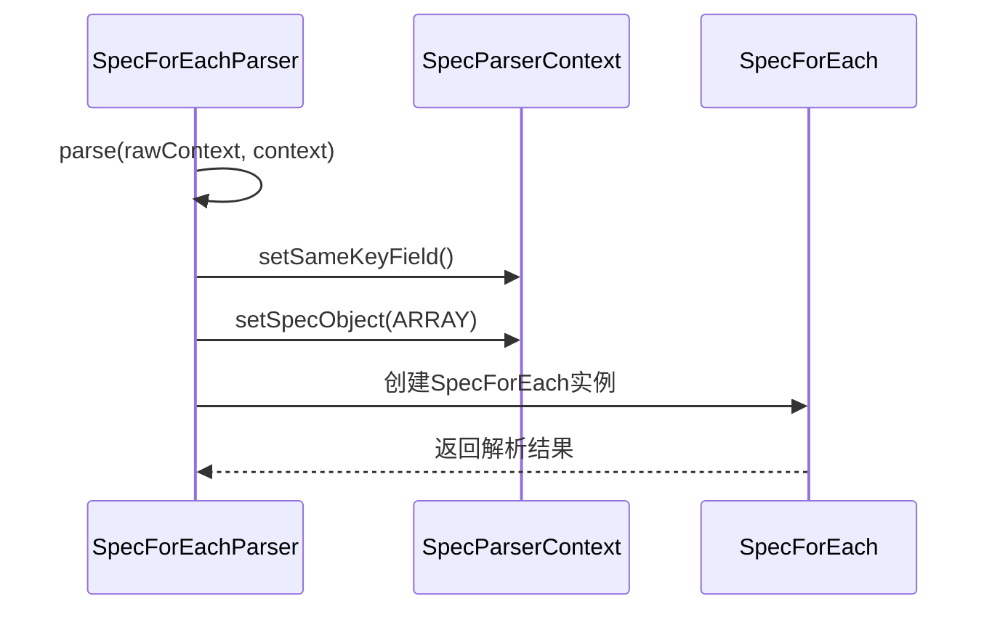
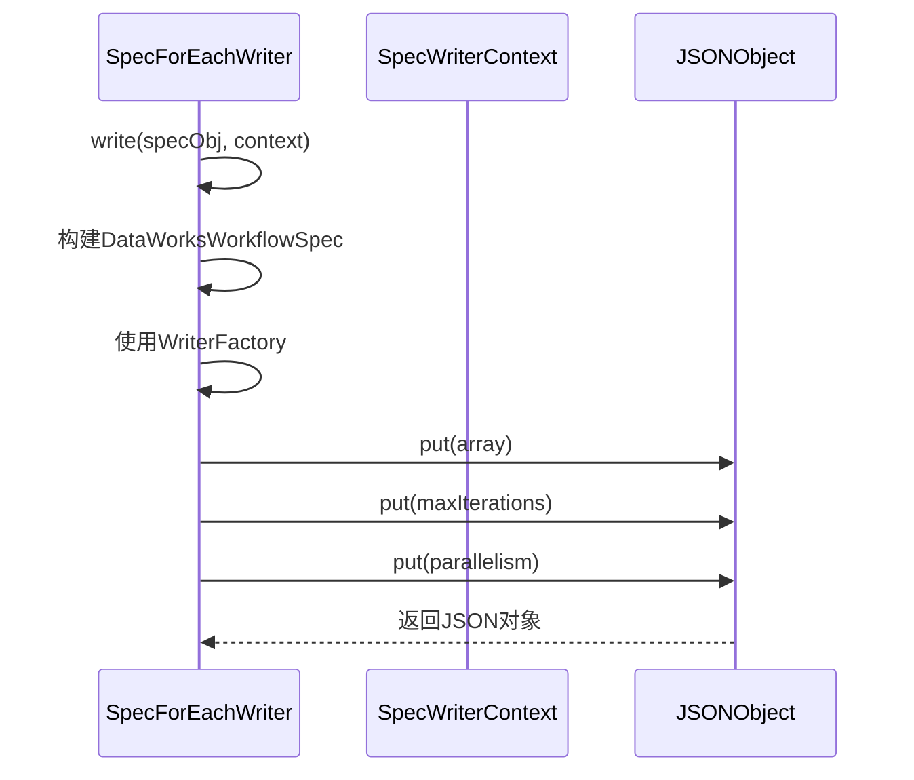
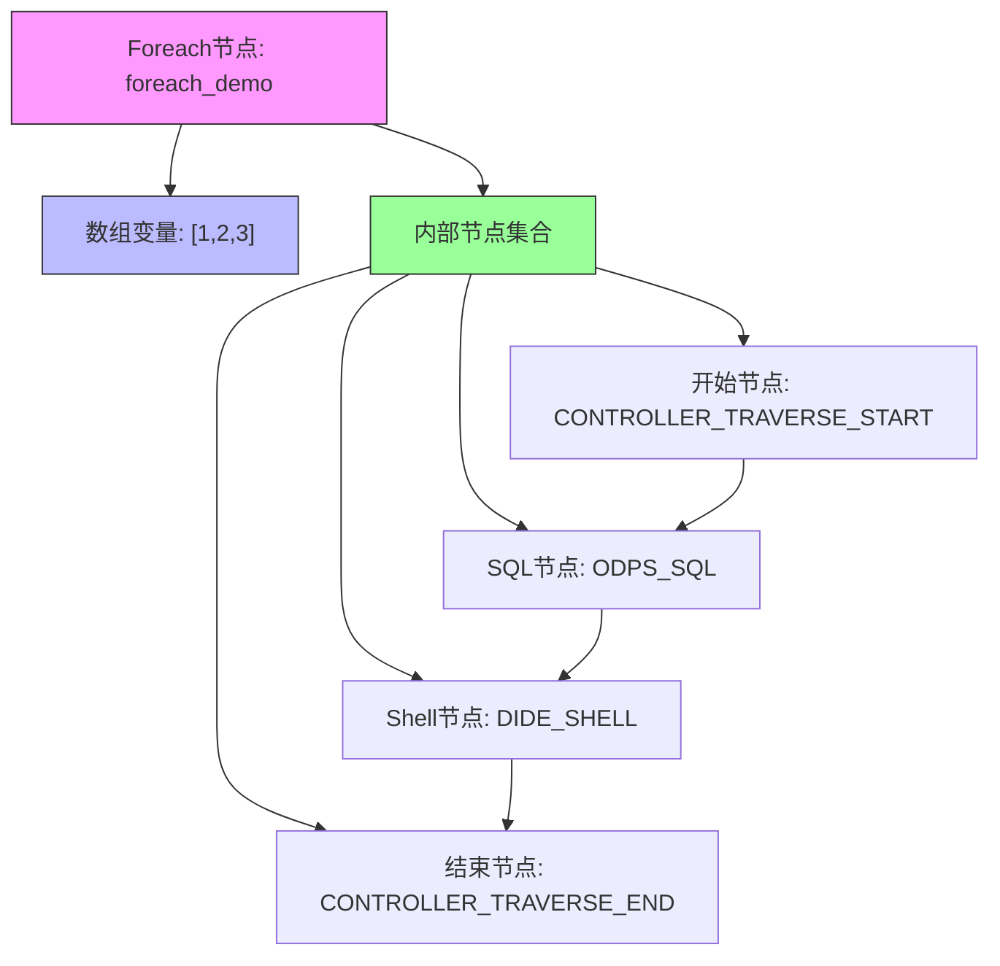

# Foreach节点支持

<cite>
**本文档引用文件**  
- [SpecForEach.schema.json](file://spec/src/main/resources/spec/schema/SpecForEach.schema.json)
- [SpecForEach.java](file://spec/src/main/java/com/aliyun/dataworks/common/spec/domain/noref/SpecForEach.java)
- [SpecForEachParser.java](file://spec/src/main/java/com/aliyun/dataworks/common/spec/parser/impl/SpecForEachParser.java)
- [SpecForEachWriter.java](file://spec/src/main/java/com/aliyun/dataworks/common/spec/writer/impl/SpecForEachWriter.java)
- [ForeachNodeSpecHandler.java](file://client/migrationx/migrationx-domain/migrationx-domain-dataworks/src/main/java/com/aliyun/dataworks/migrationx/domain/dataworks/service/spec/handler/ForeachNodeSpecHandler.java)
- [foreach.json](file://spec/src/test/resources/nodemodel/foreach.json)
- [foreach_demo.schedule.json](file://dwcli/myworkspace/foreach_demo/foreach_demo.schedule.json)
</cite>

## 目录
1. [简介](#简介)
2. [核心结构](#核心结构)
3. [数据模型](#数据模型)
4. [处理流程](#处理流程)
5. [序列化与反序列化](#序列化与反序列化)
6. [示例分析](#示例分析)
7. [配置参数](#配置参数)

## 简介
Foreach节点是DataWorks规范系统中的控制流节点，用于实现循环遍历功能。该节点允许用户定义一个数组变量，并在每次迭代中执行一组内部节点。Foreach节点支持最大迭代次数和并行度控制，适用于需要对数据集进行批量处理的场景。

**Section sources**
- [ForeachNodeSpecHandler.java](file://client/migrationx/migrationx-domain/migrationx-domain-dataworks/src/main/java/com/aliyun/dataworks/migrationx/domain/dataworks/service/spec/handler/ForeachNodeSpecHandler.java#L34-L39)

## 核心结构
Foreach节点的核心结构由外部节点容器和内部节点集合组成。外部节点作为循环的入口点，包含循环控制参数；内部节点构成循环体，在每次迭代中按定义的依赖关系执行。



**Diagram sources**
- [foreach_demo.schedule.json](file://dwcli/myworkspace/foreach_demo/foreach_demo.schedule.json#L10-L106)

## 数据模型
Foreach节点的数据模型定义了循环执行所需的所有属性，包括迭代数据源、内部节点、执行流程和控制参数。



**Diagram sources**
- [SpecForEach.java](file://spec/src/main/java/com/aliyun/dataworks/common/spec/domain/noref/SpecForEach.java#L32-L44)
- [SpecNode.java](file://spec/src/main/java/com/aliyun/dataworks/common/spec/domain/ref/SpecNode.java)

## 处理流程
Foreach节点的处理流程包括节点识别、内部节点提取、参数映射和结构构建四个主要步骤。

```mermaid
flowchart TD
Start([开始]) --> IdentifyNode["识别Foreach节点"]
IdentifyNode --> ExtractInnerNodes["提取内部节点"]
ExtractInnerNodes --> MapParameters["映射循环参数"]
MapParameters --> BuildStructure["构建Foreach结构"]
BuildStructure --> End([结束])
Note over IdentifyNode,ExtractInnerNodes: 使用CodeProgramType.CONTROLLER_TRAVERSE进行节点类型匹配
Note over MapParameters: 将loopDataArray参数映射为迭代数组
Note over BuildStructure: 设置最大迭代次数和执行流程
```

**Diagram sources**
- [ForeachNodeSpecHandler.java](file://client/migrationx/migrationx-domain/migrationx-domain-dataworks/src/main/java/com/aliyun/dataworks/migrationx/domain/dataworks/service/spec/handler/ForeachNodeSpecHandler.java#L44-L86)

## 序列化与反序列化
Foreach节点的序列化与反序列化由专门的解析器和写入器处理，确保JSON格式的正确转换。

### 反序列化流程


### 序列化流程


**Diagram sources**
- [SpecForEachParser.java](file://spec/src/main/java/com/aliyun/dataworks/common/spec/parser/impl/SpecForEachParser.java#L30-L50)
- [SpecForEachWriter.java](file://spec/src/main/java/com/aliyun/dataworks/common/spec/writer/impl/SpecForEachWriter.java#L34-L55)

## 示例分析
以下是一个完整的Foreach节点使用示例，展示了从定义到执行的完整流程。



**Diagram sources**
- [foreach_demo.schedule.json](file://dwcli/myworkspace/foreach_demo/foreach_demo.schedule.json#L1-L106)
- [foreach.json](file://spec/src/test/resources/nodemodel/foreach.json#L1-L205)

## 配置参数
Foreach节点支持以下配置参数：

| 参数名称 | 类型 | 描述 | 是否必需 |
|---------|------|------|---------|
| **nodes** | 数组 | 内部节点列表 | 是 |
| **array** | 对象 | 迭代数组变量 | 否 |
| **flow** | 数组 | 节点间依赖关系 | 否 |
| **maxIterations** | 整数 | 最大迭代次数 | 否 |
| **parallelism** | 整数 | 并行度 | 否 |

**Section sources**
- [SpecForEach.schema.json](file://spec/src/main/resources/spec/schema/SpecForEach.schema.json#L1-L30)
- [SpecForEach.java](file://spec/src/main/java/com/aliyun/dataworks/common/spec/domain/noref/SpecForEach.java#L32-L44)