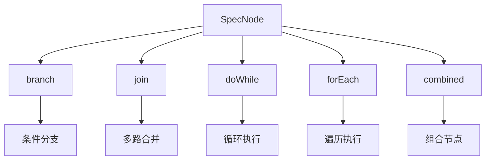
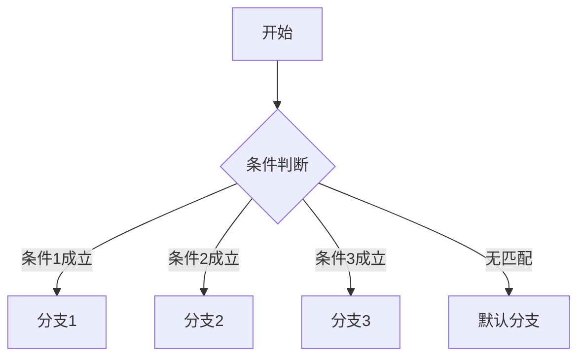
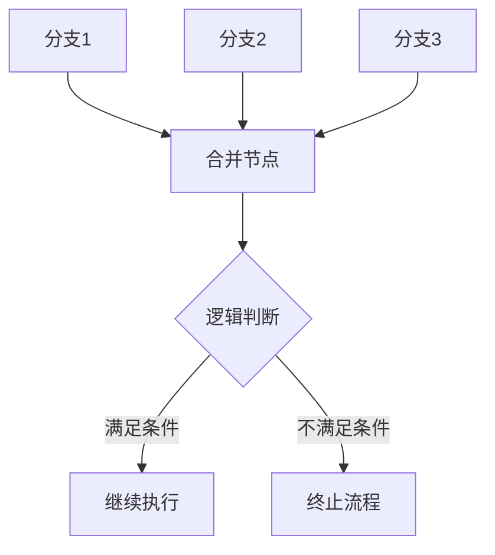
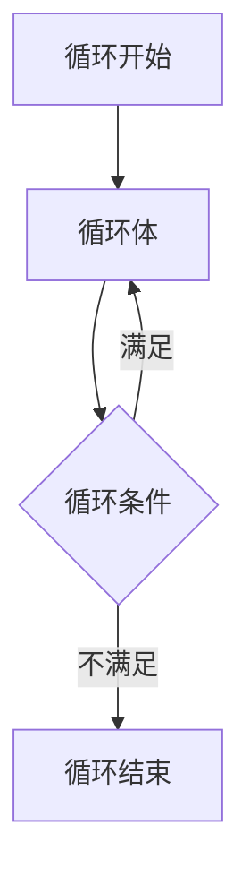
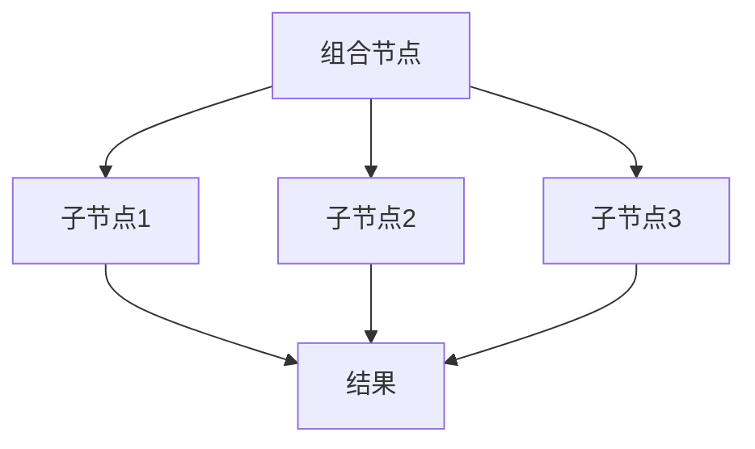
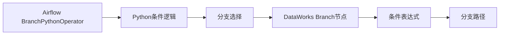

# 控制节点

<cite>
**本文档引用的文件**  
- [SpecNode.schema.json](file://spec/src/main/resources/spec/schema/SpecNode.schema.json)
- [SpecBranch.schema.json](file://spec/src/main/resources/spec/schema/SpecBranch.schema.json)
- [SpecBranches.schema.json](file://spec/src/main/resources/spec/schema/SpecBranches.schema.json)
- [SpecJoin.schema.json](file://spec/src/main/resources/spec/schema/SpecJoin.schema.json)
- [SpecJoinBranch.schema.json](file://spec/src/main/resources/spec/schema/SpecJoinBranch.schema.json)
- [SpecDoWhile.schema.json](file://spec/src/main/resources/spec/schema/SpecDoWhile.schema.json)
- [SpecForEach.schema.json](file://spec/src/main/resources/spec/schema/SpecForEach.schema.json)
- [SpecSubFlow.schema.json](file://spec/src/main/resources/spec/schema/SpecSubFlow.schema.json)
- [SpecLogic.schema.json](file://spec/src/main/resources/spec/schema/SpecLogic.schema.json)
- [dowhile.json](file://spec/src/test/resources/nodemodel/dowhile.json)
- [foreach.json](file://spec/src/test/resources/nodemodel/foreach.json)
- [branch.md](file://docs/spec-templates/control-flow/branch.md)
- [join.md](file://docs/spec-templates/control-flow/join.md)
- [combined-node.md](file://docs/spec-templates/nodes/combined-node.md)
- [migrationx-domain-airflow](file://client/migrationx/migrationx-domain/migrationx-domain-airflow)
- [dwcli/templates](file://dwcli/dwcli/templates)
</cite>

## 目录
1. [引言](#引言)
2. [控制流节点设计原理](#控制流节点设计原理)
3. [分支节点（Branch）](#分支节点branch)
4. [合并节点（Join）](#合并节点join)
5. [循环节点（DoWhile）](#循环节点dowhile)
6. [组合节点（Combined Node）](#组合节点combined-node)
7. [源系统控制逻辑迁移](#源系统控制逻辑迁移)
8. [dwcli模板定义](#dwcli模板定义)
9. [典型问题调试策略](#典型问题调试策略)
10. [可靠性保障建议](#可靠性保障建议)

## 引言
本文档全面介绍DataWorks平台中控制流节点的设计原理与使用方法，重点解析SpecNode中branch、join、doWhile、combined等控制结构字段的语义和配置方式。通过流程图和代码示例展示如何构建复杂的条件执行逻辑和循环处理流程，说明MigrationX如何将源系统的控制逻辑（如Airflow的BranchPythonOperator）转换为DataWorks的控制节点，并提供dwcli中控制节点的模板定义。

## 控制流节点设计原理
DataWorks的控制流节点基于SpecNode模型实现，通过在节点定义中嵌入特定的控制结构字段来实现复杂的流程控制。这些控制结构作为SpecNode的可选字段，允许在单个节点内部定义子工作流和控制逻辑。

**图示来源**
- [SpecNode.schema.json](file://spec/src/main/resources/spec/schema/SpecNode.schema.json#L72-L85)

**本节来源**
- [SpecNode.schema.json](file://spec/src/main/resources/spec/schema/SpecNode.schema.json)

## 分支节点（Branch）
分支节点通过`branch`字段实现条件分支逻辑，允许根据变量值或节点输出决定后续执行路径。

### 语义与配置
分支节点的核心是`SpecBranch`结构，包含一个`branches`数组，每个分支包含：
- `when`: 条件表达式
- `valueType`: 变量类型（System, Constant, NodeOutput等）
- `fromVariable`: 来源变量
- `output`: 目标输出

**图示来源**
- [SpecBranch.schema.json](file://spec/src/main/resources/spec/schema/SpecBranch.schema.json)
- [SpecBranches.schema.json](file://spec/src/main/resources/spec/schema/SpecBranches.schema.json)

**本节来源**
- [SpecBranch.schema.json](file://spec/src/main/resources/spec/schema/SpecBranch.schema.json#L1-L15)
- [SpecBranches.schema.json](file://spec/src/main/resources/spec/schema/SpecBranches.schema.json#L1-L36)
- [branch.md](file://docs/spec-templates/control-flow/branch.md)

## 合并节点（Join）
合并节点通过`join`字段实现多路合并逻辑，支持基于逻辑表达式的合并条件。

### 语义与配置
合并节点的核心是`SpecJoin`结构，包含：
- `branches`: 合并分支数组
- `logic`: 逻辑表达式
- `resultStatus`: 结果状态

每个`SpecJoinBranch`包含：
- `name`: 分支名称
- `nodeId`: 节点ID
- `output`: 输出定义
- `assertion`: 断言条件

**图示来源**
- [SpecJoin.schema.json](file://spec/src/main/resources/spec/schema/SpecJoin.schema.json)
- [SpecJoinBranch.schema.json](file://spec/src/main/resources/spec/schema/SpecJoinBranch.schema.json)

**本节来源**
- [SpecJoin.schema.json](file://spec/src/main/resources/spec/schema/SpecJoin.schema.json#L1-L21)
- [SpecJoinBranch.schema.json](file://spec/src/main/resources/spec/schema/SpecJoinBranch.schema.json#L1-L35)
- [join.md](file://docs/spec-templates/control-flow/join.md)

## 循环节点（DoWhile）
循环节点通过`doWhile`字段实现循环执行逻辑，支持最大迭代次数限制。

### 语义与配置
循环节点的核心是`SpecDoWhile`结构，包含：
- `nodes`: 循环体节点数组
- `specWhile`: 循环条件节点
- `flow`: 节点间依赖关系
- `maxIterations`: 最大迭代次数

**图示来源**
- [SpecDoWhile.schema.json](file://spec/src/main/resources/spec/schema/SpecDoWhile.schema.json)
- [dowhile.json](file://spec/src/test/resources/nodemodel/dowhile.json)

**本节来源**
- [SpecDoWhile.schema.json](file://spec/src/main/resources/spec/schema/SpecDoWhile.schema.json#L1-L31)
- [dowhile.json](file://spec/src/test/resources/nodemodel/dowhile.json)

## 组合节点（Combined Node）
组合节点通过`combined`字段（实际引用`SpecSubFlow`）实现节点组合，将多个节点封装为一个逻辑单元。

### 语义与配置
组合节点的核心是`SpecSubFlow`结构，包含：
- `output`: 输出定义
- `id`: 子流程ID
- `nodes`: 包含的节点数组

**图示来源**
- [SpecSubFlow.schema.json](file://spec/src/main/resources/spec/schema/SpecSubFlow.schema.json)
- [combined-node.md](file://docs/spec-templates/nodes/combined-node.md)

**本节来源**
- [SpecSubFlow.schema.json](file://spec/src/main/resources/spec/schema/SpecSubFlow.schema.json#L1-L38)
- [combined-node.md](file://docs/spec-templates/nodes/combined-node.md)

## 源系统控制逻辑迁移
MigrationX工具负责将源系统的控制逻辑转换为DataWorks的控制节点。

### Airflow到DataWorks的转换
对于Airflow的`BranchPythonOperator`，MigrationX执行以下转换：
1. 将Python分支逻辑转换为DataWorks的`branch`节点
2. 保持原有的条件判断逻辑
3. 映射分支目标到相应的DataWorks节点

**本节来源**
- [migrationx-domain-airflow](file://client/migrationx/migrationx-domain/migrationx-domain-airflow)
- [airflow_dag_parser](file://client/migrationx/migrationx-transformer/src/main/python/airflow_dag_parser)

## dwcli模板定义
dwcli提供了控制节点的模板定义，便于快速创建和管理控制流节点。

### 模板结构
控制节点模板位于`dwcli/templates`目录，包含：
- `manual-workflow.template.json`: 手动工作流模板
- `odps-sql-daily.template.json`: ODPS SQL每日任务模板
- `python-daily.template.json`: Python每日任务模板
- `shell-daily.template.json`: Shell每日任务模板

**本节来源**
- [dwcli/templates](file://dwcli/dwcli/templates)

## 典型问题调试策略
针对控制节点的常见问题提供以下调试策略：

### 逻辑死锁
- **现象**: 流程无法继续执行
- **排查方法**: 检查循环条件是否永远为真
- **解决方案**: 设置合理的`maxIterations`值

### 条件判断失效
- **现象**: 分支选择不符合预期
- **排查方法**: 验证条件表达式语法和变量值
- **解决方案**: 使用调试模式查看变量实际值

### 循环溢出
- **现象**: 循环次数超出预期
- **排查方法**: 检查循环条件节点的输出
- **解决方案**: 添加循环计数器和终止条件

**本节来源**
- [SpecDoWhile.schema.json](file://spec/src/main/resources/spec/schema/SpecDoWhile.schema.json)
- [SpecBranch.schema.json](file://spec/src/main/resources/spec/schema/SpecBranch.schema.json)

## 可靠性保障建议
为确保控制节点的可靠运行，建议采取以下措施：

1. **设置合理的超时时间**: 为每个控制节点配置适当的`timeout`值
2. **配置重试机制**: 设置`rerunMode`和`rerunTimes`以应对临时故障
3. **监控循环执行**: 为循环节点设置`maxIterations`防止无限循环
4. **验证条件表达式**: 在生产环境部署前充分测试条件逻辑
5. **使用默认分支**: 为分支节点配置默认执行路径

**本节来源**
- [SpecNode.schema.json](file://spec/src/main/resources/spec/schema/SpecNode.schema.json)
- [SpecDoWhile.schema.json](file://spec/src/main/resources/spec/schema/SpecDoWhile.schema.json)