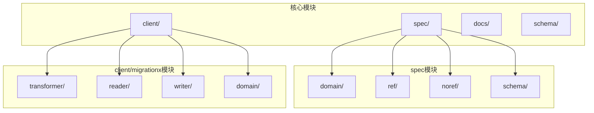
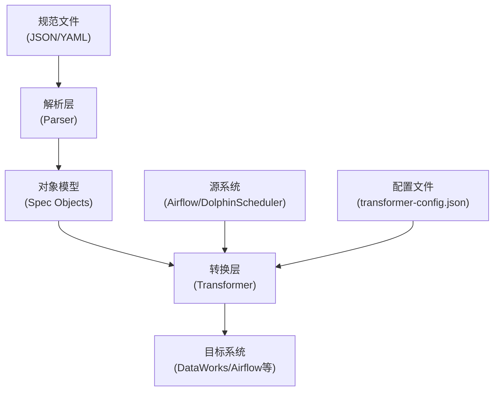
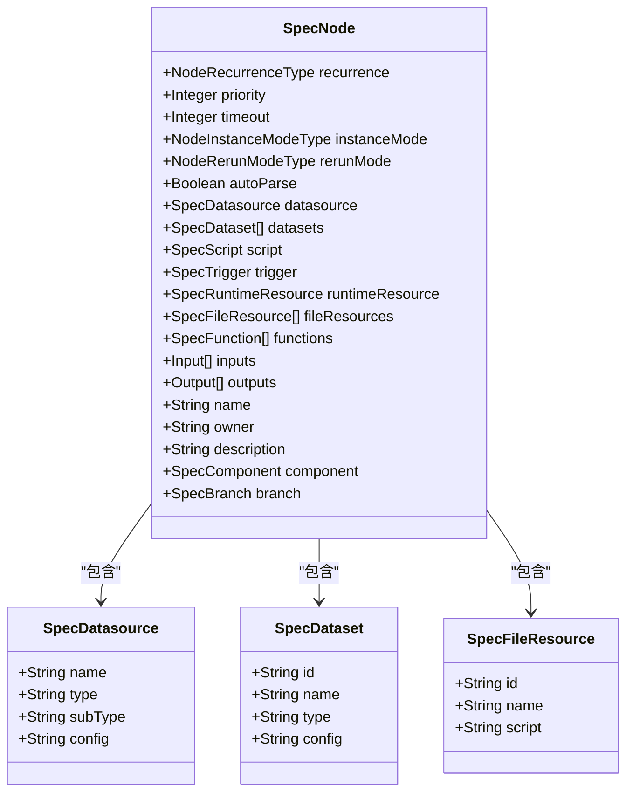
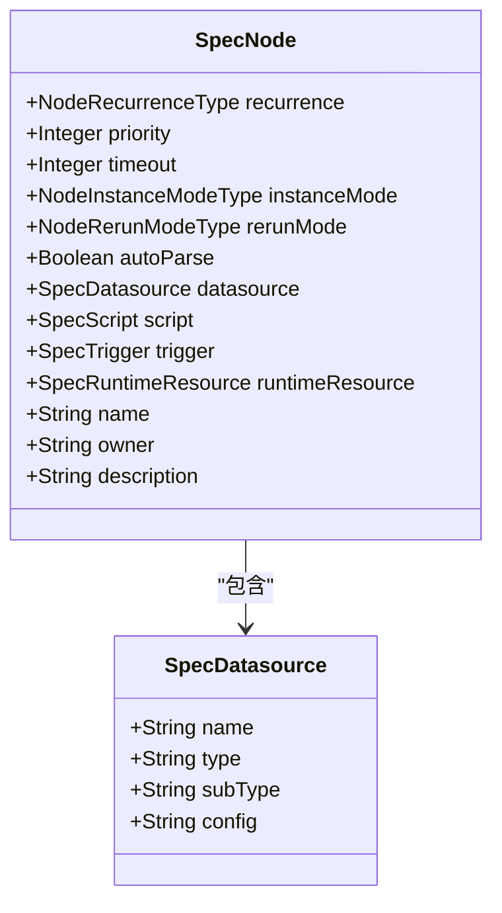
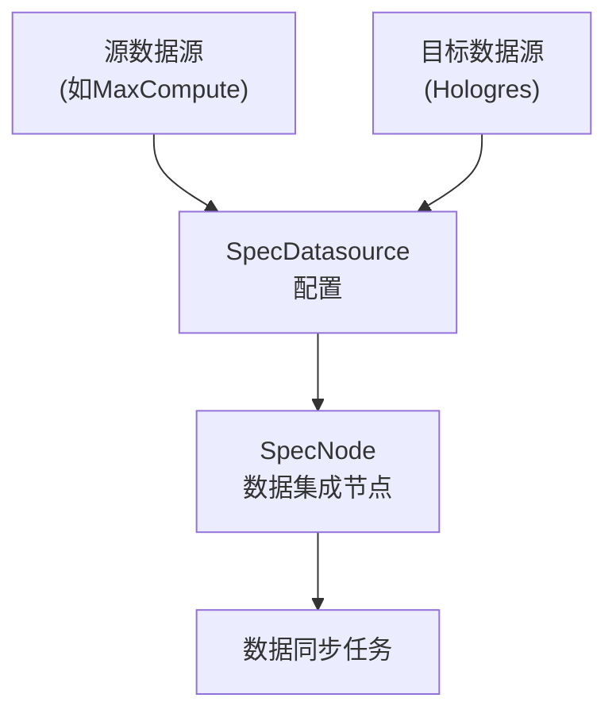
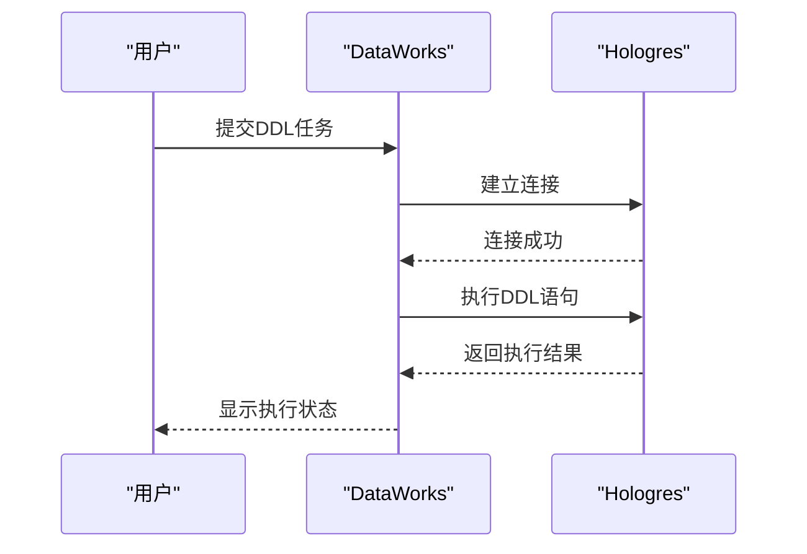
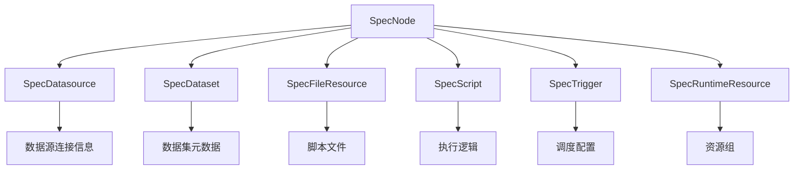
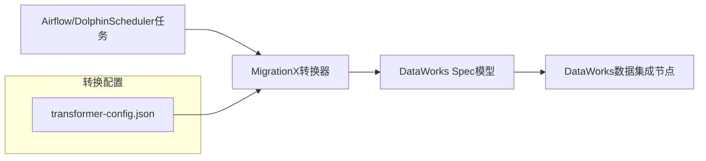
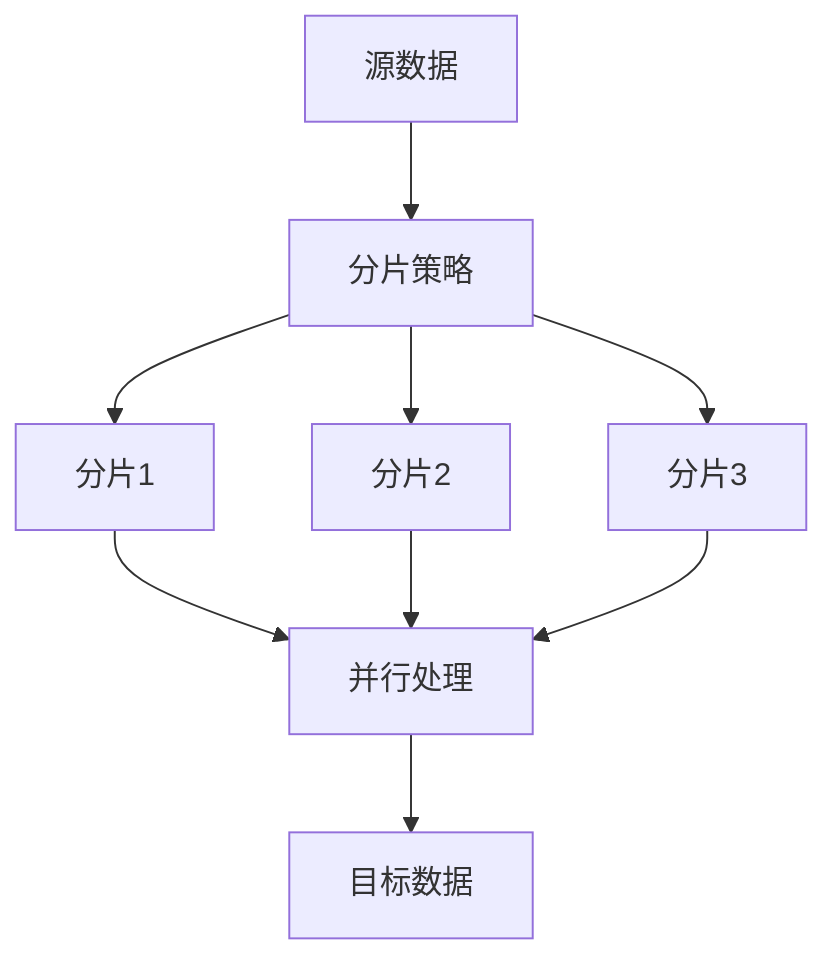

# 数据集成节点

<cite>
**本文档引用的文件**
- [DataWorksWorkflowSpec.java](file://spec/src/main/java/com/aliyun/dataworks/common/spec/domain/DataWorksWorkflowSpec.java)
- [SpecNode.java](file://spec/src/main/java/com/aliyun/dataworks/common/spec/domain/ref/SpecNode.java)
- [SpecDatasource.java](file://spec/src/main/java/com/aliyun/dataworks/common/spec/domain/ref/SpecDatasource.java)
- [SpecNode.schema.json](file://spec/src/main/resources/spec/schema/SpecNode.schema.json)
- [SpecDatasource.schema.json](file://spec/src/main/resources/spec/schema/SpecDatasource.schema.json)
- [hologres-sync-data.md](file://docs/spec-templates/nodes/hologres-sync-data.md)
- [hologres-sync-ddl.md](file://docs/spec-templates/nodes/hologres-sync-ddl.md)
- [dataworks-transformer-config-hologres-sample.json](file://client/migrationx/migrationx-transformer/src/main/conf/dataworks-transformer-config-hologres-sample.json)
- [usage.md](file://docs/migrationx/usage.md)
- [spec-fields.md](file://docs/spec/spec-fields.md)
</cite>

## 目录
1. [引言](#引言)
2. [项目结构](#项目结构)
3. [核心组件](#核心组件)
4. [架构概述](#架构概述)
5. [详细组件分析](#详细组件分析)
6. [依赖分析](#依赖分析)
7. [性能考虑](#性能考虑)
8. [故障排除指南](#故障排除指南)
9. [结论](#结论)

## 引言

本文档系统阐述了Hologres同步、Data Integration等数据集成类节点的模型结构与配置参数。详细说明了SpecNode中datasource、datasets、fileResources等字段在数据同步场景下的作用机制。通过实际案例展示如何定义数据源映射、同步策略和DDL变更任务。解释了MigrationX在转换Airflow或DolphinScheduler中的ETL任务时，如何映射到DataWorks的数据集成节点。提供了配置模板示例，并针对连接失败、数据倾斜、字段类型不匹配等问题提供了解决方案。同时给出了大规模数据同步的性能优化建议，如分片策略、并发度设置和容错机制。

## 项目结构

本文档所涉及的代码库主要包含以下几个核心模块：

- **client/**: 客户端工具，包括migrationx（迁移工具）和client-toolkits（工具包）
- **docs/**: 文档目录，包含开发指南、迁移使用说明和规范模板
- **dwcli/**: DataWorks命令行接口工具
- **schema/**: JSON Schema定义文件，用于验证数据结构
- **spec/**: 核心规范定义，包含数据模型和解析器

其中，数据集成节点的核心定义位于`spec/`模块中，而迁移转换功能主要在`client/migrationx/`模块中实现。



**Diagram sources**
- [DataWorksWorkflowSpec.java](file://spec/src/main/java/com/aliyun/dataworks/common/spec/domain/DataWorksWorkflowSpec.java)
- [SpecNode.java](file://spec/src/main/java/com/aliyun/dataworks/common/spec/domain/ref/SpecNode.java)

**Section sources**
- [DataWorksWorkflowSpec.java](file://spec/src/main/java/com/aliyun/dataworks/common/spec/domain/DataWorksWorkflowSpec.java)
- [SpecNode.java](file://spec/src/main/java/com/aliyun/dataworks/common/spec/domain/ref/SpecNode.java)

## 核心组件

数据集成节点的核心组件主要包括SpecNode、SpecDatasource、SpecDataset和SpecFileResource等类。这些组件共同构成了数据同步任务的模型结构。

SpecNode是数据集成节点的核心类，它包含了数据同步任务的所有配置信息，如数据源、数据集、文件资源等。SpecDatasource用于定义数据源的连接信息，SpecDataset用于定义数据集的元数据，而SpecFileResource则用于管理任务依赖的文件资源。

在数据同步场景下，这些组件通过特定的机制协同工作：SpecNode通过datasource字段引用SpecDatasource实例来获取数据源连接信息，通过datasets字段引用一个或多个SpecDataset实例来定义数据同步的范围和策略，通过fileResources字段引用SpecFileResource实例来管理任务执行所需的脚本和配置文件。

**Section sources**
- [SpecNode.java](file://spec/src/main/java/com/aliyun/dataworks/common/spec/domain/ref/SpecNode.java)
- [SpecDatasource.java](file://spec/src/main/java/com/aliyun/dataworks/common/spec/domain/ref/SpecDatasource.java)
- [SpecNode.schema.json](file://spec/src/main/resources/spec/schema/SpecNode.schema.json)
- [SpecDatasource.schema.json](file://spec/src/main/resources/spec/schema/SpecDatasource.schema.json)

## 架构概述

数据集成节点的架构设计遵循了模块化和可扩展的原则，主要由以下几个层次构成：

1. **规范层(Specification Layer)**: 定义了数据集成任务的抽象模型，包括节点、数据源、数据集等核心概念
2. **解析层(Parser Layer)**: 负责将JSON/YAML格式的规范文件解析为内存中的对象模型
3. **转换层(Transformer Layer)**: 实现不同调度系统之间的任务转换，如从Airflow/DolphinScheduler到DataWorks
4. **执行层(Execution Layer)**: 负责将规范模型转换为具体的执行指令并提交到目标系统



**Diagram sources**
- [SpecNode.java](file://spec/src/main/java/com/aliyun/dataworks/common/spec/domain/ref/SpecNode.java)
- [SpecDatasource.java](file://spec/src/main/java/aliyun/dataworks/common/spec/domain/ref/SpecDatasource.java)

## 详细组件分析

### Hologres数据同步节点分析

Hologres数据同步节点(HOLOGRES_SYNC_DATA)是数据集成节点的一种具体实现，用于将数据从源端同步到Hologres实例。

#### 模型结构


**Diagram sources**
- [SpecNode.java](file://spec/src/main/java/com/aliyun/dataworks/common/spec/domain/ref/SpecNode.java)
- [SpecDatasource.java](file://spec/src/main/java/com/aliyun/dataworks/common/spec/domain/ref/SpecDatasource.java)
- [SpecNode.schema.json](file://spec/src/main/resources/spec/schema/SpecNode.schema.json)

#### 配置参数说明

Hologres数据同步节点的关键配置参数包括：

- **datasource**: 数据源配置，包含连接信息和认证凭证
- **datasets**: 数据集配置，定义同步的数据范围和映射关系
- **fileResources**: 文件资源，包含同步任务所需的脚本和配置文件
- **script**: 执行脚本，包含具体的同步逻辑

在数据同步场景下，这些字段的作用机制如下：
- `datasource`字段用于建立与源系统和目标系统的连接
- `datasets`字段用于定义需要同步的数据表或数据集
- `fileResources`字段用于管理同步任务依赖的脚本文件
- `script`字段包含具体的同步逻辑，如数据抽取、转换和加载操作

**Section sources**
- [hologres-sync-data.md](file://docs/spec-templates/nodes/hologres-sync-data.md)
- [SpecNode.java](file://spec/src/main/java/com/aliyun/dataworks/common/spec/domain/ref/SpecNode.java)

### Hologres DDL节点分析

Hologres DDL节点(HOLOGRES_SYNC_DDL)用于在Hologres实例中执行数据定义语言(DDL)操作。

#### 模型结构


**Diagram sources**
- [SpecNode.java](file://spec/src/main/java/com/aliyun/dataworks/common/spec/domain/ref/SpecNode.java)
- [SpecDatasource.java](file://spec/src/main/java/com/aliyun/dataworks/common/spec/domain/ref/SpecDatasource.java)

#### 配置参数说明

Hologres DDL节点的关键配置参数相对简单，主要包含：

- **datasource**: 指定要执行DDL操作的Hologres数据源
- **script**: 包含具体的DDL语句，如CREATE TABLE、ALTER TABLE等

与数据同步节点相比，DDL节点不需要datasets和fileResources等复杂配置，因为它主要关注表结构的变更而非数据的移动。

**Section sources**
- [hologres-sync-ddl.md](file://docs/spec-templates/nodes/hologres-sync-ddl.md)
- [SpecNode.java](file://spec/src/main/java/com/aliyun/dataworks/common/spec/domain/ref/SpecNode.java)

### 数据源映射与同步策略

在数据同步场景下，SpecNode中的datasource、datasets和fileResources字段协同工作，实现复杂的数据集成任务。

#### 数据源映射机制


**Diagram sources**
- [SpecDatasource.java](file://spec/src/main/java/com/aliyun/dataworks/common/spec/domain/ref/SpecDatasource.java)

#### 同步策略配置

同步策略主要通过datasets字段进行配置，可以定义以下几种同步模式：

- **全量同步**: 每次同步所有数据
- **增量同步**: 只同步新增或变更的数据
- **分区同步**: 基于分区字段进行同步

```json
{
  "datasets": [
    {
      "id": "dataset_1",
      "name": "sales_data",
      "type": "INCREMENTAL",
      "config": "{\"partitionColumn\": \"ds\", \"incrementalColumn\": \"update_time\"}"
    }
  ]
}
```

**Section sources**
- [spec-fields.md](file://docs/spec/spec-fields.md)
- [hologres-sync-data.md](file://docs/spec-templates/nodes/hologres-sync-data.md)

### DDL变更任务定义

DDL变更任务通过HOLOGRES_SYNC_DDL类型的SpecNode来定义，主要用于管理Hologres表结构。

#### DDL任务执行流程


**Diagram sources**
- [hologres-sync-ddl.md](file://docs/spec-templates/nodes/hologres-sync-ddl.md)

#### 实际用例

Hologres DDL节点通常用于以下场景：
1. 在工作流开始前创建所需的表结构
2. 在数据处理完成后修改表的结构或属性
3. 执行表的分区管理操作

**Section sources**
- [hologres-sync-ddl.md](file://docs/spec-templates/nodes/hologres-sync-ddl.md)

## 依赖分析

数据集成节点与其他组件之间存在复杂的依赖关系，这些关系主要体现在以下几个方面：



**Diagram sources**
- [SpecNode.java](file://spec/src/main/java/com/aliyun/dataworks/common/spec/domain/ref/SpecNode.java)
- [SpecDatasource.java](file://spec/src/main/java/com/aliyun/dataworks/common/spec/domain/ref/SpecDatasource.java)

### MigrationX转换机制

MigrationX在转换Airflow或DolphinScheduler中的ETL任务时，通过以下机制映射到DataWorks的数据集成节点：



**Diagram sources**
- [usage.md](file://docs/migrationx/usage.md)
- [dataworks-transformer-config-hologres-sample.json](file://client/migrationx/migrationx-transformer/src/main/conf/dataworks-transformer-config-hologres-sample.json)

转换过程中的关键映射规则包括：
- Airflow的PythonOperator映射为DIDE_SHELL节点
- DolphinScheduler的SQL节点根据数据库类型映射为相应的DataWorks SQL节点
- 调度配置（cron表达式、依赖关系等）被转换为DataWorks的调度策略

**Section sources**
- [usage.md](file://docs/migrationx/usage.md)
- [dataworks-transformer-config-hologres-sample.json](file://client/migrationx/migrationx-transformer/src/main/conf/dataworks-transformer-config-hologres-sample.json)

## 性能考虑

大规模数据同步的性能优化需要从多个维度进行考虑：

### 分片策略


**Diagram sources**
- [hologres-sync-data.md](file://docs/spec-templates/nodes/hologres-sync-data.md)

### 并发度设置
合理的并发度设置可以显著提升数据同步性能，但需要平衡资源消耗和系统负载。

### 容错机制
完善的容错机制包括：
- 任务重试策略
- 断点续传功能
- 错误数据隔离

**Section sources**
- [hologres-sync-data.md](file://docs/spec-templates/nodes/hologres-sync-data.md)

## 故障排除指南

### 常见问题及解决方案

| 问题类型 | 可能原因 | 解决方案 |
|--------|--------|--------|
| 连接失败 | 网络问题、认证信息错误 | 检查网络连接，验证认证信息 |
| 数据倾斜 | 分片不均匀、热点数据 | 优化分片策略，重新分布数据 |
| 字段类型不匹配 | 源目标类型不兼容 | 添加类型转换逻辑，调整映射关系 |

**Section sources**
- [hologres-sync-data.md](file://docs/spec-templates/nodes/hologres-sync-data.md)
- [hologres-sync-ddl.md](file://docs/spec-templates/nodes/hologres-sync-ddl.md)

## 结论

本文档全面分析了Hologres同步、Data Integration等数据集成类节点的模型结构与配置参数。通过深入解析SpecNode中datasource、datasets、fileResources等字段的作用机制，展示了如何定义数据源映射、同步策略和DDL变更任务。同时，详细说明了MigrationX在转换Airflow或DolphinScheduler中的ETL任务时的映射机制，并提供了配置模板示例和常见问题的解决方案。对于大规模数据同步场景，给出了分片策略、并发度设置和容错机制等性能优化建议，为数据集成任务的设计和实施提供了全面的指导。