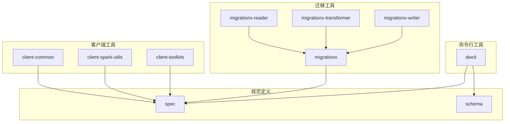
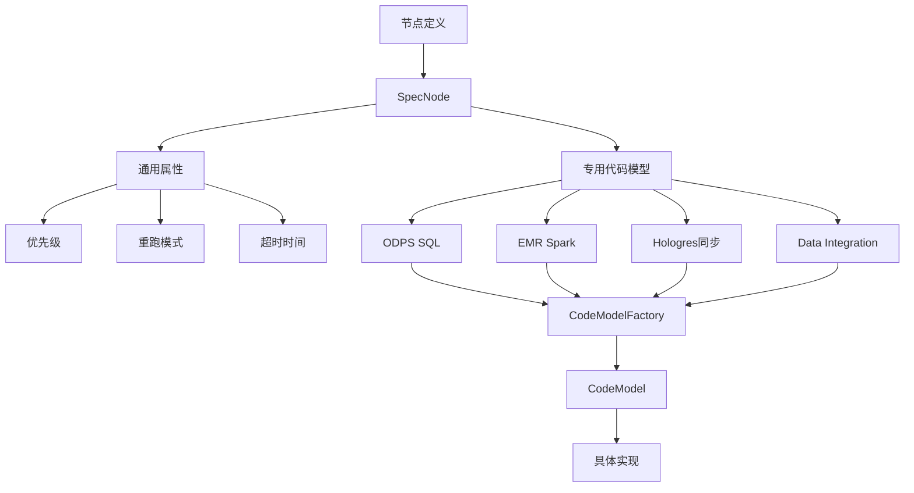
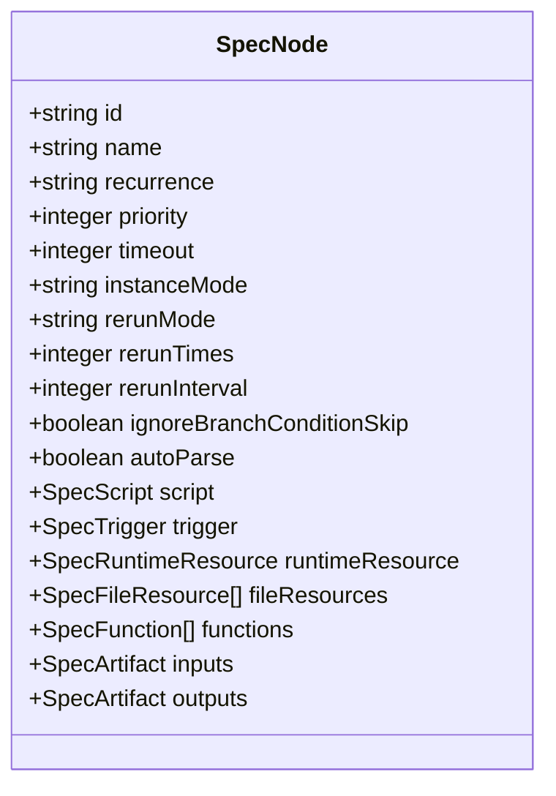
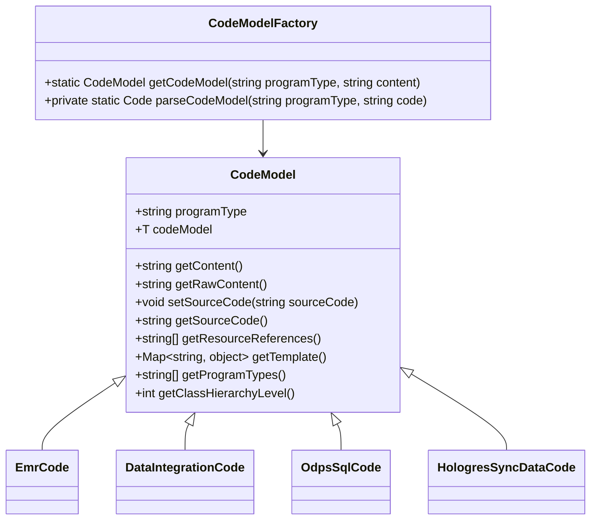
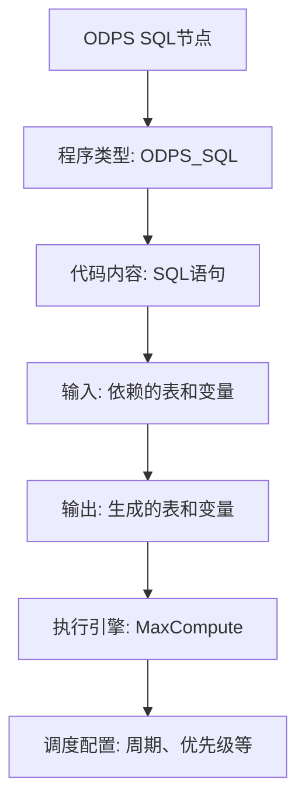
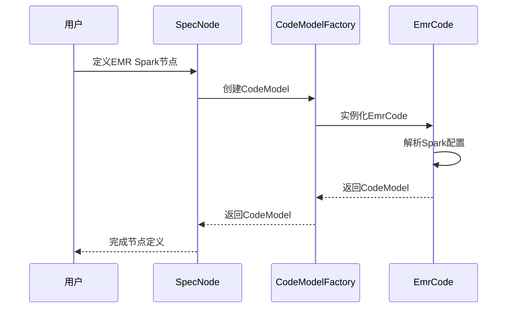
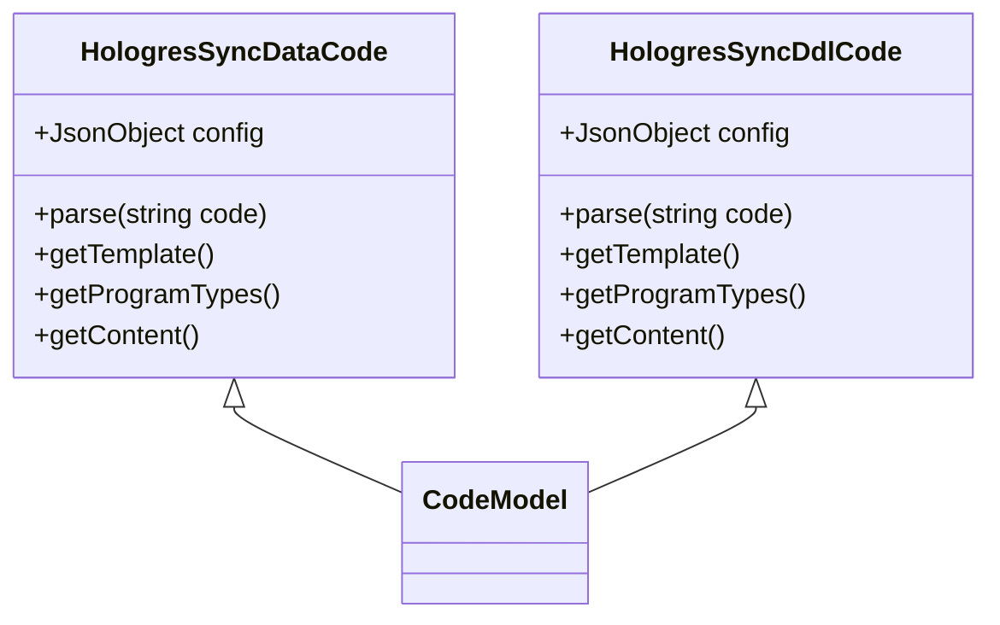
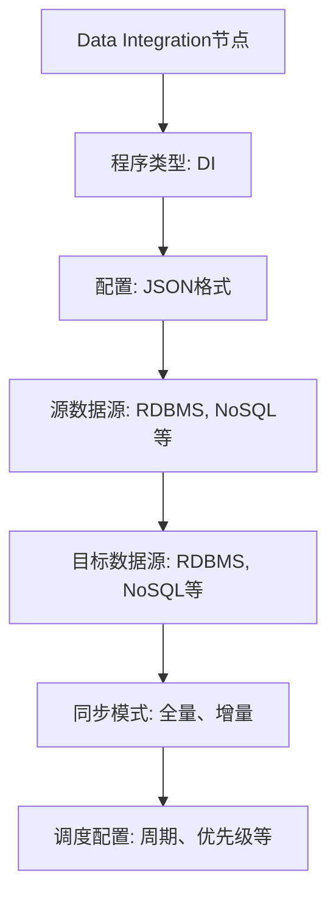
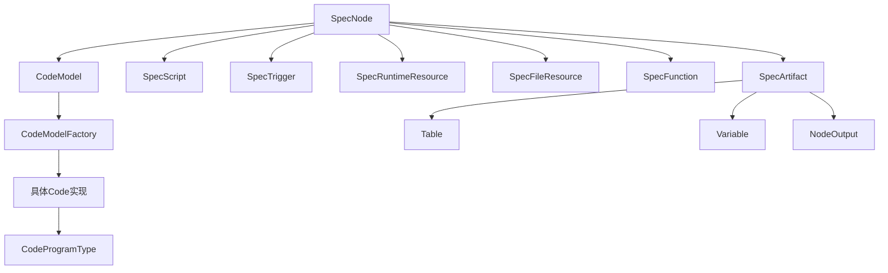

# 节点类型

<cite>
**本文档引用的文件**
- [node.schema.json](file://schema/node.schema.json)
- [SpecNode.schema.json](file://spec/src/main/resources/spec/schema/SpecNode.schema.json)
- [CodeModel.java](file://spec/src/main/java/com/aliyun/dataworks/common/spec/domain/dw/codemodel/CodeModel.java)
- [CodeModelFactory.java](file://spec/src/main/java/com/aliyun/dataworks/common/spec/domain/dw/codemodel/CodeModelFactory.java)
- [DataWorksNode.java](file://spec/src/main/java/com/aliyun/dataworks/common/spec/domain/dw/nodemodel/DataWorksNode.java)
- [EmrCode.java](file://spec/src/main/java/com/aliyun/dataworks/common/spec/domain/dw/codemodel/EmrCode.java)
- [DataIntegrationCode.java](file://spec/src/main/java/com/aliyun/dataworks/common/spec/domain/dw/codemodel/DataIntegrationCode.java)
- [CodeProgramType.java](file://spec/src/main/java/com/aliyun/dataworks/common/spec/domain/dw/types/CodeProgramType.java)
- [odps-sql.md](file://docs/spec-templates/nodes/odps-sql.md)
- [emr-spark.md](file://docs/spec-templates/nodes/emr-spark.md)
- [hologres-sync-data.md](file://docs/spec-templates/nodes/hologres-sync-data.md)
- [hologres-sync-ddl.md](file://docs/spec-templates/nodes/hologres-sync-ddl.md)
- [dwcli](file://dwcli)
</cite>

## 目录
1. [介绍](#介绍)
2. [项目结构](#项目结构)
3. [核心组件](#核心组件)
4. [架构概述](#架构概述)
5. [详细组件分析](#详细组件分析)
6. [依赖分析](#依赖分析)
7. [性能考虑](#性能考虑)
8. [故障排除指南](#故障排除指南)
9. [结论](#结论)

## 介绍
本文档详细介绍了DataWorks Spec系统中的节点类型，包括ODPS SQL、EMR Spark、Hologres同步、Data Integration等各类节点的模型定义和配置参数。文档深入解析了SpecNode的通用属性（如优先级、重跑模式）和各类专用代码模型（CodeModel）的特有属性。通过实际代码示例，展示了如何定义不同类型的节点及其配置，并解释了节点类型系统如何支持MigrationX在不同调度系统间进行任务类型转换。同时，文档说明了这些节点类型在dwcli工具模板中的实现方式，针对节点配置错误和执行失败提供了解决方案，并给出了不同类型节点的性能调优建议。

## 项目结构
DataWorks Spec项目采用模块化设计，主要分为客户端工具、迁移工具、规范定义和命令行工具等几个核心部分。项目结构清晰地反映了其功能划分，其中spec模块定义了节点类型的核心模型，migrationx模块负责不同调度系统间的任务转换，dwcli提供了命令行接口来操作这些节点。

**图表来源**
- [node.schema.json](file://schema/node.schema.json)
- [SpecNode.schema.json](file://spec/src/main/resources/spec/schema/SpecNode.schema.json)

**章节来源**
- [node.schema.json](file://schema/node.schema.json)
- [SpecNode.schema.json](file://spec/src/main/resources/spec/schema/SpecNode.schema.json)

## 核心组件
DataWorks Spec系统的核心组件包括节点模型(SpecNode)、代码模型(CodeModel)、节点类型定义(CodeProgramType)和数据集成模型等。这些组件共同构成了一个完整的任务定义和执行框架，支持多种计算引擎和数据处理场景。

**章节来源**
- [CodeModel.java](file://spec/src/main/java/com/aliyun/dataworks/common/spec/domain/dw/codemodel/CodeModel.java)
- [DataWorksNode.java](file://spec/src/main/java/com/aliyun/dataworks/common/spec/domain/dw/nodemodel/DataWorksNode.java)
- [CodeProgramType.java](file://spec/src/main/java/com/aliyun/dataworks/common/spec/domain/dw/types/CodeProgramType.java)

## 架构概述
DataWorks Spec系统的架构设计遵循分层原则，从底层的数据模型到上层的应用接口，形成了一个完整的任务定义和转换体系。系统通过CodeModel工厂模式实现了对不同节点类型的动态解析和处理，支持灵活的扩展机制。

**图表来源**
- [CodeModel.java](file://spec/src/main/java/com/aliyun/dataworks/common/spec/domain/dw/codemodel/CodeModel.java)
- [CodeModelFactory.java](file://spec/src/main/java/com/aliyun/dataworks/common/spec/domain/dw/codemodel/CodeModelFactory.java)

## 详细组件分析

### 节点模型分析
DataWorks Spec系统中的节点模型(SpecNode)是任务定义的核心，它包含了节点的通用属性和专用代码模型。通用属性定义了所有节点共有的行为特征，而专用代码模型则针对不同类型的计算引擎提供了特定的配置参数。

#### 节点通用属性

**图表来源**
- [SpecNode.schema.json](file://spec/src/main/resources/spec/schema/SpecNode.schema.json)

#### 节点代码模型

**图表来源**
- [CodeModel.java](file://spec/src/main/java/com/aliyun/dataworks/common/spec/domain/dw/codemodel/CodeModel.java)
- [CodeModelFactory.java](file://spec/src/main/java/com/aliyun/dataworks/common/spec/domain/dw/codemodel/CodeModelFactory.java)
- [EmrCode.java](file://spec/src/main/java/com/aliyun/dataworks/common/spec/domain/dw/codemodel/EmrCode.java)
- [DataIntegrationCode.java](file://spec/src/main/java/com/aliyun/dataworks/common/spec/domain/dw/codemodel/DataIntegrationCode.java)

**章节来源**
- [CodeModel.java](file://spec/src/main/java/com/aliyun/dataworks/common/spec/domain/dw/codemodel/CodeModel.java)
- [CodeModelFactory.java](file://spec/src/main/java/com/aliyun/dataworks/common/spec/domain/dw/codemodel/CodeModelFactory.java)

### 专用节点类型分析

#### ODPS SQL节点
ODPS SQL节点是DataWorks中最常用的节点类型之一，用于执行MaxCompute SQL语句。该节点类型通过ODPS_SQL程序类型标识，支持标准的SQL语法和MaxCompute特有的扩展功能。

**图表来源**
- [CodeProgramType.java](file://spec/src/main/java/com/aliyun/dataworks/common/spec/domain/dw/types/CodeProgramType.java)
- [odps-sql.md](file://docs/spec-templates/nodes/odps-sql.md)

#### EMR Spark节点
EMR Spark节点用于在EMR集群上执行Spark作业，支持多种Spark作业类型，包括Spark SQL、Spark Streaming和Spark批处理等。该节点类型通过EMR_SPARK系列程序类型标识。

**图表来源**
- [EmrCode.java](file://spec/src/main/java/com/aliyun/dataworks/common/spec/domain/dw/codemodel/EmrCode.java)
- [CodeProgramType.java](file://spec/src/main/java/com/aliyun/dataworks/common/spec/domain/dw/types/CodeProgramType.java)
- [emr-spark.md](file://docs/spec-templates/nodes/emr-spark.md)

#### Hologres同步节点
Hologres同步节点用于在Hologres数据库之间同步数据和DDL变更。该节点类型包括Hologres同步数据(HOLOGRES_SYNC_DATA)和Hologres同步DDL(HOLOGRES_SYNC_DDL)两种子类型。

**图表来源**
- [CodeProgramType.java](file://spec/src/main/java/com/aliyun/dataworks/common/spec/domain/dw/types/CodeProgramType.java)
- [hologres-sync-data.md](file://docs/spec-templates/nodes/hologres-sync-data.md)
- [hologres-sync-ddl.md](file://docs/spec-templates/nodes/hologres-sync-ddl.md)

#### Data Integration节点
Data Integration节点用于定义数据集成任务，支持多种数据源之间的数据同步。该节点类型通过DI程序类型标识，使用JSON格式的配置来定义数据同步的源和目标。

**图表来源**
- [DataIntegrationCode.java](file://spec/src/main/java/com/aliyun/dataworks/common/spec/domain/dw/codemodel/DataIntegrationCode.java)
- [CodeProgramType.java](file://spec/src/main/java/com/aliyun/dataworks/common/spec/domain/dw/types/CodeProgramType.java)

## 依赖分析
DataWorks Spec系统的组件之间存在明确的依赖关系，这些依赖关系确保了系统的灵活性和可扩展性。通过分析这些依赖，可以更好地理解系统的架构设计和工作原理。

**图表来源**
- [SpecNode.schema.json](file://spec/src/main/resources/spec/schema/SpecNode.schema.json)
- [CodeModel.java](file://spec/src/main/java/com/aliyun/dataworks/common/spec/domain/dw/codemodel/CodeModel.java)
- [CodeModelFactory.java](file://spec/src/main/java/com/aliyun/dataworks/common/spec/domain/dw/codemodel/CodeModelFactory.java)
- [CodeProgramType.java](file://spec/src/main/java/com/aliyun/dataworks/common/spec/domain/dw/types/CodeProgramType.java)

**章节来源**
- [SpecNode.schema.json](file://spec/src/main/resources/spec/schema/SpecNode.schema.json)
- [CodeModel.java](file://spec/src/main/java/com/aliyun/dataworks/common/spec/domain/dw/codemodel/CodeModel.java)
- [CodeModelFactory.java](file://spec/src/main/java/com/aliyun/dataworks/common/spec/domain/dw/codemodel/CodeModelFactory.java)
- [CodeProgramType.java](file://spec/src/main/java/com/aliyun/dataworks/common/spec/domain/dw/types/CodeProgramType.java)

## 性能考虑
在设计和使用DataWorks Spec节点时，需要考虑多个性能因素。对于ODPS SQL节点，应优化SQL查询语句，避免全表扫描；对于EMR Spark节点，应合理配置资源参数，避免资源浪费；对于Hologres同步节点，应选择合适的数据同步模式，减少对源系统的压力；对于Data Integration节点，应合理设置并发度，提高数据同步效率。

## 故障排除指南
当节点配置错误或执行失败时，可以按照以下步骤进行排查：首先检查节点的通用属性配置是否正确，包括优先级、重跑模式等；然后检查专用代码模型的配置是否符合要求；最后检查输入输出依赖是否正确设置。对于执行失败的情况，应查看详细的错误日志，定位问题根源。

**章节来源**
- [node.schema.json](file://schema/node.schema.json)
- [SpecNode.schema.json](file://spec/src/main/resources/spec/schema/SpecNode.schema.json)
- [CodeModel.java](file://spec/src/main/java/com/aliyun/dataworks/common/spec/domain/dw/codemodel/CodeModel.java)

## 结论
DataWorks Spec系统通过统一的节点模型和灵活的代码模型设计，实现了对多种计算引擎和数据处理场景的支持。系统采用工厂模式和反射机制，能够动态解析和处理不同类型的节点，具有良好的扩展性和灵活性。通过dwcli工具，用户可以方便地创建和管理这些节点，实现高效的数据处理任务编排。