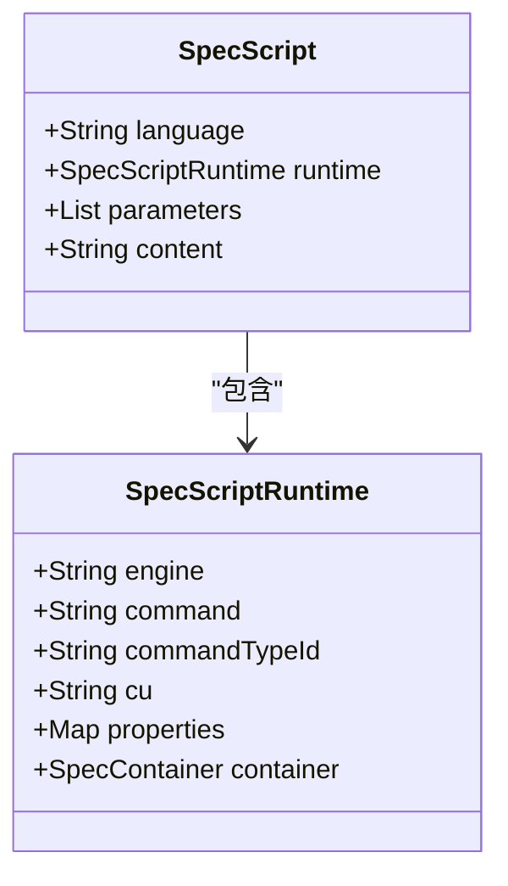
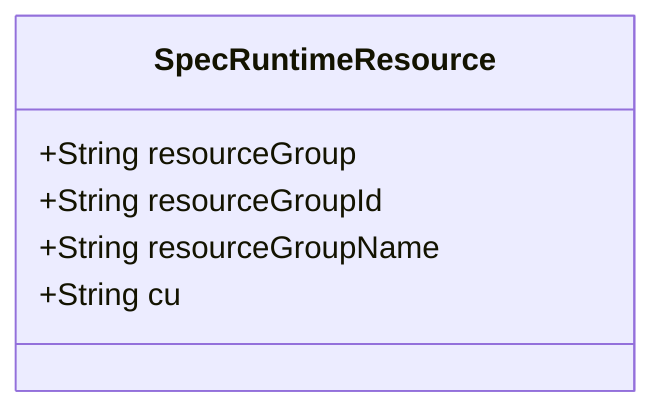
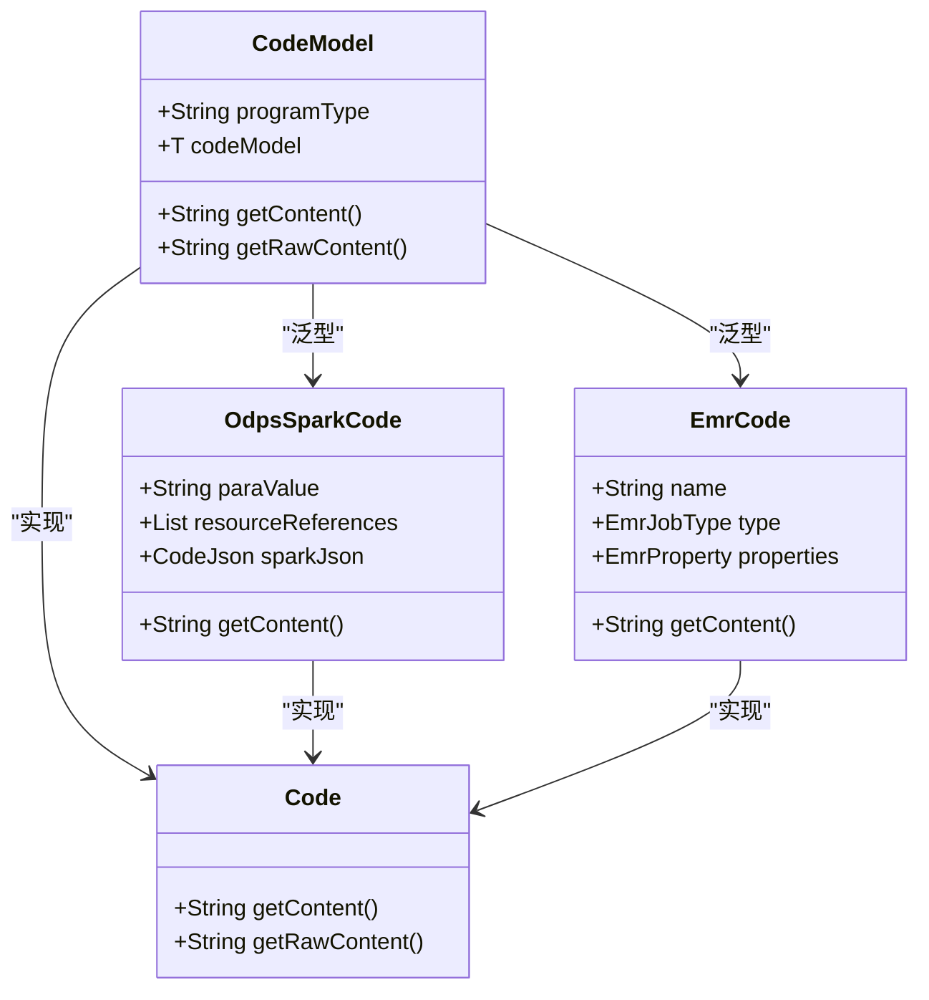
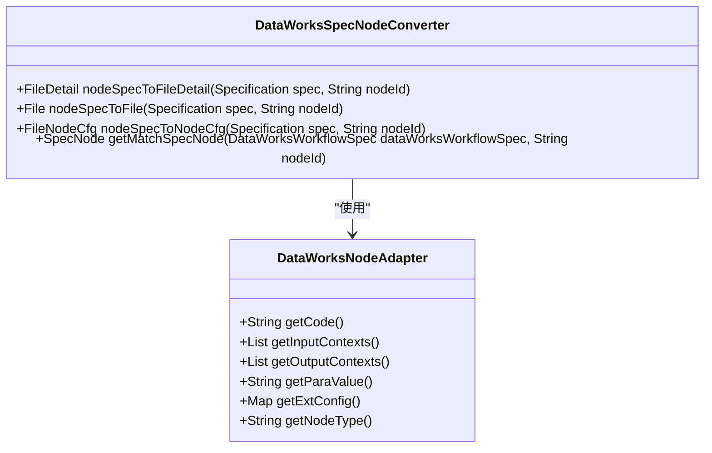
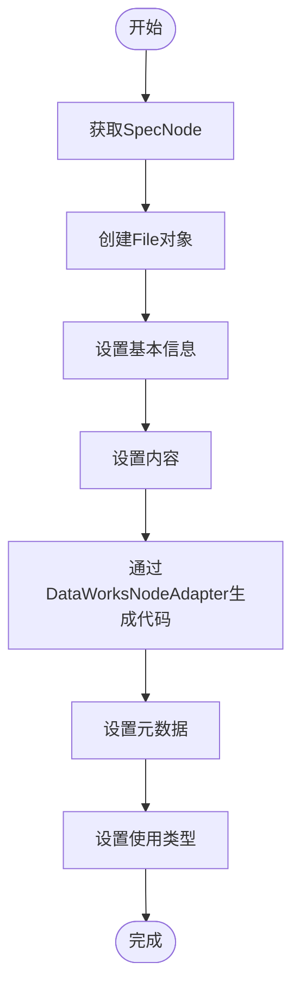

# 计算节点

<cite>
**本文档引用文件**   
- [DataWorksWorkflowSpec.java](file://spec/src/main/java/com/aliyun/dataworks/common/spec/domain/DataWorksWorkflowSpec.java)
- [node.schema.json](file://schema/node.schema.json)
- [script.schema.json](file://schema/script.schema.json)
- [runtimeResource.schema.json](file://schema/runtimeResource.schema.json)
- [odps-sql.md](file://docs/spec-templates/nodes/odps-sql.md)
- [emr-spark.md](file://docs/spec-templates/nodes/emr-spark.md)
- [pai-studio.md](file://docs/spec-templates/nodes/pai-studio.md)
- [component-sql.md](file://docs/spec-templates/nodes/component-sql.md)
- [pai-flow.md](file://docs/spec-templates/nodes/pai-flow.md)
- [SpecNode.java](file://spec/src/main/java/com/aliyun/dataworks/common/spec/domain/ref/SpecNode.java)
- [SpecScript.java](file://spec/src/main/java/com/aliyun/dataworks/common/spec/domain/ref/SpecScript.java)
- [SpecRuntimeResource.java](file://spec/src/main/java/com/aliyun/dataworks/common/spec/domain/ref/SpecRuntimeResource.java)
- [DataWorksSpecNodeConverter.java](file://client/migrationx/migrationx-domain/migrationx-domain-dataworks/src/main/java/com/aliyun/dataworks/migrationx/domain/dataworks/service/converter/DataWorksSpecNodeConverter.java)
- [TEMPLATE_GUIDE.md](file://dwcli/docs/TEMPLATE_GUIDE.md)
- [odps-sql-daily.template.json](file://dwcli/dwcli/templates/odps-sql-daily.template.json)
- [OdpsSparkCode.java](file://spec/src/main/java/com/aliyun/dataworks/common/spec/domain/dw/codemodel/OdpsSparkCode.java)
- [CodeModelFactoryTest.java](file://spec/src/test/java/com/aliyun/dataworks/common/spec/domain/dw/codemodel/CodeModelFactoryTest.java)
- [CodeModel.java](file://spec/src/main/java/com/aliyun/dataworks/common/spec/domain/dw/codemodel/CodeModel.java)
</cite>

## 目录
1. [引言](#引言)
2. [计算节点核心属性](#计算节点核心属性)
3. [ODPS SQL节点](#odps-sql节点)
4. [EMR Spark节点](#emr-spark节点)
5. [PAI-Studio节点](#pai-studio节点)
6. [组件SQL节点](#组件sql节点)
7. [PAI Flow节点](#pai-flow节点)
8. [CodeModel实现机制](#codemodel实现机制)
9. [迁移转换机制](#迁移转换机制)
10. [dwcli模板定义](#dwcli模板定义)
11. [常见问题排查](#常见问题排查)
12. [性能调优建议](#性能调优建议)
13. [结论](#结论)

## 引言

计算节点是DataWorks平台中执行数据处理、分析和机器学习任务的核心组件。本文档深入介绍ODPS SQL、EMR Spark、PAI-Studio等计算类节点的实现机制与配置方式，详细解析SpecNode中与计算任务相关的属性及其在不同计算引擎中的映射关系。通过代码示例说明如何通过CodeModel定义SQL脚本、Spark作业或机器学习任务，并展示MigrationX如何将源系统中的计算任务转换为DataWorks对应的计算节点类型。同时提供dwcli模板中计算节点的定义方法，针对资源不足、语法错误、依赖缺失等常见问题给出排查方案，最后给出各类计算节点的性能调优建议。

**本文档引用文件**   
- [DataWorksWorkflowSpec.java](file://spec/src/main/java/com/aliyun/dataworks/common/spec/domain/DataWorksWorkflowSpec.java)
- [node.schema.json](file://schema/node.schema.json)

## 计算节点核心属性

计算节点的核心属性定义了节点的行为、资源配置和执行环境。这些属性在SpecNode类中定义，并通过JSON Schema进行约束。

### SpecNode核心字段

SpecNode类定义了计算节点的所有核心属性，包括调度、优先级、超时、重试策略等。

```mermaid
classDiagram
class SpecNode {
+NodeRecurrenceType recurrence
+Integer priority
+Integer timeout
+TimeUnit timeoutUnit
+NodeInstanceModeType instanceMode
+NodeRerunModeType rerunMode
+Integer rerunTimes
+Integer rerunInterval
+Boolean ignoreBranchConditionSkip
+Boolean autoParse
+SpecDatasource datasource
+List<SpecDataset> datasets
+SpecScript script
+SpecTrigger trigger
+SpecRuntimeResource runtimeResource
+List<SpecFileResource> fileResources
+List<SpecFunction> functions
+List<Input> inputs
+List<Output> outputs
+SpecNodeRef reference
+SpecBranch branch
+SpecJoin join
+SpecDoWhile doWhile
+SpecForEach foreach
+SpecSubFlow combined
+SpecParamHub paramHub
+String name
+String owner
+String description
+SpecComponent component
+SpecScheduleStrategy strategy
+SpecSubFlow subflow
+SpecPaiflow paiflow
}
```



**图表来源**  
- [SpecNode.java](file://spec/src/main/java/com/aliyun/dataworks/common/spec/domain/ref/SpecNode.java#L53-L145)

### Script属性

Script属性定义了节点的脚本信息，包括路径、语言和运行时配置。



**图表来源**  
- [SpecScript.java](file://spec/src/main/java/com/aliyun/dataworks/common/spec/domain/ref/SpecScript.java#L34-L44)
- [script.schema.json](file://schema/script.schema.json#L19-L35)

### RuntimeResource属性

RuntimeResource属性定义了节点的运行时资源，主要指资源组。



**图表来源**  
- [SpecRuntimeResource.java](file://spec/src/main/java/com/aliyun/dataworks/common/spec/domain/ref/SpecRuntimeResource.java#L33-L37)
- [runtimeResource.schema.json](file://schema/runtimeResource.schema.json#L11-L13)

**本文档引用文件**  
- [SpecNode.java](file://spec/src/main/java/com/aliyun/dataworks/common/spec/domain/ref/SpecNode.java)
- [SpecScript.java](file://spec/src/main/java/com/aliyun/dataworks/common/spec/domain/ref/SpecScript.java)
- [SpecRuntimeResource.java](file://spec/src/main/java/com/aliyun/dataworks/common/spec/domain/ref/SpecRuntimeResource.java)

## ODPS SQL节点

ODPS SQL节点用于在MaxCompute计算引擎上执行SQL语句，是DataWorks最常用的节点类型之一。

### 节点类型信息

- **CodeProgramType**: ODPS_SQL (commandTypeId: 10)
- **CalcEngineType**: ODPS (MaxCompute)
- **Language**: odps-sql, sql
- **文件后缀**: .sql

### 完整配置示例

```json
{
  "id": "node_odps_sql_001",
  "name": "daily_data_aggregation",
  "recurrence": "Normal",
  "priority": 5,
  "timeout": 3600,
  "instanceMode": "T+1",
  "rerunMode": "Allowed",
  "datasource": {
    "name": "odps_first",
    "type": "odps"
  },
  "script": {
    "id": "script_odps_sql_001",
    "path": "/业务流程/数据开发/daily_aggregation.sql",
    "language": "odps-sql",
    "runtime": {
      "engine": "MaxCompute",
      "command": "ODPS_SQL",
      "commandTypeId": 10,
      "maxComputeConf": {
        "odps.sql.mapper.split.size": "256",
        "odps.sql.reducer.instances": "100"
      }
    },
    "parameters": [
      "{{variables.bizdate}}",
      "{{variables.region}}"
    ]
  },
  "runtimeResource": {
    "resourceGroup": "group_524257424564736",
    "id": "runtime_res_odps"
  }
}
```

### MaxCompute参数配置

通过`maxComputeConf`设置MaxCompute SQL参数：

```json
{
  "runtime": {
    "engine": "MaxCompute",
    "command": "ODPS_SQL",
    "commandTypeId": 10,
    "maxComputeConf": {
      "odps.sql.mapper.split.size": "256",
      "odps.sql.reducer.instances": "100",
      "odps.sql.jobconf.odps2": "true",
      "odps.sql.decimal.odps2": "true",
      "odps.sql.hive.compatible": "true",
      "odps.sql.executionengine.coldata.deep.buffer.size.max": "67108864",
      "odps.optimizer.enable.ppd": "true"
    }
  }
}
```

| 参数 | 说明 | 示例值 |
|------|------|--------|
| odps.sql.mapper.split.size | Mapper split 大小(MB) | 256 |
| odps.sql.reducer.instances | Reducer 实例数 | 100 |
| odps.sql.jobconf.odps2 | 启用 MaxCompute 2.0 | true |
| odps.sql.decimal.odps2 | 启用 2.0 decimal 类型 | true |
| odps.sql.hive.compatible | Hive 兼容模式 | true |
| odps.optimizer.enable.ppd | 启用谓词下推优化 | true |

### 最佳实践

1. **分区管理**: 输出表使用分区，在SQL中使用`INSERT OVERWRITE TABLE ... PARTITION`
2. **参数化**: 使用变量参数化日期、区域等动态值
3. **性能优化**:
   - 合理设置`odps.sql.mapper.split.size`和`odps.sql.reducer.instances`
   - 启用PPD(谓词下推)优化
   - 使用MapJoin优化小表关联
4. **资源隔离**: 生产环境使用专用资源组(runtimeResource)
5. **超时设置**: 根据SQL复杂度合理设置timeout，建议3600-7200秒

**本文档引用文件**  
- [odps-sql.md](file://docs/spec-templates/nodes/odps-sql.md)

## EMR Spark节点

EMR_SPARK节点用于在EMR集群上提交Spark作业，支持Spark Submit方式运行Jar包或Python脚本。

### 节点类型信息

- **CodeProgramType**: EMR_SPARK (commandTypeId: 228)
- **CalcEngineType**: EMR
- **Language**: shell, python, java
- **文件后缀**: .sh

### 完整配置示例

```json
{
  "id": "node_emr_spark_001",
  "name": "spark_batch_processing",
  "recurrence": "Normal",
  "priority": 3,
  "timeout": 7200,
  "instanceMode": "T+1",
  "rerunMode": "Allowed",
  "script": {
    "id": "script_emr_spark_001",
    "path": "/emr/spark_jobs/batch_processing.sh",
    "language": "shell",
    "runtime": {
      "engine": "EMR",
      "command": "EMR_SPARK",
      "commandTypeId": 228,
      "emrJobConfig": {
        "jobMode": "LOCAL",
        "jobType": "SPARK",
        "executeMode": "Single",
        "clusterId": "C-ABC123DEF456",
        "args": [
          "--date",
          "${bizdate}",
          "--input",
          "oss://bucket/input/",
          "--output",
          "oss://bucket/output/"
        ],
        "sparkConf": {
          "spark.executor.memory": "4g",
          "spark.executor.cores": "2",
          "spark.driver.memory": "2g",
          "spark.sql.shuffle.partitions": "200"
        },
        "files": [
          "oss://bucket/conf/application.conf"
        ],
        "jars": [
          "oss://bucket/libs/spark-job.jar"
        ],
        "mainClass": "com.example.SparkBatchJob",
        "mainJar": "oss://bucket/libs/spark-job.jar"
      }
    }
  },
  "runtimeResource": {
    "resourceGroup": "group_emr",
    "id": "runtime_res_emr"
  }
}
```

### Spark Submit参数

```json
{
  "emrJobConfig": {
    "mainJar": "oss://bucket/libs/spark-job.jar",
    "mainClass": "com.example.SparkBatchJob",
    "args": [
      "--date", "${bizdate}",
      "--input", "oss://bucket/input/",
      "--output", "oss://bucket/output/"
    ],
    "files": [
      "oss://bucket/conf/application.conf",
      "oss://bucket/conf/log4j.properties"
    ],
    "jars": [
      "oss://bucket/libs/dependency1.jar",
      "oss://bucket/libs/dependency2.jar"
    ]
  }
}
```

| 字段 | 说明 |
|------|------|
| mainJar | 主Jar包路径(支持OSS/HDFS路径) |
| mainClass | Main类全限定名 |
| args | 应用程序参数 |
| files | 需要分发到Executor的文件列表 |
| jars | 依赖Jar包列表 |

### Spark配置参数

通过`sparkConf`设置Spark运行时参数：

```json
{
  "emrJobConfig": {
    "sparkConf": {
      "spark.executor.memory": "4g",
      "spark.executor.cores": "2",
      "spark.executor.instances": "10",
      "spark.driver.memory": "2g",
      "spark.driver.cores": "1",
      "spark.sql.shuffle.partitions": "200",
      "spark.default.parallelism": "200",
      "spark.dynamicAllocation.enabled": "true",
      "spark.shuffle.service.enabled": "true",
      "spark.serializer": "org.apache.spark.serializer.KryoSerializer"
    }
  }
}
```

| 参数 | 说明 | 推荐值 |
|------|------|--------|
| spark.executor.memory | Executor内存 | 4g-8g |
| spark.executor.cores | Executor CPU核数 | 2-4 |
| spark.executor.instances | Executor实例数 | 根据数据量调整 |
| spark.driver.memory | Driver内存 | 1g-2g |
| spark.sql.shuffle.partitions | Shuffle分区数 | 200-500 |
| spark.dynamicAllocation.enabled | 动态资源分配 | true |
| spark.serializer | 序列化器 | KryoSerializer |

### 最佳实践

1. **资源配置**:
   - 根据数据量合理设置executor.memory和executor.cores
   - 启用动态资源分配(dynamicAllocation)提高资源利用率
2. **性能优化**:
   - 使用Kryo序列化器提升序列化性能
   - 合理设置shuffle.partitions，避免小文件问题
   - 启用backpressure机制(Streaming作业)
3. **存储路径**:
   - 优先使用OSS路径存储Jar包和配置文件
   - 使用`local://`引用集群本地文件
4. **监控与调试**:
   - 设置合理的timeout(建议7200-14400秒)
   - 启用Spark UI监控作业执行
   - 配置log4j输出详细日志

**本文档引用文件**  
- [emr-spark.md](file://docs/spec-templates/nodes/emr-spark.md)

## PAI-Studio节点

PAI Studio节点(PAI_STUDIO)用于在DataWorks中执行PAI(Platform of Artificial Intelligence) Studio中的机器学习和深度学习任务。

### 节点类型信息

- **CodeProgramType**: PAI_STUDIO (commandTypeId: 1000)
- **CalcEngineType**: PAI
- **文件后缀**: .json

### 完整配置示例

```json
{
  "version": "1.1.0",
  "kind": "CycleWorkflow",
  "spec": {
    "nodes": [
      {
        "recurrence": "Normal",
        "id": "pai_studio_1",
        "instanceMode": "T+1",
        "rerunMode": "Allowed",
        "autoParse": true,
        "script": {
          "path": "path/to/pai_studio",
          "runtime": {
            "command": "PAI_STUDIO"
          },
          "content": "{\"appId\":23620,\"computeResource\":{\"MaxCompute\":\"execution_maxcompute\"},\"connectionType\":\"MaxCompute\",\"description\":\"\",\"flowUniqueCode\":\"ee1b1797-9f7c-4937-b672-028c4ced649b\",\"inputs\":[],\"name\":\"haozhen-designer-001\",\"outputs\":[],\"paiflowArguments\":\"---\\\\narguments:\\\\n  parameters:\\\\n  - name: \\\\\\\"execution_maxcompute\\\\\\\"\\\\n    value:\\\\n      endpoint: \\\\\\\"http://service.odps.aliyun-inc.com/api\\\\\\\"\\\\n     odpsProject: \\\\\\\"dw_scheduler_pre_dev\\\\\\\"\\\\n      spec:\\\\n        endpoint: \\\\\\\"http://service.odps.aliyun-inc.com/api\\\\\\\"\\\\n        odpsProject: \\\\\\\"dw_scheduler_pre_dev\\\\\\\"\\\\n      resourceType: \\\\\\\"MaxCompute\\\\\\\"\\\\n\",\"paiflowParameters\":{},\"paiflowPipeline\":\"---\\\\napiVersion: \\\\\\\"core/v1\\\\\\\"\\\\nmetadata:\\\\n  provider: \\\\\\\"067848\\\\\\\"\\\\n  version: \\\\\\\"v1\\\\\\\"\\\\n  identifier: \\\\\\\"job-root-pipeline-identifier\\\\\\\"\\\\n  annotations: {}\\\\nspec:\\\\n  inputs:\\\\n    artifacts: []\\\\n    parameters:\\\\n    - name: \\\\\\\"execution_maxcompute\\\\\\\"\\\\n      type: \\\\\\\"Map\\\\\\\"\\\\n  arguments:\\\\n    artifacts: []\\\\n    parameters: []\\\\n  dependencies: []\\\\n  initContainers: []\\\\n  sideCarContainers: []\\\\n  pipelines:\\\\n  - apiVersion: \\\\\\\"core/v1\\\\\\\"\\\\n    metadata:\\\\n      provider: \\\\\\\"pai\\\\\\\"\\\\n      version: \\\\\\\"v1\\\\\\\"\\\\n      identifier: \\\\\\\"sql\\\\\\\"\\\\n      name: \\\\\\\"id-fdb222dd-1396-4cdc-baf8\\\\\\\"\\\\n      displayName: \\\\\\\"SQL脚本-1\\\\\\\"\\\\n      annotations: {}\\\\n    spec:\\\\n      arguments:\\\\n        artifacts: []\\\\n        parameters:\\\\n        - name: \\\\\\\"scriptMode\\\\\\\"\\\\n          value: false\\\\n        - name: \\\\\\\"addCreateTableStatement\\\\\\\"\\\\n          value: true\\\\n        - name: \\\\\\\"sql\\\\\\\"\\\\n          value: \\\\\\\"select 1;\\\\\\\"\\\\n        - name: \\\\\\\"execution\\\\\\\"\\\\n          from: \\\\\\\"{{inputs.parameters.execution_maxcompute}}\\\\\\\"\\\\n      dependencies: []\\\\n      initContainers: []\\\\n      sideCarContainers: []\\\\n      pipelines: []\\\\n      volumes: []\\\\n  - apiVersion: \\\\\\\"core/v1\\\\\\\"\\\\n    metadata:\\\\n      provider: \\\\\\\"pai\\\\\\\"\\\\n      version: \\\\\\\"v1\\\\\\\"\\\\n      identifier: \\\\\\\"sql\\\\\\\"\\\\n      name: \\\\\\\"id-c541f1eb-81b8-4e10-921b\\\\\\\"\\\\n      displayName: \\\\\\\"SQL脚本-2\\\\\\\"\\\\n      annotations: {}\\\\n    spec:\\\\n      arguments:\\\\n        artifacts:\\\\n        - name: \\\\\\\"inputTable3\\\\\\\"\\\\n          from: \\\\\\\"{{pipelines.id-fdb222dd-1396-4cdc-baf8.outputs.artifacts.outputTable}}\\\\\\\"\\\\n        parameters:\\\\n        - name: \\\\\\\"scriptMode\\\\\\\"\\\\n          value: false\\\\n        - name: \\\\\\\"addCreateTableStatement\\\\\\\"\\\\n          value: true\\\\n        - name: \\\\\\\"sql\\\\\\\"\\\\n          value: \\\\\\\"SELECT 2;\\\\\\\"\\\\n        - name: \\\\\\\"execution\\\\\\\"\\\\n          from: \\\\\\\"{{inputs.parameters.execution_maxcompute}}\\\\\\\"\\\\n      dependencies:\\\\n      - \\\\\\\"id-fdb222dd-1396-4cdc-baf8\\\\\\\"\\\\n      initContainers: []\\\\n      sideCarContainers: []\\\\n      pipelines: []\\\\n      volumes: []\\\\n  - apiVersion: \\\\\\\"core/v1\\\\\\\"\\\\n    metadata:\\\\n      provider: \\\\\\\"pai\\\\\\\"\\\\n      version: \\\\\\\"v1\\\\\\\"\\\\n      identifier: \\\\\\\"data_source\\\\\\\"\\\\n      name: \\\\\\\"id-151c5da3-ad9c-4be7-8ac3\\\\\\\"\\\\n      displayName: \\\\\\\"读数据表-1\\\\\\\"\\\\n      annotations: {}\\\\n    spec:\\\\n      arguments:\\\\n        artifacts: []\\\\n        parameters:\\\\n        - name: \\\\\\\"hasPartition\\\\\\\"\\\\n          value: \\\\\\\"false\\\\\\\"\\\\n        - name: \\\\\\\"execution\\\\\\\"\\\\n          from: \\\\\\\"{{inputs.parameters.execution_maxcompute}}\\\\\\\"\\\\n      dependencies: []\\\\n      initContainers: []\\\\n      sideCarContainers: []\\\\n      pipelines: []\\\\n      volumes: []\\\\n\",\"paraValue\":\"--paiflow_endpoint=paiflowinner-share.aliyuncs.com --region=inner\",\"prgType\":\"1000138\",\"requestId\":\"7A497B66-62ED-52A3-A64D-F1EC7B61052A\",\"taskRelations\":[{\"childTaskUniqueCode\":\"id-c541f1eb-81b8-4e10-921b\",\"parentTaskUniqueCode\":\"id-fdb222dd-1396-4cdc-baf8\"}],\"tasks\":[{\"root\":true,\"taskName\":\"SQL脚本-1\",\"taskUniqueCode\":\"id-fdb222dd-1396-4cdc-baf8\"},{\"root\":false,\"taskName\":\"SQL脚本-2\",\"taskUniqueCode\":\"id-c541f1eb-81b8-4e10-921b\"},{\"root\":true,\"taskName\":\"读数据表-1\",\"taskUniqueCode\":\"id-151c5da3-ad9c-4be7-8ac3\"}],\"workspaceId\":\"23620\"}",
          "extraContent": "{\"experimentId\":\"experiment-mwzpv9cbwjx0tc7gc3\",\"name\":\"haozhen-designer-001\",\"desc\":\"\"}"
        }
      }
    ]
  }
}
```

### PAI Studio任务定义

```json
{
  "script": {
    "runtime": {
      "command": "PAI_STUDIO"
    },
    "content": "PAI Studio 任务的 JSON 配置",
    "extraContent": "额外的配置信息"
  }
}
```

### 实际用例

PAI Studio节点通常用于:
1. 在DataWorks工作流中集成机器学习训练任务
2. 执行深度学习模型的训练和推理
3. 运行PAI平台提供的各种算法组件

### 最佳实践

1. **资源配置**: 根据训练任务的需求合理配置计算资源
2. **模型管理**: 使用PAI平台的模型管理功能管理训练好的模型
3. **监控调试**: 利用PAI Studio的可视化界面监控训练过程

**本文档引用文件**  
- [pai-studio.md](file://docs/spec-templates/nodes/pai-studio.md)

## 组件SQL节点

组件SQL节点(COMPONENT_SQL)是一种特殊类型的节点，它通过预定义的组件来执行SQL查询，通常用于数据处理和分析场景。

### 节点类型信息

- **CodeProgramType**: COMPONENT_SQL (commandTypeId: 1200)
- **CalcEngineType**: GENERAL
- **Language**: sql
- **文件后缀**: .sql

### 完整配置示例

```json
{
  "version": "1.1.0",
  "kind": "CycleWorkflow",
  "spec": {
    "nodes": [
      {
        "recurrence": "Normal",
        "id": "component_sql_1",
        "instanceMode": "T+1",
        "rerunMode": "Allowed",
        "autoParse": true,
        "component": {
          "id": "121212",
          "inputs": [
            {
              "name": "in1",
              "value": "va1"
            }
          ],
          "outputs": [
            {
              "name": "out1",
              "value": "va1"
            }
          ]
        },
        "script": {
          "path": "path/to/component_sql",
          "runtime": {
            "command": "COMPONENT_SQL"
          },
          "content": "select @@{in1}"
        }
      }
    ]
  }
}
```

### 组件定义

```json
{
  "component": {
    "id": "component_id",
    "inputs": [
      {
        "name": "input_param_name",
        "value": "input_param_value"
      }
    ],
    "outputs": [
      {
        "name": "output_param_name",
        "value": "output_param_value"
      }
    ]
  }
}
```

### 实际用例

组件SQL节点通常用于:
1. 通过预定义组件执行标准化的SQL操作
2. 简化复杂SQL查询的参数化配置
3. 在数据工作流中复用标准化的数据处理组件

### 最佳实践

1. **参数化**: 使用输入参数实现SQL语句的动态化
2. **复用性**: 设计通用的组件以在多个工作流中复用
3. **错误处理**: 在组件中处理潜在的数据异常情况

**本文档引用文件**  
- [component-sql.md](file://docs/spec-templates/nodes/component-sql.md)

## PAI Flow节点

PAI Flow节点(PAI_FLOW)用于在DataWorks中执行PAI平台的复杂机器学习工作流，支持多步骤的AI任务编排。

### 节点类型信息

- **CodeProgramType**: PAI_FLOW (commandTypeId: 1250)
- **CalcEngineType**: PAI
- **文件后缀**: .json

### 完整配置示例

```json
{
  "version": "1.1.0",
  "kind": "CycleWorkflow",
  "spec": {
    "nodes": [
      {
        "recurrence": "Normal",
        "id": "paiflow_1",
        "timeout": 10000,
        "instanceMode": "T+1",
        "rerunMode": "Allowed",
        "rerunTimes": 3,
        "rerunInterval": 180000,
        "ignoreBranchConditionSkip": true,
        "script": {
          "path": "paiflows/test_create_paiflow_1739519049",
          "runtime": {
            "command": "PAI_FLOW",
            "commandTypeId": 1250,
            "cu": "0.25"
          },
          "parameters": [
            {
              "name": "bizdate",
              "artifactType": "Variable",
              "scope": "NodeParameter",
              "type": "System",
              "value": "${yyyymmdd}"
            }
          ]
        },
        "runtimeResource": {
          "resourceGroup": "group_56152229",
          "id": "8177987838884455485"
        },
        "paiflow": {
          "nodes": [
            {
              "recurrence": "Normal",
              "id": "8245048540225720582",
              "timeout": 10000,
              "instanceMode": "T+1",
              "rerunMode": "Allowed",
              "rerunTimes": 3,
              "rerunInterval": 180000,
              "ignoreBranchConditionSkip": true,
              "script": {
                "path": "paiflows/test_create_paiflow_1739519049/rag_sync_index",
                "runtime": {
                  "engine": "General",
                  "command": "PAI_FLOW_RAG_GENERATE_EMBEDDING",
                  "commandTypeId": 1252
                }
              }
            }
          ],
          "flow": [
            {
              "nodeId": "8245048540225720582",
              "depends": [
                {
                  "type": "Normal",
                  "output": "8170100874044141528",
                  "refTableName": "rag_parse_chunk"
                }
              ]
            }
          ]
        }
      }
    ]
  }
}
```

### PAI工作流定义

```json
{
  "paiflow": {
    "nodes": [ /* PAI工作流中的子节点 */ ],
    "flow": [ /* 子节点间的依赖关系 */ ]
  }
}
```

### 实际用例

PAI Flow节点通常用于:
1. 编排复杂的机器学习训练流程
2. 执行多步骤的数据预处理和模型训练任务
3. 实现端到端的AI模型开发工作流

### 最佳实践

1. **流程设计**: 设计合理的PAI工作流结构，确保任务间的依赖关系正确
2. **资源规划**: 为不同的PAI任务分配合适的计算资源
3. **监控调试**: 使用PAI平台提供的监控工具追踪工作流执行状态

**本文档引用文件**  
- [pai-flow.md](file://docs/spec-templates/nodes/pai-flow.md)

## CodeModel实现机制

CodeModel是DataWorks中用于生成和解析节点代码的核心机制，它将计算任务的配置转换为可执行的代码内容。

### CodeModel架构



**图表来源**  
- [CodeModel.java](file://spec/src/main/java/com/aliyun/dataworks/common/spec/domain/dw/codemodel/CodeModel.java#L37-L50)
- [OdpsSparkCode.java](file://spec/src/main/java/com/aliyun/dataworks/common/spec/domain/dw/codemodel/OdpsSparkCode.java#L38-L71)
- [CodeModelFactoryTest.java](file://spec/src/test/java/com/aliyun/dataworks/common/spec/domain/dw/codemodel/CodeModelFactoryTest.java#L40-L53)

### OdpsSparkCode实现

OdpsSparkCode类实现了ODPS Spark节点的代码生成逻辑：

```java
@Data
@EqualsAndHashCode(callSuper = true)
public class OdpsSparkCode extends Code {
    private String paraValue;
    private List<String> resourceReferences;
    private CodeJson sparkJson;

    @Override
    public String getContent() {
        // 生成ODPS Spark代码内容
        StringBuilder content = new StringBuilder();
        content.append("##@para_value{").append(paraValue).append("}\n");
        
        if (CollectionUtils.isNotEmpty(resourceReferences)) {
            for (String resource : resourceReferences) {
                content.append("##@resource_reference{\"").append(resource).append("\"}\n");
            }
        }
        
        if (sparkJson != null) {
            content.append("##@spark_json{").append(GsonUtils.toJsonString(sparkJson)).append("}\n");
        }
        
        return content.toString();
    }

    @Override
    public List<String> getProgramTypes() {
        return Collections.singletonList(CodeProgramType.ODPS_SPARK.name());
    }
}
```

### CodeModel工厂模式

CodeModelFactory使用工厂模式创建不同类型的CodeModel：

```java
public class CodeModelFactory {
    public static <T extends Code> CodeModel<T> getCodeModel(String programType, String content) {
        // 根据programType创建相应的CodeModel
        switch (programType) {
            case "ODPS_SPARK":
                return new CodeModel<>((T) new OdpsSparkCode());
            case "EMR_HIVE":
                return new CodeModel<>((T) new EmrCode());
            // 其他类型...
            default:
                throw new IllegalArgumentException("Unsupported program type: " + programType);
        }
    }
}
```

**本文档引用文件**  
- [OdpsSparkCode.java](file://spec/src/main/java/com/aliyun/dataworks/common/spec/domain/dw/codemodel/OdpsSparkCode.java)
- [CodeModelFactoryTest.java](file://spec/src/test/java/com/aliyun/dataworks/common/spec/domain/dw/codemodel/CodeModelFactoryTest.java)
- [CodeModel.java](file://spec/src/main/java/com/aliyun/dataworks/common/spec/domain/dw/codemodel/CodeModel.java)

## 迁移转换机制

MigrationX负责将源系统中的计算任务转换为DataWorks对应的计算节点类型，其核心是DataWorksSpecNodeConverter类。

### 转换器架构



**图表来源**  
- [DataWorksSpecNodeConverter.java](file://client/migrationx/migrationx-domain/migrationx-domain-dataworks/src/main/java/com/aliyun/dataworks/migrationx/domain/dataworks/service/converter/DataWorksSpecNodeConverter.java#L65-L566)

### 节点转换流程



### 核心转换方法

DataWorksSpecNodeConverter提供了多个核心转换方法：

1. **nodeSpecToFileDetail**: 将SpecNode转换为FileDetail对象
2. **nodeSpecToFile**: 将SpecNode转换为File对象
3. **nodeSpecToNodeCfg**: 将SpecNode转换为FileNodeCfg对象
4. **getMatchSpecNode**: 根据节点ID获取匹配的SpecNode

这些方法共同实现了从DataWorks规范到实际节点对象的转换过程。

**本文档引用文件**  
- [DataWorksSpecNodeConverter.java](file://client/migrationx/migrationx-domain/migrationx-domain-dataworks/src/main/java/com/aliyun/dataworks/migrationx/domain/dataworks/service/converter/DataWorksSpecNodeConverter.java)

## dwcli模板定义

dwcli提供了模板机制来简化计算节点的创建过程，支持内置模板和用户自定义模板。

### 模板位置

dwcli支持两种类型的模板：

#### 1. 内置模板 (Built-in Templates)

位置：**代码内嵌** - `dwcli/pkg/template/manager.py`

内置模板列表：
- `odps-sql-daily` - ODPS SQL调度任务
- `shell-daily` - Shell脚本调度任务
- `python-daily` - Python脚本调度任务
- `manual-workflow` - 手动触发工作流

这些模板随dwcli安装，无需额外配置。

#### 2. 用户自定义模板 (User Templates)

位置：`~/.config/dwcli/templates/`

用户可以在此目录下添加自定义模板文件。

### 自定义模板格式

模板文件命名：`<template-name>.template.json`

模板文件结构：
```json
{
  "spec": {
    "version": "1.0",
    "kind": "CycleWorkflow|ManualWorkflow",
    "metadata": {
      "name": "{{ name }}",
      "owner": "{{ owner | default('admin') }}"
    },
    "spec": {
      "nodes": [
        {
          "id": "{{ name }}",
          "name": "{{ name }}",
          "type": "NODE_TYPE",
          "timeout": 3600,
          "script": {
            "path": "{{ name }}.ext"
          }
        }
      ],
      "flow": []
    }
  },
  "code": {
    "extension": "ext",
    "content": "# Code template for {{ name }}\n"
  }
}
```

### 模板变量

支持的Jinja2变量：
- `{{ name }}` - 节点名称 (必需)
- `{{ owner }}` - 所有者 (可选，默认 'admin')
- Jinja2过滤器：`default()`, `title()`, `replace()`, 等

### 示例：ODPS SQL模板

文件：`~/.config/dwcli/templates/odps-sql-daily.template.json`

```json
{
  "spec": {
    "version": "1.0",
    "kind": "CycleWorkflow",
    "metadata": {
      "name": "{{ name }}",
      "owner": "{{ owner | default('admin') }}"
    },
    "spec": {
      "nodes": [
        {
          "id": "{{ name }}",
          "name": "{{ name }}",
          "type": "ODPS_SQL",
          "timeout": 3600,
          "script": {
             "path": "{{ name }}.sql"
          }
        }
      ],
      "flow": []
    }
  },
  "code": {
    "extension": "sql",
    "content": "-- SQL Script for {{ name }}\n-- TODO: Add your SQL logic here\n\nSELECT 1;\n"
  }
}
```

使用：
```bash
dwcli node create ./jobs --name my_odps_job --template odps-sql-daily
```

**本文档引用文件**  
- [TEMPLATE_GUIDE.md](file://dwcli/docs/TEMPLATE_GUIDE.md)
- [odps-sql-daily.template.json](file://dwcli/dwcli/templates/odps-sql-daily.template.json)

## 常见问题排查

### 资源不足

**症状**: 作业执行失败，错误信息包含"资源不足"、"内存溢出"等。

**排查方案**:
1. 检查`runtimeResource`配置，确保指定了正确的资源组
2. 对于Spark作业，检查`sparkConf`中的内存配置：
   - `spark.executor.memory`: 增加Executor内存
   - `spark.driver.memory`: 增加Driver内存
3. 对于ODPS SQL，检查`maxComputeConf`中的资源配置：
   - `odps.sql.mapper.split.size`: 调整Mapper split大小
   - `odps.sql.reducer.instances`: 增加Reducer实例数

### 语法错误

**症状**: 作业提交失败，错误信息包含"语法错误"、"解析失败"等。

**排查方案**:
1. 检查`script.content`中的代码语法
2. 对于SQL节点，确保使用正确的ODPS SQL语法
3. 对于Spark作业，检查Shell脚本或Python代码的语法
4. 使用dwcli的验证功能检查模板语法

### 依赖缺失

**症状**: 作业执行失败，错误信息包含"类找不到"、"文件不存在"等。

**排查方案**:
1. 检查`emrJobConfig.jars`和`emrJobConfig.files`，确保所有依赖文件都已正确配置
2. 对于ODPS Spark，检查`resourceReferences`，确保所有资源引用都已正确配置
3. 检查OSS路径权限，确保作业可以访问指定的文件
4. 对于Python作业，检查`spark.pyspark.python`和`spark.pyspark.driver.python`，确保Python版本一致

**本文档引用文件**  
- [emr-spark.md](file://docs/spec-templates/nodes/emr-spark.md)
- [odps-sql.md](file://docs/spec-templates/nodes/odps-sql.md)

## 性能调优建议

### 资源规格选择

#### ODPS SQL
- **小作业**: 1-2GB内存，1-2个Reducer
- **中等作业**: 4-8GB内存，10-50个Reducer
- **大作业**: 16GB以上内存，100+个Reducer

#### EMR Spark
- **Executor内存**: 4-8GB
- **Executor核数**: 2-4核
- **Executor实例数**: 根据数据量调整，建议从10开始
- **Driver内存**: 1-2GB

### 并发控制

1. **合理设置并发度**:
   - Spark作业: `spark.sql.shuffle.partitions`设置为200-500
   - ODPS SQL: `odps.sql.reducer.instances`根据数据量调整
2. **启用动态资源分配**:
   - Spark: `spark.dynamicAllocation.enabled=true`
   - 避免资源浪费，提高资源利用率

### 执行超时设置

| 节点类型 | 建议超时时间 | 说明 |
|---------|------------|------|
| ODPS SQL | 3600-7200秒 | 根据SQL复杂度调整 |
| EMR Spark | 7200-14400秒 | 批处理作业建议2-4小时 |
| PAI Studio | 14400-28800秒 | 机器学习训练建议4-8小时 |
| PAI Flow | 28800-86400秒 | 复杂工作流建议8-24小时 |

### 其他调优建议

1. **数据本地化**: 尽量使用OSS存储，减少数据传输开销
2. **缓存优化**: 对于重复使用的数据，考虑使用缓存
3. **分区优化**: 合理设计数据分区，避免全表扫描
4. **索引优化**: 对于大表查询，考虑创建合适的索引

**本文档引用文件**  
- [odps-sql.md](file://docs/spec-templates/nodes/odps-sql.md)
- [emr-spark.md](file://docs/spec-templates/nodes/emr-spark.md)

## 结论

本文档深入介绍了DataWorks中各类计算节点的实现机制与配置方式。通过分析SpecNode、Script、RuntimeResource等核心属性，我们了解了计算节点的基本结构和配置方法。针对ODPS SQL、EMR Spark、PAI-Studio等不同类型的计算节点，我们详细解析了它们的配置方式和最佳实践。

CodeModel机制为计算任务的代码生成提供了统一的框架，而MigrationX则实现了从源系统到DataWorks的平滑迁移。dwcli的模板功能大大简化了节点创建过程，提高了开发效率。

在实际使用中，应根据具体场景选择合适的计算引擎和配置参数，并注意资源规格、并发控制和执行超时等性能调优要点。通过合理配置和优化，可以充分发挥DataWorks平台的计算能力，满足各种数据处理需求。