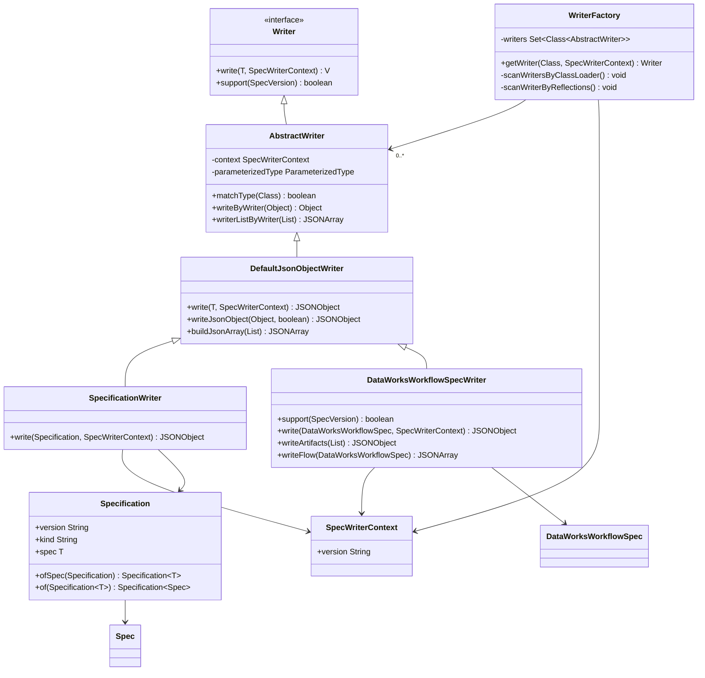
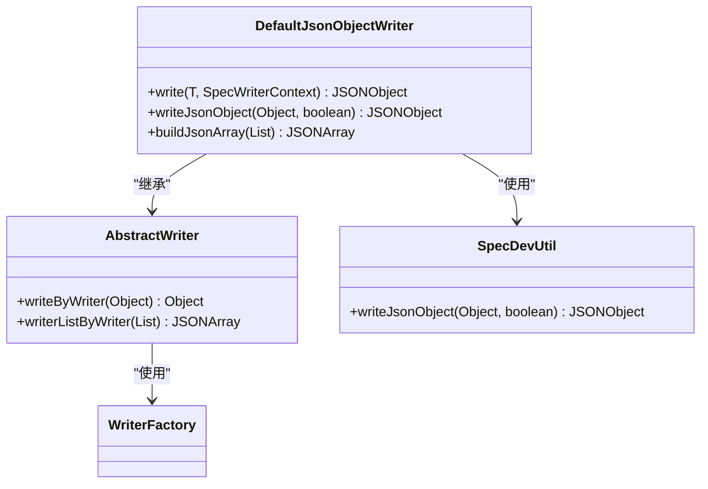
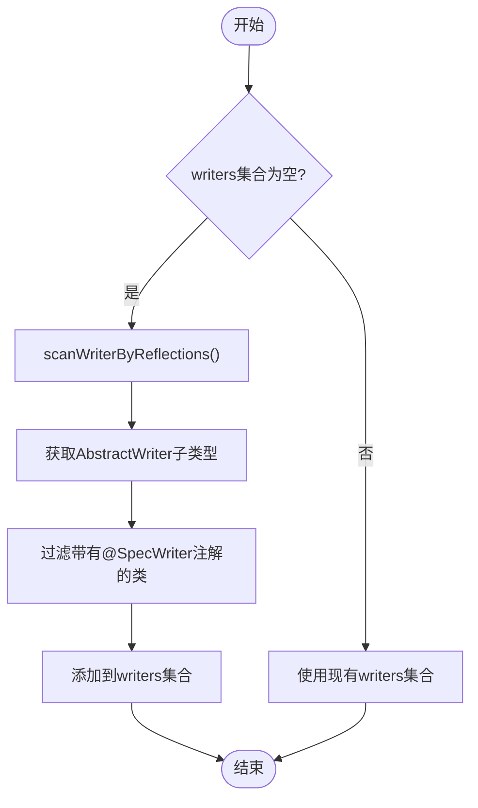
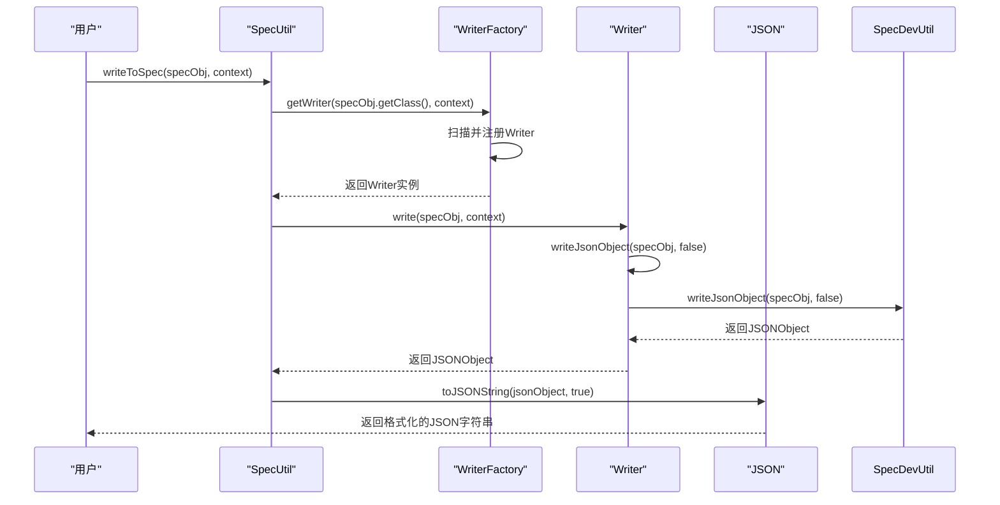
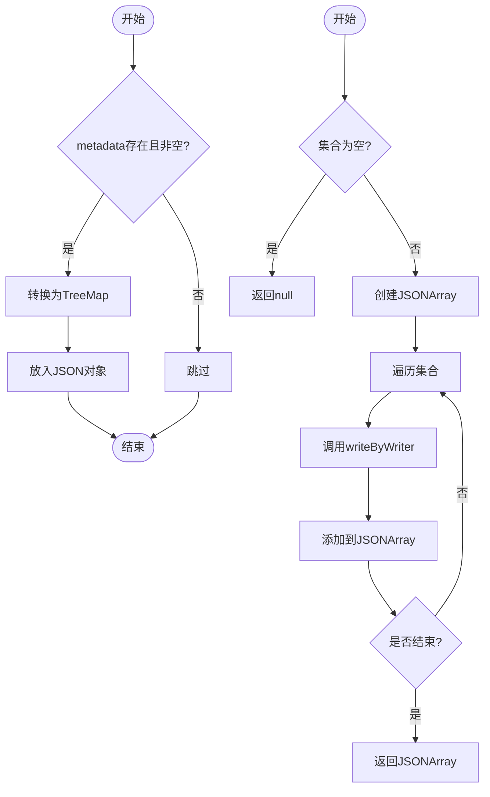
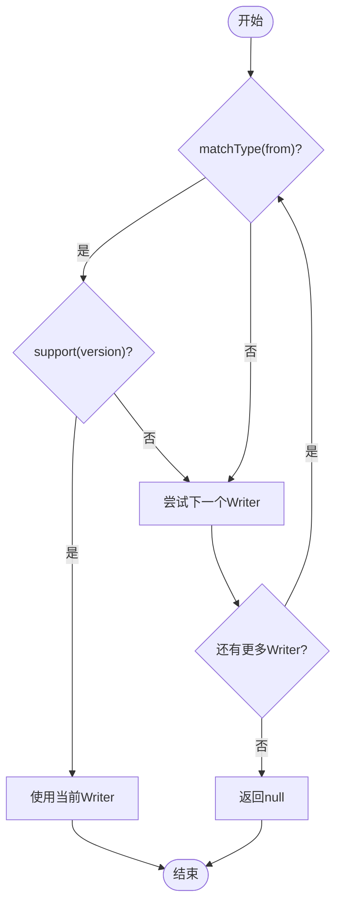
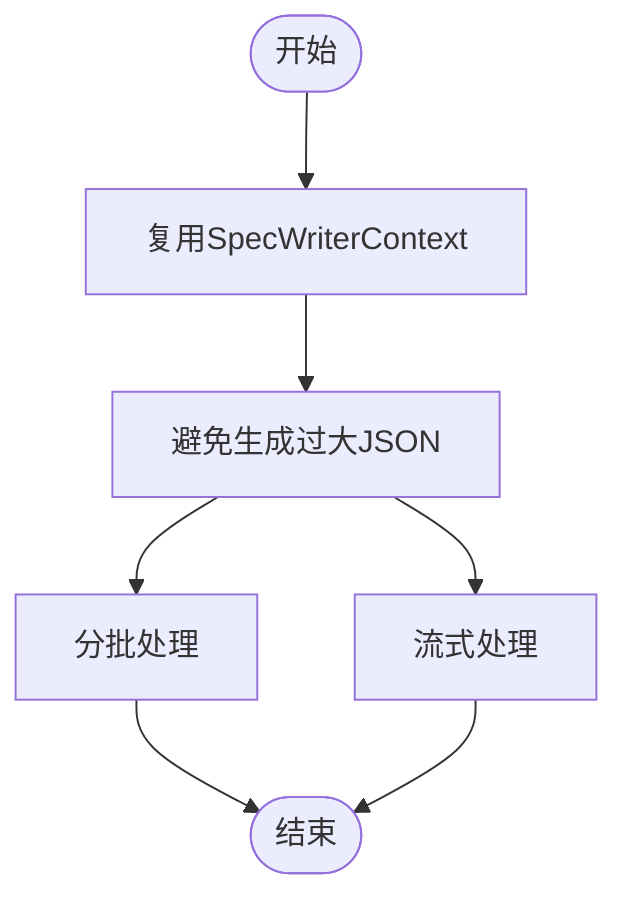

# 序列化机制

<cite>
**本文档中引用的文件**  
- [DefaultJsonObjectWriter.java](file://spec/src/main/java/com/aliyun/dataworks/common/spec/writer/impl/DefaultJsonObjectWriter.java)
- [WriterFactory.java](file://spec/src/main/java/com/aliyun/dataworks/common/spec/writer/WriterFactory.java)
- [AbstractWriter.java](file://spec/src/main/java/com/aliyun/dataworks/common/spec/writer/impl/AbstractWriter.java)
- [SpecificationWriter.java](file://spec/src/main/java/com/aliyun/dataworks/common/spec/writer/impl/SpecificationWriter.java)
- [DataWorksWorkflowSpecWriter.java](file://spec/src/main/java/com/aliyun/dataworks/common/spec/writer/impl/DataWorksWorkflowSpecWriter.java)
- [SpecDevUtil.java](file://spec/src/main/java/com/aliyun/dataworks/common/spec/utils/SpecDevUtil.java)
- [SpecWriterContext.java](file://spec/src/main/java/com/aliyun/dataworks/common/spec/writer/SpecWriterContext.java)
- [Specification.java](file://spec/src/main/java/com/aliyun/dataworks/common/spec/domain/Specification.java)
</cite>

## 目录
1. [引言](#引言)
2. [核心组件](#核心组件)
3. [DefaultJsonObjectWriter实现原理](#defaultjsonobjectwriter实现原理)
4. [WriterFactory初始化过程](#writerfactory初始化过程)
5. [writeToSpec方法执行流程](#writetospec方法执行流程)
6. [序列化过程中的特殊处理](#序列化过程中的特殊处理)
7. [Writer匹配机制](#writer匹配机制)
8. [性能优化建议](#性能优化建议)
9. [结论](#结论)

## 引言
本文档详细阐述了DataWorks规范系统中的序列化机制，重点分析了DefaultJsonObjectWriter的实现原理、WriterFactory的初始化过程以及writeToSpec方法的完整执行流程。文档还说明了序列化过程中对metadata字段的特殊处理、集合类型序列化的实现方式，以及Writer的匹配机制，并提供了性能优化建议。

## 核心组件

本节分析序列化机制中的核心组件及其关系。

**图源**
- [Writer.java](file://spec/src/main/java/com/aliyun/dataworks/common/spec/writer/Writer.java)
- [AbstractWriter.java](file://spec/src/main/java/com/aliyun/dataworks/common/spec/writer/impl/AbstractWriter.java)
- [DefaultJsonObjectWriter.java](file://spec/src/main/java/com/aliyun/dataworks/common/spec/writer/impl/DefaultJsonObjectWriter.java)
- [SpecificationWriter.java](file://spec/src/main/java/com/aliyun/dataworks/common/spec/writer/impl/SpecificationWriter.java)
- [DataWorksWorkflowSpecWriter.java](file://spec/src/main/java/com/aliyun/dataworks/common/spec/writer/impl/DataWorksWorkflowSpecWriter.java)
- [WriterFactory.java](file://spec/src/main/java/com/aliyun/dataworks/common/spec/writer/WriterFactory.java)
- [SpecWriterContext.java](file://spec/src/main/java/com/aliyun/dataworks/common/spec/writer/SpecWriterContext.java)
- [Specification.java](file://spec/src/main/java/com/aliyun/dataworks/common/spec/domain/Specification.java)

**节源**
- [Writer.java](file://spec/src/main/java/com/aliyun/dataworks/common/spec/writer/Writer.java)
- [AbstractWriter.java](file://spec/src/main/java/com/aliyun/dataworks/common/spec/writer/impl/AbstractWriter.java)
- [DefaultJsonObjectWriter.java](file://spec/src/main/java/com/aliyun/dataworks/common/spec/writer/impl/DefaultJsonObjectWriter.java)
- [SpecificationWriter.java](file://spec/src/main/java/com/aliyun/dataworks/common/spec/writer/impl/SpecificationWriter.java)
- [DataWorksWorkflowSpecWriter.java](file://spec/src/main/java/com/aliyun/dataworks/common/spec/writer/impl/DataWorksWorkflowSpecWriter.java)
- [WriterFactory.java](file://spec/src/main/java/com/aliyun/dataworks/common/spec/writer/WriterFactory.java)
- [SpecWriterContext.java](file://spec/src/main/java/com/aliyun/dataworks/common/spec/writer/SpecWriterContext.java)
- [Specification.java](file://spec/src/main/java/com/aliyun/dataworks/common/spec/domain/Specification.java)

## DefaultJsonObjectWriter实现原理

DefaultJsonObjectWriter是序列化机制的核心实现类，它继承自AbstractWriter并重写了write方法，负责将领域对象转换为JSONObject。该类通过反射机制遍历对象的字段，将非静态字段的值写入JSON对象中。

**图源**
- [DefaultJsonObjectWriter.java](file://spec/src/main/java/com/aliyun/dataworks/common/spec/writer/impl/DefaultJsonObjectWriter.java)
- [AbstractWriter.java](file://spec/src/main/java/com/aliyun/dataworks/common/spec/writer/impl/AbstractWriter.java)
- [SpecDevUtil.java](file://spec/src/main/java/com/aliyun/dataworks/common/spec/utils/SpecDevUtil.java)

**节源**
- [DefaultJsonObjectWriter.java](file://spec/src/main/java/com/aliyun/dataworks/common/spec/writer/impl/DefaultJsonObjectWriter.java)

## WriterFactory初始化过程

WriterFactory负责管理所有Writer实现类的实例化和注册。它通过Reflections或ClassLoader扫描指定包下的所有Writer实现类，并将它们注册到内部的集合中。初始化过程包括两个主要方法：scanWritersByClassLoader和scanWriterByReflections。

**图源**
- [WriterFactory.java](file://spec/src/main/java/com/aliyun/dataworks/common/spec/writer/WriterFactory.java)

**节源**
- [WriterFactory.java](file://spec/src/main/java/com/aliyun/dataworks/common/spec/writer/WriterFactory.java)

## writeToSpec方法执行流程

writeToSpec方法的执行流程从获取匹配的Writer实例开始，经过Writer的write方法执行，最后通过JSON.toJSONString生成格式化的JSON字符串。整个流程涉及多个组件的协作。

**图源**
- [WriterFactory.java](file://spec/src/main/java/com/aliyun/dataworks/common/spec/writer/WriterFactory.java)
- [AbstractWriter.java](file://spec/src/main/java/com/aliyun/dataworks/common/spec/writer/impl/AbstractWriter.java)
- [SpecDevUtil.java](file://spec/src/main/java/com/aliyun/dataworks/common/spec/utils/SpecDevUtil.java)

**节源**
- [WriterFactory.java](file://spec/src/main/java/com/aliyun/dataworks/common/spec/writer/WriterFactory.java)
- [AbstractWriter.java](file://spec/src/main/java/com/aliyun/dataworks/common/spec/writer/impl/AbstractWriter.java)
- [SpecDevUtil.java](file://spec/src/main/java/com/aliyun/dataworks/common/spec/utils/SpecDevUtil.java)

## 序列化过程中的特殊处理

在序列化过程中，对metadata字段有特殊处理，将其转换为TreeMap以保证顺序。同时，buildJsonArray方法负责处理集合类型的序列化，通过递归调用writeByWriter方法将集合中的每个元素转换为JSON格式。

**图源**
- [DefaultJsonObjectWriter.java](file://spec/src/main/java/com/aliyun/dataworks/common/spec/writer/impl/DefaultJsonObjectWriter.java)
- [AbstractWriter.java](file://spec/src/main/java/com/aliyun/dataworks/common/spec/writer/impl/AbstractWriter.java)

**节源**
- [DefaultJsonObjectWriter.java](file://spec/src/main/java/com/aliyun/dataworks/common/spec/writer/impl/DefaultJsonObjectWriter.java)

## Writer匹配机制

Writer的匹配机制通过matchType和support方法实现。matchType方法根据对象类型进行匹配，support方法根据版本号筛选合适的Writer。这种双重匹配机制确保了序列化过程的准确性和灵活性。

**图源**
- [WriterFactory.java](file://spec/src/main/java/com/aliyun/dataworks/common/spec/writer/WriterFactory.java)
- [AbstractWriter.java](file://spec/src/main/java/com/aliyun/dataworks/common/spec/writer/impl/AbstractWriter.java)

**节源**
- [WriterFactory.java](file://spec/src/main/java/com/aliyun/dataworks/common/spec/writer/WriterFactory.java)
- [AbstractWriter.java](file://spec/src/main/java/com/aliyun/dataworks/common/spec/writer/impl/AbstractWriter.java)

## 性能优化建议

针对序列化性能和内存占用问题，建议复用SpecWriterContext实例，避免频繁创建和销毁。同时，应避免生成过大的JSON字符串，可以通过分批处理或流式处理来优化内存使用。

**图源**
- [SpecWriterContext.java](file://spec/src/main/java/com/aliyun/dataworks/common/spec/writer/SpecWriterContext.java)

**节源**
- [SpecWriterContext.java](file://spec/src/main/java/com/aliyun/dataworks/common/spec/writer/SpecWriterContext.java)

## 结论

本文档详细阐述了DataWorks规范系统中的序列化机制，包括DefaultJsonObjectWriter的实现原理、WriterFactory的初始化过程、writeToSpec方法的执行流程、序列化过程中的特殊处理、Writer匹配机制以及性能优化建议。这些内容为理解和优化序列化过程提供了全面的指导。