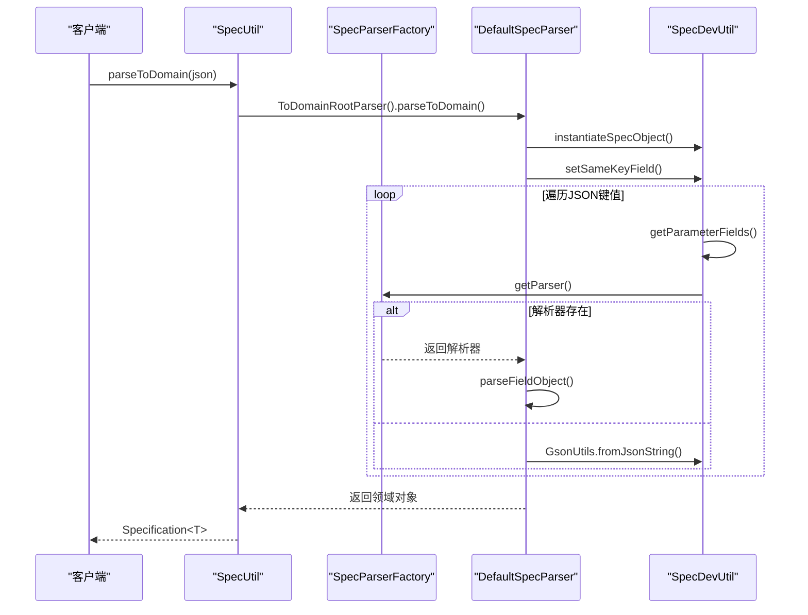
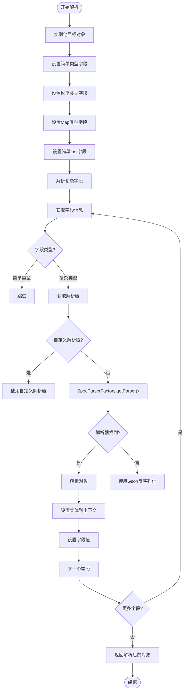
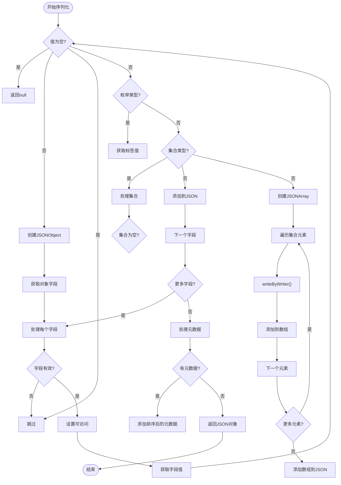
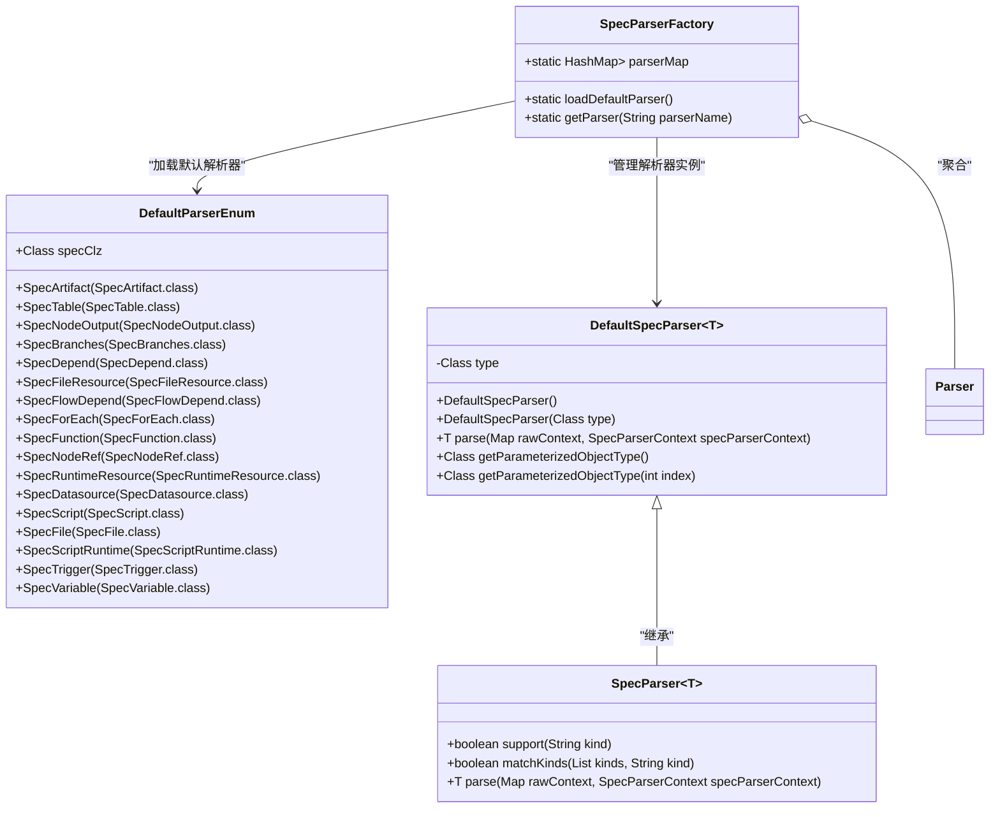
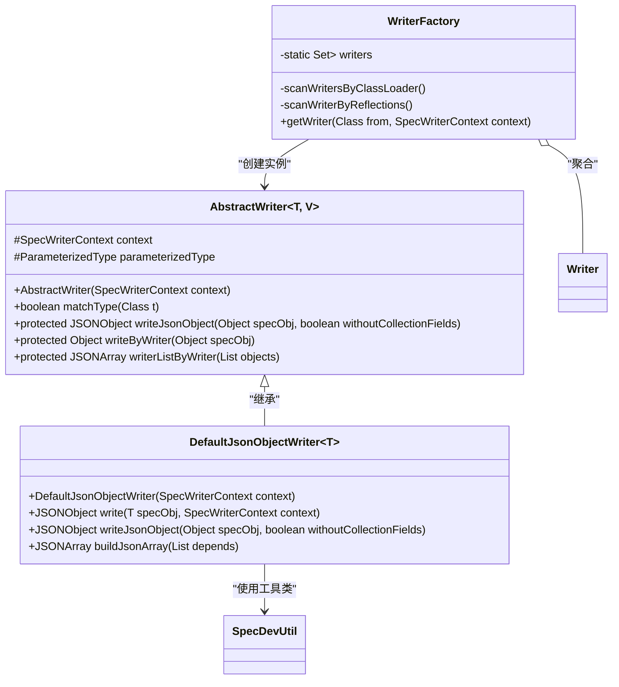
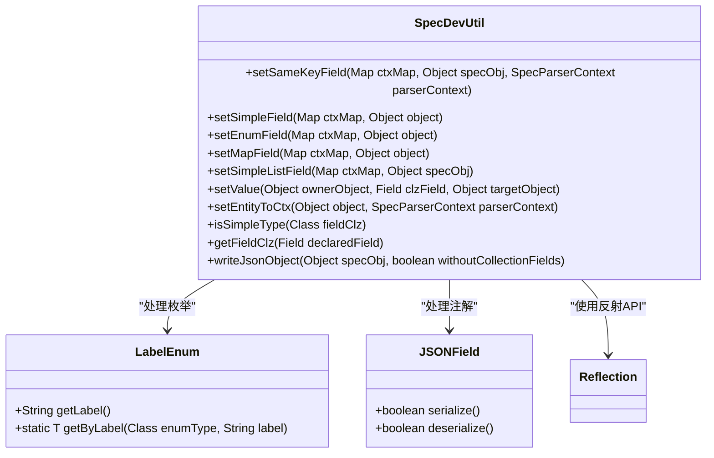
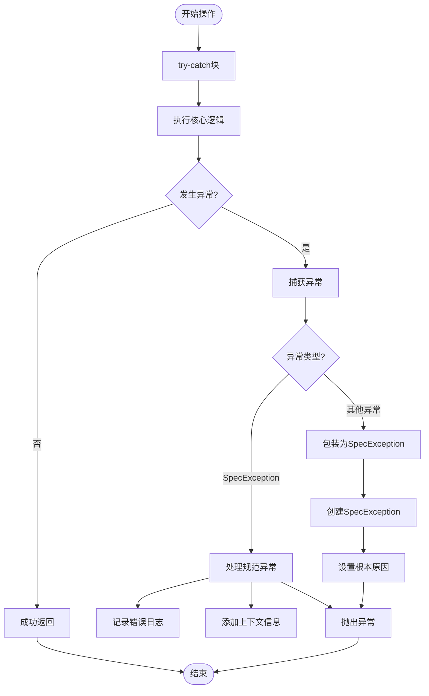
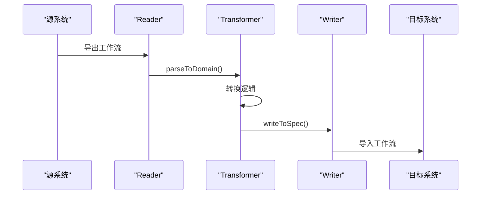

# 规范解析与序列化

<cite>
**本文档中引用的文件**  
- [SpecUtil.java](file://spec/src/main/java/com/aliyun/dataworks/common/spec/SpecUtil.java)
- [SpecParserFactory.java](file://spec/src/main/java/com/aliyun/dataworks/common/spec/parser/SpecParserFactory.java)
- [WriterFactory.java](file://spec/src/main/java/com/aliyun/dataworks/common/spec/writer/WriterFactory.java)
- [DefaultSpecParser.java](file://spec/src/main/java/com/aliyun/dataworks/common/spec/parser/impl/DefaultSpecParser.java)
- [DefaultJsonObjectWriter.java](file://spec/src/main/java/com/aliyun/dataworks/common/spec/writer/impl/DefaultJsonObjectWriter.java)
- [SpecDevUtil.java](file://spec/src/main/java/com/aliyun/dataworks/common/spec/utils/SpecDevUtil.java)
- [DataWorksWorkflowSpec.java](file://spec/src/main/java/com/aliyun/dataworks/common/spec/domain/DataWorksWorkflowSpec.java)
- [DefaultParserEnum.java](file://spec/src/main/java/com/aliyun/dataworks/common/spec/parser/DefaultParserEnum.java)
</cite>

## 目录
1. [简介](#简介)
2. [核心组件](#核心组件)
3. [解析与序列化机制](#解析与序列化机制)
4. [工厂机制与反射处理](#工厂机制与反射处理)
5. [错误处理与验证策略](#错误处理与验证策略)
6. [与MigrationX转换器的集成](#与migrationx转换器的集成)
7. [性能优化建议](#性能优化建议)
8. [结论](#结论)

## 简介
本文档深入解析DataWorks规范解析与序列化的核心机制，重点阐述`SpecUtil.parseToDomain()`和`SpecUtil.writeToSpec()`的实现原理。该系统通过反射和注解技术，实现了复杂对象图的JSON格式工作流规范与领域对象之间的双向转换。文档详细说明了解析器和写入器的工厂机制、默认实现的工作流程，以及与MigrationX转换器的集成方式，为开发者提供全面的技术参考。

## 核心组件

本系统的核心组件包括`SpecUtil`工具类、`SpecParserFactory`和`WriterFactory`工厂类、`DefaultSpecParser`和`DefaultJsonObjectWriter`默认实现，以及`SpecDevUtil`辅助工具类。这些组件协同工作，实现了规范的解析与序列化功能。

**本节来源**
- [SpecUtil.java](file://spec/src/main/java/com/aliyun/dataworks/common/spec/SpecUtil.java)
- [SpecParserFactory.java](file://spec/src/main/java/com/aliyun/dataworks/common/spec/parser/SpecParserFactory.java)
- [WriterFactory.java](file://spec/src/main/java/com/aliyun/dataworks/common/spec/writer/WriterFactory.java)

## 解析与序列化机制

### SpecUtil核心方法

`SpecUtil`类提供了规范解析与序列化的入口方法。`parseToDomain()`方法将JSON字符串解析为领域对象，而`writeToSpec()`方法则将领域对象序列化为格式化的JSON字符串。

**图示来源**
- [SpecUtil.java](file://spec/src/main/java/com/aliyun/dataworks/common/spec/SpecUtil.java#L71-L77)
- [DefaultSpecParser.java](file://spec/src/main/java/com/aliyun/dataworks/common/spec/parser/impl/DefaultSpecParser.java#L55-L60)
- [SpecDevUtil.java](file://spec/src/main/java/com/aliyun/dataworks/common/spec/utils/SpecDevUtil.java#L105-L114)

### DefaultSpecParser工作流程

`DefaultSpecParser`是默认的解析器实现，它通过反射机制将JSON数据映射到领域对象的字段。解析过程包括实例化目标对象、设置简单类型字段、枚举字段、Map字段和复杂对象字段。

**图示来源**
- [DefaultSpecParser.java](file://spec/src/main/java/com/aliyun/dataworks/common/spec/parser/impl/DefaultSpecParser.java#L55-L174)
- [SpecDevUtil.java](file://spec/src/main/java/com/aliyun/dataworks/common/spec/utils/SpecDevUtil.java#L105-L114)

### DefaultJsonObjectWriter工作流程

`DefaultJsonObjectWriter`是默认的写入器实现，负责将领域对象序列化为JSON格式。它通过反射获取对象的所有可序列化字段，并递归处理集合类型字段。

**图示来源**
- [DefaultJsonObjectWriter.java](file://spec/src/main/java/com/aliyun/dataworks/common/spec/writer/impl/DefaultJsonObjectWriter.java#L45-L58)
- [AbstractWriter.java](file://spec/src/main/java/com/aliyun/dataworks/common/spec/writer/impl/AbstractWriter.java#L68-L82)

## 工厂机制与反射处理

### 解析器工厂机制

`SpecParserFactory`通过Java反射和枚举机制动态加载和管理所有解析器。系统启动时，工厂会扫描指定包下的所有解析器实现，并根据类名或泛型类型建立映射关系。

**图示来源**
- [SpecParserFactory.java](file://spec/src/main/java/com/aliyun/dataworks/common/spec/parser/SpecParserFactory.java#L37-L86)
- [DefaultParserEnum.java](file://spec/src/main/java/com/aliyun/dataworks/common/spec/parser/DefaultParserEnum.java#L43-L137)
- [DefaultSpecParser.java](file://spec/src/main/java/com/aliyun/dataworks/common/spec/parser/impl/DefaultSpecParser.java#L44-L45)

### 写入器工厂机制

`WriterFactory`采用类似的工厂模式管理所有写入器实现。通过`@SpecWriter`注解标记的类会被自动扫描并注册到工厂中，支持根据目标类型和版本选择合适的写入器。

**图示来源**
- [WriterFactory.java](file://spec/src/main/java/com/aliyun/dataworks/common/spec/writer/WriterFactory.java#L37-L86)
- [AbstractWriter.java](file://spec/src/main/java/com/aliyun/dataworks/common/spec/writer/impl/AbstractWriter.java#L41-L95)
- [DefaultJsonObjectWriter.java](file://spec/src/main/java/com/aliyun/dataworks/common/spec/writer/impl/DefaultJsonObjectWriter.java#L39-L73)

### 反射与注解处理

`SpecDevUtil`工具类封装了复杂的反射操作，包括字段获取、类型判断、值设置等。系统通过`@JSONField`注解控制序列化行为，并利用`LabelEnum`接口处理枚举类型的标签转换。

**图示来源**
- [SpecDevUtil.java](file://spec/src/main/java/com/aliyun/dataworks/common/spec/utils/SpecDevUtil.java#L56-L575)
- [DataWorksWorkflowSpec.java](file://spec/src/main/java/com/aliyun/dataworks/common/spec/domain/DataWorksWorkflowSpec.java#L64-L65)

## 错误处理与验证策略

系统实现了多层次的错误处理机制，包括解析异常、字段缺失、类型转换错误等。`SpecException`封装了所有规范相关的异常，通过`SpecErrorCode`枚举定义了详细的错误码。

**本节来源**
- [SpecUtil.java](file://spec/src/main/java/com/aliyun/dataworks/common/spec/SpecUtil.java#L84-L93)
- [DefaultSpecParser.java](file://spec/src/main/java/com/aliyun/dataworks/common/spec/parser/impl/DefaultSpecParser.java#L72-L78)
- [SpecDevUtil.java](file://spec/src/main/java/com/aliyun/dataworks/common/spec/utils/SpecDevUtil.java#L203-L214)

## 与MigrationX转换器的集成

规范解析与序列化功能与MigrationX转换器紧密集成，用于在不同系统间迁移工作流。读取源系统工作流时，使用`parseToDomain()`将其转换为统一的领域模型；写入目标系统时，使用`writeToSpec()`将领域模型序列化为目标格式。

**本节来源**
- [SpecUtil.java](file://spec/src/main/java/com/aliyun/dataworks/common/spec/SpecUtil.java#L71-L95)
- [DataWorksWorkflowSpec.java](file://spec/src/main/java/com/aliyun/dataworks/common/spec/domain/DataWorksWorkflowSpec.java#L66-L130)

## 性能优化建议

针对常见的解析性能问题和内存溢出问题，建议采取以下优化措施：

1. **缓存解析器实例**：避免重复创建解析器，利用工厂的单例模式
2. **控制对象图深度**：避免无限递归引用，设置合理的解析深度限制
3. **批量处理**：对大量规范进行批量解析和序列化，减少系统调用开销
4. **内存监控**：监控大对象的创建，及时释放不再使用的领域对象
5. **流式处理**：对于超大JSON文件，考虑使用流式解析器替代全量加载

## 结论

本文档详细解析了DataWorks规范解析与序列化的核心机制。通过`SpecUtil`工具类、工厂模式、反射技术和注解处理，系统实现了灵活高效的JSON与领域对象转换。该机制不仅支持复杂的对象图处理，还提供了完善的错误处理和扩展能力，为MigrationX等迁移工具提供了坚实的基础。开发者在使用时应注意性能优化，确保系统在处理大规模工作流时的稳定性和效率。