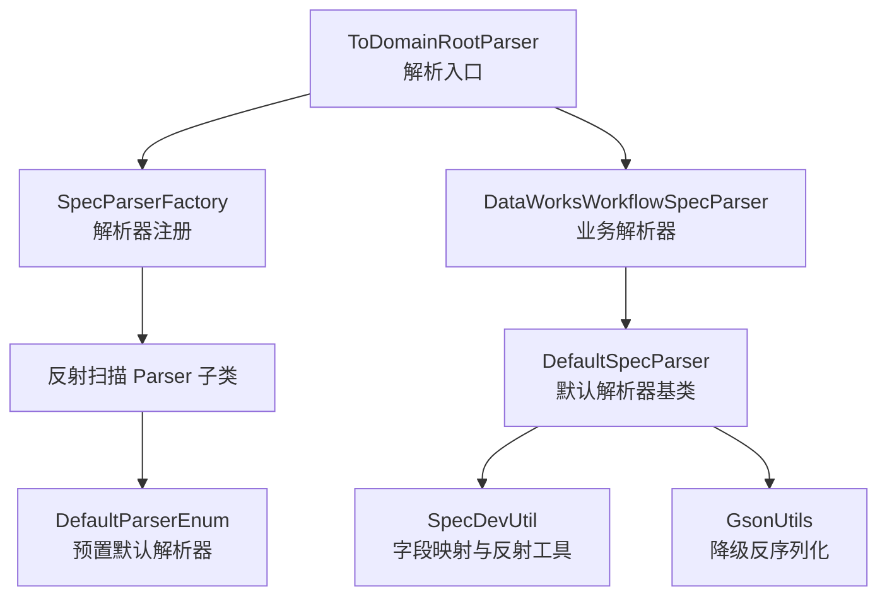
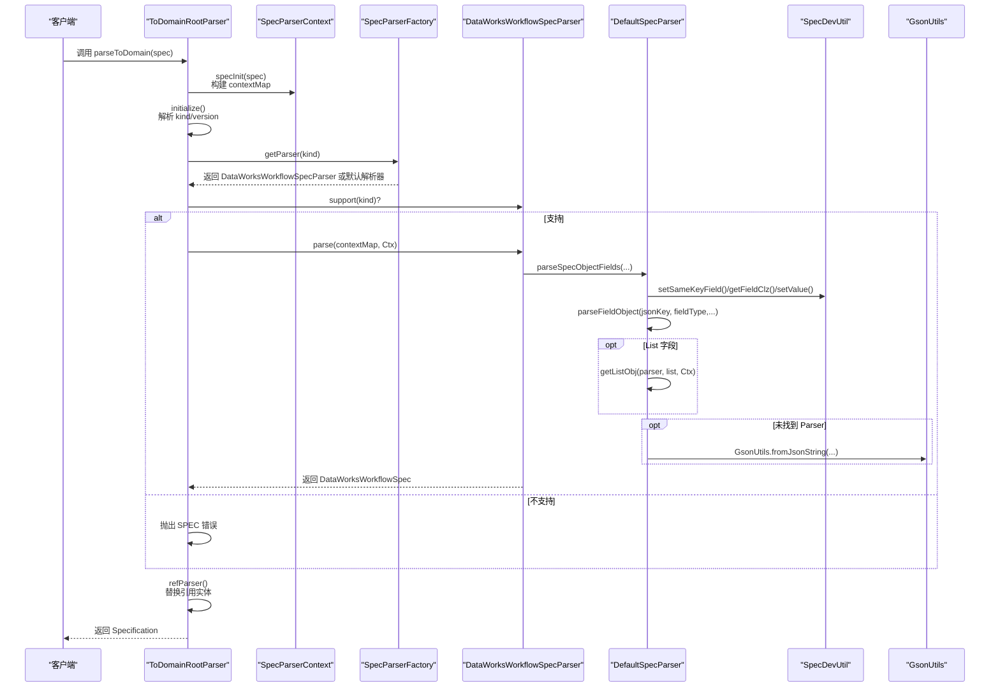
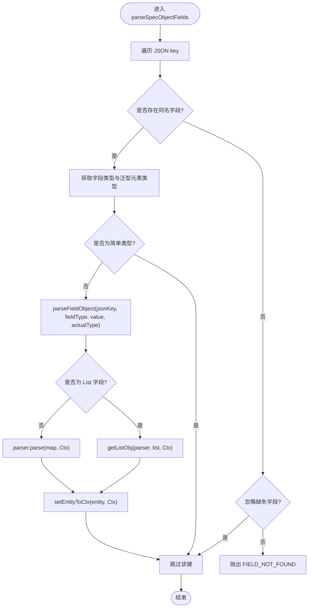
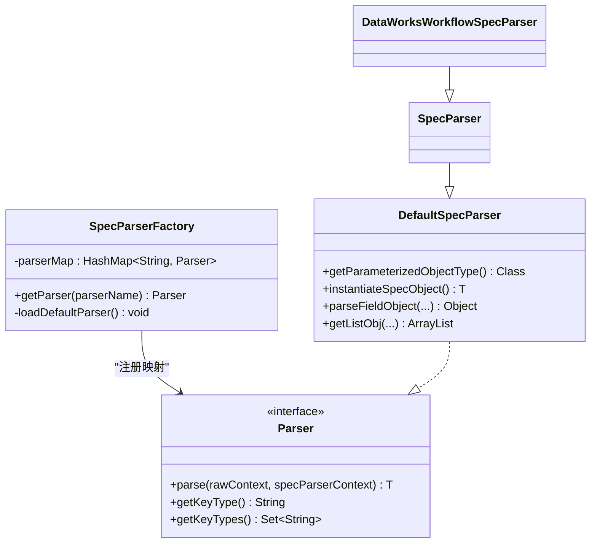
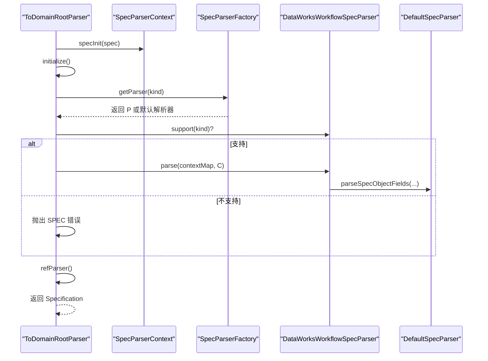
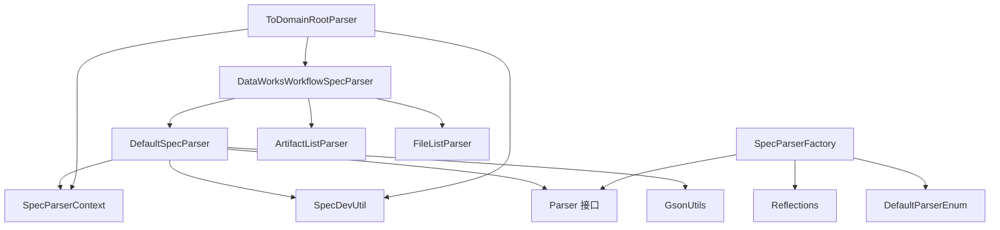

# 解析机制

<cite>
**本文引用的文件列表**
- [DefaultSpecParser.java](file://spec/src/main/java/com/aliyun/dataworks/common/spec/parser/impl/DefaultSpecParser.java)
- [SpecParserFactory.java](file://spec/src/main/java/com/aliyun/dataworks/common/spec/parser/SpecParserFactory.java)
- [ToDomainRootParser.java](file://spec/src/main/java/com/aliyun/dataworks/common/spec/parser/ToDomainRootParser.java)
- [Parser.java](file://spec/src/main/java/com/aliyun/dataworks/common/spec/parser/Parser.java)
- [SpecParser.java](file://spec/src/main/java/com/aliyun/dataworks/common/spec/parser/impl/SpecParser.java)
- [DataWorksWorkflowSpecParser.java](file://spec/src/main/java/com/aliyun/dataworks/common/spec/parser/impl/DataWorksWorkflowSpecParser.java)
- [SpecDevUtil.java](file://spec/src/main/java/com/aliyun/dataworks/common/spec/utils/SpecDevUtil.java)
- [GsonUtils.java](file://spec/src/main/java/com/aliyun/dataworks/common/spec/utils/GsonUtils.java)
- [SpecErrorCode.java](file://spec/src/main/java/com/aliyun/dataworks/common/spec/exception/SpecErrorCode.java)
- [SpecParserContext.java](file://spec/src/main/java/com/aliyun/dataworks/common/spec/parser/SpecParserContext.java)
- [DataWorksWorkflowSpec.java](file://spec/src/main/java/com/aliyun/dataworks/common/spec/domain/DataWorksWorkflowSpec.java)
- [ArtifactListParser.java](file://spec/src/main/java/com/aliyun/dataworks/common/spec/parser/impl/ArtifactListParser.java)
- [FileListParser.java](file://spec/src/main/java/com/aliyun/dataworks/common/spec/parser/impl/FileListParser.java)
</cite>

## 目录
1. [简介](#简介)
2. [项目结构与入口](#项目结构与入口)
3. [核心组件](#核心组件)
4. [架构总览](#架构总览)
5. [组件详解](#组件详解)
6. [依赖关系分析](#依赖关系分析)
7. [性能与优化建议](#性能与优化建议)
8. [故障排查指南](#故障排查指南)
9. [结论](#结论)

## 简介
本文件系统性解析 DataWorks 规范解析机制，重点围绕 DefaultSpecParser 的泛型反射实例化、字段映射与 List 类型处理，SpecParserFactory 的初始化与反射扫描注册，以及 parseToDomain 方法从 ToDomainRootParser 到具体 Parser 的完整调用链路进行深入剖析。同时给出 JSON 字符串解析为 DataWorksWorkflowSpec 对象的实际示例路径，并说明当找不到匹配 Parser 时的降级策略（GsonUtils），以及错误码 PARSER_NOT_FOUND、FIELD_NOT_FOUND 的触发条件与处理方式。最后提供面向大规模 JSON 解析的性能优化建议。

## 项目结构与入口
- 解析入口位于 ToDomainRootParser，负责将原始 JSON 字符串转换为 Specification 领域对象。
- 解析工厂 SpecParserFactory 通过 Reflections 扫描并注册所有 Parser 实现，构建解析器映射表。
- 默认解析器 DefaultSpecParser 基于泛型类型反射实例化领域对象，并处理字段映射与 List 特殊逻辑。
- 具体业务解析器如 DataWorksWorkflowSpecParser 继承默认解析器，覆盖自定义字段解析策略。

图表来源
- [ToDomainRootParser.java](file://spec/src/main/java/com/aliyun/dataworks/common/spec/parser/ToDomainRootParser.java#L62-L120)
- [SpecParserFactory.java](file://spec/src/main/java/com/aliyun/dataworks/common/spec/parser/SpecParserFactory.java#L40-L74)
- [DataWorksWorkflowSpecParser.java](file://spec/src/main/java/com/aliyun/dataworks/common/spec/parser/impl/DataWorksWorkflowSpecParser.java#L31-L55)
- [DefaultSpecParser.java](file://spec/src/main/java/com/aliyun/dataworks/common/spec/parser/impl/DefaultSpecParser.java#L54-L110)
- [SpecDevUtil.java](file://spec/src/main/java/com/aliyun/dataworks/common/spec/utils/SpecDevUtil.java#L105-L115)
- [GsonUtils.java](file://spec/src/main/java/com/aliyun/dataworks/common/spec/utils/GsonUtils.java#L128-L146)

章节来源
- [ToDomainRootParser.java](file://spec/src/main/java/com/aliyun/dataworks/common/spec/parser/ToDomainRootParser.java#L62-L120)
- [SpecParserFactory.java](file://spec/src/main/java/com/aliyun/dataworks/common/spec/parser/SpecParserFactory.java#L40-L74)

## 核心组件
- DefaultSpecParser：默认解析器基类，负责通过泛型反射实例化领域对象、字段映射、List 类型处理与降级策略。
- SpecParserFactory：静态初始化阶段扫描并注册所有 Parser 实现，建立解析器映射表；同时预加载 DefaultParserEnum 中的默认解析器。
- ToDomainRootParser：顶层解析器，协调上下文初始化、选择具体 Parser、预解析简单字段、引用关系解析。
- DataWorksWorkflowSpecParser：业务解析器，覆盖 DataWorksWorkflowSpec 的解析策略，提供自定义字段解析（如 artifacts、files）。
- SpecDevUtil：反射工具集，负责字段发现、简单类型设置、枚举映射、集合与引用实体处理。
- GsonUtils：Gson 工具，提供 JSON 序列化/反序列化能力，用于 DefaultSpecParser 的降级处理。
- SpecErrorCode：错误码枚举，统一错误分类与标识。
- SpecParserContext：解析上下文，承载 JSON 解析后的 Map、实体映射与引用信息。

章节来源
- [DefaultSpecParser.java](file://spec/src/main/java/com/aliyun/dataworks/common/spec/parser/impl/DefaultSpecParser.java#L54-L195)
- [SpecParserFactory.java](file://spec/src/main/java/com/aliyun/dataworks/common/spec/parser/SpecParserFactory.java#L38-L86)
- [ToDomainRootParser.java](file://spec/src/main/java/com/aliyun/dataworks/common/spec/parser/ToDomainRootParser.java#L62-L218)
- [DataWorksWorkflowSpecParser.java](file://spec/src/main/java/com/aliyun/dataworks/common/spec/parser/impl/DataWorksWorkflowSpecParser.java#L31-L55)
- [SpecDevUtil.java](file://spec/src/main/java/com/aliyun/dataworks/common/spec/utils/SpecDevUtil.java#L105-L115)
- [GsonUtils.java](file://spec/src/main/java/com/aliyun/dataworks/common/spec/utils/GsonUtils.java#L128-L146)
- [SpecErrorCode.java](file://spec/src/main/java/com/aliyun/dataworks/common/spec/exception/SpecErrorCode.java#L22-L77)
- [SpecParserContext.java](file://spec/src/main/java/com/aliyun/dataworks/common/spec/parser/SpecParserContext.java#L40-L90)

## 架构总览
下图展示了解析机制的整体架构与关键交互：

图表来源
- [ToDomainRootParser.java](file://spec/src/main/java/com/aliyun/dataworks/common/spec/parser/ToDomainRootParser.java#L62-L178)
- [SpecParserFactory.java](file://spec/src/main/java/com/aliyun/dataworks/common/spec/parser/SpecParserFactory.java#L99-L120)
- [DataWorksWorkflowSpecParser.java](file://spec/src/main/java/com/aliyun/dataworks/common/spec/parser/impl/DataWorksWorkflowSpecParser.java#L31-L55)
- [DefaultSpecParser.java](file://spec/src/main/java/com/aliyun/dataworks/common/spec/parser/impl/DefaultSpecParser.java#L112-L195)
- [SpecDevUtil.java](file://spec/src/main/java/com/aliyun/dataworks/common/spec/utils/SpecDevUtil.java#L105-L115)
- [GsonUtils.java](file://spec/src/main/java/com/aliyun/dataworks/common/spec/utils/GsonUtils.java#L128-L146)

## 组件详解

### DefaultSpecParser 实现原理
- 泛型类型获取与实例化
  - 通过 getParameterizedObjectType 获取泛型参数 Class，进而 instantiateSpecObject 使用反射创建领域对象实例。
  - 若无法确定泛型类型，抛出解析错误。
- 字段映射
  - parseSpecObjectFields 遍历 JSON key，尝试在领域对象中查找同名字段，若不存在且未开启忽略缺失字段，则抛出 FIELD_NOT_FOUND。
  - 使用 SpecDevUtil.getPropertyFields 获取字段列表，再通过反射 setValue 设置值。
- List 类型字段的特殊处理
  - isListField 判断字段类型是否为 List 且值也为 List。
  - getListObj 循环调用具体 Parser.parse 并将实体放入上下文，便于后续引用解析。
- 降级策略
  - 当找不到匹配 Parser 时，记录警告并尝试使用 GsonUtils.fromJsonString 将对象或列表按类型反序列化回目标类型，避免解析中断。

图表来源
- [DefaultSpecParser.java](file://spec/src/main/java/com/aliyun/dataworks/common/spec/parser/impl/DefaultSpecParser.java#L145-L195)
- [SpecDevUtil.java](file://spec/src/main/java/com/aliyun/dataworks/common/spec/utils/SpecDevUtil.java#L337-L341)

章节来源
- [DefaultSpecParser.java](file://spec/src/main/java/com/aliyun/dataworks/common/spec/parser/impl/DefaultSpecParser.java#L54-L195)
- [SpecDevUtil.java](file://spec/src/main/java/com/aliyun/dataworks/common/spec/utils/SpecDevUtil.java#L337-L341)

### SpecParserFactory 初始化与注册
- 静态初始化块
  - 先加载默认解析器（DefaultParserEnum.values()），将每个默认类型映射到 DefaultSpecParser 实例。
  - 使用 Reflections 扫描 Parser 接口所在包下的子类，通过无参构造实例化并注册：
    - 若为 DefaultSpecParser 子类，使用其 getParameterizedObjectType().getSimpleName() 作为 key。
    - 否则使用 Parser.getKeyTypes() 或泛型接口的第一个类型参数的简单名作为 key。
- 异常处理
  - 实例化失败时抛出 PARSER_LOAD_ERROR。

图表来源
- [SpecParserFactory.java](file://spec/src/main/java/com/aliyun/dataworks/common/spec/parser/SpecParserFactory.java#L38-L86)
- [Parser.java](file://spec/src/main/java/com/aliyun/dataworks/common/spec/parser/Parser.java#L30-L52)
- [DefaultSpecParser.java](file://spec/src/main/java/com/aliyun/dataworks/common/spec/parser/impl/DefaultSpecParser.java#L44-L110)
- [SpecParser.java](file://spec/src/main/java/com/aliyun/dataworks/common/spec/parser/impl/SpecParser.java#L31-L49)
- [DataWorksWorkflowSpecParser.java](file://spec/src/main/java/com/aliyun/dataworks/common/spec/parser/impl/DataWorksWorkflowSpecParser.java#L31-L55)

章节来源
- [SpecParserFactory.java](file://spec/src/main/java/com/aliyun/dataworks/common/spec/parser/SpecParserFactory.java#L40-L74)

### parseToDomain 调用链路
- ToDomainRootParser.parseToDomain
  - 初始化上下文：SpecParserContext.specInit 将 JSON 转为 Map。
  - initialize：解析 kind/version，创建 Specification，选择 Parser。
  - preParser：设置简单字段、枚举、Map、List 等，然后调用 specParser.parse 进行领域对象解析。
  - refParser：根据引用信息替换为实体对象，支持输出节点与节点 ID 的特殊替换。
- 具体 Parser 选择
  - getSpecParser：优先反射扫描业务解析器（如 DataWorksWorkflowSpecParser），若不支持则退回默认解析器；否则抛出 SPEC 错误。

图表来源
- [ToDomainRootParser.java](file://spec/src/main/java/com/aliyun/dataworks/common/spec/parser/ToDomainRootParser.java#L62-L178)
- [SpecParserFactory.java](file://spec/src/main/java/com/aliyun/dataworks/common/spec/parser/SpecParserFactory.java#L99-L120)
- [DataWorksWorkflowSpecParser.java](file://spec/src/main/java/com/aliyun/dataworks/common/spec/parser/impl/DataWorksWorkflowSpecParser.java#L31-L55)
- [DefaultSpecParser.java](file://spec/src/main/java/com/aliyun/dataworks/common/spec/parser/impl/DefaultSpecParser.java#L145-L195)

章节来源
- [ToDomainRootParser.java](file://spec/src/main/java/com/aliyun/dataworks/common/spec/parser/ToDomainRootParser.java#L62-L178)

### JSON 解析为 DataWorksWorkflowSpec 示例
以下为示例路径，展示如何将 JSON 字符串解析为 DataWorksWorkflowSpec 对象：
- 入口：ToDomainRootParser.parseToDomain
- 业务解析器：DataWorksWorkflowSpecParser
- 领域对象：DataWorksWorkflowSpec
- 关键字段映射：由 DefaultSpecParser.parseSpecObjectFields 完成，配合 SpecDevUtil.setSameKeyField 等工具完成简单类型、枚举、Map、List 的设置。

章节来源
- [ToDomainRootParser.java](file://spec/src/main/java/com/aliyun/dataworks/common/spec/parser/ToDomainRootParser.java#L62-L178)
- [DataWorksWorkflowSpecParser.java](file://spec/src/main/java/com/aliyun/dataworks/common/spec/parser/impl/DataWorksWorkflowSpecParser.java#L31-L55)
- [DataWorksWorkflowSpec.java](file://spec/src/main/java/com/aliyun/dataworks/common/spec/domain/DataWorksWorkflowSpec.java#L64-L130)

### List 类型字段的特殊处理逻辑
- isListField：判断字段类型为 List 且值也为 List。
- getListObj：循环对列表元素逐一调用具体 Parser.parse，并将生成的实体加入上下文，以便后续引用解析。
- 简单类型 List：SpecDevUtil.setSimpleListField 会直接复制基础类型列表，不走 Parser。

章节来源
- [DefaultSpecParser.java](file://spec/src/main/java/com/aliyun/dataworks/common/spec/parser/impl/DefaultSpecParser.java#L180-L195)
- [SpecDevUtil.java](file://spec/src/main/java/com/aliyun/dataworks/common/spec/utils/SpecDevUtil.java#L406-L425)

### 降级处理策略（找不到匹配 Parser）
- 触发条件：DefaultSpecParser.parseFieldObject 在通过 SpecParserFactory.getParser 未找到对应 Parser 时。
- 处理流程：记录警告日志，尝试使用 GsonUtils.fromJsonString 将对象或列表按类型反序列化回目标类型，避免解析失败。

章节来源
- [DefaultSpecParser.java](file://spec/src/main/java/com/aliyun/dataworks/common/spec/parser/impl/DefaultSpecParser.java#L112-L143)
- [GsonUtils.java](file://spec/src/main/java/com/aliyun/dataworks/common/spec/utils/GsonUtils.java#L128-L146)

### 错误处理机制
- PARSER_NOT_FOUND：当无法通过 SpecParserFactory.getParser 找到对应 Parser 时触发。
- FIELD_NOT_FOUND：当 JSON key 在领域对象中找不到同名字段且未开启忽略缺失字段时触发。
- TARGET_ENTITY_NOT_FOUND：引用解析阶段找不到目标实体时触发。
- 其他错误：GET_ID_ERROR、ENUM_NOT_EXIST、PARSE_ERROR、PARSER_LOAD_ERROR、DUPLICATE_ID、REF_ID_PARSER_ERROR、VALIDATE_ERROR、WRITER_LOAD_ERROR 等。

章节来源
- [SpecErrorCode.java](file://spec/src/main/java/com/aliyun/dataworks/common/spec/exception/SpecErrorCode.java#L22-L77)
- [DefaultSpecParser.java](file://spec/src/main/java/com/aliyun/dataworks/common/spec/parser/impl/DefaultSpecParser.java#L145-L160)
- [ToDomainRootParser.java](file://spec/src/main/java/com/aliyun/dataworks/common/spec/parser/ToDomainRootParser.java#L196-L206)

## 依赖关系分析
- DefaultSpecParser 依赖
  - Parser 接口、SpecParserContext 上下文、SpecDevUtil 反射与字段工具、GsonUtils 降级反序列化。
- SpecParserFactory 依赖
  - Reflections 反射扫描、Parser 接口、DefaultParserEnum 默认解析器。
- ToDomainRootParser 依赖
  - SpecParserContext、SpecRefEntity 子类集合、SpecDevUtil、DataWorksWorkflowSpecParser。
- DataWorksWorkflowSpecParser 依赖
  - DefaultSpecParser、SpecParser、SpecConstants、ArtifactListParser、FileListParser。

图表来源
- [DefaultSpecParser.java](file://spec/src/main/java/com/aliyun/dataworks/common/spec/parser/impl/DefaultSpecParser.java#L54-L110)
- [SpecParserFactory.java](file://spec/src/main/java/com/aliyun/dataworks/common/spec/parser/SpecParserFactory.java#L40-L74)
- [ToDomainRootParser.java](file://spec/src/main/java/com/aliyun/dataworks/common/spec/parser/ToDomainRootParser.java#L99-L120)
- [DataWorksWorkflowSpecParser.java](file://spec/src/main/java/com/aliyun/dataworks/common/spec/parser/impl/DataWorksWorkflowSpecParser.java#L31-L55)
- [ArtifactListParser.java](file://spec/src/main/java/com/aliyun/dataworks/common/spec/parser/impl/ArtifactListParser.java#L37-L84)
- [FileListParser.java](file://spec/src/main/java/com/aliyun/dataworks/common/spec/parser/impl/FileListParser.java#L40-L89)

章节来源
- [DefaultSpecParser.java](file://spec/src/main/java/com/aliyun/dataworks/common/spec/parser/impl/DefaultSpecParser.java#L54-L110)
- [SpecParserFactory.java](file://spec/src/main/java/com/aliyun/dataworks/common/spec/parser/SpecParserFactory.java#L40-L74)
- [ToDomainRootParser.java](file://spec/src/main/java/com/aliyun/dataworks/common/spec/parser/ToDomainRootParser.java#L99-L120)
- [DataWorksWorkflowSpecParser.java](file://spec/src/main/java/com/aliyun/dataworks/common/spec/parser/impl/DataWorksWorkflowSpecParser.java#L31-L55)

## 性能与优化建议
- 预加载解析器
  - 在应用启动阶段调用 SpecParserFactory，确保静态初始化完成，避免首次请求时的反射扫描开销。
- 减少反射调用
  - 对频繁使用的 Parser，可缓存实例与字段元数据，避免重复反射查找。
- 预置默认解析器
  - 利用 DefaultParserEnum 提前注册常用领域对象的默认解析器，减少运行时反射成本。
- 降低降级反序列化频率
  - 通过完善 Parser 注册与命名约定，尽量命中已注册 Parser，减少 GsonUtils.fromJsonString 的使用。
- 批量解析优化
  - 对批量 JSON 文档，复用 SpecParserContext，避免重复 JSON 解析与 Map 构建。
- 避免不必要的字段映射
  - 在业务解析器中明确覆盖仅需解析的关键字段，减少 DefaultSpecParser 的全字段遍历。

[本节为通用性能建议，无需特定文件引用]

## 故障排查指南
- PARSER_NOT_FOUND
  - 检查 SpecParserFactory 是否正确扫描并注册了对应 Parser；确认 JSON key 与 Parser 的 key 映射是否一致。
- FIELD_NOT_FOUND
  - 确认 JSON key 是否与领域对象字段名称一致；若允许缺失字段，可在上下文中设置忽略标志。
- TARGET_ENTITY_NOT_FOUND
  - 检查引用格式与实体 ID 是否存在；确认 ToDomainRootParser.refParser 的实体映射是否正确填充。
- ENUM_NOT_EXIST
  - 检查枚举标签是否匹配；确认枚举实现是否符合 LabelEnum 接口。
- REF_ID_PARSER_ERROR
  - 检查引用字符串格式是否为 {{type.id}} 或 {id}。
- GET_ID_ERROR
  - 检查实体类是否包含 id 字段且可访问。

章节来源
- [SpecErrorCode.java](file://spec/src/main/java/com/aliyun/dataworks/common/spec/exception/SpecErrorCode.java#L22-L77)
- [DefaultSpecParser.java](file://spec/src/main/java/com/aliyun/dataworks/common/spec/parser/impl/DefaultSpecParser.java#L145-L160)
- [ToDomainRootParser.java](file://spec/src/main/java/com/aliyun/dataworks/common/spec/parser/ToDomainRootParser.java#L196-L206)

## 结论
DefaultSpecParser 通过泛型反射与反射工具实现了灵活的领域对象实例化与字段映射，结合 SpecParserFactory 的反射注册机制，形成了可扩展的解析体系。ToDomainRootParser 将解析流程组织为“上下文初始化—选择解析器—预解析—引用解析”的清晰步骤。对于 List 类型与缺失 Parser 的场景，提供了完善的降级策略与错误码体系。在大规模 JSON 解析场景下，建议通过预加载解析器、减少反射与降级反序列化次数来提升性能。