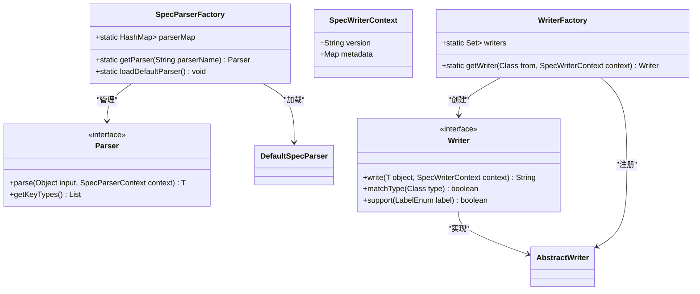
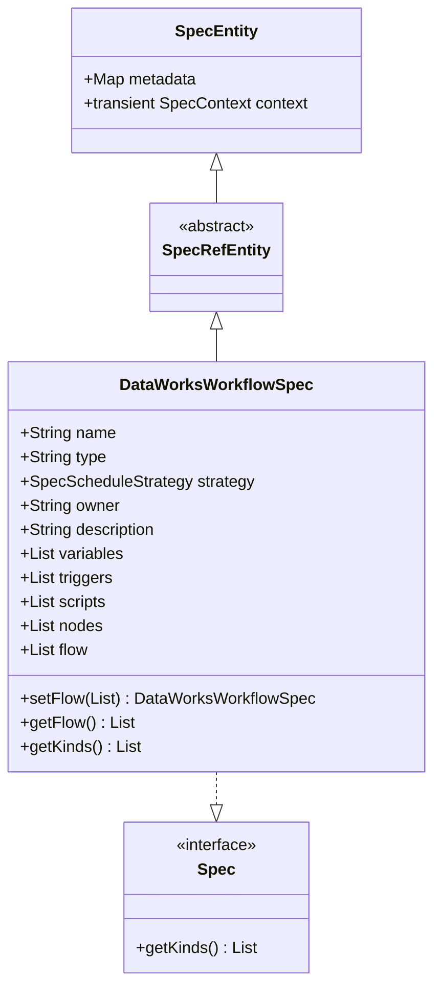
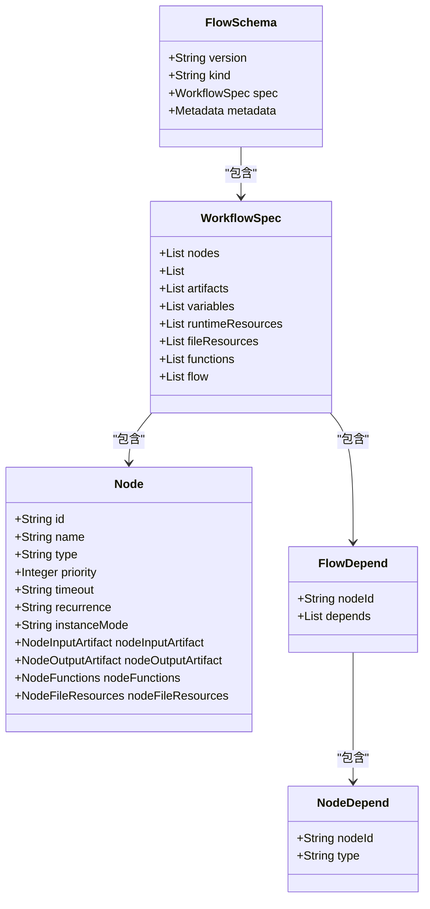
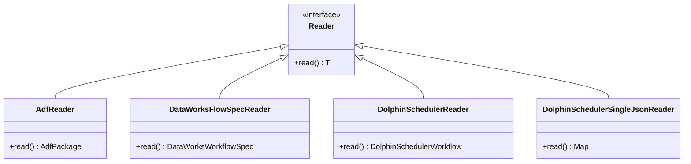
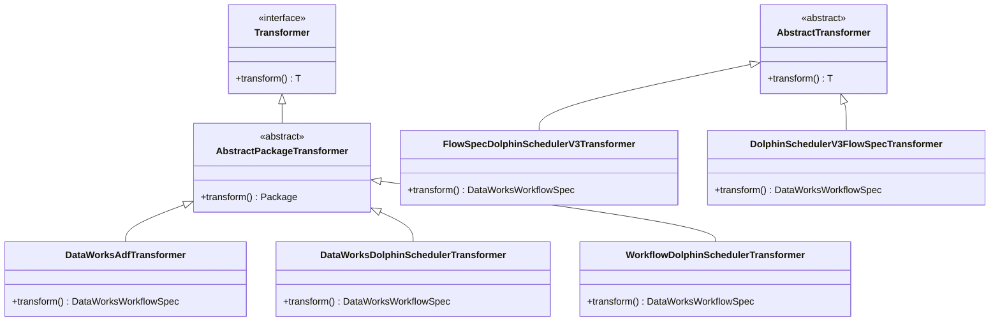
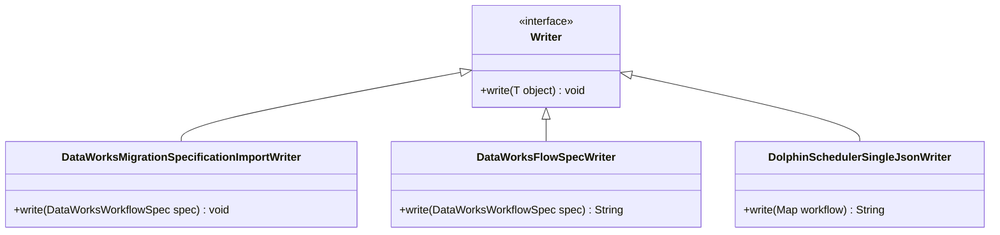
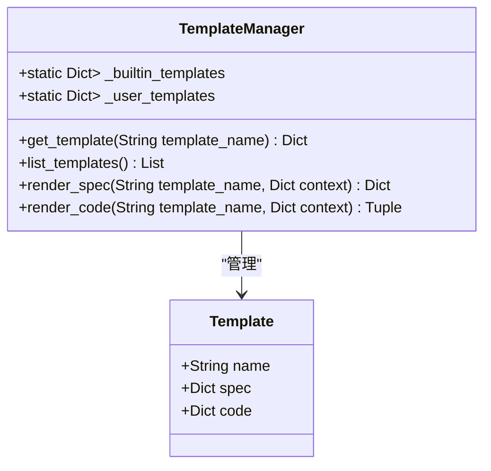
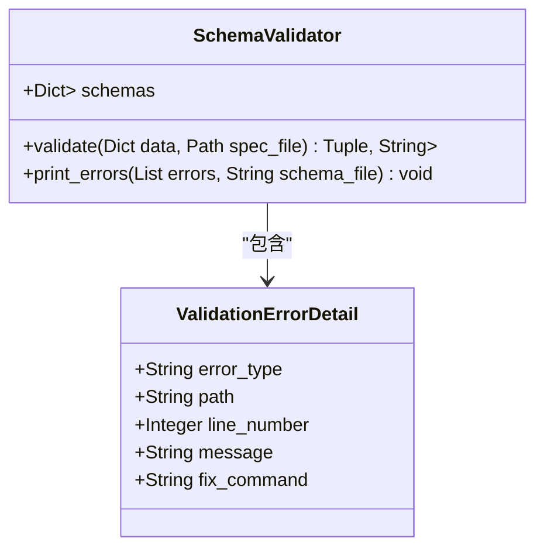
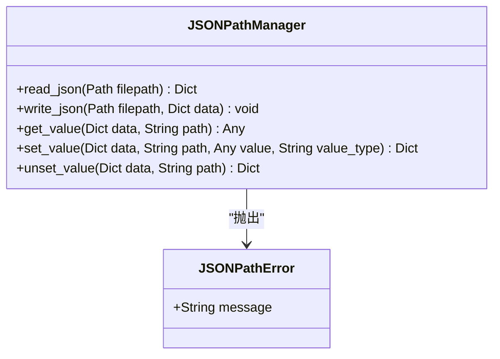

# 核心功能

<cite>
**本文档中引用的文件**  
- [DataWorksWorkflowSpec.java](file://spec/src/main/java/com/aliyun/dataworks/common/spec/domain/DataWorksWorkflowSpec.java)
- [SpecParserFactory.java](file://spec/src/main/java/com/aliyun/dataworks/common/spec/parser/SpecParserFactory.java)
- [WriterFactory.java](file://spec/src/main/java/com/aliyun/dataworks/common/spec/writer/WriterFactory.java)
- [Spec.java](file://spec/src/main/java/com/aliyun/dataworks/common/spec/domain/Spec.java)
- [SpecEntity.java](file://spec/src/main/java/com/aliyun/dataworks/common/spec/domain/SpecEntity.java)
- [flow.schema.json](file://schema/flow.schema.json)
- [cli.py](file://dwcli/dwcli/cli.py)
- [manager.py](file://dwcli/dwcli/pkg/template/manager.py)
- [manager.py](file://dwcli/dwcli/pkg/jsonpath/manager.py)
- [validator.py](file://dwcli/dwcli/pkg/schema/validator.py)
- [AdfReader.java](file://client/migrationx/migrationx-reader/src/main/java/com/aliyun/dataworks/migrationx/reader/adf/AdfReader.java)
- [DataWorksFlowSpecReader.java](file://client/migrationx/migrationx-reader/src/main/java/com/aliyun/dataworks/migrationx/reader/dataworks/DataWorksFlowSpecReader.java)
- [DolphinSchedulerReader.java](file://client/migrationx/migrationx-reader/src/main/java/com/aliyun/dataworks/migrationx/reader/dolphinscheduler/DolphinSchedulerReader.java)
- [DolphinSchedulerSingleJsonReader.java](file://client/migrationx/migrationx-reader/src/main/java/com/aliyun/dataworks/migrationx/reader/dolphinscheduler/DolphinSchedulerSingleJsonReader.java)
- [AbstractPackageTransformer.java](file://client/migrationx/migrationx-transformer/src/main/java/com/aliyun/dataworks/migrationx/transformer/core/transformer/AbstractPackageTransformer.java)
- [Transformer.java](file://client/migrationx/migrationx-transformer/src/main/java/com/aliyun/dataworks/migrationx/transformer/core/transformer/Transformer.java)
- [DataWorksAdfTransformer.java](file://client/migrationx/migrationx-transformer/src/main/java/com/aliyun/dataworks/migrationx/transformer/dataworks/transformer/DataWorksAdfTransformer.java)
- [DataWorksDolphinSchedulerTransformer.java](file://client/migrationx/migrationx-transformer/src/main/java/com/aliyun/dataworks/migrationx/transformer/dataworks/transformer/DataWorksDolphinSchedulerTransformer.java)
- [WorkflowDolphinSchedulerTransformer.java](file://client/migrationx/migrationx-transformer/src/main/java/com/aliyun/dataworks/migrationx/transformer/dataworks/transformer/WorkflowDolphinSchedulerTransformer.java)
- [FlowSpecDolphinSchedulerV3Transformer.java](file://client/migrationx/migrationx-transformer/src/main/java/com/aliyun/dataworks/migrationx/transformer/dolphinscheduler/transformer/flowspec/FlowSpecDolphinSchedulerV3Transformer.java)
- [AbstractTransformer.java](file://client/migrationx/migrationx-transformer/src/main/java/com/aliyun/dataworks/migrationx/transformer/flowspec/transformer/AbstractTransformer.java)
- [DolphinSchedulerV3FlowSpecTransformer.java](file://client/migrationx/migrationx-transformer/src/main/java/com/aliyun/dataworks/migrationx/transformer/flowspec/transformer/dolphinscheduler/DolphinSchedulerV3FlowSpecTransformer.java)
- [DataWorksMigrationSpecificationImportWriter.java](file://client/migrationx/migrationx-writer/src/main/java/com/aliyun/dataworks/migrationx/writer/DataWorksMigrationSpecificationImportWriter.java)
- [DataWorksFlowSpecWriter.java](file://client/migrationx/migrationx-writer/src/main/java/com/aliyun/dataworks/migrationx/writer/dataworks/DataWorksFlowSpecWriter.java)
- [DolphinSchedulerSingleJsonWriter.java](file://client/migrationx/migrationx-writer/src/main/java/com/aliyun/dataworks/migrationx/writer/dolphinscheduler/DolphinSchedulerSingleJsonWriter.java)
- [SpecWriter.java](file://spec/src/main/java/com/aliyun/dataworks/common/spec/annotation/SpecWriter.java)
- [Writer.java](file://spec/src/main/java/com/aliyun/dataworks/common/spec/writer/Writer.java)
- [AbstractWriter.java](file://spec/src/main/java/com/aliyun/dataworks/common/spec/writer/impl/AbstractWriter.java)
</cite>

## 目录
1. [工作流描述规范（Spec）](#工作流描述规范spec)
2. [迁移工具（MigrationX）](#迁移工具migrationx)
3. [命令行工具（dwcli）](#命令行工具dwcli)

## 工作流描述规范（Spec）

dataworks-spec项目的核心是其工作流描述规范（Spec），该规范提供了一套标准化的JSON Schema来描述数据工作流的结构和行为。规范系统基于Java实现，采用领域驱动设计（DDD）模式，通过实体类型系统、解析器和序列化器来处理工作流的定义。

### 规范解析与序列化

规范系统的核心是解析器（Parser）和序列化器（Writer）机制。`SpecParserFactory`类负责管理所有解析器的注册和获取，通过反射机制自动发现并加载实现了`Parser`接口的解析器。解析器使用`@SpecParser`注解来声明其支持的实体类型，从而实现基于类型的解析策略。

**图示来源**
- [SpecParserFactory.java](file://spec/src/main/java/com/aliyun/dataworks/common/spec/parser/SpecParserFactory.java)
- [WriterFactory.java](file://spec/src/main/java/com/aliyun/dataworks/common/spec/writer/WriterFactory.java)
- [SpecWriter.java](file://spec/src/main/java/com/aliyun/dataworks/common/spec/annotation/SpecWriter.java)
- [Writer.java](file://spec/src/main/java/com/aliyun/dataworks/common/spec/writer/Writer.java)
- [AbstractWriter.java](file://spec/src/main/java/com/aliyun/dataworks/common/spec/writer/impl/AbstractWriter.java)

序列化过程由`WriterFactory`管理，它通过扫描类路径下的`AbstractWriter`子类来注册所有可用的序列化器。每个序列化器通过`@SpecWriter`注解声明其支持的版本和类型，从而实现版本兼容性和类型匹配。

### 实体类型系统

规范系统采用分层的实体类型系统，所有实体都继承自`SpecEntity`基类，该类提供了元数据（metadata）和上下文（context）的通用支持。`Spec`接口定义了所有规范实体必须实现的`getKinds()`方法，用于标识实体支持的工作流类型。

`DataWorksWorkflowSpec`类是核心工作流规范的实现，它继承自`SpecRefEntity`并实现了`Spec`接口。该类定义了工作流的各种组成部分，包括节点（nodes）、脚本（scripts）、变量（variables）、触发器（triggers）等。通过`getKinds()`方法，它声明了支持多种工作流类型，如周期工作流（CYCLE_WORKFLOW）、手动工作流（MANUAL_WORKFLOW）等。

**图示来源**
- [SpecEntity.java](file://spec/src/main/java/com/aliyun/dataworks/common/spec/domain/SpecEntity.java)
- [Spec.java](file://spec/src/main/java/com/aliyun/dataworks/common/spec/domain/Spec.java)
- [DataWorksWorkflowSpec.java](file://spec/src/main/java/com/aliyun/dataworks/common/spec/domain/DataWorksWorkflowSpec.java)

### 工作流类型和节点类型

工作流类型通过`kind`字段在JSON Schema中定义，主要分为周期工作流（CycleWorkflow）和手动工作流（ManualWorkflow）。`flow.schema.json`文件定义了工作流的通用结构，包括版本、类型、规范定义和元数据。通过JSON Schema的`if-then`条件语句，系统能够根据`kind`值动态应用不同的验证规则。

**图示来源**
- [flow.schema.json](file://schema/flow.schema.json)

节点类型系统通过`SpecNode`类实现，支持多种节点类型，包括ODPS SQL节点、EMR Spark节点、PAI节点等。每个节点类型都有其特定的配置参数和执行逻辑，通过`type`字段进行区分。依赖关系通过`flow`字段中的`FlowDepend`对象定义，支持正常依赖、跨周期自依赖、跨周期子节点依赖等多种依赖类型。

## 迁移工具（MigrationX）

MigrationX是dataworks-spec项目中的核心迁移工具，负责在不同数据工作流平台之间进行转换和迁移。它采用Reader-Transformer-Writer架构模式，将迁移过程分解为三个独立的阶段：读取源平台数据、转换为中间表示、写入目标平台。

### Reader模块

Reader模块负责从源平台读取工作流定义。系统提供了多种Reader实现，包括`AdfReader`用于读取Azure Data Factory工作流，`DataWorksFlowSpecReader`用于读取DataWorks工作流，以及`DolphinSchedulerReader`用于读取DolphinScheduler工作流。

**图示来源**
- [AdfReader.java](file://client/migrationx/migrationx-reader/src/main/java/com/aliyun/dataworks/migrationx/reader/adf/AdfReader.java)
- [DataWorksFlowSpecReader.java](file://client/migrationx/migrationx-reader/src/main/java/com/aliyun/dataworks/migrationx/reader/dataworks/DataWorksFlowSpecReader.java)
- [DolphinSchedulerReader.java](file://client/migrationx/migrationx-reader/src/main/java/com/aliyun/dataworks/migrationx/reader/dolphinscheduler/DolphinSchedulerReader.java)
- [DolphinSchedulerSingleJsonReader.java](file://client/migrationx/migrationx-reader/src/main/java/com/aliyun/dataworks/migrationx/reader/dolphinscheduler/DolphinSchedulerSingleJsonReader.java)

每个Reader实现都针对特定平台的API和数据格式进行了优化，能够高效地提取工作流的元数据和配置信息。`DolphinSchedulerSingleJsonReader`特别设计用于处理单个JSON格式的工作流定义，而其他Reader则支持更复杂的包结构。

### Transformer模块

Transformer模块是迁移过程的核心，负责将源平台的工作流定义转换为DataWorks规范的中间表示。系统采用分层的Transformer架构，包括`AbstractPackageTransformer`作为基类，以及针对不同源平台的具体实现如`DataWorksAdfTransformer`和`DataWorksDolphinSchedulerTransformer`。

**图示来源**
- [AbstractPackageTransformer.java](file://client/migrationx/migrationx-transformer/src/main/java/com/aliyun/dataworks/migrationx/transformer/core/transformer/AbstractPackageTransformer.java)
- [Transformer.java](file://client/migrationx/migrationx-transformer/src/main/java/com/aliyun/dataworks/migrationx/transformer/core/transformer/Transformer.java)
- [DataWorksAdfTransformer.java](file://client/migrationx/migrationx-transformer/src/main/java/com/aliyun/dataworks/migrationx/transformer/dataworks/transformer/DataWorksAdfTransformer.java)
- [DataWorksDolphinSchedulerTransformer.java](file://client/migrationx/migrationx-transformer/src/main/java/com/aliyun/dataworks/migrationx/transformer/dataworks/transformer/DataWorksDolphinSchedulerTransformer.java)
- [WorkflowDolphinSchedulerTransformer.java](file://client/migrationx/migrationx-transformer/src/main/java/com/aliyun/dataworks/migrationx/transformer/dataworks/transformer/WorkflowDolphinSchedulerTransformer.java)
- [FlowSpecDolphinSchedulerV3Transformer.java](file://client/migrationx/migrationx-transformer/src/main/java/com/aliyun/dataworks/migrationx/transformer/dolphinscheduler/transformer/flowspec/FlowSpecDolphinSchedulerV3Transformer.java)
- [AbstractTransformer.java](file://client/migrationx/migrationx-transformer/src/main/java/com/aliyun/dataworks/migrationx/transformer/flowspec/transformer/AbstractTransformer.java)
- [DolphinSchedulerV3FlowSpecTransformer.java](file://client/migrationx/migrationx-transformer/src/main/java/com/aliyun/dataworks/migrationx/transformer/flowspec/transformer/dolphinscheduler/DolphinSchedulerV3FlowSpecTransformer.java)

Transformer模块采用链式处理模式，多个Transformer可以串联执行，每个Transformer负责处理特定的转换任务。例如，`FlowSpecDolphinSchedulerV3Transformer`专门处理DolphinScheduler V3版本的工作流规范转换，而`DataWorksDolphinSchedulerTransformer`则负责更高层次的平台特定转换。

### Writer模块

Writer模块负责将转换后的中间表示写入目标平台。系统提供了多种Writer实现，包括`DataWorksMigrationSpecificationImportWriter`用于将规范导入DataWorks，`DataWorksFlowSpecWriter`用于生成DataWorks工作流定义，以及`DolphinSchedulerSingleJsonWriter`用于生成DolphinScheduler的JSON格式工作流。

**图示来源**
- [DataWorksMigrationSpecificationImportWriter.java](file://client/migrationx/migrationx-writer/src/main/java/com/aliyun/dataworks/migrationx/writer/DataWorksMigrationSpecificationImportWriter.java)
- [DataWorksFlowSpecWriter.java](file://client/migrationx/migrationx-writer/src/main/java/com/aliyun/dataworks/migrationx/writer/dataworks/DataWorksFlowSpecWriter.java)
- [DolphinSchedulerSingleJsonWriter.java](file://client/migrationx/migrationx-writer/src/main/java/com/aliyun/dataworks/migrationx/writer/dolphinscheduler/DolphinSchedulerSingleJsonWriter.java)

Writer模块与Spec系统的序列化器紧密集成，利用`WriterFactory`来选择合适的序列化策略。每个Writer实现都针对目标平台的API和数据格式进行了优化，确保生成的工作流定义符合平台要求。

## 命令行工具（dwcli）

dwcli是dataworks-spec项目的命令行工具，提供了一套简洁的CLI命令来管理数据工作流。它基于Click框架构建，支持创建、修改、验证和检查工作流规范。

### 模板管理

模板管理功能由`TemplateManager`类实现，它支持内置模板和用户自定义模板。模板存储在`templates`目录中，采用JSON格式定义，包含规范（spec）和代码（code）两部分。`render_spec`和`render_code`方法使用Jinja2模板引擎将上下文变量注入模板中，生成最终的规范和代码文件。

**图示来源**
- [manager.py](file://dwcli/dwcli/pkg/template/manager.py)

### 验证器

验证器功能由`SchemaValidator`类实现，它基于JSON Schema对工作流规范进行验证。验证器支持内置Schema和用户自定义Schema，能够提供详细的错误信息和修复建议。`validate`方法返回验证结果、错误列表和Schema键，`print_errors`方法则以友好的格式输出验证错误。

**图示来源**
- [validator.py](file://dwcli/dwcli/pkg/schema/validator.py)

### JSONPath管理

JSONPath管理功能由`JSONPathManager`类实现，它提供了一套完整的JSON路径操作接口，包括读取、写入、获取、设置和删除值。`get_value`、`set_value`和`unset_value`方法支持标准的JSONPath语法，能够精确地操作JSON文档中的任意节点。

**图示来源**
- [manager.py](file://dwcli/dwcli/pkg/jsonpath/manager.py)

dwcli工具通过`cli.py`中的Click命令组提供了用户友好的命令行接口，包括`node create`、`node set`、`node unset`、`node inspect`和`node validate`等命令，使用户能够方便地管理数据工作流。