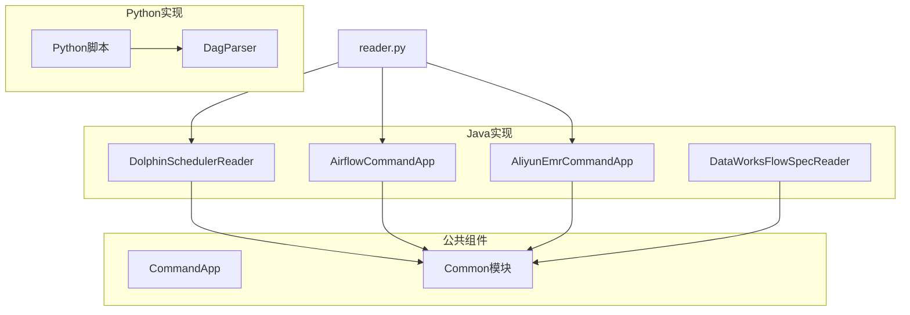
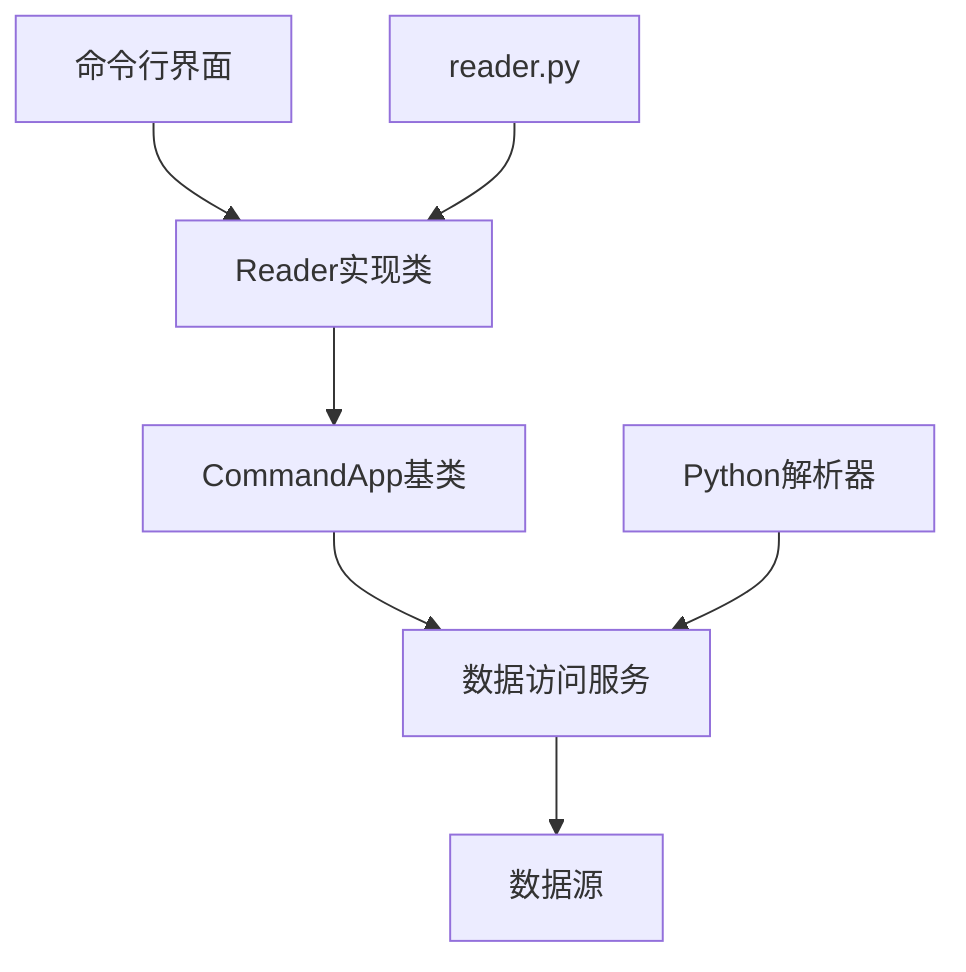
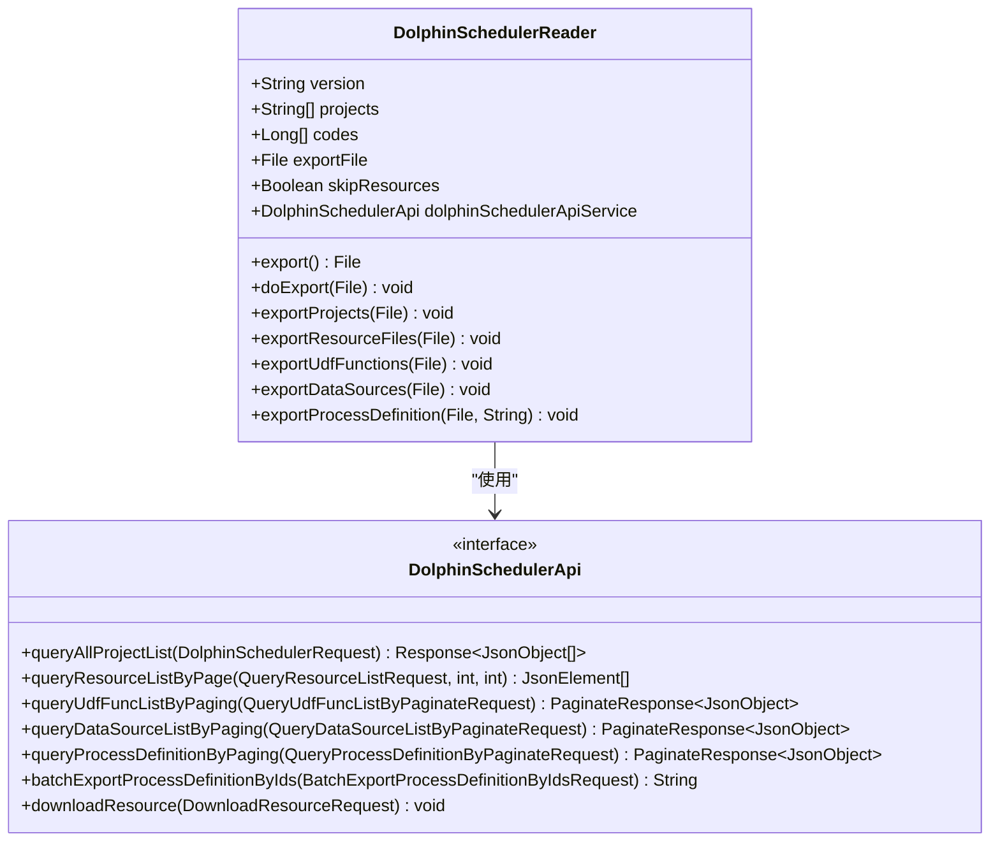
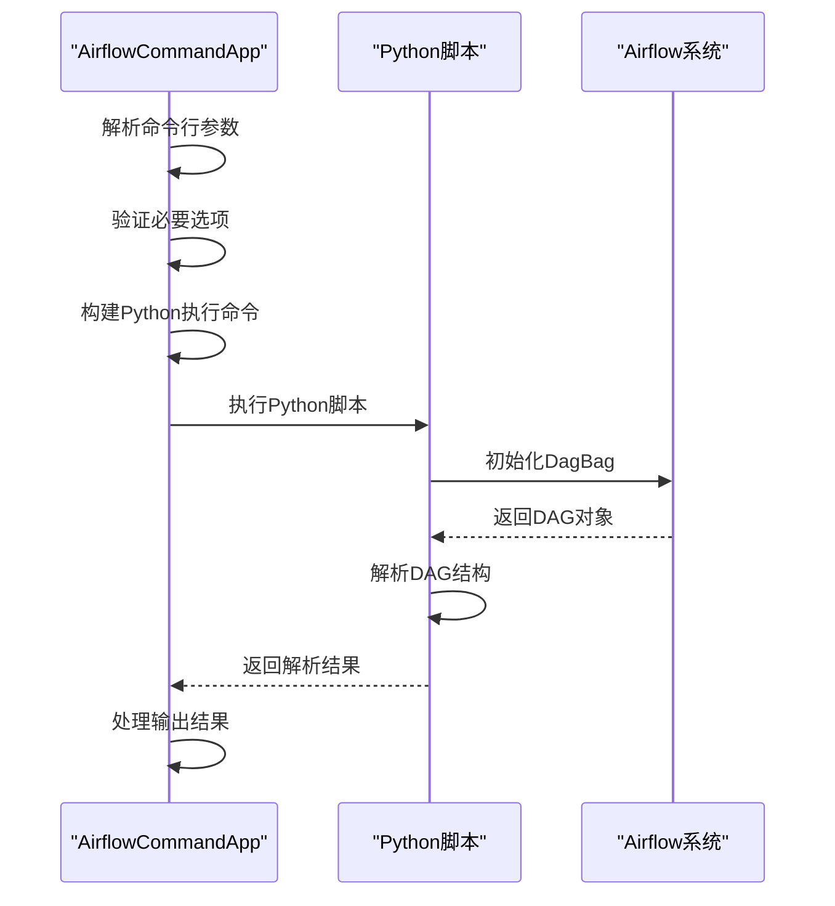
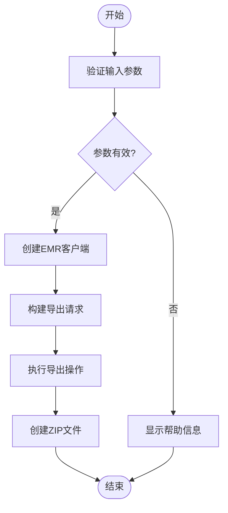
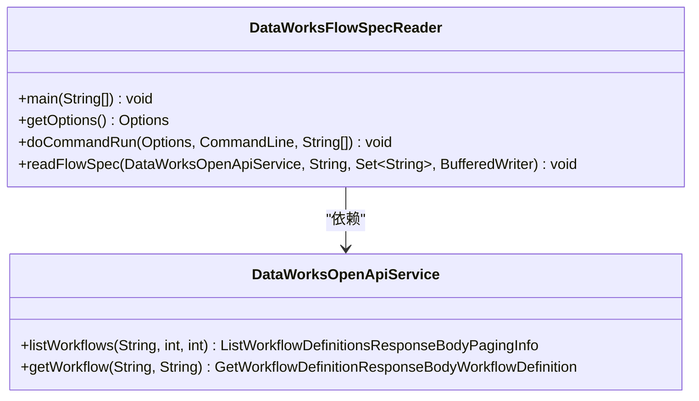
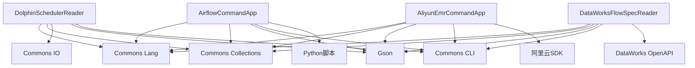

# Reader模块

<cite>
**本文档中引用的文件**  
- [DolphinSchedulerReader.java](file://client/migrationx/migrationx-reader/src/main/java/com/aliyun/dataworks/migrationx/reader/dolphinscheduler/DolphinSchedulerReader.java)
- [AirflowCommandApp.java](file://client/migrationx/migrationx-reader/src/main/java/com/aliyun/dataworks/migrationx/reader/airflow/AirflowCommandApp.java)
- [AliyunEmrCommandApp.java](file://client/migrationx/migrationx-reader/src/main/java/com/aliyun/dataworks/migrationx/reader/aliyunemr/AliyunEmrCommandApp.java)
- [DataWorksFlowSpecReader.java](file://client/migrationx/migrationx-reader/src/main/java/com/aliyun/dataworks/migrationx/reader/dataworks/DataWorksFlowSpecReader.java)
- [reader.py](file://client/migrationx/src/main/bin/reader.py)
- [dag_parser.py](file://client/migrationx/migrationx-reader/src/main/python/src/airflow_dag_parser/dag_parser.py)
- [CommandApp.java](file://client/client-common/src/main/java/com/aliyun/dataworks/client/command/CommandApp.java)
</cite>

## 目录
1. [简介](#简介)
2. [项目结构](#项目结构)
3. [核心组件](#核心组件)
4. [架构概述](#架构概述)
5. [详细组件分析](#详细组件分析)
6. [依赖分析](#依赖分析)
7. [性能考虑](#性能考虑)
8. [故障排除指南](#故障排除指南)
9. [结论](#结论)

## 简介
Reader模块是DataWorks-Spec项目中的核心组件，负责从多种工作流调度系统中读取数据。该模块支持从DolphinScheduler、Airflow、阿里云EMR等多种系统中提取工作流定义、任务节点、依赖关系和调度配置。通过API或文件系统接口，Reader模块能够高效地获取源系统的元数据，并将其转换为统一的规范格式。本模块的设计遵循可扩展性原则，允许轻松集成新的数据源。

## 项目结构
Reader模块的代码组织体现了清晰的分层架构和模块化设计。Java实现位于`client/migrationx/migrationx-reader/src/main/java`目录下，按数据源类型进行包划分。Python脚本位于`client/migrationx/migrationx-reader/src/main/python`目录中，主要用于Airflow等系统的解析工作。命令行工具通过`reader.py`脚本统一入口，实现了跨语言的协同工作。

**图表来源**
- [DolphinSchedulerReader.java](file://client/migrationx/migrationx-reader/src/main/java/com/aliyun/dataworks/migrationx/reader/dolphinscheduler/DolphinSchedulerReader.java)
- [AirflowCommandApp.java](file://client/migrationx/migrationx-reader/src/main/java/com/aliyun/dataworks/migrationx/reader/airflow/AirflowCommandApp.java)
- [AliyunEmrCommandApp.java](file://client/migrationx/migrationx-reader/src/main/java/com/aliyun/dataworks/migrationx/reader/aliyunemr/AliyunEmrCommandApp.java)
- [DataWorksFlowSpecReader.java](file://client/migrationx/migrationx-reader/src/main/java/com/aliyun/dataworks/migrationx/reader/dataworks/DataWorksFlowSpecReader.java)
- [reader.py](file://client/migrationx/src/main/bin/reader.py)
- [dag_parser.py](file://client/migrationx/migrationx-reader/src/main/python/src/airflow_dag_parser/dag_parser.py)

**章节来源**
- [DolphinSchedulerReader.java](file://client/migrationx/migrationx-reader/src/main/java/com/aliyun/dataworks/migrationx/reader/dolphinscheduler/DolphinSchedulerReader.java)
- [AirflowCommandApp.java](file://client/migrationx/migrationx-reader/src/main/java/com/aliyun/dataworks/migrationx/reader/airflow/AirflowCommandApp.java)
- [AliyunEmrCommandApp.java](file://client/migrationx/migrationx-reader/src/main/java/com/aliyun/dataworks/migrationx/reader/aliyunemr/AliyunEmrCommandApp.java)

## 核心组件
Reader模块的核心组件包括DolphinSchedulerReader、AirflowCommandApp、AliyunEmrCommandApp和DataWorksFlowSpecReader。这些组件都继承自CommandApp基类，实现了统一的命令行接口。每个Reader实现类都针对特定的数据源进行了优化，通过相应的API或文件系统接口提取数据。公共接口定义了标准化的读取操作，确保了模块的一致性和可维护性。

**章节来源**
- [DolphinSchedulerReader.java](file://client/migrationx/migrationx-reader/src/main/java/com/aliyun/dataworks/migrationx/reader/dolphinscheduler/DolphinSchedulerReader.java)
- [AirflowCommandApp.java](file://client/migrationx/migrationx-reader/src/main/java/com/aliyun/dataworks/migrationx/reader/airflow/AirflowCommandApp.java)
- [AliyunEmrCommandApp.java](file://client/migrationx/migrationx-reader/src/main/java/com/aliyun/dataworks/migrationx/reader/aliyunemr/AliyunEmrCommandApp.java)
- [DataWorksFlowSpecReader.java](file://client/migrationx/migrationx-reader/src/main/java/com/aliyun/dataworks/migrationx/reader/dataworks/DataWorksFlowSpecReader.java)
- [CommandApp.java](file://client/client-common/src/main/java/com/aliyun/dataworks/client/command/CommandApp.java)

## 架构概述
Reader模块采用分层架构设计，上层为具体的Reader实现类，中层为公共的CommandApp基类，底层为各种数据访问服务。这种设计实现了关注点分离，提高了代码的可测试性和可维护性。模块通过Java和Python的混合编程模式，充分利用了两种语言的优势：Java用于构建稳定的命令行框架，Python用于处理复杂的解析逻辑。

**图表来源**
- [DolphinSchedulerReader.java](file://client/migrationx/migrationx-reader/src/main/java/com/aliyun/dataworks/migrationx/reader/dolphinscheduler/DolphinSchedulerReader.java)
- [AirflowCommandApp.java](file://client/migrationx/migrationx-reader/src/main/java/com/aliyun/dataworks/migrationx/reader/airflow/AirflowCommandApp.java)
- [AliyunEmrCommandApp.java](file://client/migrationx/migrationx-reader/src/main/java/com/aliyun/dataworks/migrationx/reader/aliyunemr/AliyunEmrCommandApp.java)
- [CommandApp.java](file://client/client-common/src/main/java/com/aliyun/dataworks/client/command/CommandApp.java)
- [reader.py](file://client/migrationx/src/main/bin/reader.py)

## 详细组件分析

### DolphinSchedulerReader分析
DolphinSchedulerReader负责从DolphinScheduler系统中读取工作流数据。它支持1.x、2.x和3.x版本的API，通过版本检测自动选择合适的API服务。该组件能够导出项目信息、资源文件、UDF函数、数据源和工作流定义，并将它们组织成结构化的JSON文件。

**图表来源**
- [DolphinSchedulerReader.java](file://client/migrationx/migrationx-reader/src/main/java/com/aliyun/dataworks/migrationx/reader/dolphinscheduler/DolphinSchedulerReader.java)

**章节来源**
- [DolphinSchedulerReader.java](file://client/migrationx/migrationx-reader/src/main/java/com/aliyun/dataworks/migrationx/reader/dolphinscheduler/DolphinSchedulerReader.java)

### AirflowCommandApp分析
AirflowCommandApp通过调用Python脚本的方式与Airflow系统交互。它首先验证必要的命令行参数，然后构建Python执行命令，最终调用Airflow的DAG解析器来提取工作流信息。这种设计实现了Java和Python的无缝集成，充分利用了Airflow原生的Python API。

**图表来源**
- [AirflowCommandApp.java](file://client/migrationx/migrationx-reader/src/main/java/com/aliyun/dataworks/migrationx/reader/airflow/AirflowCommandApp.java)
- [dag_parser.py](file://client/migrationx/migrationx-reader/src/main/python/src/airflow_dag_parser/dag_parser.py)

**章节来源**
- [AirflowCommandApp.java](file://client/migrationx/migrationx-reader/src/main/java/com/aliyun/dataworks/migrationx/reader/airflow/AirflowCommandApp.java)
- [dag_parser.py](file://client/migrationx/migrationx-reader/src/main/python/src/airflow_dag_parser/dag_parser.py)

### AliyunEmrCommandApp分析
AliyunEmrCommandApp专门用于从阿里云EMR系统导出工作流数据。它通过阿里云POP SDK与EMR服务进行通信，支持通过访问密钥、端点、区域ID等参数进行身份验证。该组件能够导出指定项目的工作流，并将结果打包成ZIP文件。

**图表来源**
- [AliyunEmrCommandApp.java](file://client/migrationx/migrationx-reader/src/main/java/com/aliyun/dataworks/migrationx/reader/aliyunemr/AliyunEmrCommandApp.java)

**章节来源**
- [AliyunEmrCommandApp.java](file://client/migrationx/migrationx-reader/src/main/java/com/aliyun/dataworks/migrationx/reader/aliyunemr/AliyunEmrCommandApp.java)

### DataWorksFlowSpecReader分析
DataWorksFlowSpecReader从DataWorks系统读取FlowSpec格式的规范文件。它通过DataWorks OpenAPI服务获取工作流定义，并将多个工作流的规范合并到一个JSON数组中。该组件支持按工作流ID进行过滤，提高了数据读取的灵活性。

**图表来源**
- [DataWorksFlowSpecReader.java](file://client/migrationx/migrationx-reader/src/main/java/com/aliyun/dataworks/migrationx/reader/dataworks/DataWorksFlowSpecReader.java)

**章节来源**
- [DataWorksFlowSpecReader.java](file://client/migrationx/migrationx-reader/src/main/java/com/aliyun/dataworks/migrationx/reader/dataworks/DataWorksFlowSpecReader.java)

## 依赖分析
Reader模块的依赖关系清晰明了，各组件之间耦合度低。Java实现依赖于Commons CLI库处理命令行参数，Gson库处理JSON序列化，以及Apache Commons库提供各种实用工具。Python实现依赖于Airflow SDK来解析DAG文件。通过CommandApp基类，所有Reader实现共享相同的命令行接口和错误处理机制。

**图表来源**
- [DolphinSchedulerReader.java](file://client/migrationx/migrationx-reader/src/main/java/com/aliyun/dataworks/migrationx/reader/dolphinscheduler/DolphinSchedulerReader.java)
- [AirflowCommandApp.java](file://client/migrationx/migrationx-reader/src/main/java/com/aliyun/dataworks/migrationx/reader/airflow/AirflowCommandApp.java)
- [AliyunEmrCommandApp.java](file://client/migrationx/migrationx-reader/src/main/java/com/aliyun/dataworks/migrationx/reader/aliyunemr/AliyunEmrCommandApp.java)
- [DataWorksFlowSpecReader.java](file://client/migrationx/migrationx-reader/src/main/java/com/aliyun/dataworks/migrationx/reader/dataworks/DataWorksFlowSpecReader.java)

**章节来源**
- [DolphinSchedulerReader.java](file://client/migrationx/migrationx-reader/src/main/java/com/aliyun/dataworks/migrationx/reader/dolphinscheduler/DolphinSchedulerReader.java)
- [AirflowCommandApp.java](file://client/migrationx/migrationx-reader/src/main/java/com/aliyun/dataworks/migrationx/reader/airflow/AirflowCommandApp.java)
- [AliyunEmrCommandApp.java](file://client/migrationx/migrationx-reader/src/main/java/com/aliyun/dataworks/migrationx/reader/aliyunemr/AliyunEmrCommandApp.java)
- [DataWorksFlowSpecReader.java](file://client/migrationx/migrationx-reader/src/main/java/com/aliyun/dataworks/migrationx/reader/dataworks/DataWorksFlowSpecReader.java)

## 性能考虑
对于大规模数据读取，建议采取以下优化措施：使用分页查询避免内存溢出，合理设置批量大小以平衡性能和资源消耗，启用资源跳过功能减少不必要的文件下载，以及利用并行处理提高整体效率。此外，应监控网络延迟和API调用频率，避免触发限流机制。

## 故障排除指南
针对常见的读取失败场景，提供以下故障排除建议：
- **认证失败**：检查访问密钥、令牌等认证信息是否正确，确认权限是否足够
- **网络超时**：检查网络连接，调整超时设置，确认端点地址是否正确
- **数据格式错误**：验证源系统版本兼容性，检查API响应格式是否符合预期
- **资源不足**：增加JVM堆内存，优化分页大小，考虑分批处理
- **依赖缺失**：确保所有必需的库和工具都已正确安装和配置

**章节来源**
- [DolphinSchedulerReader.java](file://client/migrationx/migrationx-reader/src/main/java/com/aliyun/dataworks/migrationx/reader/dolphinscheduler/DolphinSchedulerReader.java)
- [AirflowCommandApp.java](file://client/migrationx/migrationx-reader/src/main/java/com/aliyun/dataworks/migrationx/reader/airflow/AirflowCommandApp.java)
- [AliyunEmrCommandApp.java](file://client/migrationx/migrationx-reader/src/main/java/com/aliyun/dataworks/migrationx/reader/aliyunemr/AliyunEmrCommandApp.java)
- [DataWorksFlowSpecReader.java](file://client/migrationx/migrationx-reader/src/main/java/com/aliyun/dataworks/migrationx/reader/dataworks/DataWorksFlowSpecReader.java)

## 结论
Reader模块通过统一的架构设计和灵活的实现方式，成功实现了从多种工作流调度系统读取数据的功能。各Reader实现类在保持各自特有逻辑的同时，共享了公共的接口和基础组件，确保了代码的一致性和可维护性。通过Java和Python的混合编程，模块充分发挥了两种语言的优势，为数据迁移和集成提供了强大的支持。