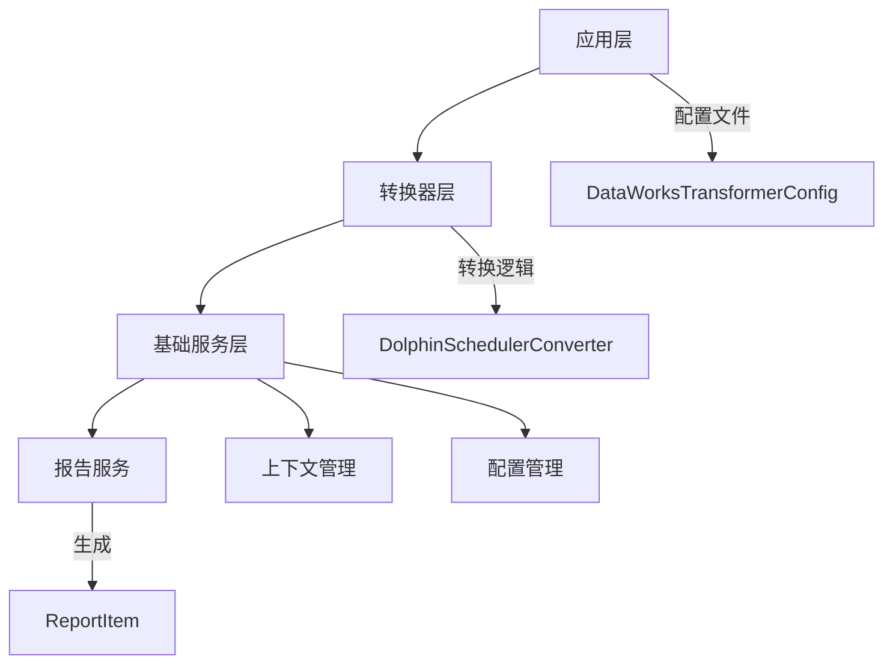
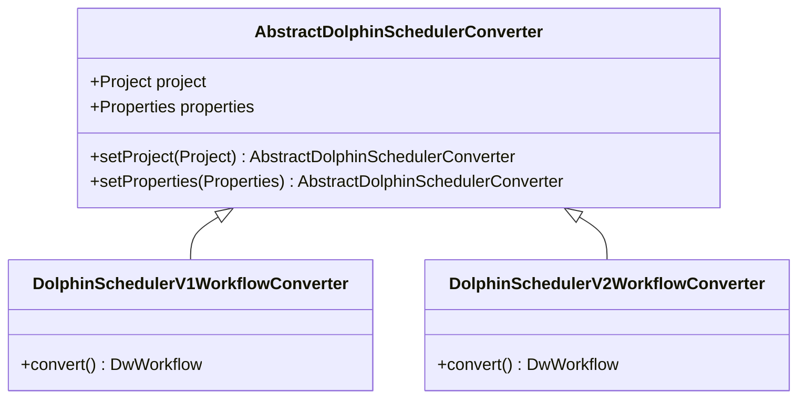
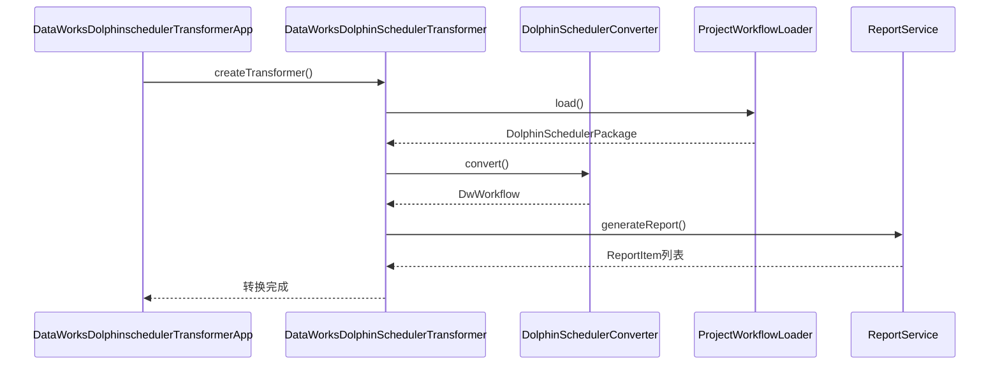
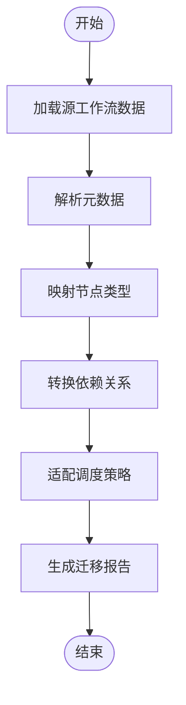
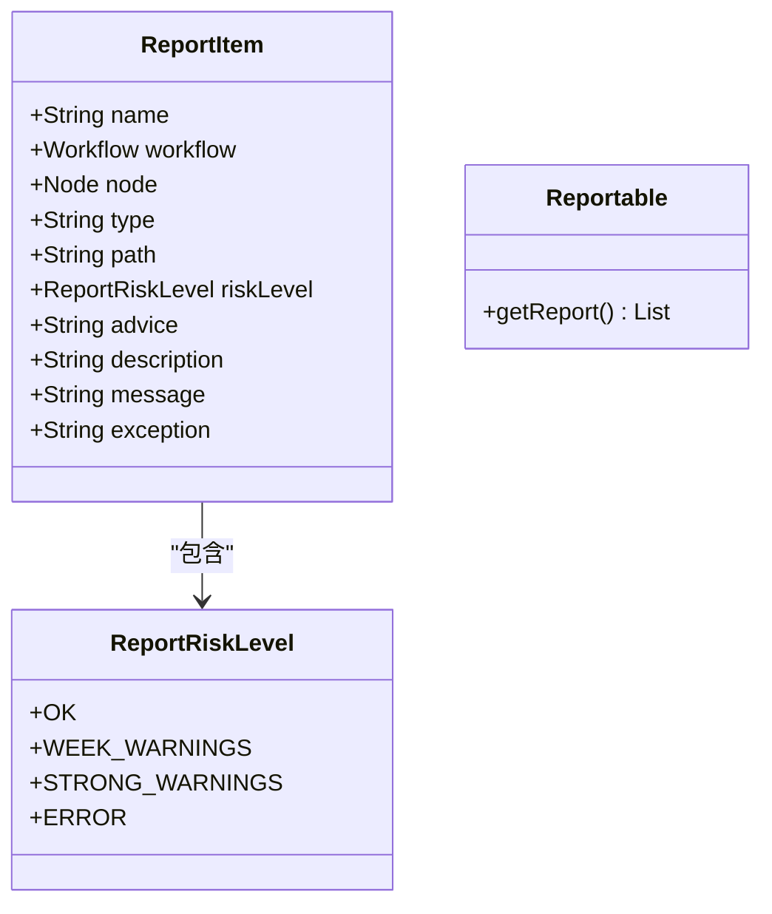
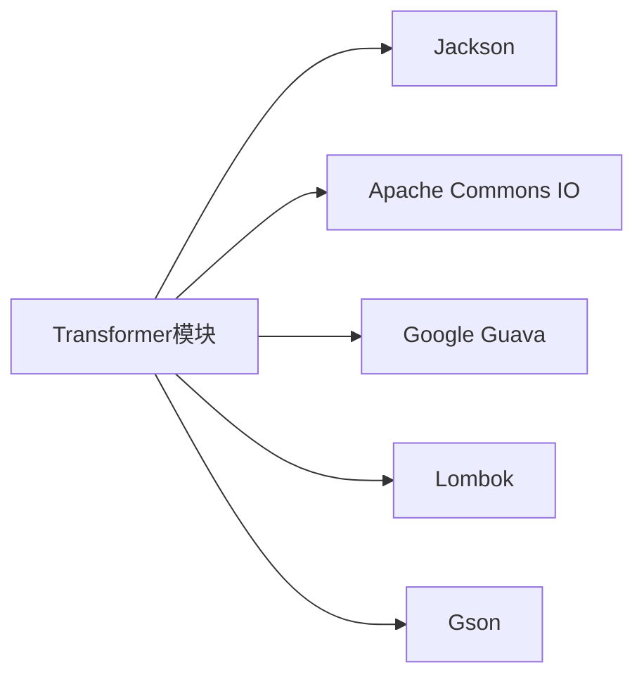

# Transformer模块

<cite>
**本文档中引用的文件**
- [DataWorksDolphinschedulerTransformerApp.java](file://client/migrationx/migrationx-transformer/src/main/java/com/aliyun/dataworks/migrationx/transformer/dataworks/apps/DataWorksDolphinschedulerTransformerApp.java)
- [DataWorksDolphinSchedulerTransformer.java](file://client/migrationx/migrationx-transformer/src/main/java/com/aliyun/dataworks/migrationx/transformer/dataworks/transformer/DataWorksDolphinSchedulerTransformer.java)
- [WorkflowDolphinSchedulerTransformer.java](file://client/migrationx/migrationx-transformer/src/main/java/com/aliyun/dataworks/migrationx/transformer/dataworks/transformer/WorkflowDolphinSchedulerTransformer.java)
- [DolphinSchedulerConverterContext.java](file://client/migrationx/migrationx-transformer/src/main/java/com/aliyun/dataworks/migrationx/transformer/dataworks/converter/dolphinscheduler/DolphinSchedulerConverterContext.java)
- [AbstractDolphinSchedulerConverter.java](file://client/migrationx/migrationx-transformer/src/main/java/com/aliyun/dataworks/migrationx/transformer/dataworks/converter/dolphinscheduler/AbstractDolphinSchedulerConverter.java)
- [DolphinSchedulerV1WorkflowConverter.java](file://client/migrationx/migrationx-transformer/src/main/java/com/aliyun/dataworks/migrationx/transformer/dataworks/converter/dolphinscheduler/v1/workflow/DolphinSchedulerV1WorkflowConverter.java)
- [DolphinSchedulerV2WorkflowConverter.java](file://client/migrationx/migrationx-transformer/src/main/java/com/aliyun/dataworks/migrationx/transformer/dataworks/converter/dolphinscheduler/v2/workflow/DolphinSchedulerV2WorkflowConverter.java)
- [ReportItem.java](file://client/migrationx/migrationx-transformer/src/main/java/com/aliyun/dataworks/migrationx/transformer/core/report/ReportItem.java)
- [ReportRiskLevel.java](file://client/migrationx/migrationx-transformer/src/main/java/com/aliyun/dataworks/migrationx/transformer/core/report/ReportRiskLevel.java)
- [transformer.py](file://client/migrationx/src/main/bin/transformer.py)
- [dag_converter.py](file://client/migrationx-transformer/src/main/python/airflow_dag_parser/converter/dag_converter.py)
- [task_converter.py](file://client/migrationx-transformer/src/main/python/airflow_dag_parser/converter/task_converter.py)
- [dw_workflow.py](file://client/migrationx-transformer/src/main/python/airflow_dag_parser/models/dw_workflow.py)
</cite>

## 目录
1. [引言](#引言)
2. [核心组件](#核心组件)
3. [架构概述](#架构概述)
4. [详细组件分析](#详细组件分析)
5. [依赖分析](#依赖分析)
6. [性能考虑](#性能考虑)
7. [故障排除指南](#故障排除指南)
8. [结论](#结论)

## 引言
Transformer模块是DataWorks迁移框架中的核心组件，负责将来自不同工作流系统的源数据转换为DataWorks兼容的格式。该模块支持多种源系统，包括DolphinScheduler、Airflow等，并提供了灵活的配置选项和扩展机制。本文档将深入分析Transformer模块的实现机制，重点关注工作流模型转换的各个方面。

## 核心组件
Transformer模块由多个核心组件构成，包括ProjectWorkflowLoader、DolphinSchedulerConverter和DataWorksDolphinSchedulerTransformer。这些组件协同工作，完成从源系统工作流数据加载到目标系统格式转换的全过程。模块还包含报告生成机制，用于评估迁移过程中的风险和问题。

**本节来源**
- [DataWorksDolphinschedulerTransformerApp.java](file://client/migrationx/migrationx-transformer/src/main/java/com/aliyun/dataworks/migrationx/transformer/dataworks/apps/DataWorksDolphinschedulerTransformerApp.java)
- [DataWorksDolphinSchedulerTransformer.java](file://client/migrationx/migrationx-transformer/src/main/java/com/aliyun/dataworks/migrationx/transformer/dataworks/transformer/DataWorksDolphinSchedulerTransformer.java)

## 架构概述
Transformer模块采用分层架构设计，分为应用层、转换器层和基础服务层。应用层负责处理命令行参数和配置文件，转换器层实现具体的转换逻辑，基础服务层提供通用的功能支持，如报告生成和上下文管理。

**图示来源**
- [DataWorksTransformerConfig.java](file://client/migrationx/migrationx-transformer/src/main/java/com/aliyun/dataworks/migrationx/transformer/dataworks/transformer/DataWorksTransformerConfig.java)
- [DolphinSchedulerConverterContext.java](file://client/migrationx/migrationx-transformer/src/main/java/com/aliyun/dataworks/migrationx/transformer/dataworks/converter/dolphinscheduler/DolphinSchedulerConverterContext.java)
- [ReportItem.java](file://client/migrationx/migrationx-transformer/src/main/java/com/aliyun/dataworks/migrationx/transformer/core/report/ReportItem.java)

## 详细组件分析

### ProjectWorkflowLoader分析
ProjectWorkflowLoader负责加载源系统的工作流数据。它通过读取源系统的项目包，解析其中的工作流定义，并将其转换为内部表示形式。加载过程包括元数据提取、节点信息解析和依赖关系构建。

**本节来源**
- [DataWorksDolphinschedulerTransformerApp.java](file://client/migrationx/migrationx-transformer/src/main/java/com/aliyun/dataworks/migrationx/transformer/dataworks/apps/DataWorksDolphinschedulerTransformerApp.java)

### DolphinSchedulerConverter分析
DolphinSchedulerConverter是专门用于DolphinScheduler工作流转换的核心组件。它实现了从DolphinScheduler数据结构到DataWorks数据结构的映射，包括节点类型转换、依赖关系处理和调度策略适配。

#### 类图

**图示来源**
- [AbstractDolphinSchedulerConverter.java](file://client/migrationx/migrationx-transformer/src/main/java/com/aliyun/dataworks/migrationx/transformer/dataworks/converter/dolphinscheduler/AbstractDolphinSchedulerConverter.java)
- [DolphinSchedulerV1WorkflowConverter.java](file://client/migrationx/migrationx-transformer/src/main/java/com/aliyun/dataworks/migrationx/transformer/dataworks/converter/dolphinscheduler/v1/workflow/DolphinSchedulerV1WorkflowConverter.java)
- [DolphinSchedulerV2WorkflowConverter.java](file://client/migrationx/migrationx-transformer/src/main/java/com/aliyun/dataworks/migrationx/transformer/dataworks/converter/dolphinscheduler/v2/workflow/DolphinSchedulerV2WorkflowConverter.java)

### DataWorksDolphinSchedulerTransformer分析
DataWorksDolphinSchedulerTransformer执行完整的转换逻辑，协调各个组件的工作。它管理转换过程的生命周期，包括初始化、加载、转换和写入阶段。

#### 序列图

**图示来源**
- [DataWorksDolphinschedulerTransformerApp.java](file://client/migrationx/migrationx-transformer/src/main/java/com/aliyun/dataworks/migrationx/transformer/dataworks/apps/DataWorksDolphinschedulerTransformerApp.java)
- [DataWorksDolphinSchedulerTransformer.java](file://client/migrationx/migrationx-transformer/src/main/java/com/aliyun/dataworks/migrationx/transformer/dataworks/transformer/DataWorksDolphinSchedulerTransformer.java)
- [DolphinSchedulerConverterContext.java](file://client/migrationx/migrationx-transformer/src/main/java/com/aliyun/dataworks/migrationx/transformer/dataworks/converter/dolphinscheduler/DolphinSchedulerConverterContext.java)

### 转换过程分析
转换过程涉及多个关键方面，包括元数据处理、节点类型映射、依赖关系转换和调度策略适配。

#### 流程图

**图示来源**
- [DataWorksDolphinSchedulerTransformer.java](file://client/migrationx/migrationx-transformer/src/main/java/com/aliyun/dataworks/migrationx/transformer/dataworks/transformer/DataWorksDolphinSchedulerTransformer.java)

### 迁移风险报告分析
ReportItem类及其相关组件负责生成迁移风险报告，评估转换过程中的潜在问题。

#### 类图

**图示来源**
- [ReportItem.java](file://client/migrationx/migrationx-transformer/src/main/java/com/aliyun/dataworks/migrationx/transformer/core/report/ReportItem.java)
- [ReportRiskLevel.java](file://client/migrationx/migrationx-transformer/src/main/java/com/aliyun/dataworks/migrationx/transformer/core/report/ReportRiskLevel.java)
- [Reportable.java](file://client/migrationx/migrationx-transformer/src/main/java/com/aliyun/dataworks/migrationx/transformer/core/report/Reportable.java)

**本节来源**
- [ReportItem.java](file://client/migrationx/migrationx-transformer/src/main/java/com/aliyun/dataworks/migrationx/transformer/core/report/ReportItem.java)
- [ReportRiskLevel.java](file://client/migrationx/migrationx-transformer/src/main/java/com/aliyun/dataworks/migrationx/transformer/core/report/ReportRiskLevel.java)

## 依赖分析
Transformer模块依赖于多个外部组件和库，包括JSON处理库、文件操作工具和配置管理框架。这些依赖关系通过Maven进行管理，确保版本兼容性和依赖解析。

**图示来源**
- [pom.xml](file://client/migrationx/migrationx-transformer/pom.xml)

**本节来源**
- [pom.xml](file://client/migrationx/migrationx-transformer/pom.xml)

## 性能考虑
在处理大型工作流时，Transformer模块需要考虑性能优化。建议使用增量转换策略，避免一次性加载过多数据。对于复杂的转换任务，可以考虑并行处理多个工作流。

## 故障排除指南
当遇到转换问题时，首先检查配置文件是否正确，然后查看生成的迁移报告以识别具体问题。常见的问题包括不支持的节点类型、表达式语法差异和依赖关系错误。

**本节来源**
- [ReportItem.java](file://client/migrationx/migrationx-transformer/src/main/java/com/aliyun/dataworks/migrationx/transformer/core/report/ReportItem.java)
- [DataWorksDolphinschedulerTransformerApp.java](file://client/migrationx/migrationx-transformer/src/main/java/com/aliyun/dataworks/migrationx/transformer/dataworks/apps/DataWorksDolphinschedulerTransformerApp.java)

## 结论
Transformer模块提供了一个强大而灵活的工作流转换框架，支持多种源系统到DataWorks的迁移。通过合理的配置和扩展，可以满足各种复杂的迁移需求。未来的工作可以集中在提高转换效率和扩展支持的节点类型上。