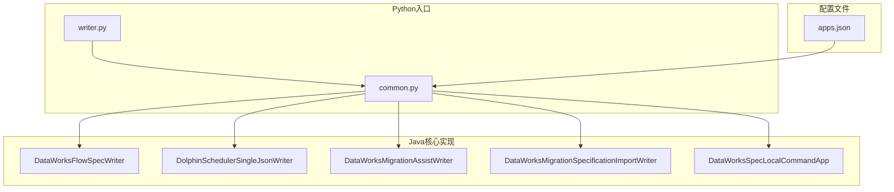
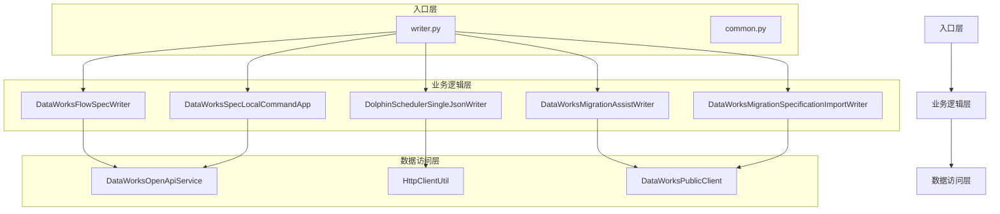
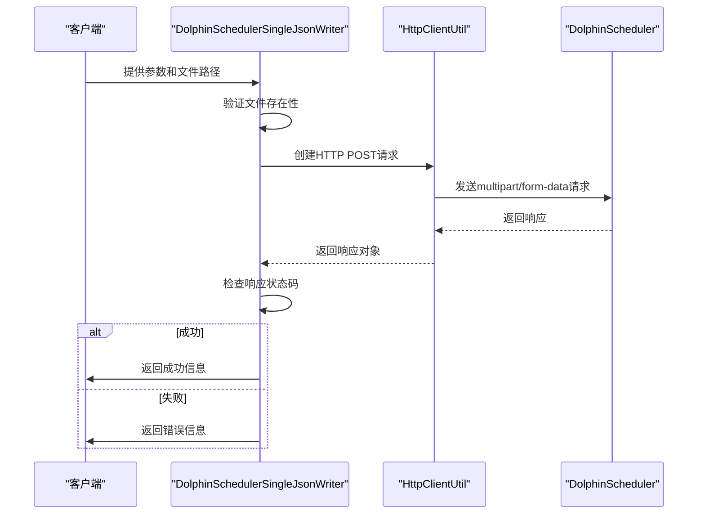
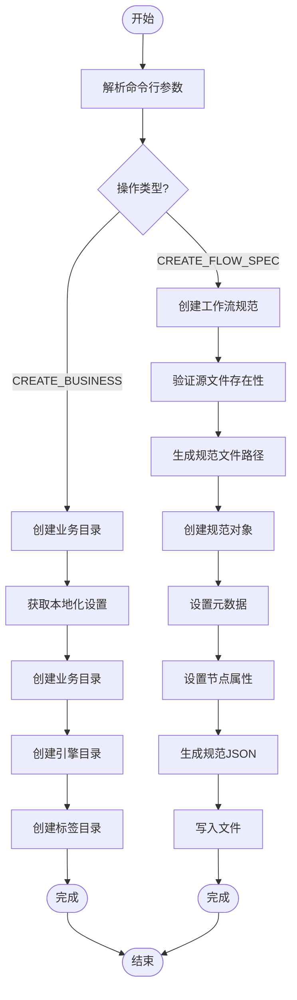
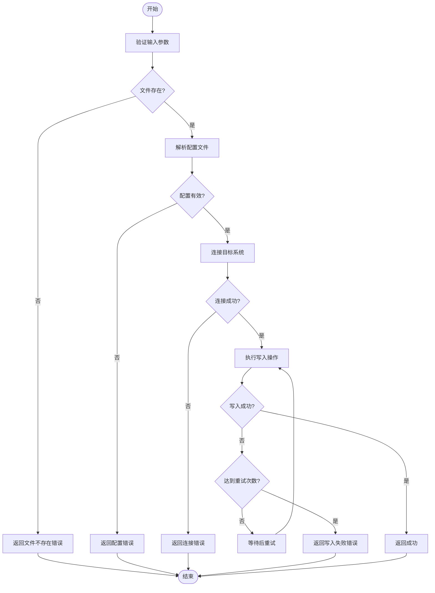
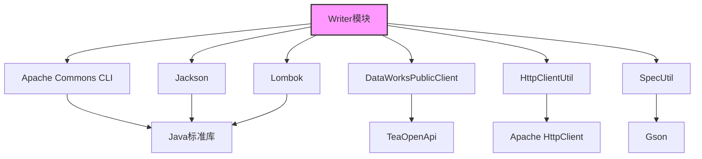

# Writer模块

<cite>
**本文档中引用的文件**  
- [writer.py](file://client/migrationx/src/main/bin/writer.py)
- [DataWorksFlowSpecWriter.java](file://client/migrationx/migrationx-writer/src/main/java/com/aliyun/dataworks/migrationx/writer/dataworks/DataWorksFlowSpecWriter.java)
- [DolphinSchedulerSingleJsonWriter.java](file://client/migrationx/migrationx-writer/src/main/java/com/aliyun/dataworks/migrationx/writer/dolphinscheduler/DolphinSchedulerSingleJsonWriter.java)
- [DataWorksMigrationAssistWriter.java](file://client/migrationx/migrationx-writer/src/main/java/com/aliyun/dataworks/migrationx/writer/DataWorksMigrationAssistWriter.java)
- [DataWorksMigrationSpecificationImportWriter.java](file://client/migrationx/migrationx-writer/src/main/java/com/aliyun/dataworks/migrationx/writer/DataWorksMigrationSpecificationImportWriter.java)
- [DataWorksSpecLocalCommandApp.java](file://client/migrationx/migrationx-writer/src/main/java/com/aliyun/dataworks/migrationx/local/DataWorksSpecLocalCommandApp.java)
- [common.py](file://client/client-common/src/main/bin/common.py)
- [apps.json](file://client/migrationx/src/main/conf/apps.json)
</cite>

## 目录
1. [简介](#简介)
2. [项目结构](#项目结构)
3. [核心组件](#核心组件)
4. [架构概述](#架构概述)
5. [详细组件分析](#详细组件分析)
6. [依赖分析](#依赖分析)
7. [性能考虑](#性能考虑)
8. [故障排除指南](#故障排除指南)
9. [结论](#结论)

## 简介
Writer模块是DataWorks迁移工具的核心组件之一，负责将转换后的工作流规范写入目标系统。该模块支持多种输出目标，包括DataWorks平台、DolphinScheduler系统以及本地文件系统。通过不同的Writer实现类，用户可以灵活地将工作流配置数据写入到指定的目标环境中。本模块不仅提供了丰富的配置选项和适用场景，还实现了完善的数据验证、错误处理和事务管理机制，确保写入过程的可靠性和稳定性。

## 项目结构
Writer模块的实现分布在多个Java和Python文件中，形成了一个清晰的分层架构。主要组件包括命令行入口、核心写入器实现类以及辅助工具类。这些组件协同工作，实现了从配置解析到数据写入的完整流程。



**图源**
- [writer.py](file://client/migrationx/src/main/bin/writer.py)
- [common.py](file://client/client-common/src/main/bin/common.py)
- [apps.json](file://client/migrationx/src/main/conf/apps.json)

**本节来源**
- [writer.py](file://client/migrationx/src/main/bin/writer.py)
- [common.py](file://client/client-common/src/main/bin/common.py)
- [apps.json](file://client/migrationx/src/main/conf/apps.json)

## 核心组件
Writer模块的核心组件包括多个专门的写入器实现类，每个类针对特定的目标系统进行了优化。这些组件通过统一的接口和配置机制进行管理，确保了代码的可维护性和扩展性。主要核心组件包括DataWorksFlowSpecWriter、DolphinSchedulerSingleJsonWriter、DataWorksMigrationAssistWriter、DataWorksMigrationSpecificationImportWriter和DataWorksSpecLocalCommandApp。

**本节来源**
- [DataWorksFlowSpecWriter.java](file://client/migrationx/migrationx-writer/src/main/java/com/aliyun/dataworks/migrationx/writer/dataworks/DataWorksFlowSpecWriter.java)
- [DolphinSchedulerSingleJsonWriter.java](file://client/migrationx/migrationx-writer/src/main/java/com/aliyun/dataworks/migrationx/writer/dolphinscheduler/DolphinSchedulerSingleJsonWriter.java)
- [DataWorksMigrationAssistWriter.java](file://client/migrationx/migrationx-writer/src/main/java/com/aliyun/dataworks/migrationx/writer/DataWorksMigrationAssistWriter.java)
- [DataWorksMigrationSpecificationImportWriter.java](file://client/migrationx/migrationx-writer/src/main/java/com/aliyun/dataworks/migrationx/writer/DataWorksMigrationSpecificationImportWriter.java)
- [DataWorksSpecLocalCommandApp.java](file://client/migrationx/migrationx-writer/src/main/java/com/aliyun/dataworks/migrationx/local/DataWorksSpecLocalCommandApp.java)

## 架构概述
Writer模块的架构设计遵循了分层和模块化的原则，确保了各组件之间的低耦合和高内聚。整个架构可以分为三层：入口层、业务逻辑层和数据访问层。入口层负责接收用户输入和参数解析；业务逻辑层实现了具体的写入逻辑和流程控制；数据访问层则封装了与外部系统的交互细节。



**图源**
- [DataWorksFlowSpecWriter.java](file://client/migrationx/migrationx-writer/src/main/java/com/aliyun/dataworks/migrationx/writer/dataworks/DataWorksFlowSpecWriter.java)
- [DolphinSchedulerSingleJsonWriter.java](file://client/migrationx/migrationx-writer/src/main/java/com/aliyun/dataworks/migrationx/writer/dolphinscheduler/DolphinSchedulerSingleJsonWriter.java)
- [DataWorksMigrationAssistWriter.java](file://client/migrationx/migrationx-writer/src/main/java/com/aliyun/dataworks/migrationx/writer/DataWorksMigrationAssistWriter.java)
- [DataWorksMigrationSpecificationImportWriter.java](file://client/migrationx/migrationx-writer/src/main/java/com/aliyun/dataworks/migrationx/writer/DataWorksMigrationSpecificationImportWriter.java)
- [DataWorksSpecLocalCommandApp.java](file://client/migrationx/migrationx-writer/src/main/java/com/aliyun/dataworks/migrationx/local/DataWorksSpecLocalCommandApp.java)

## 详细组件分析

### DataWorksFlowSpecWriter分析
DataWorksFlowSpecWriter是专门用于将工作流规范写入DataWorks系统的实现类。它通过DataWorks OpenAPI服务与目标系统进行交互，支持批量写入工作流和节点。该类实现了异步作业状态检查机制，确保写入操作的完整性和可靠性。

```mermaid
sequenceDiagram
participant Client as "客户端"
participant Writer as "DataWorksFlowSpecWriter"
participant Service as "DataWorksOpenApiService"
participant DataWorks as "DataWorks系统"
Client->>Writer : 提交JSON文件
Writer->>Service : 初始化API服务
Service->>DataWorks : 批量提交工作流
DataWorks-->>Service : 返回异步作业ID
Service->>Writer : 返回作业ID集合
loop 检查作业状态
Writer->>Service : 查询作业状态
Service->>DataWorks : 获取作业状态
DataWorks-->>Service : 返回状态信息
Service-->>Writer : 返回状态
alt 作业完成
Writer->>Writer : 记录成功/失败状态
break 循环
else 作业仍在运行
Writer->>Writer : 等待5秒
end
end
Writer->>Client : 返回最终结果
```

**图源**
- [DataWorksFlowSpecWriter.java](file://client/migrationx/migrationx-writer/src/main/java/com/aliyun/dataworks/migrationx/writer/dataworks/DataWorksFlowSpecWriter.java)

**本节来源**
- [DataWorksFlowSpecWriter.java](file://client/migrationx/migrationx-writer/src/main/java/com/aliyun/dataworks/migrationx/writer/dataworks/DataWorksFlowSpecWriter.java)

### DolphinSchedulerSingleJsonWriter分析
DolphinSchedulerSingleJsonWriter负责将工作流规范生成为DolphinScheduler兼容的JSON文件。该实现类通过HTTP POST请求将JSON文件上传到DolphinScheduler的导入API端点，实现了与DolphinScheduler系统的无缝集成。



**图源**
- [DolphinSchedulerSingleJsonWriter.java](file://client/migrationx/migrationx-writer/src/main/java/com/aliyun/dataworks/migrationx/writer/dolphinscheduler/DolphinSchedulerSingleJsonWriter.java)

**本节来源**
- [DolphinSchedulerSingleJsonWriter.java](file://client/migrationx/migrationx-writer/src/main/java/com/aliyun/dataworks/migrationx/writer/dolphinscheduler/DolphinSchedulerSingleJsonWriter.java)

### DataWorksSpecLocalCommandApp分析
DataWorksSpecLocalCommandApp支持本地文件输出功能，允许用户在本地创建工作流规范文件和业务目录结构。该类提供了创建业务目录和生成工作流规范文件的功能，为本地开发和测试提供了便利。



**图源**
- [DataWorksSpecLocalCommandApp.java](file://client/migrationx/migrationx-writer/src/main/java/com/aliyun/dataworks/migrationx/local/DataWorksSpecLocalCommandApp.java)

**本节来源**
- [DataWorksSpecLocalCommandApp.java](file://client/migrationx/migrationx-writer/src/main/java/com/aliyun/dataworks/migrationx/local/DataWorksSpecLocalCommandApp.java)

### 写入过程中的数据验证、错误处理和事务管理机制
Writer模块实现了多层次的数据验证、错误处理和事务管理机制，确保了写入过程的可靠性和稳定性。在数据验证方面，模块通过JSON Schema验证和业务规则检查确保输入数据的正确性。在错误处理方面，采用了异常捕获、日志记录和用户友好的错误信息提示。在事务管理方面，通过异步作业状态检查和重试机制确保了操作的原子性和一致性。



**图源**
- [DataWorksFlowSpecWriter.java](file://client/migrationx/migrationx-writer/src/main/java/com/aliyun/dataworks/migrationx/writer/dataworks/DataWorksFlowSpecWriter.java)
- [DolphinSchedulerSingleJsonWriter.java](file://client/migrationx/migrationx-writer/src/main/java/com/aliyun/dataworks/migrationx/writer/dolphinscheduler/DolphinSchedulerSingleJsonWriter.java)
- [DataWorksMigrationAssistWriter.java](file://client/migrationx/migrationx-writer/src/main/java/com/aliyun/dataworks/migrationx/writer/DataWorksMigrationAssistWriter.java)

**本节来源**
- [DataWorksFlowSpecWriter.java](file://client/migrationx/migrationx-writer/src/main/java/com/aliyun/dataworks/migrationx/writer/dataworks/DataWorksFlowSpecWriter.java)
- [DolphinSchedulerSingleJsonWriter.java](file://client/migrationx/migrationx-writer/src/main/java/com/aliyun/dataworks/migrationx/writer/dolphinscheduler/DolphinSchedulerSingleJsonWriter.java)
- [DataWorksMigrationAssistWriter.java](file://client/migrationx/migrationx-writer/src/main/java/com/aliyun/dataworks/migrationx/writer/DataWorksMigrationAssistWriter.java)

## 依赖分析
Writer模块依赖于多个外部库和内部组件，形成了一个复杂的依赖网络。主要依赖包括Apache Commons CLI用于命令行参数解析，Jackson用于JSON处理，Lombok用于简化Java代码，以及DataWorks公共API客户端用于与DataWorks系统交互。



**图源**
- [pom.xml](file://client/migrationx/migrationx-writer/pom.xml)
- [DataWorksFlowSpecWriter.java](file://client/migrationx/migrationx-writer/src/main/java/com/aliyun/dataworks/migrationx/writer/dataworks/DataWorksFlowSpecWriter.java)
- [DolphinSchedulerSingleJsonWriter.java](file://client/migrationx/migrationx-writer/src/main/java/com/aliyun/dataworks/migrationx/writer/dolphinscheduler/DolphinSchedulerSingleJsonWriter.java)

**本节来源**
- [pom.xml](file://client/migrationx/migrationx-writer/pom.xml)
- [DataWorksFlowSpecWriter.java](file://client/migrationx/migrationx-writer/src/main/java/com/aliyun/dataworks/migrationx/writer/dataworks/DataWorksFlowSpecWriter.java)
- [DolphinSchedulerSingleJsonWriter.java](file://client/migrationx/migrationx-writer/src/main/java/com/aliyun/dataworks/migrationx/writer/dolphinscheduler/DolphinSchedulerSingleJsonWriter.java)

## 性能考虑
Writer模块在设计时充分考虑了性能优化，特别是在处理大规模工作流写入时。通过批量处理、异步操作和连接复用等技术，显著提升了写入效率。对于DataWorksFlowSpecWriter，采用了批量提交和异步状态检查机制，避免了逐个提交带来的性能瓶颈。对于DolphinSchedulerSingleJsonWriter，通过HTTP连接池和复用减少了网络开销。此外，所有写入器都实现了合理的错误重试策略，在保证可靠性的同时避免了过度重试导致的性能下降。

**本节来源**
- [DataWorksFlowSpecWriter.java](file://client/migrationx/migrationx-writer/src/main/java/com/aliyun/dataworks/migrationx/writer/dataworks/DataWorksFlowSpecWriter.java)
- [DolphinSchedulerSingleJsonWriter.java](file://client/migrationx/migrationx-writer/src/main/java/com/aliyun/dataworks/migrationx/writer/dolphinscheduler/DolphinSchedulerSingleJsonWriter.java)

## 故障排除指南
针对常见的写入失败场景，提供以下故障排除指南：

### 权限不足
当出现权限不足错误时，请检查以下几点：
1. 确认提供的AccessKey ID和AccessKey Secret是否正确
2. 检查目标系统中的用户权限是否足够
3. 验证区域ID(regionId)是否与目标系统匹配
4. 确认项目ID(projectId)是否有效且有访问权限

### 存储空间不足
当出现存储空间不足错误时，请采取以下措施：
1. 检查目标系统的存储配额
2. 清理不必要的旧工作流或节点
3. 联系系统管理员增加存储配额
4. 分批写入大规模工作流以减少单次写入量

### 数据校验失败
当出现数据校验失败错误时，请按以下步骤排查：
1. 验证JSON文件格式是否正确
2. 检查必填字段是否缺失
3. 确认字段值是否符合预期格式
4. 使用JSON Schema验证工具检查文件结构
5. 参考示例文件修正数据格式

### 批量写入性能优化建议
1. 合理设置批量大小，避免单次写入过多数据
2. 使用异步操作提高并发处理能力
3. 复用网络连接减少建立连接的开销
4. 实现智能重试策略，避免过度重试
5. 监控系统资源使用情况，及时调整写入速率

**本节来源**
- [DataWorksFlowSpecWriter.java](file://client/migrationx/migrationx-writer/src/main/java/com/aliyun/dataworks/migrationx/writer/dataworks/DataWorksFlowSpecWriter.java)
- [DolphinSchedulerSingleJsonWriter.java](file://client/migrationx/migrationx-writer/src/main/java/com/aliyun/dataworks/migrationx/writer/dolphinscheduler/DolphinSchedulerSingleJsonWriter.java)
- [DataWorksMigrationAssistWriter.java](file://client/migrationx/migrationx-writer/src/main/java/com/aliyun/dataworks/migrationx/writer/DataWorksMigrationAssistWriter.java)

## 结论
Writer模块通过精心设计的架构和实现，提供了强大而灵活的工作流写入功能。它不仅支持多种目标系统，还实现了完善的数据验证、错误处理和事务管理机制。通过详细的配置选项和使用示例，用户可以轻松地将转换后的工作流规范写入到目标环境中。未来可以进一步优化批量处理性能，增加更多的目标系统支持，并提供更丰富的监控和诊断功能。