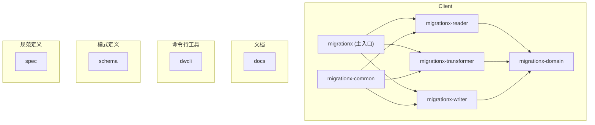
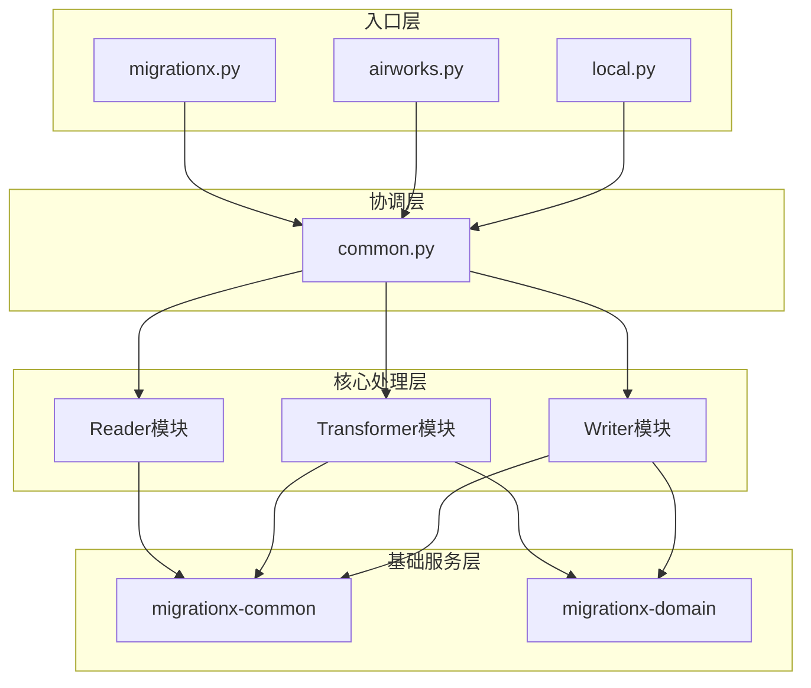
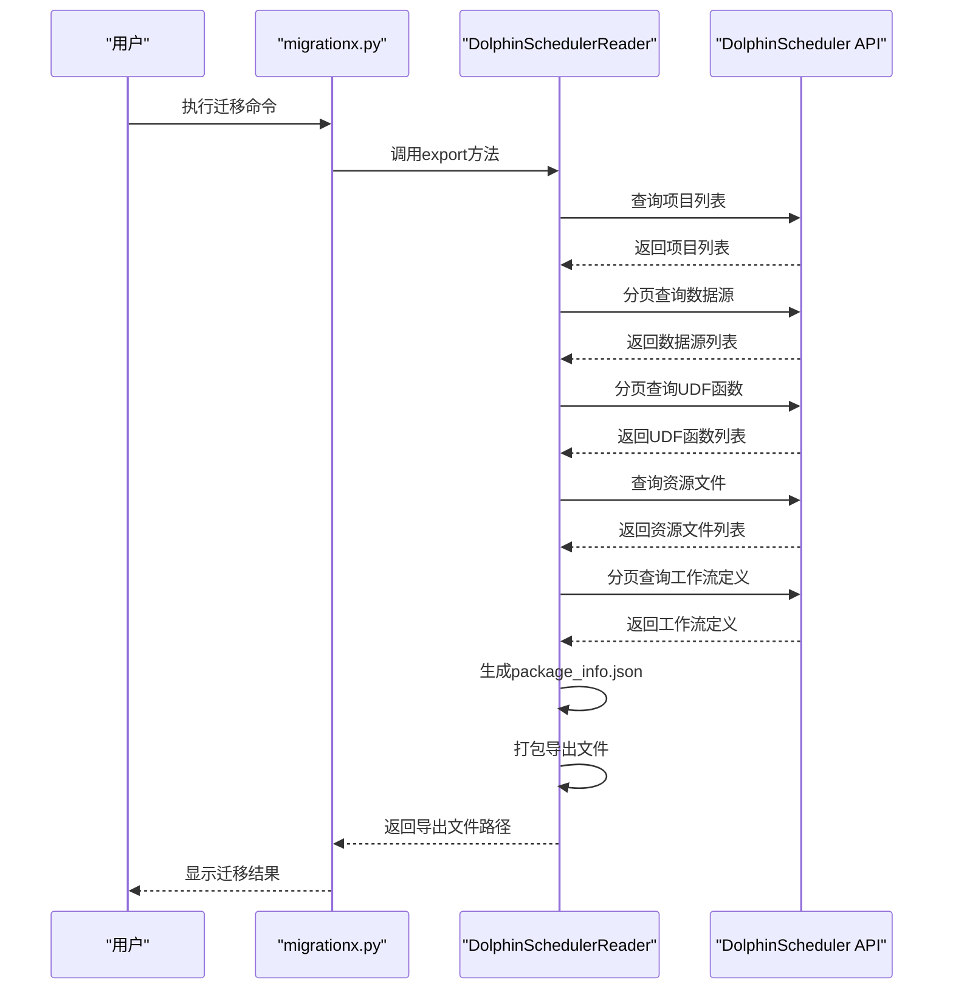
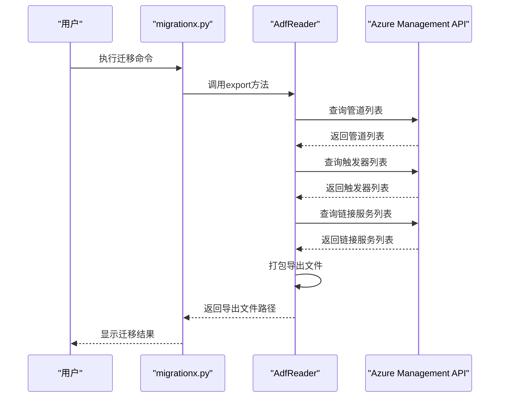
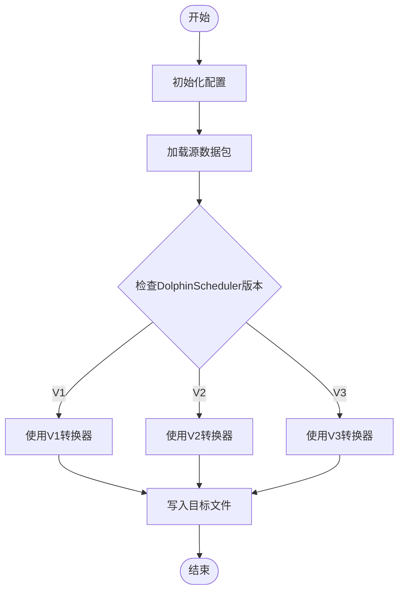
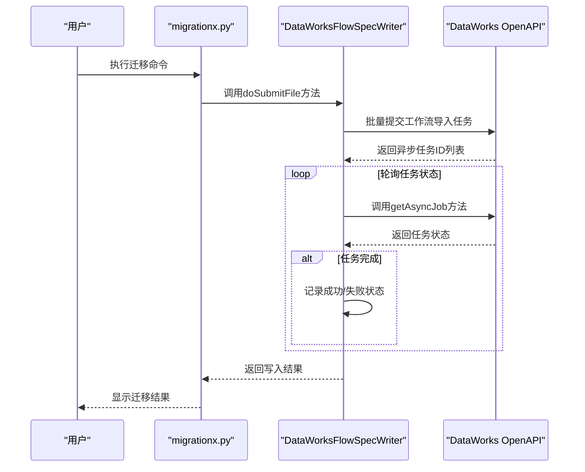
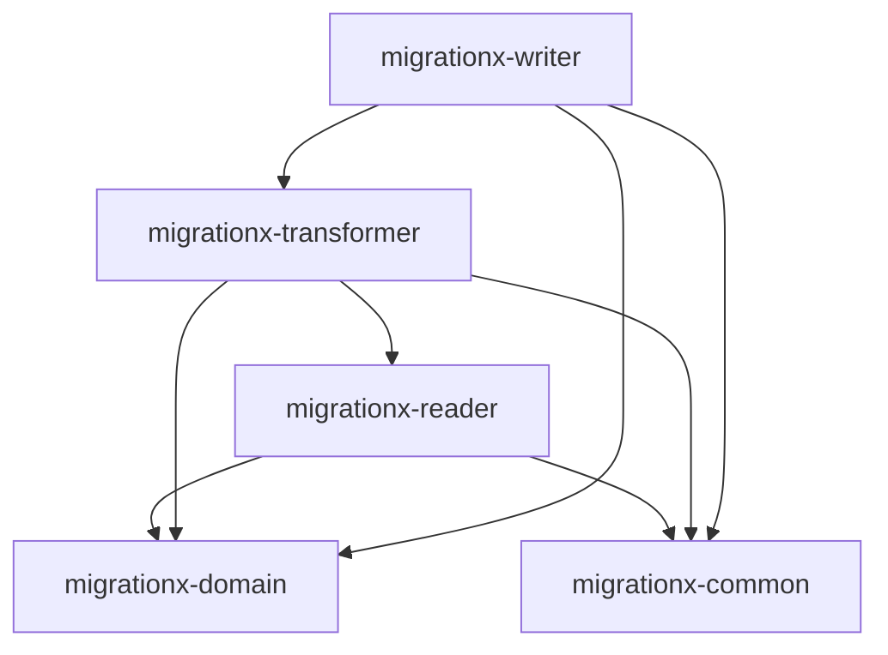

# 迁移工具

<cite>
**本文档中引用的文件**  
- [migrationx.py](file://client/migrationx/src/main/bin/migrationx.py)
- [reader.py](file://client/migrationx/src/main/bin/reader.py)
- [transformer.py](file://client/migrationx/src/main/bin/transformer.py)
- [writer.py](file://client/migrationx/src/main/bin/writer.py)
- [common.py](file://client/client-common/src/main/bin/common.py)
- [migrationx.json](file://client/migrationx/src/main/conf/migrationx.json)
- [DolphinSchedulerReader.java](file://client/migrationx/migrationx-reader/src/main/java/com/aliyun/dataworks/migrationx/reader/dolphinscheduler/DolphinSchedulerReader.java)
- [AdfReader.java](file://client/migrationx/migrationx-reader/src/main/java/com/aliyun/dataworks/migrationx/reader/adf/AdfReader.java)
- [DataWorksDolphinSchedulerTransformer.java](file://client/migrationx/migrationx-transformer/src/main/java/com/aliyun/dataworks/migrationx/transformer/dataworks/transformer/DataWorksDolphinSchedulerTransformer.java)
- [DataWorksFlowSpecWriter.java](file://client/migrationx/migrationx-writer/src/main/java/com/aliyun/dataworks/migrationx/writer/dataworks/DataWorksFlowSpecWriter.java)
</cite>

## 目录
1. [简介](#简介)
2. [项目结构](#项目结构)
3. [核心组件](#核心组件)
4. [架构概述](#架构概述)
5. [详细组件分析](#详细组件分析)
6. [依赖分析](#依赖分析)
7. [性能考虑](#性能考虑)
8. [故障排除指南](#故障排除指南)
9. [结论](#结论)

## 简介
迁移工具（MigrationX）是一个用于将工作流从不同调度系统（如DolphinScheduler、Airflow、Azure Data Factory等）迁移到DataWorks平台的工具。该工具采用模块化设计，包含Reader、Transformer和Writer三大核心模块，分别负责从源系统读取数据、转换数据格式以及将转换后的数据写入目标系统。本文档将深入分析这三个模块的实现细节和协作机制，重点介绍DolphinSchedulerReader、AdfReader、DataWorksDolphinSchedulerTransformer和DataWorksFlowSpecWriter等关键组件。

## 项目结构
迁移工具的项目结构清晰，主要分为client、docs、dwcli、schema和spec五个部分。其中client目录包含了迁移工具的核心实现，包括migrationx-common、migrationx-domain、migrationx-reader、migrationx-transformer和migrationx-writer等子模块。每个子模块都有明确的职责，如migrationx-reader负责从源系统读取数据，migrationx-transformer负责数据转换，migrationx-writer负责将数据写入目标系统。

**Diagram sources**
- [project_structure](file://project_structure)

**Section sources**
- [project_structure](file://project_structure)

## 核心组件
迁移工具的核心组件包括Reader、Transformer和Writer三大模块。Reader模块负责从源系统（如DolphinScheduler、Airflow等）读取工作流数据；Transformer模块负责将读取的数据转换为DataWorks兼容的格式；Writer模块负责将转换后的数据写入DataWorks系统。这三个模块通过配置文件和命令行参数进行协调，形成一个完整的迁移流程。

**Section sources**
- [migrationx.py](file://client/migrationx/src/main/bin/migrationx.py)
- [reader.py](file://client/migrationx/src/main/bin/reader.py)
- [transformer.py](file://client/migrationx/src/main/bin/transformer.py)
- [writer.py](file://client/migrationx/src/main/bin/writer.py)

## 架构概述
迁移工具的架构采用分层设计，从上到下分为入口层、协调层、核心处理层和基础服务层。入口层由migrationx.py等脚本组成，负责解析配置文件并调用相应的处理模块；协调层由common.py等工具类组成，负责处理命令行参数、环境变量替换等通用任务；核心处理层由Reader、Transformer和Writer三大模块组成，负责具体的业务逻辑；基础服务层由migrationx-common等模块组成，提供日志、HTTP客户端、JSON处理等基础功能。

**Diagram sources**
- [migrationx.py](file://client/migrationx/src/main/bin/migrationx.py)
- [common.py](file://client/client-common/src/main/bin/common.py)

**Section sources**
- [migrationx.py](file://client/migrationx/src/main/bin/migrationx.py)
- [common.py](file://client/client-common/src/main/bin/common.py)

## 详细组件分析

### Reader模块分析
Reader模块负责从源系统读取工作流数据。该模块支持多种源系统，包括DolphinScheduler、Airflow、Azure Data Factory等。每种源系统都有对应的Reader实现，如DolphinSchedulerReader和AdfReader。这些Reader实现都遵循相同的接口规范，通过配置文件中的参数来指定具体的源系统和读取参数。

#### DolphinSchedulerReader实现
DolphinSchedulerReader是Reader模块中用于从DolphinScheduler系统读取数据的实现。该类通过DolphinScheduler的API接口，分页查询项目、工作流、资源文件、UDF函数和数据源等信息，并将这些信息导出为JSON格式的文件。导出过程包括以下几个步骤：首先查询所有项目信息，然后根据项目名称或代码过滤需要导出的项目；接着导出数据源、UDF函数和资源文件；最后导出工作流定义。导出的文件会被打包成ZIP格式，便于后续处理。

**Diagram sources**
- [DolphinSchedulerReader.java](file://client/migrationx/migrationx-reader/src/main/java/com/aliyun/dataworks/migrationx/reader/dolphinscheduler/DolphinSchedulerReader.java)

**Section sources**
- [DolphinSchedulerReader.java](file://client/migrationx/migrationx-reader/src/main/java/com/aliyun/dataworks/migrationx/reader/dolphinscheduler/DolphinSchedulerReader.java)

#### AdfReader实现
AdfReader是Reader模块中用于从Azure Data Factory系统读取数据的实现。该类通过Azure Management API，查询管道（pipeline）、触发器（trigger）和链接服务（linked service）等信息，并将这些信息导出为JSON格式的文件。与DolphinSchedulerReader类似，AdfReader也遵循相同的导出流程，但使用的是Azure的REST API接口。

**Diagram sources**
- [AdfReader.java](file://client/migrationx/migrationx-reader/src/main/java/com/aliyun/dataworks/migrationx/reader/adf/AdfReader.java)

**Section sources**
- [AdfReader.java](file://client/migrationx/migrationx-reader/src/main/java/com/aliyun/dataworks/migrationx/reader/adf/AdfReader.java)

### Transformer模块分析
Transformer模块负责将Reader模块导出的数据转换为DataWorks兼容的格式。该模块的核心是DataWorksDolphinSchedulerTransformer类，它实现了从DolphinScheduler数据到DataWorks数据的转换逻辑。转换过程包括项目资产加载、工作流转换和风险报告生成等步骤。

#### DataWorksDolphinSchedulerTransformer实现
DataWorksDolphinSchedulerTransformer是Transformer模块的核心实现，负责将DolphinScheduler的数据包转换为DataWorks的数据包。该类的转换过程分为四个阶段：初始化、加载、转换和写入。在初始化阶段，根据配置文件设置目标包的格式（DWMA或SPEC）；在加载阶段，使用DolphinSchedulerPackageFileService加载源数据包；在转换阶段，根据DolphinScheduler的版本选择相应的转换器（V1、V2或V3）进行转换；在写入阶段，使用DataWorksSpecPackageFileService将转换后的数据写入目标文件。

**Diagram sources**
- [DataWorksDolphinSchedulerTransformer.java](file://client/migrationx/migrationx-transformer/src/main/java/com/aliyun/dataworks/migrationx/transformer/dataworks/transformer/DataWorksDolphinSchedulerTransformer.java)

**Section sources**
- [DataWorksDolphinSchedulerTransformer.java](file://client/migrationx/migrationx-transformer/src/main/java/com/aliyun/dataworks/migrationx/transformer/dataworks/transformer/DataWorksDolphinSchedulerTransformer.java)

### Writer模块分析
Writer模块负责将Transformer模块转换后的数据写入DataWorks系统。该模块的核心是DataWorksFlowSpecWriter类，它通过DataWorks的OpenAPI接口，将工作流规范（Flow Spec）导入到DataWorks项目中。

#### DataWorksFlowSpecWriter实现
DataWorksFlowSpecWriter是Writer模块的核心实现，负责将转换后的工作流数据写入DataWorks系统。该类通过DataWorksOpenApiService提供的接口，批量提交工作流导入任务，并轮询异步任务的状态，直到所有任务完成。写入过程包括以下几个步骤：首先解析输入的JSON文件，然后根据规范类型（节点或工作流）分别调用saveNode或importWorkflow方法；对于工作流导入任务，会返回异步任务ID，需要通过getAsyncJob方法轮询任务状态。

**Diagram sources**
- [DataWorksFlowSpecWriter.java](file://client/migrationx/migrationx-writer/src/main/java/com/aliyun/dataworks/migrationx/writer/dataworks/DataWorksFlowSpecWriter.java)

**Section sources**
- [DataWorksFlowSpecWriter.java](file://client/migrationx/migrationx-writer/src/main/java/com/aliyun/dataworks/migrationx/writer/dataworks/DataWorksFlowSpecWriter.java)

## 依赖分析
迁移工具的各个模块之间存在明确的依赖关系。Reader模块依赖于migrationx-domain模块来定义数据结构，依赖于migrationx-common模块提供基础服务；Transformer模块依赖于Reader模块的输出，同时依赖于migrationx-domain和migrationx-common模块；Writer模块依赖于Transformer模块的输出，同样依赖于migrationx-domain和migrationx-common模块。这种依赖关系确保了模块之间的松耦合，便于维护和扩展。

**Diagram sources**
- [pom.xml](file://client/migrationx/pom.xml)

**Section sources**
- [pom.xml](file://client/migrationx/pom.xml)

## 性能考虑
对于大规模迁移场景，性能优化至关重要。以下是一些性能优化建议：
1. **批量处理**：尽量使用批量API接口，减少网络请求次数。
2. **并行处理**：对于独立的任务，可以采用并行处理方式，提高处理效率。
3. **分页查询**：对于大数据量的查询，使用分页查询避免内存溢出。
4. **异步处理**：对于耗时较长的操作，采用异步处理方式，避免阻塞主线程。
5. **缓存机制**：对于频繁访问的数据，可以引入缓存机制，减少重复查询。

## 故障排除指南
在迁移过程中可能会遇到各种问题，以下是一些常见问题的解决方案：
1. **认证失败**：检查访问密钥和令牌是否正确，确保有足够的权限访问源系统和目标系统。
2. **网络超时**：检查网络连接是否稳定，适当增加超时时间。
3. **数据格式错误**：检查导出的数据格式是否符合预期，确保转换器能够正确解析。
4. **资源不足**：对于大数据量的迁移，确保有足够的内存和磁盘空间。
5. **API限制**：注意源系统和目标系统的API调用限制，避免触发限流机制。

**Section sources**
- [DolphinSchedulerReader.java](file://client/migrationx/migrationx-reader/src/main/java/com/aliyun/dataworks/migrationx/reader/dolphinscheduler/DolphinSchedulerReader.java)
- [DataWorksFlowSpecWriter.java](file://client/migrationx/migrationx-writer/src/main/java/com/aliyun/dataworks/migrationx/writer/dataworks/DataWorksFlowSpecWriter.java)

## 结论
迁移工具（MigrationX）通过Reader、Transformer和Writer三大模块的协同工作，实现了从多种调度系统到DataWorks平台的平滑迁移。该工具采用模块化设计，具有良好的扩展性和可维护性。通过深入分析各个模块的实现细节，我们可以更好地理解其工作原理，并针对具体需求进行定制和优化。未来可以考虑增加更多源系统的支持，以及提供更丰富的转换规则和验证机制，进一步提升迁移工具的实用性和可靠性。