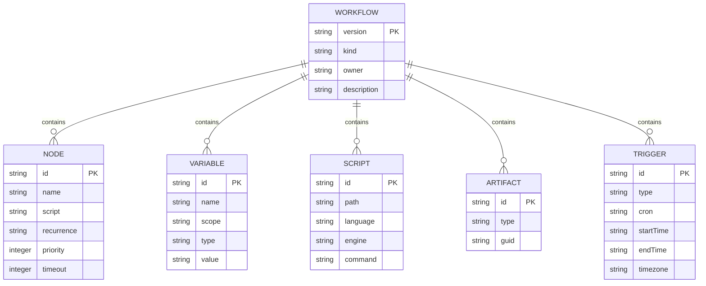
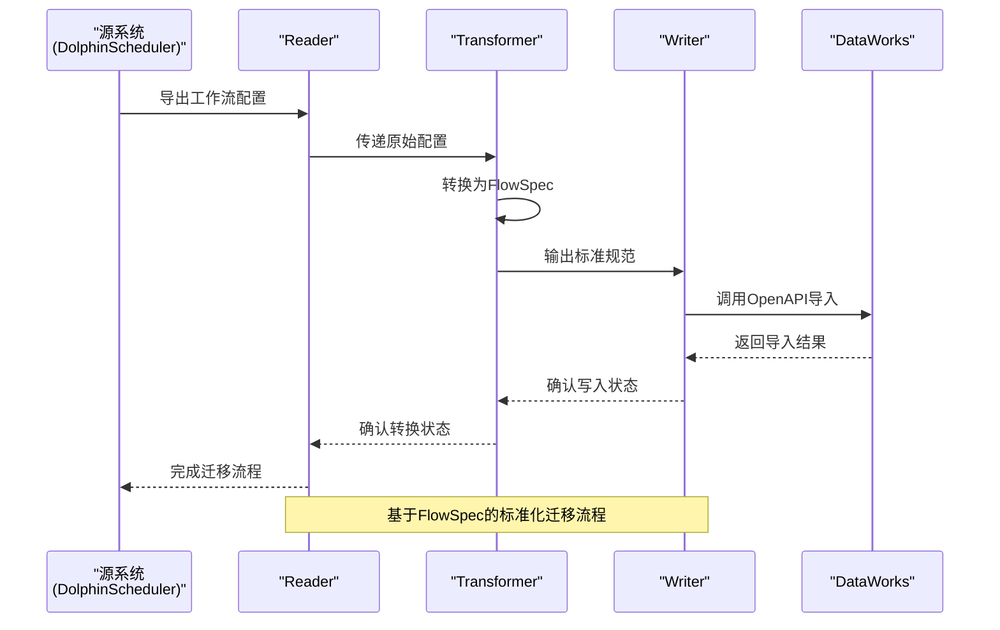
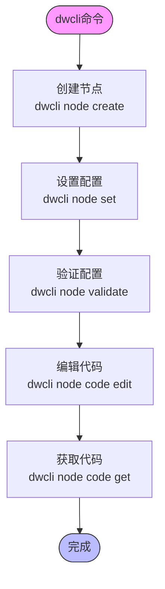

# 项目概述

<cite>
**本文档引用文件**   
- [README.md](file://README.md)
- [README_zh_CN.md](file://README_zh_CN.md)
- [pom.xml](file://pom.xml)
- [spec/pom.xml](file://spec/pom.xml)
- [docs/migrationx/index.md](file://docs/migrationx/index.md)
- [docs/spec/spec-fields.md](file://docs/spec/spec-fields.md)
- [client/migrationx/src/main/bin/migrationx.py](file://client/migrationx/src/main/bin/migrationx.py)
- [client/migrationx/src/main/conf/apps.json](file://client/migrationx/src/main/conf/apps.json)
- [client/migrationx/src/main/bin/reader.py](file://client/migrationx/src/main/bin/reader.py)
- [client/migrationx/src/main/bin/transformer.py](file://client/migrationx/src/main/bin/transformer.py)
- [client/migrationx/src/main/bin/writer.py](file://client/migrationx/src/main/bin/writer.py)
- [docs/migrationx/usage.md](file://docs/migrationx/usage.md)
- [dwcli/setup.py](file://dwcli/setup.py)
- [dwcli/dwcli/cli.py](file://dwcli/dwcli/cli.py)
</cite>

## 目录
1. [简介](#简介)
2. [核心组件](#核心组件)
3. [架构设计](#架构设计)
4. [工作流描述规范(FlowSpec)](#工作流描述规范flowspec)
5. [迁移工具(MigrationX)](#迁移工具migrationx)
6. [命令行工具(dwcli)](#命令行工具dwcli)
7. [支持的调度系统](#支持的调度系统)
8. [实际应用案例](#实际应用案例)
9. [开发与扩展](#开发与扩展)

## 简介

dataworks-spec项目是一个专注于工作流模型转换与标准化的开源项目。该项目的核心目标是解决不同工作流调度系统之间的互操作性问题，特别是与阿里云DataWorks平台的集成。项目通过定义一个通用的工作流描述规范（FlowSpec），并提供基于该规范的迁移工具（MigrationX），实现了从多种开源调度系统到DataWorks的无缝迁移。

项目主要包含三个核心组件：spec、migrationx和dwcli。spec模块定义了工作流描述规范，为不同调度系统提供了一个统一的抽象模型；migrationx模块是基于FlowSpec的迁移工具，实现了从源调度系统到DataWorks的完整迁移流程；dwcli模块是一个命令行工具，支持配置即代码（Configuration-as-Code）的管理模式，用于创建和管理FlowSpec配置。

该项目采用领域驱动设计（DDD）和管道-过滤器架构模式，确保了系统的可扩展性和可维护性。通过将复杂的迁移过程分解为读取（Reader）、转换（Transformer）和写入（Writer）三个独立的阶段，项目实现了高度的模块化和灵活性，使得开发者可以轻松地为新的调度系统添加支持。

**Section sources**
- [README.md](file://README.md#L6-L10)
- [README_zh_CN.md](file://README_zh_CN.md#L6-L10)

## 核心组件

dataworks-spec项目由三个主要组件构成：spec、migrationx和dwcli。这些组件协同工作，共同实现了工作流模型的标准化和迁移。

spec组件是项目的基础，它定义了通用的工作流描述规范（FlowSpec）。该规范采用JSON格式，描述了工作流的各个要素，包括节点、依赖关系、变量、脚本等。spec模块不仅定义了规范的结构，还提供了相应的Java类库，用于解析和生成FlowSpec文件。

migrationx组件是项目的迁移引擎，它基于FlowSpec规范实现了从源调度系统到DataWorks的完整迁移流程。该组件采用管道-过滤器架构，将迁移过程分解为三个独立的阶段：读取（Reader）、转换（Transformer）和写入（Writer）。每个阶段都有明确的职责，确保了迁移过程的可维护性和可扩展性。

dwcli组件是一个Python编写的命令行工具，它支持配置即代码（Configuration-as-Code）的管理模式。通过dwcli，用户可以使用命令行快速创建、修改和验证FlowSpec配置，极大地提高了开发效率和配置管理的自动化程度。

**Section sources**
- [README.md](file://README.md#L8-L11)
- [README_zh_CN.md](file://README_zh_CN.md#L8-L10)

## 架构设计

dataworks-spec项目采用了领域驱动设计（DDD）和管道-过滤器架构模式，这种设计确保了系统的高内聚、低耦合和良好的可扩展性。

### 领域驱动设计（DDD）

项目采用领域驱动设计方法，将复杂的业务逻辑分解为多个领域模型。每个调度系统（如DolphinScheduler、Airflow、Oozie等）都有其独立的领域模型，这些模型定义了该调度系统特有的工作流结构和行为。通过这种方式，项目能够准确地捕捉和表示不同调度系统的特性，同时保持核心规范的统一性。

### 管道-过滤器架构

迁移过程采用管道-过滤器架构模式，将整个迁移流程分解为三个独立的阶段：读取（Reader）、转换（Transformer）和写入（Writer）。这种架构模式具有以下优势：

1. **模块化**：每个阶段都是独立的模块，可以单独开发、测试和维护。
2. **可扩展性**：可以轻松地为新的调度系统添加支持，只需实现相应的Reader、Transformer和Writer。
3. **可重用性**：各个阶段的组件可以在不同的迁移场景中重复使用。
4. **易于调试**：由于每个阶段都是独立的，因此可以更容易地定位和解决问题。

```mermaid
graph TB
subgraph "MigrationX Pipeline"
Reader[Reader<br/>读取源系统]
Transformer[Transformer<br/>转换为FlowSpec]
Writer[Writer<br/>写入目标系统]
end
SourceSystem[源调度系统<br/>(DolphinScheduler, Airflow等)] --> Reader
Reader --> Transformer
Transformer --> Writer
Writer --> TargetSystem[目标系统<br/>(DataWorks)]
```

**Diagram sources **
- [docs/migrationx/index.md](file://docs/migrationx/index.md#L7)
- [README.md](file://README.md#L423)

**Section sources**
- [docs/migrationx/index.md](file://docs/migrationx/index.md#L9-L11)
- [README.md](file://README.md#L425-L439)

## 工作流描述规范(FlowSpec)

FlowSpec是dataworks-spec项目定义的通用工作流描述规范，它为不同调度系统提供了一个统一的抽象模型。该规范采用JSON格式，描述了工作流的各个要素，包括节点、依赖关系、变量、脚本等。

### 规范结构

FlowSpec规范主要由以下几个核心部分组成：

- **version**：规范版本号
- **kind**：工作流类型，支持周期调度工作流（CycleWorkflow）和手动调度工作流（ManualWorkflow）
- **metadata**：工作流的元信息，如责任人、描述等
- **spec**：工作流的具体定义



**Diagram sources **
- [docs/spec/spec-fields.md](file://docs/spec/spec-fields.md#L1)
- [README.md](file://README.md#L19)

### 核心概念

#### 节点（Node）

节点是工作流的基本执行单元，每个节点代表一个具体的任务。节点可以是SQL任务、Shell脚本、Spark作业等。节点的定义包括ID、名称、脚本引用、输入输出、运行时资源等属性。

#### 变量（Variable）

变量用于在工作流中传递参数和上下文信息。变量具有作用域（Scope）和类型（Type）两个重要属性。作用域决定了变量的可见范围，包括节点级、工作流级、工作空间级和租户级；类型则区分了系统变量（如$yyyymmdd）和常量。

#### 脚本（Script）

脚本定义了节点执行的具体代码或命令。每个脚本都有一个唯一的ID，可以通过该ID在节点中引用。脚本还包含了运行时信息，如执行引擎和命令类型。

#### 依赖关系（Flow）

依赖关系定义了节点之间的执行顺序。FlowSpec支持多种依赖类型，包括普通依赖、跨周期自依赖、跨周期依赖子节点等，能够满足复杂的工作流调度需求。

**Section sources**
- [docs/spec/spec-fields.md](file://docs/spec/spec-fields.md#L1)
- [README.md](file://README.md#L87-L108)

## 迁移工具(MigrationX)

MigrationX是基于FlowSpec规范的迁移工具，它实现了从多种开源调度系统到阿里云DataWorks的完整迁移流程。该工具采用管道-过滤器架构，将迁移过程分解为三个独立的阶段：读取（Reader）、转换（Transformer）和写入（Writer）。

### 迁移流程

MigrationX的迁移流程遵循以下步骤：

1. **读取（Reader）**：从源调度系统导出工作流配置。支持的源系统包括DolphinScheduler、Airflow、Aliyun EMR等。
2. **转换（Transformer）**：将源系统的配置转换为标准的FlowSpec格式。这个阶段是迁移的核心，需要处理不同系统之间的语义差异。
3. **写入（Writer）**：将转换后的FlowSpec配置导入到目标系统（DataWorks）。通过调用DataWorks的OpenAPI，实现配置的自动化部署。



**Diagram sources **
- [client/migrationx/src/main/bin/migrationx.py](file://client/migrationx/src/main/bin/migrationx.py#L15-L33)
- [docs/migrationx/usage.md](file://docs/migrationx/usage.md#L99-L103)

### 配置管理

MigrationX通过配置文件`migrationx.json`来管理迁移过程的参数。该配置文件定义了每个阶段的执行参数，包括源系统的连接信息、转换配置文件路径、目标系统的认证信息等。

```json
{
  "reader": {
    "name": "dolphinscheduler",
    "params": [
      "-a dolphinscheduler",
      "-e ${DOLPHINSCHEDULER_API_ENDPOINT}",
      "-t ${DOLPHINSCHEDULER_API_TOKEN}",
      "-v ${DOLPHINSCHEDULER_VERSION}",
      "-p ${DOLPHINSCHEDULER_PROJECT_NAME}",
      "-f ${PWD}/${DOLPHINSCHEDULER_PROJECT_NAME}.zip"
    ]
  },
  "transformer": {
    "name": "dolphinscheduler_to_dataworks",
    "params": [
      "-a dolphinscheduler_to_dataworks",
      "-c ${MIGRATIONX_HOME}/conf/dataworks-transformer-config.json",
      "-s ${PWD}/${DOLPHINSCHEDULER_PROJECT_NAME}.zip",
      "-t ${PWD}/${DOLPHINSCHEDULER_PROJECT_NAME}_dw.zip"
    ]
  },
  "writer": {
    "name": "dataworks",
    "params": [
      "-a dataworks",
      "-e dataworks.${ALIYUN_REGION_ID}.aliyuncs.com",
      "-i ${ALIYUN_ACCESS_KEY_ID}",
      "-k ${ALIYUN_ACCESS_KEY_SECRET}",
      "-p ${ALIYUN_DATAWORKS_WORKSPACE_ID}",
      "-r ${ALIYUN_REGION_ID}",
      "-f ${PWD}/${DOLPHINSCHEDULER_PROJECT_NAME}_dw.zip",
      "-t SPEC"
    ]
  }
}
```

**Section sources**
- [client/migrationx/src/main/bin/migrationx.py](file://client/migrationx/src/main/bin/migrationx.py#L1-L44)
- [docs/migrationx/usage.md](file://docs/migrationx/usage.md#L61-L96)

## 命令行工具(dwcli)

dwcli是一个Python编写的命令行工具，它支持配置即代码（Configuration-as-Code）的管理模式，用于创建和管理FlowSpec配置。该工具通过提供一系列直观的命令，极大地简化了FlowSpec配置的创建和维护过程。

### 核心功能

dwcli提供了以下核心功能：

- **节点创建**：使用模板快速创建新的工作流节点
- **配置管理**：设置和修改节点的配置参数
- **配置验证**：验证FlowSpec配置的正确性
- **代码管理**：管理与节点关联的代码文件

### 使用示例

#### 创建节点

```bash
dwcli node create my_project --name my_sql_node --template odps-sql-daily --owner admin
```

该命令将根据指定的模板创建一个新的SQL节点，包括节点配置文件（.schedule.json）和代码文件（.sql）。

#### 设置配置

```bash
dwcli node set my_project/my_sql_node --set "spec.nodes[0].priority=5" --set "spec.variables[0].value=20231201"
```

该命令用于修改节点的配置参数，支持使用JSONPath语法精确地定位和修改配置项。

#### 验证配置

```bash
dwcli node validate my_project/my_sql_node
```

该命令将验证指定节点的配置是否符合FlowSpec规范，确保配置的正确性。



**Diagram sources **
- [dwcli/dwcli/cli.py](file://dwcli/dwcli/cli.py#L16-L312)
- [dwcli/setup.py](file://dwcli/setup.py#L1-L39)

**Section sources**
- [dwcli/dwcli/cli.py](file://dwcli/dwcli/cli.py#L16-L312)
- [dwcli/setup.py](file://dwcli/setup.py#L1-L39)

## 支持的调度系统

dataworks-spec项目支持多种主流的工作流调度系统，通过其模块化的设计，可以轻松地为新的调度系统添加支持。

### 已支持的系统

目前项目已经实现了对以下调度系统的支持：

- **DolphinScheduler**：开源的分布式易扩展的可视化工作流任务调度系统
- **Airflow**：由Apache软件基金会维护的开源工作流管理平台
- **Oozie**：Hadoop生态系统中的工作流调度系统
- **Azkaban**：LinkedIn开源的工作流调度系统
- **Aliyun EMR**：阿里云的Elastic MapReduce服务
- **DataGo/彩云间**：阿里巴巴内部的数据开发平台

### 扩展机制

项目通过以下机制支持新的调度系统：

1. **领域模型（Domain）**：为新的调度系统定义领域模型，包括实体类和操作服务
2. **读取器（Reader）**：实现从新调度系统导出工作流配置的功能
3. **转换器（Transformer）**：实现从新调度系统的配置到FlowSpec的转换逻辑
4. **写入器（Writer）**：实现将FlowSpec配置导入到新调度系统的功能

这种模块化的设计使得添加对新调度系统的支持变得简单而高效，开发者只需关注特定系统的实现细节，而不必修改核心框架。

**Section sources**
- [docs/migrationx/index.md](file://docs/migrationx/index.md#L34-L36)
- [client/migrationx/src/main/conf/apps.json](file://client/migrationx/src/main/conf/apps.json#L1-L38)

## 实际应用案例

dataworks-spec项目在实际的数据集成和迁移场景中有着广泛的应用。以下是几个典型的应用案例：

### DolphinScheduler到DataWorks迁移

这是项目最常见的应用场景。企业可以使用MigrationX工具将现有的DolphinScheduler工作流一键迁移到DataWorks平台，实现调度系统的平滑升级。

迁移步骤：
1. 配置环境变量，包括DolphinScheduler的API端点、认证令牌等
2. 运行`migrationx.py`脚本，自动完成导出、转换和导入过程
3. 在DataWorks控制台验证迁移结果

### Airflow DAGs到DataWorks转换

对于使用Airflow进行数据开发的企业，可以使用AirWorks工具将Airflow的DAGs（有向无环图）转换为DataWorks工作流。

转换特点：
- 自动映射Airflow操作符到DataWorks节点类型
- 保持原有的依赖关系和调度配置
- 支持自定义转换规则，满足特定业务需求

### 配置即代码（Configuration-as-Code）

通过dwcli工具，企业可以实现工作流配置的版本化管理。开发人员可以在本地使用命令行工具创建和修改工作流配置，然后将配置文件提交到代码仓库，实现配置的版本控制和团队协作。

优势：
- 提高配置管理的效率和准确性
- 实现配置的版本控制和审计
- 支持自动化部署和持续集成

**Section sources**
- [docs/migrationx/usage.md](file://docs/migrationx/usage.md#L1-L110)
- [README.md](file://README.md#L415-L419)

## 开发与扩展

dataworks-spec项目具有良好的可扩展性，开发者可以基于现有框架为新的调度系统添加支持，或定制现有的功能。

### 开发指南

项目提供了详细的开发指南，帮助开发者快速上手。开发主要涉及以下几个方面：

1. **领域模型开发**：为新的调度系统定义领域模型，包括实体类和操作服务
2. **读取器开发**：实现从新调度系统导出工作流配置的功能
3. **转换器开发**：实现从新调度系统的配置到FlowSpec的转换逻辑
4. **写入器开发**：实现将FlowSpec配置导入到新调度系统的功能

### 扩展建议

在进行扩展开发时，建议遵循以下原则：

- **保持单一职责**：每个模块只负责一个特定的功能
- **遵循规范**：确保新功能符合FlowSpec规范
- **注重测试**：为新功能编写充分的单元测试和集成测试
- **文档化**：为新功能提供详细的文档说明

通过遵循这些原则，可以确保扩展功能的质量和可维护性，为项目的长期发展做出贡献。

**Section sources**
- [docs/dev/develop-guide.md](file://docs/dev/develop-guide.md)
- [docs/dev/develop-guide_zh_CN.md](file://docs/dev/develop-guide_zh_CN.md)