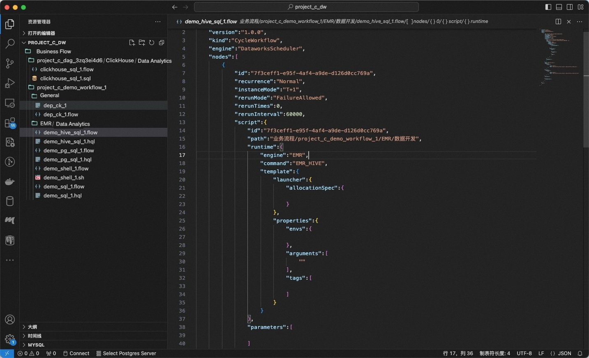
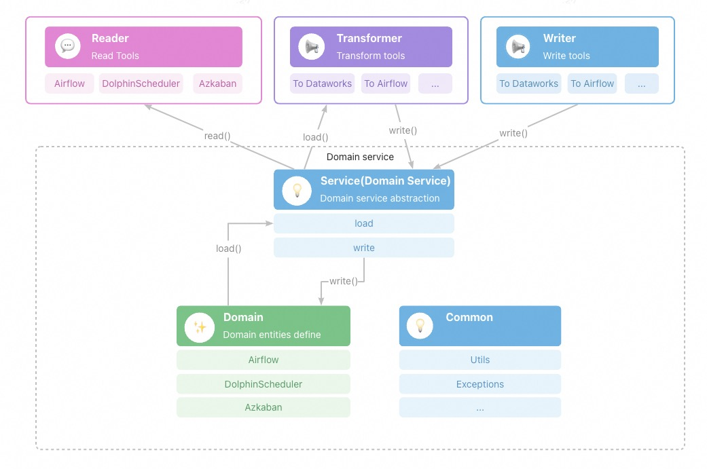

[](https://www.apache.org/licenses/LICENSE-2.0.html)


[](./README_zh_CN.md)

# Introduction

* In this project we defined a generic workflow description specification(FlowSpec)
* We developed a FlowSpec based migration tool(MigrationX) to migrate workflow models from different workflow scheduling systems to DataWorks workflow
  model.
* We can use this tool to develop conversion tools for other scheduling system workflow model.

# FlowSpec Field Reference

## CycleWorkflow

CycleWorkflow is the specification of a scheduled workflow that contains task nodes and dependencies

### Fields

| Field Name |                Field Type                 | Required | Description                            |
|:----------:|:-----------------------------------------:|----------|----------------------------------------|
| `version`  |                 `string`                  | Yes      | Version                                |
|   `kind`   |                 `string`                  | Yes      | CycleWorkflow                          |
| `metadata` |          [`Metadata`](#metadata)          | No       | define extra meta data of workflow     |
|   `spec`   | [`CycleWorkflowSpec`](#cycleworkflowspec) | Yes      | specific definition of `CycleWorkflow` |

## ManualWorkflow

ManualWorkflow is the specification of manual triggered workflow consist of task nodes and dependencies

### Fields

| Field Name |                 Field Type                  | Required | Description                             |
|:----------:|:-------------------------------------------:|----------|-----------------------------------------|
| `version`  |                  `string`                   | Yes      | version info                            |
|   `kind`   |                  `string`                   | Yes      | ManualWorkflow                          |
| `metadata` |           [`Metadata`](#metadata)           | No       | define extra meta data of workflow      |
|   `spec`   | [`ManualWorkflowSpec`](#manualworkflowspec) | Yes      | specific definition of `ManualWorkflow` |

## CycleWorkflowSpec

CycleWorkflowSpec the specification of `CycleWorkflow`

### Fields

|     Field Name     |                    Field Type                    | Required | Description                                      |
|:------------------:|:------------------------------------------------:|----------|--------------------------------------------------|
|      `nodes`       |            `Array<`[`Node`](#node)`>`            | Yes      | list of cycle node definition                    |
|    `variables`     |        `Array<`[`Variable`](#variable)`>`        | No       | list of variable definition                      |
|     `scripts`      |          `Array<`[`Script`](#script)`>`          | No       | list of script definition                        |
|     `triggers`     |         `Array<`[`Trigger`](#trigger)`>`         | No       | list of cycle trigger definition                 |
|    `artifacts`     |        `Array<`[`Artifact`](#Artifact)`>`        | No       | list of artifact definition                      |
| `runtimeResources` | `Array<`[`RuntimeResource`](#runtimeresource)`>` | No       | list of runtime resource definition              |
|  `fileResources`   |    `Array<`[`FileResource`](#fileResource)`>`    | No       | list of file resource definition                 |
|    `functions`     |        `Array<`[`Function`](#function)`>`        | No       | list of function definition                      |
|       `flow`       |            `Array<`[`Flow`](#flow)`>`            | No       | list of flow defines node dependent relationship |

## ManualWorkflowSpec

ManualWorkflowSpec is the specification of `ManualWorkflow`

### Fields

|     Field Name     |                    Field Type                    | Required | Description                                      |
|:------------------:|:------------------------------------------------:|----------|--------------------------------------------------|
|      `nodes`       |            `Array<`[`Node`](#node)`>`            | Yes      | list of manual node definition                   |
|    `variables`     |        `Array<`[`Variable`](#variable)`>`        | No       | list of variable definition                      |
|     `scripts`      |          `Array<`[`Script`](#script)`>`          | No       | list of script definition                        |
|    `artifacts`     |        `Array<`[`Artifact`](#Artifact)`>`        | No       | list of artifact definition                      |
| `runtimeResources` | `Array<`[`RuntimeResource`](#runtimeresource)`>` | No       | list of runtime resource definition              |
|  `fileResources`   |    `Array<`[`FileResource`](#fileResource)`>`    | No       | list of file resource definition                 |
|    `functions`     |        `Array<`[`Function`](#function)`>`        | No       | list of function definition                      |
|       `flow`       |            `Array<`[`Flow`](#flow)`>`            | No       | list of flow defines node dependent relationship |

## Metadata

Defines extra metadata of resource

### Fields

|  Field Name   | Field Type | Required | Description         |
|:-------------:|:----------:|----------|---------------------|
|    `owner`    |  `string`  | No       | owner of spec       |
| `description` |  `string`  | No       | description of spec |

## Node

Node is the definition of workflow node.

### Fields

|    Field Name     |                 Field Type                 | Required | Description                                                                                         |
|:-----------------:|:------------------------------------------:|----------|-----------------------------------------------------------------------------------------------------|
|       `id`        |                   String                   | Yes      | node local identifier in spec                                                                       |                     
|      `name`       |                   String                   | Yes      | node name                                                                                           |                     
|     `script`      |            [`Script`](#script)             | Yes      | referred script define or reference of the node                                                     |                     
|    `functions`    |     `Array<`[`Function`](#function)`>`     | No       | referred functions define or reference of the node                                                  |
|  `fileResources`  | `Array<`[`FileResource`](#fileResource)`>` | No       | referred file resources define or reference of the node                                             |                         
|     `inputs`      |            [`Inputs`](#inputs)             | No       | inputs of the node. `TableArtifact`, `NodeArtifcat`, `Variable` can be used as inputs of `Node`     |
|     `outputs`     |           [`Outputs`](#outputs)            | No       | outputs of the node. `TableArtifact`, `NodeArtifcat`, `Variable` can be used as outputs of `Node`   |
| `runtimeResource` |   [`RuntimeResource`](#runtimeResource)    | No       | runtime resource define or reference of the node                                                    |
|   `recurrence`    |                   string                   | No       | `recurrence` defines cycle schedule state of node, see enumerated values: [Recurrence](#recurrence) |
|    `priority`     |                  integer                   | No       | priority of the node, the larger the value, the higher the priority                                 |
|     `timeout`     |                  integer                   | No       | timeout in seconds of the node, node instance will be killed when timed out after specified seconds |
|  `instanceMode`   |                   string                   | No       | instance mode of the node, see enumerated values [InstanceMode](#instancemode)                      |
|    `rerunMode`    |                   string                   | No       | the rerun strategy of the node instance, see enumerated values [RerunMode](#rerunmode)              |

## Flow

The `flow` section of spec defines dependencies of related workflow nodes.

### Fields

| Field Name |               Field Type               | Required | Description                                      |
|:----------:|:--------------------------------------:|----------|--------------------------------------------------|
|  `nodeId`  |                `string`                | Yes      | node identifier of specific node defined in spec |
| `depends`  | `Array<`[`FlowDepend`](#flowDepend)`>` | Yes      | list of nodes depended by the node               |

## FlowDepend

`FlowDepend` define the dependency or relationship between workflow nodes.

| Field Name | Field Type | Required | Description                                                                          |
|:----------:|:----------:|----------|--------------------------------------------------------------------------------------|
|  `nodeId`  |  `string`  | Yes      | node identifier of specific node defined in spec                                     |
|   `type`   |  `string`  | Yes      | dependency type of the node, see enumerated values [DependencyType](#dependencyType) |

## Variable

`Variable` defines variables of workflow. Variables can be used in workflow nodes.

### Fields

| Field Name | Field Type | Required | Description                                                           |
|:----------:|:----------:|----------|-----------------------------------------------------------------------|
|    `id`    |  `string`  | Yes      | local identifier in spec                                              |
|   `name`   |  `string`  | Yes      | variable name                                                         |
|  `scope`   |  `string`  | Yes      | variable scope, see enumerated values [VariableScope](#variableScope) |
|   `type`   |  `string`  | Yes      | variable type, see enumerated values [VariableType](#variableType)    |
|  `value`   |  `string`  | Yes      | variable value expression                                             |

## Script

`Script` defines script source file resources. Scripts can be used in workflow by nodes, functions or resources.

### Fields

|  Field Name  |             Field Type             | Required | Description                                  |
|:------------:|:----------------------------------:|----------|----------------------------------------------|
|     `id`     |              `string`              | Yes      | local identifier in spec                     |
|    `path`    |              `string`              | Yes      | script path                                  |
|  `language`  |              `string`              | No       | script language                              |
|  `runtime`   |        [Runtime](#runtime)         | Yes      | runtime definition of script                 |
| `parameters` | `Array<`[`Variable`](#variable)`>` | No       | list of parameter definitions used by script |

## Trigger

`Trigger` defines the rules of firing time of scheduled nodes.

### Fields

| Field Name  | Field Type | Required | Description                                                                                                     |
|:-----------:|:----------:|----------|-----------------------------------------------------------------------------------------------------------------|
|    `id`     |  `string`  | Yes      | local identifier in spec                                                                                        |
|   `type`    |  `string`  | Yes      | trigger type, values: `Scheduler`, `Manual`                                                                     |
|   `cron`    |  `string`  | No       | cron expression of `Scheudler` Trigger                                                                          | 
| `startTime` |  `string`  | No       | start effect time of `Scheduler` Trigger. nodes will only instanced time in range from `startTime` to `endTime` | 
|  `endTime`  |  `string`  | No       | end of effect time of `Scheduler` Trigger.                                                                      |
| `timezone`  |  `string`  | No       | timezone of the `Scheduler` Trigger                                                                             |

## Artifact

Artifacts can be types like `NodeOutput`, `Table`, `Variable`. `Variable` can be a context variable produced by workflow nodes.

### Table

| Field Name | Field Type | Required | Description         |
|:----------:|:----------:|----------|---------------------|
|   `guid`   |  `string`  | Yes      | table artifact guid |

### NodeOutput

| Field Name | Field Type | Required | Description                      |
|:----------:|:----------:|----------|----------------------------------|
|  `output`  |  `string`  | Yes      | output string identifier of node |

## RuntimeResource

`RuntimeResource` defines runtime resources config are used to run workflow nodes runtime resources, like: resource group, YARN cluster etc.

### Fields

|   Field Name    | Field Type | Required | Description                      |
|:---------------:|:----------:|----------|----------------------------------|
|      `id`       |  `string`  | Yes      | local identifier in spec         |
| `resourceGroup` |  `string`  | Yes      | resource group global identifier |

## FileResource

`FileResource` defines the resource files used by workflow nodes. like jar, python, text file, archive files etc.

### Fields

| Field Name |    Field Type     | Required | Description                 |
|:----------:|:-----------------:|----------|-----------------------------|
|    `id`    |     `string`      | Yes      | local identifier in spec    |
|   `name`   |     `string`      | Yes      | resource file name          |
|  `script`  | [Script](#script) | Yes      | resource file script define |

## Function

User-Define-Function definition that used by workflow nodes.

### Fields

|   Field Name    |                 Field Type                 | Required | Description                    |
|:---------------:|:------------------------------------------:|----------|--------------------------------|
|      `id`       |                  `string`                  | Yes      | local identifier in spec       |
|     `name`      |                  `string`                  | Yes      | name of udf                    |
|    `script`     |             [Script](#script)              | Yes      | script file of udf             |
| `fileResources` | `Array<`[`FileResource`](#fileResource)`>` | No       | list of related file resources |

## Runtime

`Runtime` define the runtime environment of script. like command, runtime engine, image etc.

### Fields

| Field Name | Field Type | Required | Description                                                |
|:----------:|:----------:|----------|------------------------------------------------------------|
|  `engine`  |  `string`  | No       | runtime engine                                             |
| `command`  |  `string`  | No       | command identifier of script runtime execution environment |

## Outputs

Outputs hold parameters, artifacts, and results from a workflow node, `Outputs` can be consumed by another workflow node.

### Fields

|  Field Name   |               Field Type               | Required | Description                                                                           |
|:-------------:|:--------------------------------------:|----------|---------------------------------------------------------------------------------------|
|   `tables`    |      `Array<`[`Table`](#table)`>`      | No       | `tables` are list of artifact tables produced by node                                 |
|  `variables`  |   `Array<`[`Variable`](#variable)`>`   | No       | `variables` are list of `Variable` produced by node                                   |
| `nodeOutputs` | `Array<`[`NodeOutput`](#nodeOutput)`>` | No       | `nodeOutputs` are list of pre-defined node output identifier strings produced by node |

## Inputs

Inputs are the mechanism for passing parameters, artifacts, volumes from one workflow node to another

### Fields

|  Field Name   |              Field Type              | Required | Description                                                                            |
|:-------------:|:------------------------------------:|----------|----------------------------------------------------------------------------------------|
|   `tables`    |   `Array<`[`Artifact`](#table)`>`    | No       | `tables` are a list of artifact tables passed as inputs                                |
|  `variables`  |  `Array<`[`Variable`](#variable)`>`  | No       | `variables` are a list of `Variable` passed as inputs                                  |
| `nodeOutputs` | `Array<`[`Artifact`](#nodeOutput)`>` | No       | `nodeOutputs` are a list of pre-defined node output identifier string passed as inputs |

## Enumerations

### VariableScope

|   Enum Name   | Description                                                                                    |
|:-------------:|------------------------------------------------------------------------------------------------|
| NodeParameter | `NodeParameter` means the variable is avaliable in a specific node                             |
|  NodeContext  | `NodeContext` means the variable is avaliable in downstream nodes that depends on current node |
|   Workflow    | `Workflow` means the variable is avaliable in all nodes that in current workflow               |
|   Workspace   | `Workspace` means the variable is avaliable in all nodes that in current workspace             |
|    Tenant     | `Tenant` means the variable is avaliable in all nodes that in current tenant workspaces        |

### VariableType

| Enum Name | Description                                                                  |
|:---------:|------------------------------------------------------------------------------|
|  System   | `System` means the variable is avaliable a system variable like: `$yyyymmdd` |
| Constant  | `Constant` means the variable is constant value                              |

### DependencyType

|          Enum Name           | Description                                                                                                                                             |
|:----------------------------:|---------------------------------------------------------------------------------------------------------------------------------------------------------|
|            Normal            | `Normal` means the node instance of current cycle instance depends on the specific node instance in the same cycle round                                |
|   CrossCycleDependsOnSelf    | `CrossCycleDependsOnSelf` means the current cycle instance of the node depends on the previous cycle round instance of the node itself                  |
| CrossCycleDependsOnChildren  | `CrossCycleDependsOnChildren` means the current cycle instance of the node depends on the children instance of itself in the previous cycle round       |
| CrossCycleDependsOnOtherNode | `CrossCycleDependsOnOtherNode` means the current cycle instance of the node depends on the specific node instance of itself in the previous cycle round |

### Recurrence

| Enum Name | Description                                                                                                         |
|:---------:|---------------------------------------------------------------------------------------------------------------------|
|  Normal   | `Normal` means node instance code will be executed as defined repeat cycle, node will be instanced by defined cycle |
|   Skip    | `Skip` means node instance will be set success without any code effects, node will be instanced by defined cycle    |
|   Pause   | `Pause` means node instance will be set failure without any code effects, node will be instanced by defined cycle   |

### RerunMode

|   Enum Name    | Description                                                         |
|:--------------:|---------------------------------------------------------------------|
|    Allowed     | `Allowed` means node instance can be rerun without any precondition |
|     Denied     | `Denied` means node instance cannot be rerun on any condition       |
| FailureAllowed | `FailureAllowed` means node instance can be rerun on failure state  |

### InstanceMode

|  Enum Name  | Description                                                              |
|:-----------:|--------------------------------------------------------------------------|
|     T+1     | `T+1` means node modification will be applied effect on the next day     |
| Immediately | `Immediately` means node modification will be applied effect immediately |    

# FlowSpec Examples

FlowSpec can be used to describe a workflow, it is a json file that contains a list of nodes.

## real case

### EMR/CDH case

* EMR: [yaml](./spec/src/main/spec/examples/yaml/emr.yaml) [json](./spec/src/main/spec/examples/json/emr.json)
* CDH: [yaml](./spec/src/main/spec/examples/yaml/cdh.yaml) [json](./spec/src/main/spec/examples/json/cdh.json)

### example without id variables references

* [yaml](./spec/src/main/spec/examples/yaml/real_case_expanded.yaml)
* [json](./spec/src/main/spec/examples/json/real_case_expanded.json)

### example with id variables references

* [yaml](./spec/src/main/spec/examples/yaml/real_case.yaml)
* [json](./spec/src/main/spec/examples/json/real_case.json)

## simple example

* [yaml](./spec/src/main/spec/examples/yaml/simple.yaml)
* [json](./spec/src/main/spec/examples/json/simple.json)

## branch node

* [yaml](./spec/src/main/spec/examples/yaml/branch.yaml)
* [json](./spec/src/main/spec/examples/json/branch.json)

## join node

* [yaml](./spec/src/main/spec/examples/yaml/join.yaml)
* [json](./spec/src/main/spec/examples/json/join.json)

## for-each/do-while node

* [yaml](./spec/src/main/spec/examples/yaml/innerflow.yaml)
* [json](./spec/src/main/spec/examples/json/innerflow.json)

## manual workflow

* [yaml](./spec/src/main/spec/examples/yaml/manual_flow.yaml)
* [json](./spec/src/main/spec/examples/json/manual_flow.json)

## emr nodes

* [yaml](./spec/src/main/spec/examples/yaml/script_runtime_template.yaml)
* [json](./spec/src/main/spec/examples/json/script_runtime_template.json)

## resource example

* [yaml](./spec/src/main/spec/examples/yaml/file_resource.yaml)
* [json](./spec/src/main/spec/examples/json/file_resource.json)

## function example

* [yaml](./spec/src/main/spec/examples/yaml/function.yaml)
* [json](./spec/src/main/spec/examples/json/function.json)

## param-hub node

* [yaml](./spec/src/main/spec/examples/yaml/parameter_node.yaml)
* [json](./spec/src/main/spec/examples/json/parameter_node.json)

# FlowSpec example

## DataWorks migration assistant spec package demo

* the directory structure of the spec package is consistent with the directory tree of the DataWorks DataStudio business process interface
* *.sql, *.sh, *.hql are user script source files
* *.flow is the spec file corresponding to the user script source file

```shell
➜  project_c_dw tree
.
└── Business Flow
    ├── project_c_dag_3zq3ei4d6
    │   └── ClickHouse
    │       └── Data Analytics
    │           ├── clickhouse_sql_1.flow
    │           └── clickhouse_sql_1.sql
    └── project_c_demo_workflow_1
        ├── EMR
        │   └── Data Analytics
        │       ├── demo_hive_sql_1.flow
        │       ├── demo_hive_sql_1.hql
        │       ├── demo_pg_sql_1.flow
        │       ├── demo_pg_sql_1.hql
        │       ├── demo_shell_1.flow
        │       ├── demo_shell_1.sh
        │       ├── demo_sql_1.flow
        │       └── demo_sql_1.hql
        └── General
            ├── dep_ck_1
            └── dep_ck_1.flow
```



# FlowSpec Client Tool

MigrationX is a workflow model transformation tool based on FlowSpec.

* [MigrationX](docs/migrationx/index.md)
    * Dolphinscheduler migrate to Dataworks DataStudio in one-click command run
    * Dolphinscheduler export command tool
    * Conversion dolphinscheduler workflow to DataWorks FlowSpec
    * Import FlowSpec package to DataWorks DataStudio with DataWorks OpenAPI

## Architecture



### Domain Model

Define domain model for different workflow engine, containing domain entities and corresponding operation service

### Reader

Implementations of export reader tools for specific workflow engine.

### Transformer

Implementations of transformation logics between specific workflow engines.

### Writer

Implementations of import writer tools for specific workflow engine.

### Usage

[Usage](docs/migrationx/usage.md)

# Modules

* migrationx-common: common module
* migrationx-domain: domain model of specific workflow engine
* migrationx-reader: export reader implementation of specific workflow engine
* migrationx-transformer: transformer implementation of specific workflow engine
* migrationx-writer: import write implementation of specific workflow engine

# Develop guide

[Develop guide](docs/dev/develop-guide.md)

# Contributors

* Alibaba Cloud-DataWorks-Develop & Modeling & Analytics Team
