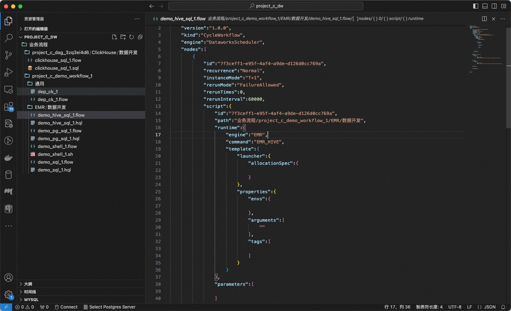
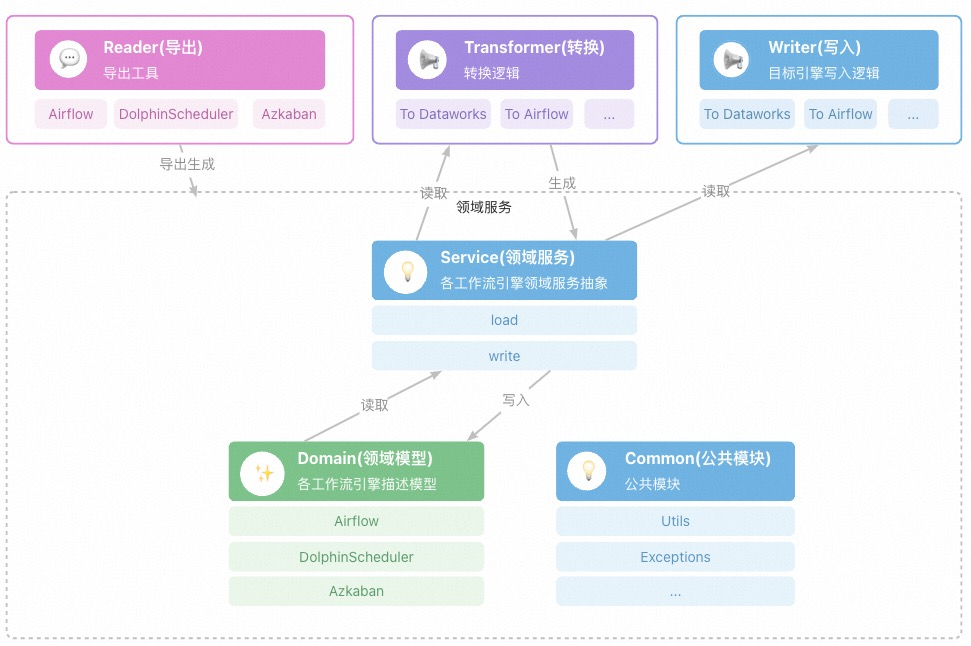

[](https://www.apache.org/licenses/LICENSE-2.0.html)


[](./README.md)

# 简介

* 本项目定义了一个通用的工作流描述规范(FlowSpec)
* 我们开发了基于FlowSpec的迁移工具(MigrationX)来迁移不同工作流调度系统的工作流模型
* 我们可以利用这个工具来开发其他调度系统的工作流模型转换工具

# FlowSpec字段参考

## CycleWorkflow

`CycleWorkflow`用于描述周期性的工作流，包含任务节点和依赖关系

### 字段列表

|    字段名     |                   字段类型                    | 是否必填 | 字段说明               |
|:----------:|:-----------------------------------------:|------|--------------------|
| `version`  |                 `string`                  | 是    | 版本号                |
|   `kind`   |                 `string`                  | 是    | `CycleWorkflow`    |
| `metadata` |          [`Metadata`](#metadata)          | 是    | 定义工作流的扩展元信息        |
|   `spec`   | [`CycleWorkflowSpec`](#cycleworkflowspec) | 是    | `CycleWorkflow`的定义 |

## ManualWorkflow

`ManualWorkflow`用于描述手动触发的工作流，包含任务节点和依赖关系

### 字段列表

|    字段名     |                    字段类型                     | 是否必填 | 字段说明                |
|:----------:|:-------------------------------------------:|------|---------------------|
| `version`  |                  `string`                   | 是    | 版本信息                |
|   `kind`   |                  `string`                   | 是    | `ManualWorkflow`    |
| `metadata` |           [`Metadata`](#metadata)           | 是    | 定义工作流的扩展元信息         |
|   `spec`   | [`ManualWorkflowSpec`](#manualworkflowspec) | 是    | `ManualWorkflow`的定义 |

## CycleWorkflowSpec

CycleWorkflowSpec是周期调度工作流`CycleWorkflow`的定义描述

### 字段列表

|     Field Name     |                       字段类型                       | 是否必填 | 字段说明        |
|:------------------:|:------------------------------------------------:|------|-------------|
|      `nodes`       |            `Array<`[`Node`](#node)`>`            | 是    | 周期任务节点列表    |
|    `variables`     |        `Array<`[`Variable`](#variable)`>`        | 否    | 变量定义列表      |
|     `scripts`      |          `Array<`[`Script`](#script)`>`          | 否    | 脚本定义列表      |
|     `triggers`     |         `Array<`[`Trigger`](#trigger)`>`         | 否    | 周期调度定义列表    |
|    `artifacts`     |        `Array<`[`Artifact`](#Artifact)`>`        | 否    | 产出物定义列表     |
| `runtimeResources` | `Array<`[`RuntimeResource`](#runtimeresource)`>` | 否    | 运行时资源定义列表   |
|  `fileResources`   |    `Array<`[`FileResource`](#fileResource)`>`    | 否    | 文件资源列表      |
|    `functions`     |        `Array<`[`Function`](#function)`>`        | 否    | 函数定义列表      |
|       `flow`       |            `Array<`[`Flow`](#flow)`>`            | 否    | 定义节点之间的依赖关系 |

## ManualWorkflowSpec

ManualWorkflowSpec是手动触发工作流`ManualWorkflow`的定义描述

### 字段列表

|     Field Name     |                       字段类型                       | 是否必填 | 字段说明        |
|:------------------:|:------------------------------------------------:|------|-------------|
|      `nodes`       |            `Array<`[`Node`](#node)`>`            | 是    | 周期任务节点列表    |
|    `variables`     |        `Array<`[`Variable`](#variable)`>`        | 否    | 变量定义列表      |
|     `scripts`      |          `Array<`[`Script`](#script)`>`          | 否    | 脚本定义列表      |
|    `artifacts`     |        `Array<`[`Artifact`](#Artifact)`>`        | 否    | 产出物定义列表     |
| `runtimeResources` | `Array<`[`RuntimeResource`](#runtimeresource)`>` | 否    | 运行时资源定义列表   |
|  `fileResources`   |    `Array<`[`FileResource`](#fileResource)`>`    | 否    | 文件资源列表      |
|    `functions`     |        `Array<`[`Function`](#function)`>`        | 否    | 函数定义列表      |
|       `flow`       |            `Array<`[`Flow`](#flow)`>`            | 否    | 定义节点之间的依赖关系 |

## Metadata

定义工作流的扩展元信息

### 字段列表

|  Field Name   |   字段类型   | 是否必填 | 字段说明 |
|:-------------:|:--------:|------|------|
|    `owner`    | `string` | 否    | 责任人  |
| `description` | `string` | 否    | 字段说明 |

## Node

工作流节点的定义描述

### 字段列表

|        字段名        |                    字段类型                    | 是否必填 | 字段说明                                                            |
|:-----------------:|:------------------------------------------:|------|-----------------------------------------------------------------|
|       `id`        |                   string                   | 是    | 节点在Spec中的唯一ID                                                   |                     
|      `name`       |                   string                   | 是    | 节点名                                                             |                     
|     `script`      |            [`Script`](#script)             | 是    | 节点所需的脚本定义或者引用                                                   |                     
|    `functions`    |     `Array<`[`Function`](#function)`>`     | 否    | 节点所需的函数定义或者引用                                                   |
|  `fileResources`  | `Array<`[`FileResource`](#fileResource)`>` | 否    | 节点所需的文件资源定义或者引用                                                 |
|     `inputs`      |            [`Inputs`](#inputs)             | 否    | 节点的输入. 可以是：`TableArtifact`, `NodeArtifcat`, `Variable`          |
|     `outputs`     |           [`Outputs`](#outputs)            | 否    | 节点输出，可以是：`TableArtifact`, `NodeArtifcat`, `Variable`            |
| `runtimeResource` |   [`RuntimeResource`](#runtimeResource)    | 否    | 节点的运行时资源定义或引用                                                   |
|   `recurrence`    |                   string                   | 否    | `recurrence`定义周期调度节点的调度状态, 具体值参考枚举类型: [Recurrence](#recurrence) |
|    `priority`     |                  integer                   | 否    | 定义节点的优先级, 数值越大优先级越高                                             |
|     `timeout`     |                  integer                   | 否    | 定义节点的超时时间，运行超过指定时间后，节点将会被kill掉，单位为秒                             |
|  `instanceMode`   |                   string                   | 否    | 节点的实例化模式，具体值参考枚举类型：[InstanceMode](#instancemode)                |
|    `rerunMode`    |                   string                   | 否    | 节点重试策略，具体值参考枚举类型：[RerunMode](#rerunmode)                        |

## Flow

`flow`部分定义了工作流节点之间的依赖关系。

### 字段列表

|    字段名    |                  字段类型                  | 是否必填 | 字段说明                      |
|:---------:|:--------------------------------------:|------|---------------------------|
| `nodeId`  |                `string`                | 是    | 节点的唯一标识符，全局唯一，用于标识工作流中的节点 |
| `depends` | `Array<`[`FlowDepend`](#flowDepend)`>` | 是    | 依赖的节点列表                   |

## FlowDepend

`FlowDepend`定义了工作流节点之间的依赖关系。

|   字段名    |   字段类型   | 是否必填 | 字段说明                                                |
|:--------:|:--------:|------|-----------------------------------------------------|
| `nodeId` | `string` | 是    | 节点的唯一标识                                             |
|  `type`  | `string` | 是    | 节点依赖的类型，具体值参考枚举类型：[DependencyType](#dependencyType) |

## Variable

`Variable`定义了工作流的变量。`Variable`可以被在工作流节点中引用

### 字段列表

|   字段名   |   字段类型   | 是否必填 | 字段说明                                         |
|:-------:|:--------:|------|----------------------------------------------|
|  `id`   | `string` | 是    | 唯一标识                                         |
| `name`  | `string` | 是    | 变量名                                          |
| `scope` | `string` | 是    | 变量作用域, 具体值参考：[VariableScope](#variableScope) |
| `type`  | `string` | 是    | 变量类型，具体值参考： [VariableType](#variableType)    |
| `value` | `string` | 是    | 变量值                                          |

## Script

`Script`定义了脚本资源。`Script`可以被在工作流节点、资源或函数中引用

### 字段列表

|     字段名      |                字段类型                | 是否必填 | 字段说明          |
|:------------:|:----------------------------------:|------|---------------|
|     `id`     |              `string`              | 是    | 唯一标识          |
|    `path`    |              `string`              | 是    | 脚本路径          |
|  `language`  |              `string`              | 否    | 脚本语言          |   
|  `runtime`   |        [Runtime](#runtime)         | 是    | 脚本运行时环境定义     |
| `parameters` | `Array<`[`Variable`](#variable)`>` | 否    | 脚本参数名及表达式定义列表 |

## Trigger

`Trigger`定义了工作流的触发器。`Trigger`决定工作流节点的周期调度运行的开始时间

### 字段列表

|     字段名     |   字段类型   | 是否必填 | 字段说明                                              |
|:-----------:|:--------:|------|---------------------------------------------------|
|    `id`     | `string` | 是    | 唯一标识                                              |
|   `type`    | `string` | 是    | 触发器类型, 可选值: `Scheduler`, `Manual`                 |
|   `cron`    | `string` | 否    | 周期调度触发器的定时表达式                                     | 
| `startTime` | `string` | 否    | 周期调度的起始生效时间，节点只在`startTime`到`endTime`时间段内执行周期调度运行 | 
|  `endTime`  | `string` | 否    | 周期调度的结束生效时间，节点只在`startTime`到`endTime`时间段内执行周期调度运行 |                                            |
| `timezone`  | `string` | 否    | 周期调度时间的时区                                         |

## Artifact

`Artifact`的类型可以是`NodeOutput`, `Table`, `Variable`. 都可以作为工作流节点的输入或者输出

### Table

|  字段名   |   字段类型   | 是否必填 | 字段说明     |
|:------:|:--------:|------|----------|
| `guid` | `string` | 是    | 产出表唯一标识符 |

### NodeOutput

|   字段名    |   字段类型   | 是否必填 | 字段说明     |
|:--------:|:--------:|------|----------|
| `output` | `string` | 是    | 节点调度输出标识 |

## RuntimeResource

`RuntimeResource`定义了节点的运行时资源，如：调度资源组，YARN集群等

### 字段列表

|       字段名       |   字段类型   | 是否必填 | 字段说明    |
|:---------------:|:--------:|------|---------|
|      `id`       | `string` | 是    | 唯一标识符   |
| `resourceGroup` | `string` | 是    | 资源组唯一标识 |

## FileResource

`FileResource`定义了文件资源，如：jar, python, text file, archive files等。`FileResource`可以被节点、函数引用

### 字段列表

|   字段名    |       字段类型        | 是否必填 | 字段说明 |
|:--------:|:-----------------:|------|------|
|   `id`   |     `string`      | 是    | 唯一标识 |
|  `name`  |     `string`      | 是    | 资源名称 |
| `script` | [Script](#script) | 是    | 资源文件 |

## Function

定义工作流节点使用的UDF

### 字段列表

|      字段名称       |                    字段类型                    | 是否必填 | 字段说明    |
|:---------------:|:------------------------------------------:|------|---------|
|      `id`       |                  `string`                  | 是    | 唯一标识    |
|     `name`      |                  `string`                  | 是    | 函数名称    |
|    `script`     |             [Script](#script)              | 是    | 使用的脚本   |
| `fileResources` | `Array<`[`FileResource`](#fileResource)`>` | 否    | 使用的资源列表 |

## Runtime

`Runtime`定义脚本的运行时环境，如：命令，运行时引擎，镜像等

### 字段列表

|    字段名    |   字段类型   | 是否必填 | 字段说明       |
|:---------:|:--------:|------|------------|
| `engine`  | `string` | 否    | 运行时引擎      |
| `command` | `string` | 是    | 运行时环境的命令标识 |

## Outputs

输出定义了工作流节点的产出信息，`Outputs`可以被下游工作流节点消费

### 字段列表

|      字段名      |                  字段类型                  | 是否必填 | 字段说明        |
|:-------------:|:--------------------------------------:|------|-------------|
|   `tables`    |      `Array<`[`Table`](#table)`>`      | 否    | 节点产出表的列表    |
|  `variables`  |   `Array<`[`Variable`](#variable)`>`   | 否    | 节点产出变量的列表   |
| `nodeOutputs` | `Array<`[`NodeOutput`](#nodeOutput)`>` | 否    | 节点的预定义输出的列表 |

## Inputs

`Inputs`定义节点输入依赖，可以是上游节点`Outputs`定义的NodeArtifact`, `TableArtifact`, `Variable`

### 字段列表

|      字段名      |                  字段类型                  | 是否必填 | 字段说明                            |
|:-------------:|:--------------------------------------:|------|---------------------------------|
|   `tables`    |      `Array<`[`Table`](#table)`>`      | 否    | `tables` 节点使用的上游产出表列表           |
|  `variables`  |   `Array<`[`Variable`](#variable)`>`   | 否    | `variables` 节点依赖的变量`Variable`列表 |
| `nodeOutputs` | `Array<`[`NodeOutput`](#nodeOutput)`>` | 否    | `nodeOutputs` 节点使用的上游节点的预定义输出列表 |

## Enumerations

枚举说明

### VariableScope

变量作用域

|      枚举值      | 字段说明                                  |
|:-------------:|---------------------------------------|
| NodeParameter | `NodeParameter` 表示只有节点内使用的参数          |
|  NodeContext  | `NodeContext` 表示节点的上下文中的参数，可以被下游节点使用  |
|   Workflow    | `Workflow` 表示工作流级别的参数，可以被工作流所有节点使用    |
|   Workspace   | `Workspace` 表示工作空间级别的参数，可以被工作空间所有节点使用 |
|    Tenant     | `Tenant` 表示租户级别参数，可以被租户的所有节点使用        |

### VariableType

变量类型

|   枚举值    | 字段说明                            |
|:--------:|---------------------------------|
|  System  | `System` 表示系统变量，例如: `$yyyymmdd` |
| Constant | `Constant` 表示常量                 |

### DependencyType

依赖类型

|             枚举值              | 字段说明                                                        |
|:----------------------------:|-------------------------------------------------------------|
|            Normal            | `Normal` 表示节点依赖的是同周期的对应的节点示例                                |
|   CrossCycleDependsOnSelf    | `CrossCycleDependsOnSelf` 表示节点当前周期的实例依赖的是上一周期的自己的实例         |
| CrossCycleDependsOnChildren  | `CrossCycleDependsOnChildren` 表示节点当前周期的实例依赖的是上一周期自己的所有子节点实例 |
| CrossCycleDependsOnOtherNode | `CrossCycleDependsOnOtherNode` 表示节点当前周期的实例依赖的是上一周期的指定节点的实例  |

### Recurrence

周期调度状态类型

|  枚举值   | 字段说明                                              |
|:------:|---------------------------------------------------|
| Normal | `Normal`表示节点会被正常按照指定调度周期调度运行                      |
|  Skip  | `Skip`表示节点会被正常按照指定调度周期实例化，但是代码不会被运行生效，任务状态直接设置为成功 |
| Pause  | `Pause`表示节点会被正产按照指定调度周期实例化，但是状态直接设置为失败            |

### RerunMode

重跑策略

|      枚举值       | 字段说明                        |
|:--------------:|-----------------------------|
|    Allowed     | `Allowed`任何情况下都允许重跑         |
|     Denied     | `Denied` 任何情况下都不允许重跑        |
| FailureAllowed | `FailureAllowed` 失败的情况下允许重跑 |

### InstanceMode

实例化模式

|     枚举值     | 字段说明                        |
|:-----------:|-----------------------------|
|     T+1     | `T+1`表示节点的配置修改将会在`T+1`天后生效  |
| Immediately | `Immediately` 表示节点配置修改将立即生效 |    

# FlowSpec 示例

## 真实案例

### EMR/CDH 示例

* EMR: [yaml](./spec/src/main/spec/examples/yaml/emr.yaml) [json](./spec/src/main/spec/examples/json/emr.json)
* CDH: [yaml](./spec/src/main/spec/examples/yaml/cdh.yaml) [json](./spec/src/main/spec/examples/json/cdh.json)

### 不使用变量引用方式的定义示例

* [yaml](./spec/src/main/spec/examples/yaml/real_case_expanded.yaml)
* [json](./spec/src/main/spec/examples/json/real_case_expanded.json)

### 使用变量引用方式的定义

* [yaml](./spec/src/main/spec/examples/yaml/real_case.yaml)
* [json](./spec/src/main/spec/examples/json/real_case.json)

## 简单示例

* [yaml](./spec/src/main/spec/examples/yaml/simple.yaml)
* [json](./spec/src/main/spec/examples/json/simple.json)

## 分支节点

* [yaml](./spec/src/main/spec/examples/yaml/branch.yaml)
* [json](./spec/src/main/spec/examples/json/branch.json)

## 归并节点

* [yaml](./spec/src/main/spec/examples/yaml/join.yaml)
* [json](./spec/src/main/spec/examples/json/join.json)

## for-each/do-while 节点

* [yaml](./spec/src/main/spec/examples/yaml/innerflow.yaml)
* [json](./spec/src/main/spec/examples/json/innerflow.json)

## 手动工作流

* [yaml](./spec/src/main/spec/examples/yaml/manual_flow.yaml)
* [json](./spec/src/main/spec/examples/json/manual_flow.json)

## EMR节点

* [yaml](./spec/src/main/spec/examples/yaml/script_runtime_template.yaml)
* [json](./spec/src/main/spec/examples/json/script_runtime_template.json)

## 资源定义

* [yaml](./spec/src/main/spec/examples/yaml/file_resource.yaml)
* [json](./spec/src/main/spec/examples/json/file_resource.json)

## 函数定义

* [yaml](./spec/src/main/spec/examples/yaml/function.yaml)
* [json](./spec/src/main/spec/examples/json/function.json)

## 参数节点

* [yaml](./spec/src/main/spec/examples/yaml/parameter_node.yaml)
* [json](./spec/src/main/spec/examples/json/parameter_node.json)

## 迁移助手导入包示例

* 包的目录结构和目前DataWorks数据开发的目录树结构保持一致
* *.sql, *.sh, *.hql 是用户的脚本文件
* *.flow 脚本文件对应的节点调度配置文件

```shell
➜  project_c_dw tree
.
└── 业务流程
    ├── project_c_dag_3zq3ei4d6
    │   └── ClickHouse
    │       └── 数据开发
    │           ├── clickhouse_sql_1.flow
    │           └── clickhouse_sql_1.sql
    └── project_c_demo_workflow_1
        ├── EMR
        │   └── 数据开发
        │       ├── demo_hive_sql_1.flow
        │       ├── demo_hive_sql_1.hql
        │       ├── demo_pg_sql_1.flow
        │       ├── demo_pg_sql_1.hql
        │       ├── demo_shell_1.flow
        │       ├── demo_shell_1.sh
        │       ├── demo_sql_1.flow
        │       └── demo_sql_1.hql
        └── 通用
            ├── dep_ck_1
            └── dep_ck_1.flow
```



# FlowSpec 工具

MigrationX 是一款基于 FlowSpec 规范的工作流迁移工具，它可以将 Dolphinscheduler 工作流转换为 DataWorks FlowSpec。

* [MigrationX](docs/migrationx/index.md)
    * Dolphinscheduler 一键迁移到 Dataworks DataStudio
    * Dolphinscheduler 工作流一键导出
    * 将Dolphinscheduler工作流转换为 DataWorks FlowSpec
    * 将FlowSpec包通过OpenAPI导入DataWorks DataStudio

## 整体架构



### 领域模型

定义不同工作流引擎的领域模型

### Reader

实现不同工作流系统的工作流导出

### Transformer

实现不同工作流系统之间的模型转换

### Writer

实现工作流系统的工作流导入

### 用法

[用法](docs/migrationx/usage_zh_CN.md)

# Modules

* migrationx-common，通用模块
* migrationx-domain，工作流引擎的模型定义
* migrationx-reader，工作流引擎的导出实现
* migrationx-transformer，工作流引擎模型的转换实现
* migrationx-writer，工作流引擎的导入实现

# 开发指南

[开发指南](docs/dev/develop-guide_zh_CN.md)

# 贡献

* 阿里云-DataWorks-开发分析建模团队
