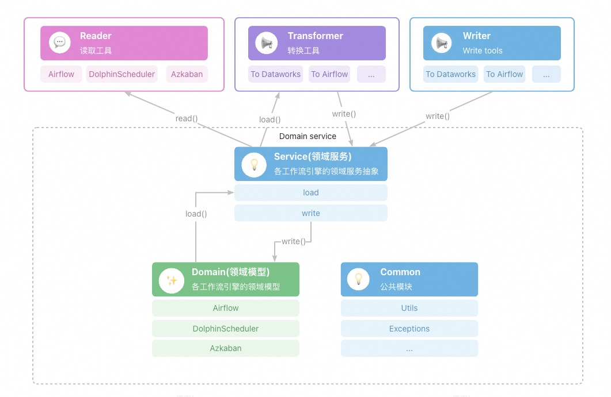

# 功能
* 支持开源数据开发调度引擎工作流任务信息导出
* 支持工作流引擎之间的模型格式转换
* 实现支持开源工作流引擎到之间的模型转换

# 概要设计 

## Domain（领域模型）
不同开源调度引擎有自己不同的工作流领域模型。
对于各自的领域模型，有一套统一的领域服务抽象来对定义这些工作流的领域模型操作，各自实现对应的操作逻辑。

## Reader（导出）
对于开源调度引擎会集成之前迁移助手做的开源引擎导出工具脚本。目前有的导出工具有Airflow、Aliyun EMR Workflow、DolphinScheduler。
如果开源引擎有自己的批量导出功能，将遵循开源引擎的导出格式，不另行开发导出工具脚本。

## Transformer（转换）
对于每两种工作流调度引擎之间的转换逻辑，开发对于的转换逻辑。

## Writer（导入）
对于每种工作流调度引擎实现对应工作流领域模型的描述格式的导入能力。比如调用OpenAPI，或者使用对应产品的导入功能。

## 用法说明
[Usage](usage.md)

# 模块简要介绍
* migrationx-common，公共类模块
* migrationx-domain，各工作流引擎领域对象及服务定义
* migrationx-reader，各工作流引擎的导出功能实现
* migrationx-transformer，工作流引擎之间的转换逻辑实现
* migrationx-writer，各工作流引擎的导入能力实现

# 现状进展
* 定义了DolphinScheduler、Airflow、Oozie、Azkaban、Datago/彩云间、Aliyun EMR Workflow、DataWorks等工作流调度引擎的领域模型和部分操作
* 集成实现了Airflow、DolphinScheduler的批量导出工具脚本，更多需求可基于此定制开发
* 集成实现了DolphinScheduler、Airflow、Oozie、Azkaban、Datago/彩云间、Aliyun EMR Workflow、等工作流调度引擎到DataWorks迁移助手标准导入导出格式的转换逻辑

# 开发文档
[开发文档](../dev/develop-guide.md)