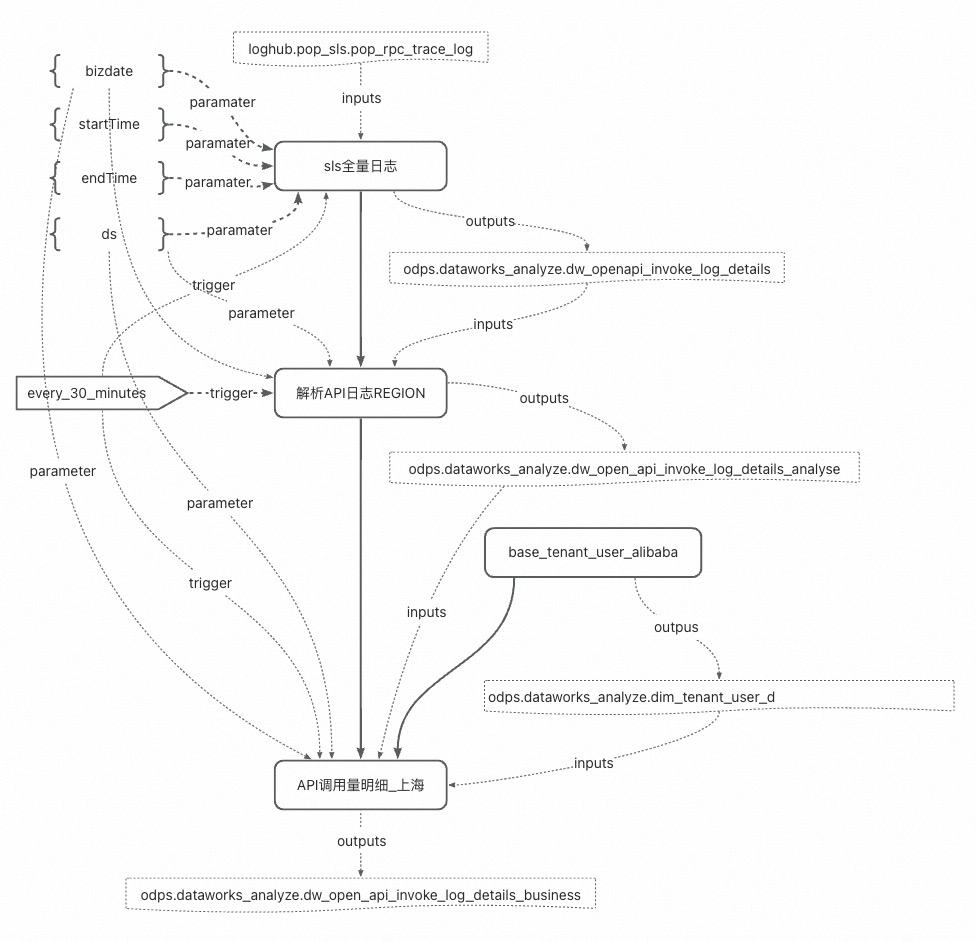

# Spec示例

## 真实案例

### 不使用用变量引用方式

* [yaml](../../spec/src/main/spec/examples/yaml/real_case_expanded.yaml)
* [json](../../spec/src/main/spec/examples/json/real_case_expanded.json)

### 变量引用方式

* [yaml](../../spec/src/main/spec/examples/yaml/real_case.yaml)
* [json](../../spec/src/main/spec/examples/json/real_case.json)

## 简单示例

* [yaml](../../spec/src/main/spec/examples/yaml/simple.yaml)
* [json](../../spec/src/main/spec/examples/json/simple.json)

## 分支节点

* [yaml](../../spec/src/main/spec/examples/yaml/branch.yaml)
* [json](../../spec/src/main/spec/examples/json/branch.json)

## 归并节点

* [yaml](../../spec/src/main/spec/examples/yaml/join.yaml)
* [json](../../spec/src/main/spec/examples/json/join.json)

## 内部工作流（for-each/do-while）

* [yaml](../../spec/src/main/spec/examples/yaml/innerflow.yaml)
* [json](../../spec/src/main/spec/examples/json/innerflow.json)

## 手动工作流

* [yaml](../../spec/src/main/spec/examples/yaml/manual_flow.yaml)
* [json](../../spec/src/main/spec/examples/json/manual_flow.json)

## DataWorks EMR节点模板

* [yaml](../../spec/src/main/spec/examples/yaml/script_runtime_template.yaml)
* [json](../../spec/src/main/spec/examples/json/script_runtime_template.json)

## 资源描述

* [yaml](../../spec/src/main/spec/examples/yaml/file_resource.yaml)
* [json](../../spec/src/main/spec/examples/json/file_resource.json)

## 函数描述

* [yaml](../../spec/src/main/spec/examples/yaml/function.yaml)
* [json](../../spec/src/main/spec/examples/json/function.json)

## 参数节点

* [yaml](../../spec/src/main/spec/examples/yaml/parameter_node.yaml)
* [json](../../spec/src/main/spec/examples/json/parameter_node.json)
